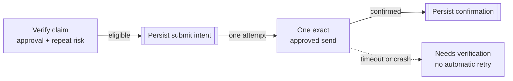

# At-most-once Job Application Submission

At-most-once submission means automation must never create a second
employer-facing attempt merely because the first attempt returned an ambiguous
result. JobCtrl combines durable submit intent with binding approval, repeat
protection, and human verification—and keeps final browser submission manual.

## Why Ordinary Retries Are Dangerous

Retries are useful for read-only work. If a source times out while fetching a
posting, trying again can be safe. A submission is different: the employer may
have received the application even when the local process did not receive a
confirmation.

Consider a crash immediately after an email provider accepts a message:

Solid arrows show the confirmed path. The dashed arrow is an ambiguous outcome:
the system preserves uncertainty instead of converting it into permission to
try again.

## At-most-once Is Not Exactly-once

“Exactly once” would promise both that the application happens and that it
happens only once. A distributed system cannot always prove both after a crash
or network partition unless the remote destination provides a compatible
idempotency contract.

At-most-once chooses the safer failure mode:

- before durable submit intent, a failed claim can remain eligible for a later
  reviewed attempt;
- after intent, JobCtrl will not automatically repeat the employer-facing
  action;
- when confirmation is missing, the run stops in `needs_verification`;
- the user checks the destination or provider history and records the real
  outcome.

The result may require manual recovery, but it avoids turning uncertainty into
a duplicate application.

## Approval Is Bound At The Mutation Boundary

With approval required—the default—the latest Apply Review decision must bind
the current job, profile version, application URL, material generation, and
qualifying rehearsal evidence. Email applications additionally bind the exact
recipient and attachment.

The worker checks that binding while atomically claiming work in SQLite. It is
not only a disabled button in the web app, so a stale page, direct API call,
standing loop, or concurrent worker cannot bypass the claim-time decision.

Turning the general approval wait off does not create generic submission
authority. Browser final submit remains manual, the Gmail sender still requires
its exact send scope, and repeat-application protection still runs.

## Repeat Protection Answers A Different Question

At-most-once protects one submission attempt from retry duplication. Repeat
protection asks whether the candidate already has a confirmed application to
the same opening.

Before each live claim, JobCtrl combines canonical job identity with confirmed
application facts. The same opening is blocked. A conservative match for the
same employer and an equivalent role requires explicit reasoned confirmation
bound to the current evidence. A one-use override is consumed in the same
atomic claim transaction.

Pending Gmail suggestions, notes, dry runs, failed pre-submit work, and submit
intent without confirmation do not become application history. Keeping these
gates separate prevents a similarity guess from creating a fact while still
blocking a known duplicate.

See
[Apply → Repeat-Application Protection](../user/apply.md#repeat-application-protection)
for the current evidence and override states.

## Browser And Email Have Different Submission Boundaries

JobCtrl does not give a page-reading model final browser-submit authority. A
browser-form claim stops before the model-driven session begins, and the user
completes the final employer action manually. The browser extension can capture
and autofill whitelisted fields, but it has no submit capability.

The owned Gmail path is different because JobCtrl controls the mutation
adapter. It can compare the exact recipient and attachment with the approval,
persist submit intent immediately before the send, restrict the live activity
to one attempt, and preserve the provider result.

These are not interchangeable promises. “At-most-once” does not mean a model
may click any web submit button once.

## Dry Runs Exercise The Boundary Without Submitting

A dry run grants one exact read-only navigation to the reviewed application
URL. Browser-level interception blocks form submission, mutating requests,
navigation replay, URL changes, redirects, and other write-bearing channels.
The agent also lacks generic typing, artifact upload, saved credentials, and
verification-code tools.

The receipt records which bounded inspection occurred. A model saying
`RESULT:DRY_RUN` is not by itself proof of complete rehearsal, and
`RESULT:APPLIED` is never accepted as authoritative submission evidence.

Dry runs help you inspect an application path. They do not consume a live
application fact or grant a later submit.

## What To Do When Verification Is Required

If a run reaches durable submit intent but lacks trustworthy confirmation:

1. do not start another live application;
2. inspect the sent-mail or employer-side history outside the model;
3. record the actual outcome in JobCtrl;
4. retry only if the evidence establishes that no employer-facing action
   occurred and the current controls allow a new claim.

This is intentionally less convenient than blind retry. The audit trail keeps
the original intent and ambiguity so recovery does not rewrite what happened.

For the full user workflow, read [Apply](../user/apply.md). For enforcement
details, read [Security](../user/security.md#approval-and-control-gates).

Related reading:

- [Open-source Job Application Tracker](open-source-job-application-tracker.md)
- [Local-first Job Search Automation](local-first-job-search-automation.md)
- [JobCtrl Guides](index.md)
