# Job Pipeline Architecture

This document explains how JobHunter's job pipeline executes today. It is the
deep-dive companion to [`architecture.md`](architecture.md): the top-level
architecture doc names the runtime boundaries, while this document follows each
pipeline phase through the UI, API, JSON-RPC worker boundary, Python stage
runner, persistence, events, and projections.

The canonical domain model remains [`ddd-target.md`](ddd-target.md). This file
documents the implemented local execution shape.

Use the first sections for the shared execution model. Each phase section then
uses the same shape: purpose and boundary, sequence diagram, component diagram,
data/events, and failure behavior. Component diagrams include concrete classes
where the code has them and module/use-case components where the implementation
is intentionally function-based.

## Pipeline Phases

The user-facing stage order is:

```text
discover -> apply
```

`Discover` is the single preparation stage. It finds jobs, enriches usable
postings, and then drains internal preparation work for scoring, tailoring, and
artifact suppression. `Apply` stays separate because it can submit applications
and has its own safety controls.

The persisted/internal stage vocabulary still includes the preparation
substatuses:

```text
discover -> enrich -> score -> tailor -> cover -> apply
```

Those names remain in stage rows, low-level contracts, CLI maintenance paths,
and diagnostics. Job list projections and the product UI map `enrich`, `score`,
`tailor`, and `cover` back to `Discover` while still exposing their detail in
job timelines and operational views.

Discovery preparation runs these internal steps:

1. Detail enrichment fetches full descriptions and application URLs.
2. `score_job` work items call the Scoring context with the current scoring
   policy.
3. Tailor eligibility is recomputed from persisted scores, hard blockers, the
   live fit-score threshold, and the current tailoring policy.
4. `suppress_tailored_artifacts` work items soft-hide active materials that no
   longer qualify; `tailor_resume` work items call Materials Generation for
   eligible jobs missing current-policy active artifacts.

`apply` is deliberately separate at workflow execution, not at pipeline action
dispatch. The Pipelines UI still sends `discover` and `apply` through
`POST /v1/pipeline/actions/run-stage`; the TS API dispatches JSON-RPC
`run_stage` and starts `JobPipelineWorkflow`. Non-apply stages enter the
synchronous `pipeline.runner` stage functions as Temporal activities. When the
selected stage is `apply`, `JobPipelineWorkflow` delegates to child
`ApplyWorkflow`, which reports lifecycle progress through apply-specific events
and projections. The dedicated JSON-RPC `apply` method is reserved for per-job
apply and retry actions.

## Execution Surfaces

There are five execution surfaces. They share the same Python stage
implementations where possible, but they differ in orchestration.

| Surface | Entry point | Execution model | Stages |
| --- | --- | --- | --- |
| Pipelines UI | `POST /v1/pipeline/actions/run-stage` | TS API sends `discover` or `apply` through JSON-RPC `run_stage`. `discover` starts one `JobPipelineWorkflow` and drains preparation subwork; `apply` stays on `JobPipelineWorkflow` and delegates to child `ApplyWorkflow`. | User-facing Discover and Apply |
| Jobs view pending pickup | `POST /v1/jobs/:jobKey/actions/run-stage` | Viewing Jobs can start one visible `pending` internal preparation substage (`enrich`, `score`, `tailor`, or `cover`) for the selected job without resetting stage state. The web page paces pickup to one unchanged list snapshot, and the API refreshes projections plus gates dispatch on observable stage eligibility before starting a job-scoped `JobPipelineWorkflow`. | Internal preparation pickup |
| CLI batch run | `jobhunter run ...` | Python `run_pipeline()` executes selected stages sequentially or streaming. `jobhunter discover` / `jobhunter run discover` is the normal preparation path; low-level `score`, `tailor`, and `cover` remain maintenance/diagnostic commands. | Discover plus internal maintenance stages |
| Temporal pipeline workflow | `JobPipelineWorkflow` | Serial workflow that dispatches selected non-apply stages as Temporal activities and delegates `apply` to child `ApplyWorkflow`. A Discover activity owns enrichment plus preparation queue drain. | Discover and Apply |
| Temporal apply workflow | `ApplyWorkflow` | Per-job apply workflow with one activity and apply-specific retry policy. | Apply |

### End-To-End UI/API Call Path

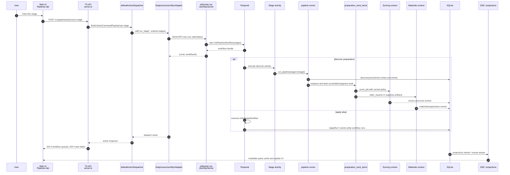

### Shared Components

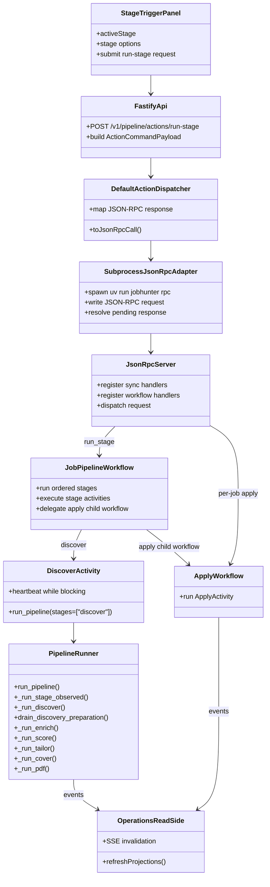

## Shared Stage Mechanics

### Stage Observation

Non-apply stages run under `_run_stage_observed()` in
`workers/automation/src/jobhunter/pipeline/runner.py`. That wrapper:

- emits `StageStarted`, `StageCompleted`, or `StageFailed` lifecycle rows to
  `job_events`;
- emits OpenTelemetry/Langfuse spans named `pipeline.stage.<stage>`;
- converts runner results into a stage status (`ok`, `partial`, or `error`);
- keeps the JSON-RPC caller informed even when downstream projections refresh
  later.

Discover source steps use `_run_discovery_source()`, a source-level variant that
also emits `DiscoveryRunStarted`, `DiscoveryRunCompleted`, and
`DiscoveryRunFailed` rows for source-quality aggregation. Long-running sources
own durable progress through the same discovery-run aggregate. For example,
JobSpy reports completed search combinations, current query/location, observed
raw rows, accepted new rows, duplicates, filtered rows, and source errors while
the crawl is still running. The dashboard progress read model renders that
source-level detail instead of only showing the coarse stage count.

Discover has a no-overlap Temporal policy. The source stage is allowed to run
longer than the default 30-minute activity window, and the workflow does not
retry the whole Discover activity after timeout/cancellation. Source adapters
are responsible for idempotency, source-quality retry, progress, and
cooperative cancellation. This prevents a still-running external crawl from
being duplicated by an automatic activity retry.

When a user stops a running Discover workflow, the API emits a failed progress
event and terminalizes the matching `discovery_runs` row so the UI, audit log,
and source-quality projections agree that the source is no longer active.
Worker startup recovery applies the same terminal state to stale source runs
left running by a prior worker process.

### Dry Run

For non-apply stages, `dryRun=true` is passed through the workflow activity into
`run_pipeline()`. The runner returns planned stage metadata and records dry-run
operational attempts before executing any stage implementation.

For apply, `dryRun` is passed into `ApplyWorkflowInput` and down to the apply
launcher. The workflow still starts, but the launcher follows the dry-run path
instead of submitting applications.

### Limit

`limit` is forwarded to every stage. The meaning is stage-specific:

- Discover: global cap for observed jobs across scheduled sources. When set,
  Discover runs sources sequentially and skips remaining sources once the cap is
  consumed; the same value is also used by the internal detail-enrichment queue
  drain and the internal preparation work-item drains.
- Score: internal/maintenance cap for jobs selected for scoring after retrieval
  preselection.
- Tailor: internal/maintenance cap for eligible high-fit jobs to tailor.
- Cover: internal/maintenance cap for eligible jobs needing cover letters.
- PDF: cap for pending PDF render jobs.
- Apply: cap for apply attempts unless `continuous=true`, in which case the
  apply launcher runs continuously.

### Sequential And Streaming

`run_pipeline()` has two Python execution modes:

- Sequential: stages run one at a time in canonical stage order.
- Streaming: each selected stage runs in its own thread. Downstream stages poll
  for pending work and finish only when their upstream producers are done and
  they have no remaining work.

The UI `run-stage` endpoint preserves request order by starting one
`JobPipelineWorkflow` for the selected stage list. The product stage trigger
normally sends only `discover` or `apply`. Non-apply stages run serially as
Temporal activities; each activity still enters the Python runner as a
single-stage `run_pipeline(stages=[stage])` invocation. `apply` remains the
dedicated `ApplyWorkflow`, executed as a child workflow when it appears in the
ordered pipeline list.

## Phase 1: Discover

### Purpose And Boundary

Discover finds postings from configured sources and creates canonical job
records plus source observations. It owns source scheduling, source-quality
feedback, canonical identity, idempotent source-control refresh, manual-capture
queue entries for protected sources, dedupe against existing jobs, and the
detail-enrichment queue drain for jobs that pass the initial title/location
filter. After enrichment, it orchestrates durable preparation work; Scoring and
Materials still own the score and artifact writes.

### Sequence

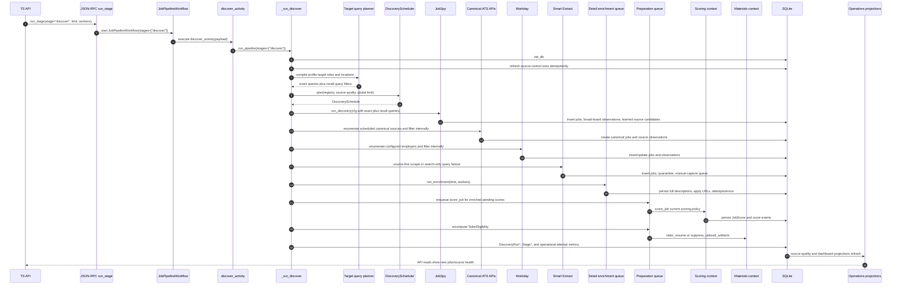

### Components

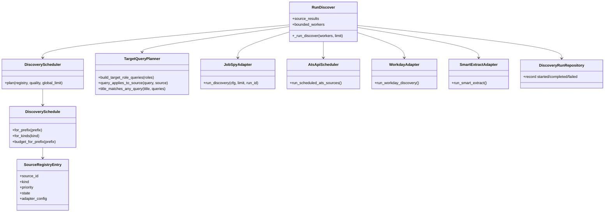

### Data And Events

- Reads source registry data from packaged YAML plus local
  `source_registry_entries`.
- Reads source-quality snapshots to schedule and budget sources.
- Reads board/runtime discovery settings from SQLite `discovery_settings`, then
  overlays target search from `candidate_profiles`. Target roles remain exact
  role guidance. Target tracks, seniority floors, role areas, and
  specializations add structured intent for deterministic recall expansion.
  Discovery settings store normalized track values (`ic`, `management`,
  `executive`) and normalized engineering seniority-floor values before the
  worker expands them. Resume import may suggest those structured fields, but
  existing user-entered profile values win.
- Compiles target roles into two query kinds:
  - exact queries, copied from the saved profile role text after note stripping;
  - recall queries, generated from the same target-role intent and marked with
    `match_mode=recall`, `generated_from=target_roles`, `target_track`, and
    `seniority_floor`.
- Recall query matching is a retrieval guard, not a relevance score. It enforces
  target track and seniority before scoring: IC targets stay IC, management
  targets stay management, executive targets stay executive, and candidates who
  configure multiple tracks get per-track recall.
- Applies exact-plus-recall intent to every discovery source family, but the
  execution shape differs by source type. JobSpy is a broad-board retrieval
  provider, so exact and recall queries are sent as external search probes.
  Direct ATS, Workday, and source-first Smart Extract sources are known
  boards/employers/pages, so they enumerate the source once per location and run
  normalized query/location acceptance through the shared discovery intake
  before any job row or delete tombstone is persisted.
  exact-plus-recall title matching internally instead of multiplying
  `queries x sources`. Smart Extract search-only sources still fan out by query
  when the source has no useful browse/all-jobs page.
- Canonical ATS adapters only emit usable postings: title, target location,
  and a non-empty description must all be present before a posting reaches the
  discovery write boundary. Greenhouse uses the public board API's content
  payload so discovered rows are not created with blank descriptions.
- Runs posting staleness and source hygiene checks before source execution:
  verified unavailable, expired, removed, or location-incompatible postings move
  to the closed lifecycle state, while active rows from JobSpy, direct ATS,
  Workday, and Smart Extract are rechecked against the current title, location,
  and description contract and soft-deleted when they no longer pass.
- Upserts source registry control rows, source locator candidates, and
  manual-capture queue entries for protected/manual sources. Existing
  `imported` or `dismissed` manual-capture entries keep their status.
- Writes `jobs`, source observations, canonical identity rows, source-learning
  registry updates, review queue entries, quarantine entries, discovery run
  rows, `job_events`, and source-level operational attempt metrics.
- Emits stage events and source-level discovery events.
- Enqueues and drains `PreparationWorkItemQueued`,
  `PreparationWorkItemStarted`, `PreparationWorkItemCompleted`, and
  `PreparationWorkItemFailed` events for internal scoring, tailoring, and
  suppression work after enrichment.
- Treats JobSpy result URLs as broad-board observations and JobSpy direct URLs
  as owner-source evidence. Runnable ATS direct URLs are promoted into
  `source_registry_entries`; ambiguous direct URLs and ATS URLs that still need
  adapter configuration are surfaced through source locator/manual-capture
  review instead of being ignored.
- Classifies JobSpy board observations as `source_role=lead_generator` and
  root employer/ATS/API sources as `source_role=canonical_source`, so board
  discovery metrics do not collapse into canonical employer source health.

### Failure And Limits

Each source family is isolated. A failed JobSpy, ATS, Workday, or Smart Extract
step records failure information and lets the caller see a partial source
result. With `limit > 0`, the stage uses sequential source execution and skips
remaining source families once the new-job cap is consumed. All discovery source
families treat the cap as a new-job budget: existing rediscoveries record
observations but do not consume the remaining budget, so exact-query duplicates
do not prevent later recall queries or sources from running. If internal
preparation work fails after enrichment, the durable work item remains failed or
retryable and the Discover result reports partial preparation status without
collapsing the owning Scoring or Materials failure into Discovery state.

## Internal Discovery Subphase: Detail Enrichment

### Purpose And Boundary

Detail enrichment turns discovered jobs into usable job records by fetching
full descriptions, application URLs, and detail-page metadata. It owns
detail-page fetching and extraction. It is not a top-level user-run pipeline
stage; Discovery starts the queue drain and passes the same `workers` value to
the enrichment runner. It does not score fit or generate materials.

### Sequence

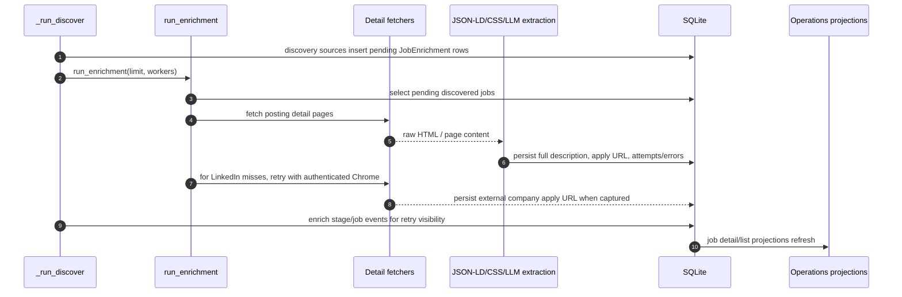

### Components

```mermaid
classDiagram
    class RunDiscover {
      +_run_discover(workers, limit)
      +internal enrichment worker
    }
    class EnrichmentRunner {
      +run_enrichment(limit, workers)
    }
    class DetailPageFetcherPort {
      +fetch(url)
    }
    class LlmPort {
      +complete(prompt, schema)
    }
    class JobEnrichment {
      +description
      +application_url
      +attempts
    }
    class EnrichmentRepository {
      +save(enrichment)
    }

    RunDiscover --> EnrichmentRunner
    EnrichmentRunner --> DetailPageFetcherPort
    EnrichmentRunner --> LlmPort
    EnrichmentRunner --> JobEnrichment
    EnrichmentRunner --> EnrichmentRepository
```

### Data And Events

- Reads pending jobs from SQLite selectors.
- Writes enriched description/application fields and canonical enrichment rows
  where available.
- Retries LinkedIn rows that are failed or enriched without an application URL
  with a bounded authenticated Chrome pass. The pass may click the LinkedIn
  apply control to capture an external company URL, but it stops before forms
  or submission.
- Records detail scrape timestamps and errors for retry/debug visibility.
- Records enrich job/stage events for retry/debug visibility without exposing
  Enrich as a top-level pipeline action.
- Updates job list/detail projections so the UI can show richer job content.

### Failure And Limits

`limit` caps pending detail jobs. `workers` controls concurrent detail work.
Individual detail failures are recorded on the job so later runs can retry or
surface the error without crashing unrelated jobs.

## Internal Discovery Preparation Work

### Purpose And Boundary

Preparation work items are the durable bridge between the user-facing Discover
stage and the internal Scoring and Materials bounded contexts. The queue makes
post-enrichment work idempotent, restartable, and observable without letting
Discovery write scores or artifacts directly.

Work item kinds are:

- `score_job`: score one enriched job with the current scoring policy.
- `tailor_resume`: create current-policy tailored materials for an eligible
  job.
- `suppress_tailored_artifacts`: soft-hide active tailored artifacts when the
  job no longer satisfies the live threshold or hard-blocker eligibility.

### Event Flow

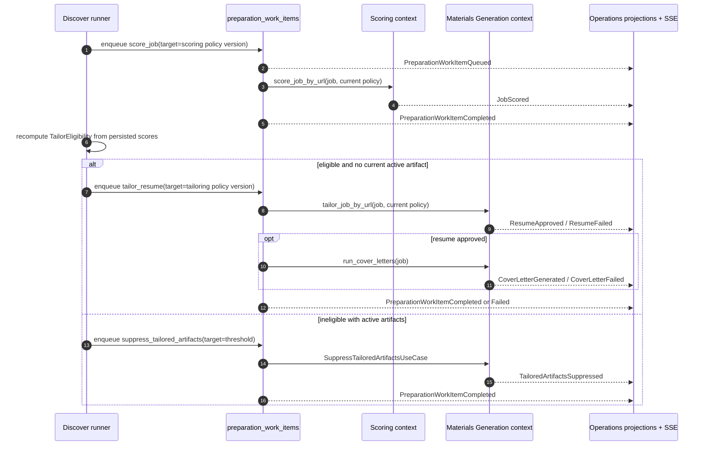

### Data And Events

- `preparation_work_items` keys work by tenant, job, kind, target version,
  source event, and idempotency key so reruns do not duplicate in-flight work.
- `target_version` is the scoring policy version for `score_job`, the tailoring
  policy version for `tailor_resume`, and the live fit-score threshold for
  `suppress_tailored_artifacts`.
- `source_event_id` ties each item to the latest discovery/enrichment/source
  fact that made the work necessary.
- Successful `tailor_resume` work immediately invokes the job-scoped cover
  stage. Cover failures are recorded on the cover stage for retry without
  forcing the tailored resume work item to regenerate the resume.
- Viewing the Jobs page is also a pickup signal: eligible visible rows whose
  current state is `pending` and whose current substage is `enrich`, `score`,
  `tailor`, or `cover` can dispatch a job-scoped run from that substage without
  resetting attempts or failure metadata. The API route is the safety boundary:
  known-ineligible rows return `not_eligible` and do not start worker activity.
- Work item lifecycle events are part of the SSE catalog, so Operations can
  invalidate dashboard, job detail, artifact, and activity projections while
  Discover is still running.
- Scoring policy changes do not silently rescore existing jobs. Current-version
  actions use `rescore_job` or
  `rescore_jobs_not_on_current_scoring_policy`.
- Tailoring policy changes do not silently regenerate existing artifacts.
  Current-version actions use `retailor_job` or `retailor_current_policy`.
- Threshold changes are live eligibility changes, not scoring policy changes:
  lowering the threshold can enqueue `tailor_resume` from persisted scores;
  raising it can enqueue `suppress_tailored_artifacts`. Neither path invokes
  the scoring LLM.

### Failure And Limits

Each work item is claimed, completed, failed, or retried independently. A
failed score does not block unrelated tailoring/suppression work for other jobs,
and a failed tailoring job can be retried without rediscovering the posting.
`limit` bounds each drain pass so local debug runs can stay small.

## Internal Preparation Context: Score

### Purpose And Boundary

Score assigns applicant-side fit scores and structured reasoning to enriched
jobs. It owns retrieval preselection, scoring criteria, LLM parsing, score
versioning, and user-corrected score history. It does not tailor materials.
In the product flow this is Discover subwork; explicit rescore actions are
maintenance controls.

### Sequence

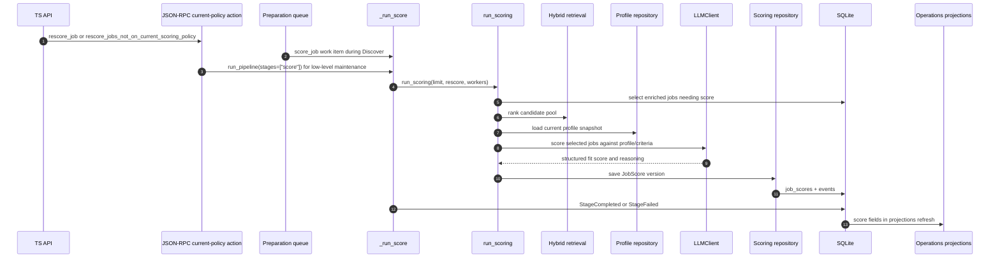

### Components

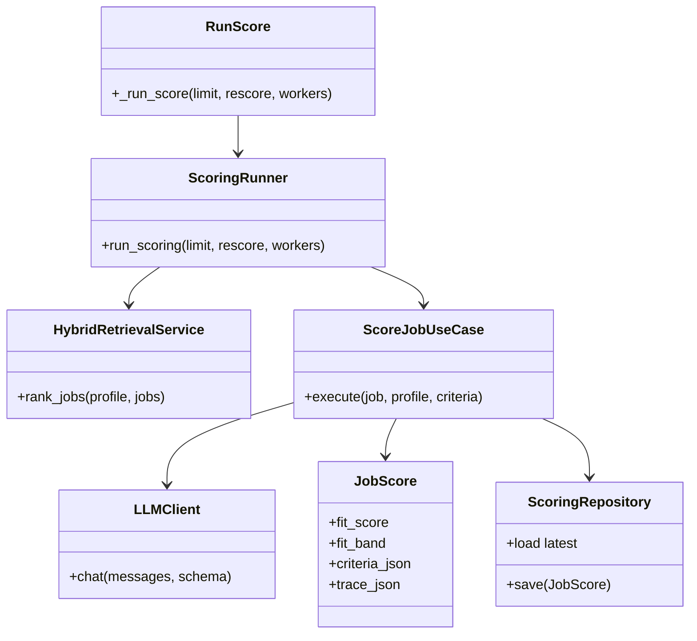

### Data And Events

- Reads enriched job content and profile target preferences.
- Writes versioned `job_scores` rows with criteria and trace metadata.
- Writes versioned `scoring_policies` rows when user corrections create
  correction-derived calibration anchors; current behavior preserves rubric
  weights and thresholds while making later score traces cite the new policy
  version and anchor IDs.
- Marks comparable latest uncorrected scores stale in `job_score_staleness`
  when a correction creates a newer scoring policy version. Corrected score
  versions are excluded. Successful uncorrected rescores under the newer policy
  resolve the stale marker; the local API can also reset active stale markers
  for explicit `jobhunter run score --rescore` processing.
- Supports a local, non-sensitive scoring governance report for QA. The report
  summarizes current policy version, rubric version, anchor count, unresolved
  and resolved stale-marker counts, correction count, and correction agreement
  signal without emitting raw job URLs, correction rationales, anchor IDs,
  resumes, generated artifacts, or local paths.
- Updates legacy-compatible score fields where needed by queue selectors.
- Publishes score events consumed by Pipeline and Operations.
- Refreshes dashboard score distributions and job list score badges.

### Failure And Limits

`limit` applies after retrieval preselection. `rescore=true` allows jobs with
existing scores back into the candidate pool. Parser warnings and failed LLM
calls are recorded so score failures do not masquerade as successful low-fit
results. Scoring prompt, model, schema, rubric, or policy changes must run the
local scoring eval gate documented in `docs/local-reliability-qa.md`; the gate
checks deterministic policy resolution separately from the raw LLM score and
pins stale-score exclusion until explicit reset/rescore.

## Internal Preparation Context: Tailor

### Purpose And Boundary

Tailor creates job-specific resume materials for high-fit jobs. It owns resume
generation, validation mode, retry/retailor decisions, and resume artifact
registration. It does not submit applications. In the product flow this is
Discover subwork. First-time manual tailoring is exposed on the job detail
tailor stage for the selected job; explicit re-tailor actions remain
current-policy regeneration controls for jobs that already have tailored
artifacts.

### Weaknesses Addressed

The previous tailoring path could pass local validation while still producing a
resume that was not good enough to send. The important gaps were:

- One generator call owned both drafting and self-approval, so there was no
  independent quality gate.
- `approved_with_judge_warning` counted as stage success, which hid weak
  tailored resumes behind a green pipeline status.
- The JSON validator checked fields before rendering, but rendered text could
  still carry banned phrases, unsupported claims, or missing required evidence.
- Model routing rejected per-call model choices, so CLI/UI/API controls could
  not safely fan out across providers or run a separate judge.
- The job blob used the source board as company fallback, which could leak
  source names into generated materials.
- Artifact/report metadata did not identify the selected generator, judge
  result, prompt version, or schema version, making audit and retry decisions
  weak.

Tailoring now treats generation and judgment as separate steps: multiple
provider/model specs can draft candidates, validation runs per candidate, and a
structured judge must return `PASS` above the configured threshold before the
resume is approved. `lenient` mode remains available for local low-cost runs,
but normal and strict modes are quality-gated.

### Sequence

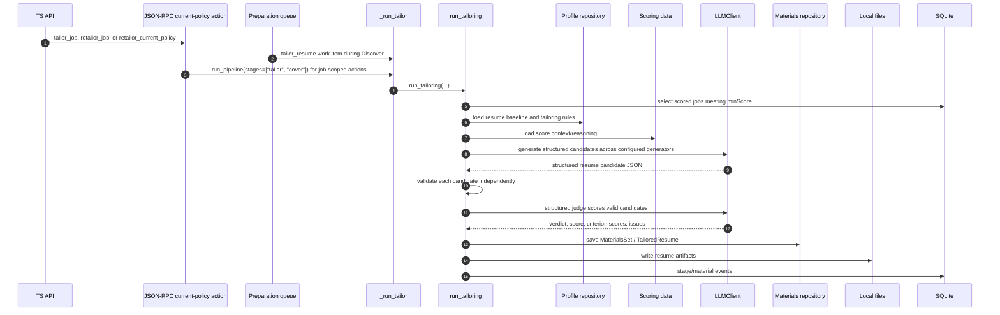

### Components

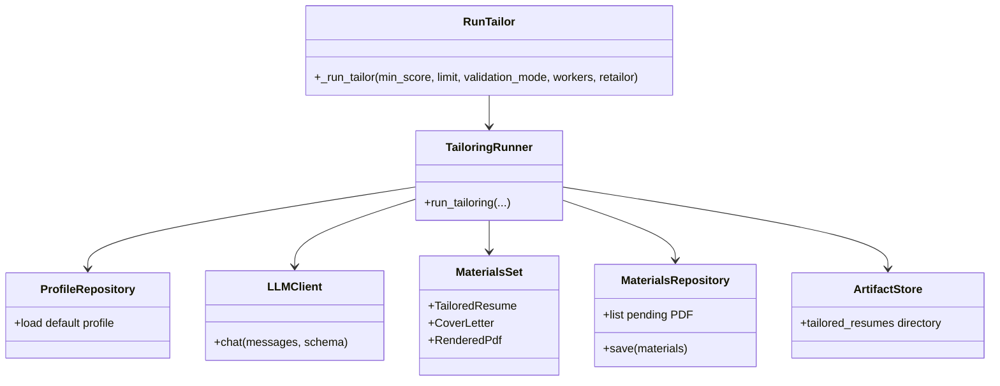

### Data And Events

- Reads jobs with score >= `minScore`; a per-job `tailor_job` user action can
  override that floor only for the selected job and then continue into the
  job-scoped cover stage.
- Reads profile resume baseline, skills, writing style, and tailoring rules.
- Writes tailored resume records and local artifacts under the JobHunter app
  directory.
- Persists safe quality metadata with the artifact/report: selected generator,
  candidate summaries, judge model, judge score/verdict/issues, and
  prompt/schema versions. Provider URLs, API keys, and raw credential config
  are never stored.
- Emits material-generation events and pipeline lifecycle events.
- Updates artifact and job detail projections.

### Failure And Limits

`validationMode` controls strictness of generated-material validation.
`retailor=true` allows existing tailored materials to be regenerated. First-time
manual tailoring uses `retailor=false` and records an audit event before worker
dispatch so the user's intent is visible even if the worker later skips or fails.
`workers` controls parallel tailoring work. `tailorModels` can fan out candidate
generation across provider/model specs, and `tailorJudgeModel` selects the
structured judge independently from apply's browser-action model. By default,
validator-passing resumes still fail the tailor stage unless the structured
judge returns `PASS` above the configured score threshold; `lenient` mode skips
the judge for local low-cost runs. Failures are tracked per job/material so the
stage can be retried without losing successful materials.

## Internal Material Context: Cover

### Purpose And Boundary

Cover creates job-specific cover letters for jobs that already have sufficient
score/material context. It owns cover-letter text generation and persistence.
It also renders the cover-letter PDF, so the stage outputs the artifacts Apply
needs without relying on a later PDF-only phase. It is surfaced as Discover
diagnostic state in the product UI rather than a primary preparation stage.

### Sequence

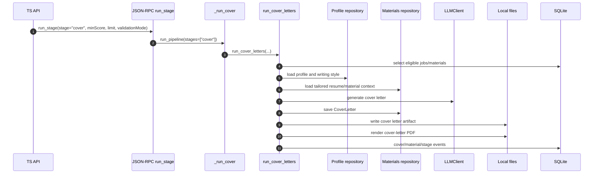

### Components

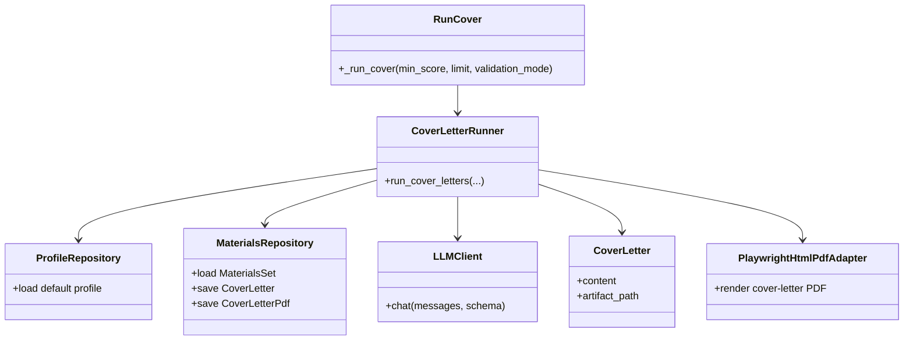

### Data And Events

- Reads score, job, profile, and existing materials context.
- Writes cover-letter material rows plus local cover-letter text and PDF files.
- Publishes cover-letter generation and PDF-rendered events.
- Refreshes artifact and job detail projections.

### Failure And Limits

`limit` caps eligible jobs. `validationMode` controls cover-letter validation.
Failures are local to individual jobs so a retry can continue from the remaining
pending cover letters.

## Phase 2: Apply

### Purpose And Boundary

Apply drives browser/agent automation to submit or dry-run applications. It is
the riskiest and longest-running phase, so the batch pipeline `run_stage` route
keeps orchestration in Temporal and `JobPipelineWorkflow` delegates the selected
`apply` stage to child `ApplyWorkflow` instead of a synchronous runner activity.
It owns apply-run lifecycle, browser execution, dry-run submission safety,
cancellation, and apply artifacts/logs.

### Sequence

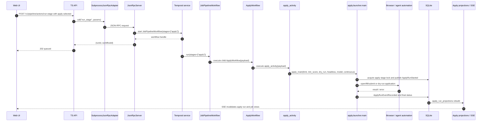

### Components

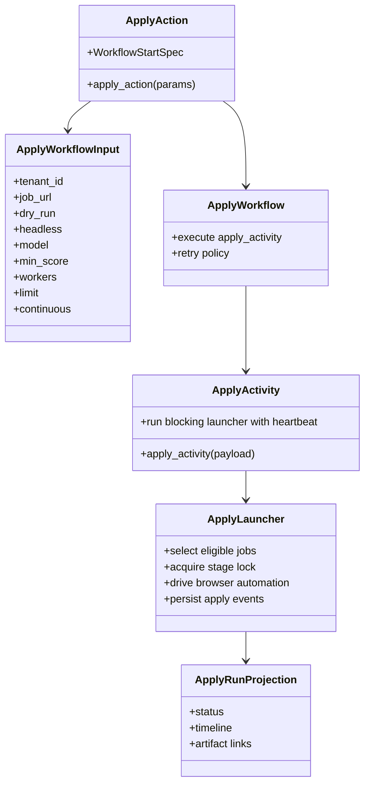

### Data And Events

- Reads eligible jobs, score/materials, posting or direct application URL data,
  and profile facts.
- Writes canonical apply stage state and `ApplyRunStarted`,
  `ApplyRunEventRecorded`, `ApplicationSubmitted`, or `ApplicationFailed`
  events.
- Writes apply logs/artifacts where available.
- Rebuilds `apply_run_projections` from lifecycle events.

### Failure, Retry, And Cancellation

`ApplyWorkflow` uses an apply-specific retry policy and a two-hour activity
timeout. Transient activity failures can retry through Temporal. Operator
errors such as no eligible job fail fast. `cancel_run` signals the workflow
runtime to cancel an in-flight run; `cancel_stage` is the post-hoc SQLite state
transition for marking a stage canceled.

## Operations Read-Side

The UI does not read directly from stage internals. It reads projection-backed
API endpoints owned by Operations:

`job_list_projections.current_stage` is a product-stage field. Projection
builders write only `discover` or `apply` there, even when the first actionable
internal row is `enrich`, `score`, `tailor`, or `cover`. The full internal
stage list remains in `job_detail_projections.stages_json` for review,
diagnostics, and repair decisions. Cover is the exception that can advance the
product stage: when the first actionable internal row is `cover` and a tailored
resume exists, the list projection writes `current_stage='apply'` while keeping
`current_substage='cover'` and the cover state visible for retry or repair.

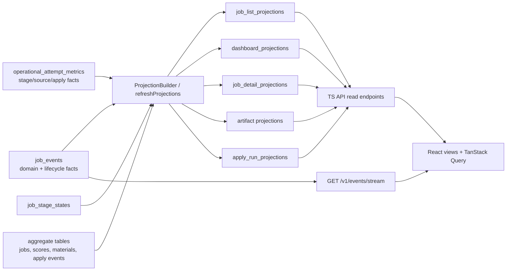

This separation is why a stage can complete before every UI card visibly
changes: the write path records durable facts first, then projection refresh and
SSE invalidation make those facts visible to the frontend.

Operational metrics are append-only rows written at pipeline boundaries rather
than inferred from dashboard labels or free-form event messages. Rows include
`stage`, `source_id`, source role, adapter, attempt kind, outcome,
operational/scrape/retryable flags, counts, durations, `error_class`,
`error_message`, `run_id`, and `job_url` when known. Discovery, enrichment,
scoring, tailoring, preparation work items, cover generation, apply dry-runs,
and orphan cleanup all record structured attempts so
`discovery_runs.status='failed'` no longer has to carry unrelated failure
causes by itself.

## Source Files

Primary implementation files:

- `apps/api/src/server.ts`: `/v1/pipeline/actions/run-stage`.
- `apps/api/src/local-actions.ts`: maps UI commands to JSON-RPC methods and
  interprets results.
- `apps/api/src/json-rpc-adapter.ts`: long-lived subprocess JSON-RPC adapter.
- `workers/automation/src/jobhunter/infrastructure/rpc/handlers.py`: JSON-RPC
  method registry.
- `workers/automation/src/jobhunter/actions.py`: local action wrapper for
  `run_stage` and `profile_import`.
- `workers/automation/src/jobhunter/pipeline/runner.py`: non-apply stage
  orchestration.
- `workers/automation/src/jobhunter/pipeline/workflow.py`: non-apply Temporal
  workflow path.
- `workers/automation/src/jobhunter/apply/workflow.py`: apply workflow.
- `workers/automation/src/jobhunter/apply/activities.py`: apply activity.
- `workers/automation/src/jobhunter/apply/launcher.py`: apply browser/agent
  launcher.
- `apps/api/src/projections.ts` and
  `workers/automation/src/jobhunter/infrastructure/projections/`: Operations
  read-side projection builders.
