# Job Pipeline Architecture

This document explains how JobHunter's job pipeline executes today. It is the
deep-dive companion to [`architecture.md`](architecture.md): the top-level
architecture doc names the runtime boundaries, while this document follows each
pipeline stage through the UI, API, JSON-RPC worker boundary, Temporal
workflow, Python activities, persistence, events, and projections.

The canonical domain model remains [`ddd-target.md`](ddd-target.md). This file
documents the implemented local execution shape.

Use the first sections for the shared execution model. Each stage section then
uses the same shape: purpose and boundary, sequence diagram, component diagram,
data/events, and failure behavior. Component diagrams include concrete classes
where the code has them and module/use-case components where the implementation
is intentionally function-based.

## Pipeline Phases

The user-facing stage order is:

```text
discover -> apply
```

`Discover` is the single preparation stage. It finds jobs, enriches usable
postings, derives deterministic per-job preparation workflows for scoring,
tailoring, cover letters, and PDFs, and performs artifact suppression for jobs
that no longer qualify. `Apply` stays separate because it can submit
applications and has its own safety controls.

The persisted/internal stage vocabulary still includes the preparation
substatuses:

```text
discover -> enrich -> score -> tailor -> cover -> apply
```

Those names remain in stage rows, low-level contracts, CLI maintenance paths,
and diagnostics. Job list projections and the product UI map `enrich`, `score`,
`tailor`, and `cover` back to `Discover` while still exposing their detail in
job timelines and operational views.

Discovery preparation runs these internal steps:

1. Detail enrichment fetches full descriptions and application URLs.
2. `JobPreparationWorkflow` score steps call the Scoring context with the
   current scoring policy.
3. Tailor eligibility is recomputed from persisted scores, hard blockers, the
   live fit-score threshold, and the current tailoring policy.
4. `JobPreparationWorkflow` tailor, cover, and PDF steps call Materials
   Generation for eligible jobs missing current-policy active artifacts.

`discover` and `apply` are deliberately separate workflow boundaries. The
Pipelines UI still sends both through `POST /v1/pipeline/actions/run-stage`; the
TS API dispatches JSON-RPC `run_stage`. A discover-only request starts
`DiscoverWorkflow` directly with deterministic id `discover-{tenantId}`. Apply
requests start `JobPipelineWorkflow`, which delegates to child `ApplyWorkflow`
and reports lifecycle progress through apply-specific events and projections.
The dedicated JSON-RPC `apply` method is reserved for per-job apply and retry
actions.

## Execution Surfaces

There are five execution surfaces. They share the same Python stage
implementations where possible, but they differ in orchestration.

| Surface | Entry point | Execution model | Stages |
| --- | --- | --- | --- |
| Pipelines UI | `POST /v1/pipeline/actions/run-stage` | TS API sends `discover` or `apply` through JSON-RPC `run_stage`. `discover` starts `DiscoverWorkflow`, which owns source-family activities, enrichment, and per-job `JobPreparationWorkflow` fan-out; `apply` stays on `JobPipelineWorkflow` and delegates to child `ApplyWorkflow`. | User-facing Discover and Apply |
| Jobs view pending pickup | `POST /v1/jobs/:jobKey/actions/run-stage` | Viewing Jobs can start one visible `pending` internal preparation substage (`enrich`, `score`, `tailor`, or `cover`) for the selected job without resetting stage state. The web page paces pickup to one unchanged list snapshot, and the API refreshes projections plus gates dispatch on observable stage eligibility before starting a job-scoped `JobPipelineWorkflow`. | Internal preparation pickup |
| Jobs bulk pending prep | `POST /v1/jobs/bulk-run-pending-preparation` | The Jobs toolbar can explicitly continue active pending preparation backlogs. The API selects the first eligible pending preparation substage per matching job, groups selected job URLs by `enrich`, `score`, `tailor`, or `cover`, and dispatches bounded `run_stage` workflows without resetting failures or running `apply`. | Internal preparation recovery |
| Jobs bulk failed retry | `POST /v1/jobs/bulk-retry-failed` | The API resets retryable failed stages, and with `runAfter: true` groups reset preparation rows by internal stage before dispatching batch `run_stage` workflows with explicit `jobUrls` and requested workers. The route records the workflow id, job URLs, worker count, and per-job `StageQueued` events with `source: "bulk_retry_failed"`; it never auto-runs `apply`. | Internal preparation recovery |
| CLI batch run | `jobhunter run ...` | The CLI builds the same `WorkflowStartSpec` shape as JSON-RPC, starts Temporal, waits for the handle, and exits non-zero on workflow failure. `jobhunter discover` / `jobhunter run discover` is the normal preparation path; low-level `score`, `tailor`, and `cover` remain maintenance/diagnostic commands. | Discover plus internal maintenance stages |
| Temporal discovery workflow | `DiscoverWorkflow` | Tenant-scoped workflow (`discover-{tenantId}`) with one activity per source family, one enrichment activity, and batched preparation child starts. | Discover |
| Temporal pipeline workflow | `JobPipelineWorkflow` | Serial workflow for remaining batch orchestration; it delegates `discover` to child `DiscoverWorkflow` and `apply` to child `ApplyWorkflow`. | Discover and Apply |
| Temporal preparation workflow | `JobPreparationWorkflow` | Deterministic per-job workflow keyed by `prep-{idempotency_key}` that runs score, tailor, cover, and PDF steps in order. | Internal preparation |
| Temporal apply workflow | `ApplyWorkflow` | Per-job apply workflow with one activity and apply-specific retry policy. | Apply |
| Temporal profile import workflow | `ProfileImportWorkflow` | Single-activity workflow for resume PDF profile import. | Profile |
| Temporal compensation refresh workflow | `CompensationRefreshWorkflow` | Single-activity workflow for posted compensation and market estimate refresh. | Compensation |

### End-To-End UI/API Call Path

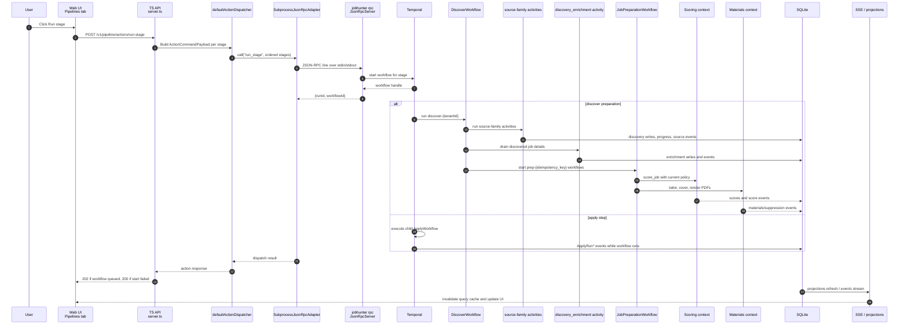

### Shared Components

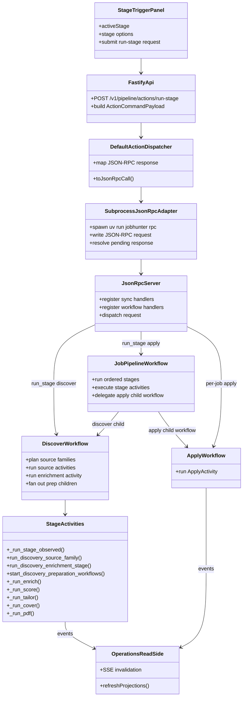

## Shared Stage Mechanics

### Stage Observation

Non-apply stages run under `_run_stage_observed()` in
`workers/automation/src/jobhunter/pipeline/runner.py`. That wrapper:

- emits `StageStarted`, `StageCompleted`, or `StageFailed` lifecycle rows to
  `job_events`;
- emits OpenTelemetry/Langfuse spans named `pipeline.stage.<stage>`;
- converts runner results into a stage status (`ok`, `partial`, or `error`);
- keeps the JSON-RPC caller informed even when downstream projections refresh
  later.

Discover source steps use `_run_discovery_source()`, a source-level variant that
also emits `DiscoveryRunStarted`, `DiscoveryRunCompleted`, and
`DiscoveryRunFailed` rows for source-quality aggregation. Long-running sources
own durable progress through the same discovery-run aggregate. For example,
JobSpy reports completed search combinations, current query/location, observed
raw rows, accepted new rows, duplicates, filtered rows, and source errors while
the crawl is still running. The dashboard progress read model renders that
source-level detail instead of only showing the coarse stage count.

Discover has a no-overlap Temporal policy and one source-family activity per
planned family. Source-family activities are allowed to run longer than the
default 30-minute activity window and heartbeat `DiscoveryRunProgress` payloads.
Temporal retries the failed source-family activity, not the whole discovery
batch, and the workflow preserves the legacy source order so global limit and
source-budget semantics remain stable. Source adapters are responsible for
idempotency, source-quality retry, progress, and cooperative cancellation.

When a user stops a running Discover workflow, the API emits a failed progress
event and terminalizes the matching `discovery_runs` row so the UI, audit log,
and source-quality projections agree that the source is no longer active.
Worker startup recovery applies the same terminal state to stale source runs
left running by a prior worker process.

### Dry Run

For non-apply maintenance stages, `dryRun=true` is passed through the workflow
payload into the owning activity. The activity returns planned stage metadata
and records dry-run operational attempts before executing any stage
implementation.

For apply, `dryRun` is passed into `ApplyWorkflowInput` and down to the apply
launcher. The workflow still starts, but the launcher follows the dry-run path
instead of submitting applications.

### Limit

`limit` is forwarded to every stage. The meaning is stage-specific:

- Discover: global cap for observed jobs across scheduled sources. When set,
  Discover runs sources sequentially and skips remaining sources once the cap is
  consumed; the same value is also used by the internal detail-enrichment queue
  drain and preparation-target derivation.
- Score: internal/maintenance cap for jobs selected for scoring after retrieval
  preselection.
- Tailor: internal/maintenance cap for eligible high-fit jobs to tailor.
- Cover: internal/maintenance cap for eligible jobs needing cover letters.
- PDF: cap for pending PDF render jobs.
- Apply: cap for apply attempts unless `continuous=true`, in which case the
  apply launcher runs continuously.

### Workflow Ordering

There is one execution path for long-running work: entry points start Temporal
workflows. The UI `run-stage` endpoint, JSON-RPC handlers, CLI commands, and
local actions all build shared workflow specs and start the workflow on the
JobHunter task queue. `JobPipelineWorkflow` preserves the requested canonical
stage order and executes non-apply maintenance stages serially as activities.
`discover` is delegated to child `DiscoverWorkflow`; `apply` is delegated to
child `ApplyWorkflow`. The deleted in-process sequential/threaded engine is no
longer reachable by a flag or fallback.

## Discover Stage

### Purpose And Boundary

Discover finds postings from configured sources and creates canonical job
records plus source observations. It owns source scheduling, source-quality
feedback, canonical identity, idempotent source-control refresh, manual-capture
queue entries for protected sources, dedupe against existing jobs, and the
detail-enrichment queue drain for jobs that pass the initial title/location
filter. After enrichment, it orchestrates durable preparation work; Scoring and
Materials still own the score and artifact writes.

### Sequence

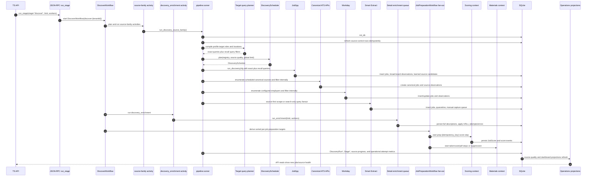

### Components

```mermaid
classDiagram
    class DiscoverWorkflow {
      +discover-{tenantId}
      +plan_discovery_sources()
      +source-family activities
      +discovery_enrichment()
      +start prep children
    }
    class DiscoverySourceActivity {
      +run_discovery_source_family()
      +heartbeat DiscoveryRunProgress
      +cooperative cancel_event
    }
    class DiscoveryScheduler {
      +plan(registry, quality, global_limit)
    }
    class TargetQueryPlanner {
      +build_target_role_queries(roles)
      +query_applies_to_source(query, source)
      +title_matches_any_query(title, queries)
    }
    class DiscoverySchedule {
      +for_prefix(prefix)
      +for_kinds(kind)
      +budget_for_prefix(prefix)
    }
    class SourceRegistryEntry {
      +source_id
      +kind
      +priority
      +state
      +adapter_config
    }
    class JobSpyAdapter {
      +run_discovery(cfg, limit, run_id)
    }
    class AtsApiScheduler {
      +run_scheduled_ats_sources()
    }
    class WorkdayAdapter {
      +run_workday_discovery()
    }
    class SmartExtractAdapter {
      +run_smart_extract()
    }
    class DiscoveryRunRepository {
      +record started/completed/failed
    }

    DiscoverWorkflow --> DiscoveryScheduler
    DiscoverWorkflow --> DiscoverySourceActivity
    DiscoverySourceActivity --> TargetQueryPlanner
    DiscoveryScheduler --> DiscoverySchedule
    DiscoverySchedule --> SourceRegistryEntry
    DiscoverySourceActivity --> JobSpyAdapter
    DiscoverySourceActivity --> AtsApiScheduler
    DiscoverySourceActivity --> WorkdayAdapter
    DiscoverySourceActivity --> SmartExtractAdapter
    DiscoverySourceActivity --> DiscoveryRunRepository
```

### Data And Events

- Reads source registry data from packaged YAML plus local
  `source_registry_entries`.
- Reads source-quality snapshots to schedule and budget sources.
- Reads board/runtime discovery settings from SQLite `discovery_settings`, then
  overlays target search from `candidate_profiles`. Target roles remain exact
  role guidance. Target tracks, seniority floors, role areas, and
  specializations add structured intent for deterministic recall expansion.
  Discovery settings store normalized track values (`ic`, `management`,
  `executive`) and normalized engineering seniority-floor values before the
  worker expands them. Resume import may suggest those structured fields, but
  existing user-entered profile values win.
- Compiles target roles into two query kinds:
  - exact queries, copied from the saved profile role text after note stripping;
  - recall queries, generated from the same target-role intent and marked with
    `match_mode=recall`, `generated_from=target_roles`, `target_track`, and
    `seniority_floor`.
- Recall query matching is a retrieval guard, not a relevance score. It enforces
  target track and seniority before scoring: IC targets stay IC, management
  targets stay management, executive targets stay executive, and candidates who
  configure multiple tracks get per-track recall.
- Applies exact-plus-recall intent to every discovery source family, but the
  execution shape differs by source type. JobSpy is a broad-board retrieval
  provider, so exact and recall queries are sent as external search probes.
  Direct ATS, Workday, and source-first Smart Extract sources are known
  boards/employers/pages, so they enumerate the source once per location and run
  normalized query/location acceptance through the shared discovery intake
  before any job row or delete tombstone is persisted.
  exact-plus-recall title matching internally instead of multiplying
  `queries x sources`. Smart Extract search-only sources still fan out by query
  when the source has no useful browse/all-jobs page.
- Canonical ATS adapters only emit usable postings: title, target location,
  and a non-empty description must all be present before a posting reaches the
  discovery write boundary. Greenhouse uses the public board API's content
  payload so discovered rows are not created with blank descriptions.
- Runs posting staleness and source hygiene checks before source execution:
  verified unavailable, expired, removed, or location-incompatible postings move
  to the closed lifecycle state, while active rows from JobSpy, direct ATS,
  Workday, and Smart Extract are rechecked against the current title, location,
  and description contract and soft-deleted when they no longer pass.
- Upserts source registry control rows, source locator candidates, and
  manual-capture queue entries for protected/manual sources. Existing
  `imported` or `dismissed` manual-capture entries keep their status.
- Writes `jobs`, source observations, canonical identity rows, source-learning
  registry updates, review queue entries, quarantine entries, discovery run
  rows, `job_events`, and source-level operational attempt metrics.
- Emits stage events and source-level discovery events.
- Derives deterministic per-job preparation targets after enrichment and starts
  `JobPreparationWorkflow` runs for scoring, tailoring, cover-letter, PDF, or
  suppression work owned by the Scoring and Materials contexts.
- Treats JobSpy result URLs as broad-board observations and JobSpy direct URLs
  as owner-source evidence. Runnable ATS direct URLs are promoted into
  `source_registry_entries`; ambiguous direct URLs and ATS URLs that still need
  adapter configuration are surfaced through source locator/manual-capture
  review instead of being ignored.
- Classifies JobSpy board observations as `source_role=lead_generator` and
  root employer/ATS/API sources as `source_role=canonical_source`, so board
  discovery metrics do not collapse into canonical employer source health.

### Failure And Limits

Each source family is isolated. A failed JobSpy, ATS, Workday, or Smart Extract
step records failure information and lets the caller see a partial source
result. With `limit > 0`, the stage uses sequential source execution and skips
remaining source families once the new-job cap is consumed. All discovery source
families treat the cap as a new-job budget: existing rediscoveries record
observations but do not consume the remaining budget, so exact-query duplicates
do not prevent later recall queries or sources from running. If internal
preparation work fails after enrichment, the per-job workflow records the failed
step and can retry or resume through Temporal without collapsing the owning
Scoring or Materials failure into Discovery state.

## Internal Discovery Subphase: Detail Enrichment

### Purpose And Boundary

Detail enrichment turns discovered jobs into usable job records by fetching
full descriptions, application URLs, and detail-page metadata. It owns
detail-page fetching and extraction. It is not a top-level user-run pipeline
stage; Discovery starts the queue drain and passes the same `workers` value to
the enrichment runner. It does not score fit or generate materials.

### Sequence

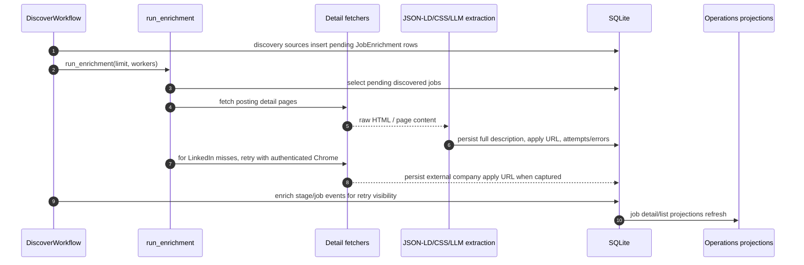

### Components

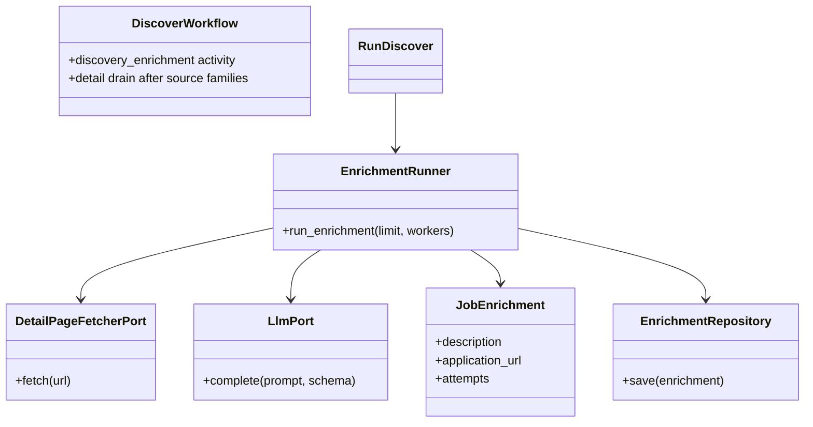

### Data And Events

- Reads pending jobs from SQLite selectors.
- Writes enriched description/application fields and canonical enrichment rows
  where available.
- Retries LinkedIn rows that are failed or enriched without an application URL
  with a bounded authenticated Chrome pass. The pass may click the LinkedIn
  apply control to capture an external company URL, but it stops before forms
  or submission.
- Records detail scrape timestamps and errors for retry/debug visibility.
- Records enrich job/stage events for retry/debug visibility without exposing
  Enrich as a top-level pipeline action.
- Updates job list/detail projections so the UI can show richer job content.

### Failure And Limits

`limit` caps pending detail jobs. `workers` controls concurrent detail work.
Individual detail failures are recorded on the job so later runs can retry or
surface the error without crashing unrelated jobs.

## Internal Discovery Preparation Work

### Purpose And Boundary

`JobPreparationWorkflow` is the durable bridge between the user-facing Discover
stage and the internal Scoring and Materials bounded contexts. Discovery derives
a deterministic target list after detail enrichment, then starts one
`JobPreparationWorkflow` per job with workflow ID `prep-{idempotency_key}` and
Temporal `USE_EXISTING` conflict behavior. The idempotency key is still computed
from tenant, job, kind, target version, and source event, but Temporal now owns
retry, recovery, and duplicate suppression instead of a local claim loop.

Preparation workflows run the requested subset of:

- `score`: score one enriched job with the current scoring policy.
- `tailor`: create current-policy tailored materials for an eligible job.
- `cover`: generate the job-scoped cover letter after tailoring succeeds.
- `pdf`: render missing PDFs for the current approved materials.

Discovery still performs the threshold/suppression recompute before fan-out so
active materials that no longer qualify are soft-hidden by the Materials context
without merging Scoring, Materials, and Discovery ownership.

### Event Flow

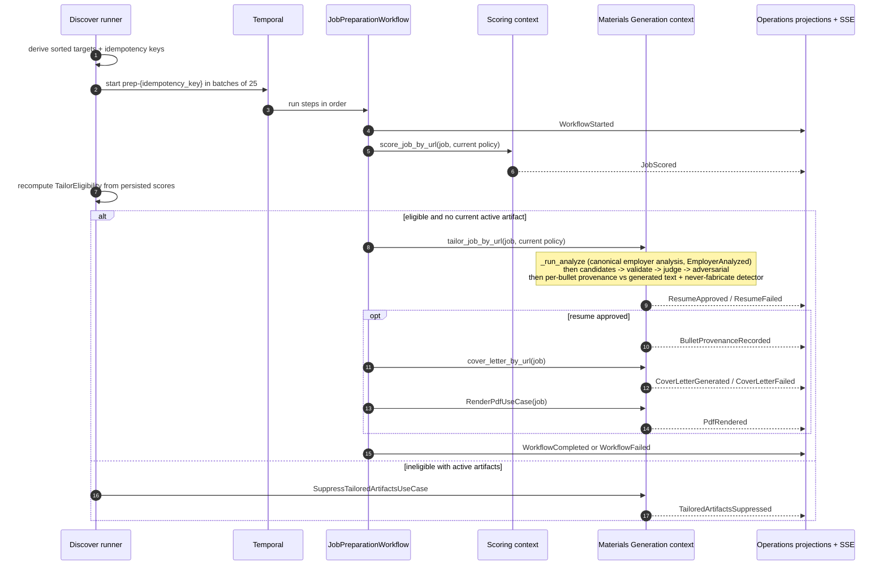

### Data And Events

- Workflow IDs key work by tenant, job, kind, target version, source event, and
  idempotency key so reruns attach to an in-flight workflow instead of starting
  duplicate side effects.
- `target_version` is the scoring policy version for score targets and the
  tailoring policy version for tailor/cover/pdf targets.
- `source_event_id` ties each workflow target to the latest discovery,
  enrichment, source, or stage fact that made the work necessary.
- Successful `tailor` work immediately invokes the job-scoped cover step and
  then the PDF rendering step. Cover/PDF failures are recorded on their owning
  stages and the workflow fails under Temporal retry policy without regenerating
  a completed earlier step on retry.
- Viewing the Jobs page is also a pickup signal: eligible visible rows whose
  current state is `pending` and whose current substage is `enrich`, `score`,
  `tailor`, or `cover` can dispatch a job-scoped run from that substage without
  resetting attempts or failure metadata. The API route is the safety boundary:
  known-ineligible rows return `not_eligible` and do not start worker activity.
- The Jobs toolbar `continue pending prep` action covers the backlog case that
  page-visible pickup intentionally throttles. It sends matching active pending
  jobs to `/v1/jobs/bulk-run-pending-preparation`; the API reuses the same
  eligibility boundary, groups selected job URLs by preparation substage, and
  records `StageQueued` with `source: "bulk_run_pending_preparation"`.
- Workflow lifecycle events are part of the `/runs` read model, and the
  underlying score/material stage events still invalidate dashboard, job detail,
  artifact, and activity projections while Discover is still running.
- Scoring policy changes do not silently rescore existing jobs. Current-version
  actions use `rescore_job` or
  `rescore_jobs_not_on_current_scoring_policy`.
- Tailoring policy changes do not silently regenerate existing artifacts.
  Current-version actions use `retailor_job` or `retailor_current_policy`.
- Threshold changes are live eligibility changes, not scoring policy changes:
  lowering the threshold can derive tailor/cover/pdf workflows from persisted
  scores; raising it can suppress active artifacts. Neither path invokes the
  scoring LLM.

### Failure And Limits

Each job preparation workflow retries its current failing step under Temporal.
A failed score does not block unrelated preparation workflows for other jobs,
and a failed tailoring job can resume at cover/pdf after the completed earlier
steps are already durable. `limit` bounds target derivation so local debug runs
can stay small.

Bulk failed retry is an API-owned recovery path, not a side effect of visiting
the Jobs page. When `runAfter: true`, the route sends the exact reset job URL
set across JSON-RPC and selected scoring honors the requested `workers` value
while processing that set. Rows already claimed by a fast worker are not moved
backward to `queued`; there is no local preparation reaper for score, tailor, or
cover because Temporal owns in-flight recovery.

## Internal Preparation Context: Score

### Purpose And Boundary

Score assigns applicant-side fit scores and structured reasoning to enriched
jobs. It owns retrieval preselection, scoring criteria, LLM parsing, score
versioning, and user-corrected score history. It does not tailor materials.
In the product flow this is Discover subwork; explicit rescore actions are
maintenance controls.

### Sequence

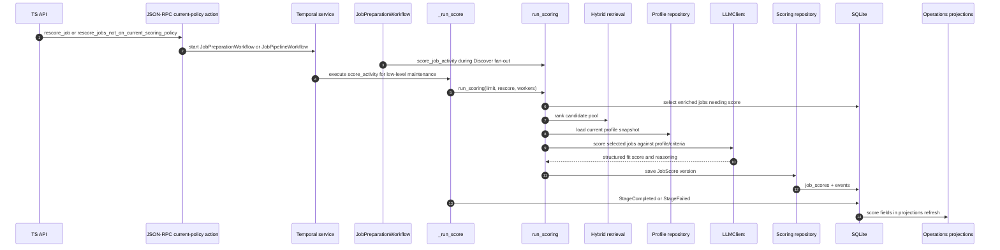

### Components

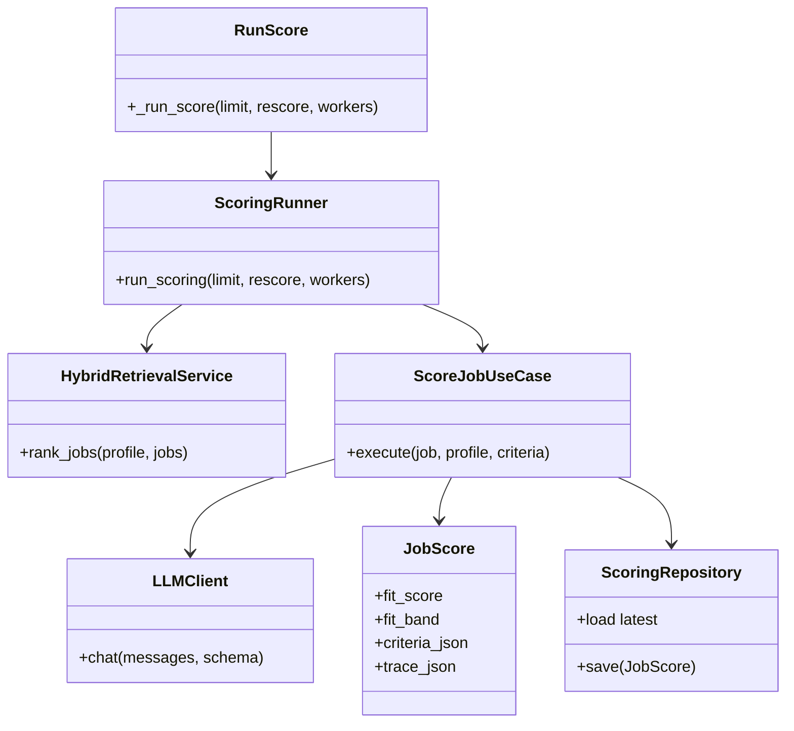

### Data And Events

- Reads enriched job content and profile target preferences.
- Writes versioned `job_scores` rows with criteria and trace metadata.
- Writes versioned `scoring_policies` rows when user corrections create
  correction-derived calibration anchors; current behavior preserves rubric
  weights and thresholds while making later score traces cite the new policy
  version and anchor IDs.
- Marks comparable latest uncorrected scores stale in `job_score_staleness`
  when a correction creates a newer scoring policy version. Corrected score
  versions are excluded. Successful uncorrected rescores under the newer policy
  resolve the stale marker; the local API can also reset active stale markers
  for explicit `jobhunter run score --rescore` processing.
- Supports a local, non-sensitive scoring governance report for QA. The report
  summarizes current policy version, rubric version, anchor count, unresolved
  and resolved stale-marker counts, correction count, and correction agreement
  signal without emitting raw job URLs, correction rationales, anchor IDs,
  resumes, generated artifacts, or local paths.
- Updates compact score fields where needed by queue selectors.
- Publishes score events consumed by Pipeline and Operations.
- Refreshes dashboard score distributions and job list score badges.

### Failure And Limits

`limit` applies after retrieval preselection. `rescore=true` allows jobs with
existing scores back into the candidate pool. Parser warnings and failed LLM
calls are recorded so score failures do not masquerade as successful low-fit
results. Scoring prompt, model, schema, rubric, or policy changes must run the
local scoring eval gate documented in `docs/local-reliability-qa.md`; the gate
checks deterministic policy resolution separately from the raw LLM score and
pins stale-score exclusion until explicit reset/rescore.

## Internal Preparation Context: Tailor

### Purpose And Boundary

Tailor creates job-specific resume materials for high-fit jobs. It owns resume
generation, validation mode, retry/retailor decisions, and resume artifact
registration. It does not submit applications. In the product flow this is
Discover subwork. First-time manual tailoring is exposed on the job detail
tailor stage for the selected job; explicit re-tailor actions remain
current-policy regeneration controls for jobs that already have tailored
artifacts.

### Generation And Approval Model

Tailoring separates drafting from approval. One or more configured
provider/model specs draft structured resume candidates. Each candidate is
validated independently against the profile contract, rendered text contract,
tailoring quality plan, and optional high-fit adversarial review.

Normal and strict validation modes require a separate structured judge to return
`PASS` at or above the configured threshold before the resume is approved.
`lenient` mode skips the judge for low-cost local runs. Approved artifacts carry
the selected generator, candidate summaries, judge model, judge score/verdict,
prompt/schema versions, quality checks, and retry feedback as audit metadata.

### Sequence

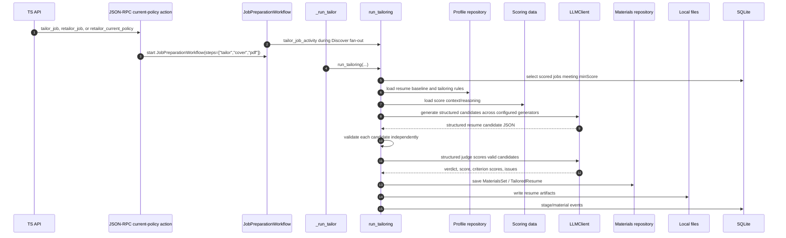

### Components

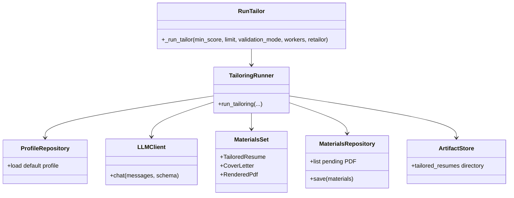

### Data And Events

- Reads jobs with score >= `minScore`; a per-job `tailor_job` user action can
  override that floor only for the selected job and then continue into the
  job-scoped cover stage.
- Reads profile resume baseline, skills, writing style, and tailoring rules.
- Writes tailored resume records and local artifacts under the JobHunter app
  directory.
- Persists safe quality metadata with the artifact/report: selected generator,
  candidate summaries, judge model, judge score/verdict/issues, and
  prompt/schema versions. Provider URLs, API keys, and raw credential config
  are never stored.
- Emits material-generation events and pipeline lifecycle events.
- Updates artifact and job detail projections.

### Failure And Limits

`validationMode` controls strictness of generated-material validation.
`retailor=true` allows existing tailored materials to be regenerated. First-time
manual tailoring uses `retailor=false` and records an audit event before worker
dispatch so the user's intent is visible even if the worker later skips or fails.
`workers` controls parallel tailoring work. `tailorModels` can fan out candidate
generation across provider/model specs, and `tailorJudgeModel` selects the
structured judge independently from apply's browser-action model. By default,
validator-passing resumes still fail the tailor stage unless the structured
judge returns `PASS` above the configured score threshold; `lenient` mode skips
the judge for local low-cost runs. Failures are tracked per job/material so the
stage can be retried without losing successful materials.

## Internal Material Context: Cover

### Purpose And Boundary

Cover creates job-specific cover letters for jobs that already have sufficient
score/material context. It owns cover-letter text generation and persistence.
It also renders the cover-letter PDF, so the stage outputs the artifacts Apply
needs without relying on a separate PDF-only stage. It is surfaced as Discover
diagnostic state in the product UI rather than a primary preparation stage.

### Sequence

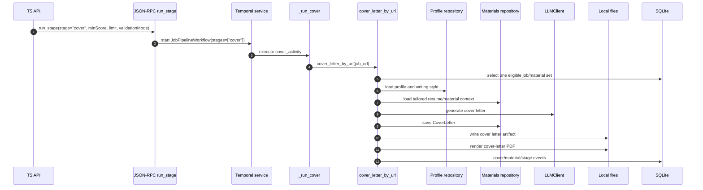

### Components

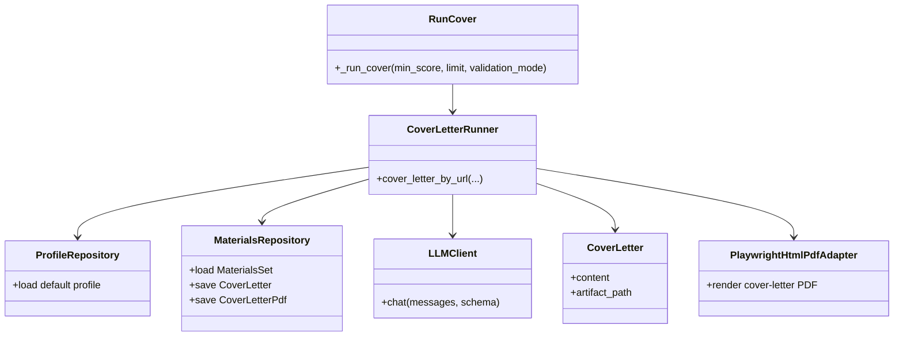

### Data And Events

- Reads score, job, profile, and existing materials context.
- Writes cover-letter material rows plus local cover-letter text and PDF files.
- Publishes cover-letter generation and PDF-rendered events.
- Refreshes artifact and job detail projections.

### Failure And Limits

`limit` caps eligible jobs. `validationMode` controls cover-letter validation.
Failures are local to individual jobs so a retry can continue from the remaining
pending cover letters.

## Apply Stage

### Purpose And Boundary

Apply drives browser/agent automation to submit or dry-run applications. It is
the riskiest and longest-running stage, so the batch pipeline `run_stage` route
keeps orchestration in Temporal and `JobPipelineWorkflow` delegates the selected
`apply` stage to child `ApplyWorkflow` instead of a synchronous runner activity.
It owns apply-run lifecycle, browser execution, dry-run submission safety,
cancellation, and apply artifacts/logs.

### Sequence

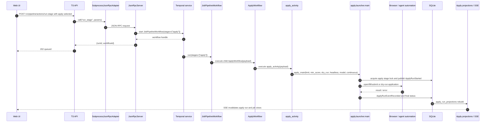

### Components

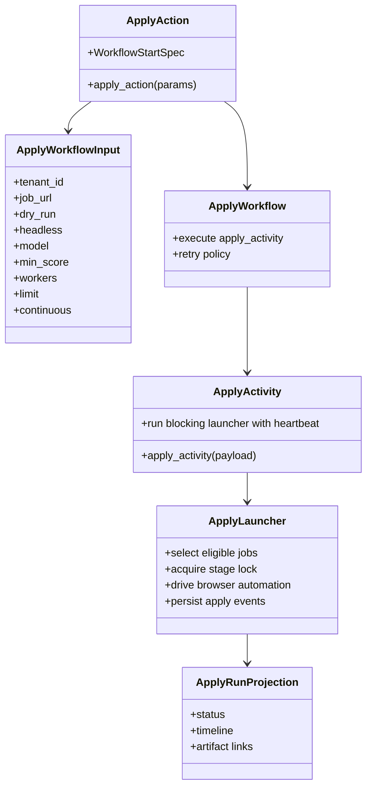

### Data And Events

- Reads eligible jobs, score/materials, posting or direct application URL data,
  and profile facts.
- Writes canonical apply stage state and `ApplyRunStarted`,
  `ApplyRunEventRecorded`, `ApplicationSubmitted`, or `ApplicationFailed`
  events.
- Writes apply logs/artifacts where available.
- Rebuilds `apply_run_projections` from lifecycle events.

### Failure, Retry, And Cancellation

`ApplyWorkflow` uses an apply-specific retry policy and a two-hour activity
timeout. Transient activity failures can retry through Temporal. Operator
errors such as no eligible job fail fast. `cancel_run` signals the workflow
runtime to cancel an in-flight run; the post-hoc SQLite state transition for
marking a stage canceled is the local API's `cancelJobAction` write.

## Operations Read-Side

The UI does not read directly from stage internals. It reads projection-backed
API endpoints owned by Operations:

`job_list_projections.current_stage` is a product-stage field. Projection
builders write only `discover` or `apply` there, even when the first actionable
internal row is `enrich`, `score`, `tailor`, or `cover`. The full internal
stage list remains in `job_detail_projections.stages_json` for review,
diagnostics, and repair decisions. Cover is the exception that can advance the
product stage: when the first actionable internal row is `cover` and a tailored
resume exists, the list projection writes `current_stage='apply'` while keeping
`current_substage='cover'` and the cover state visible for retry or repair.

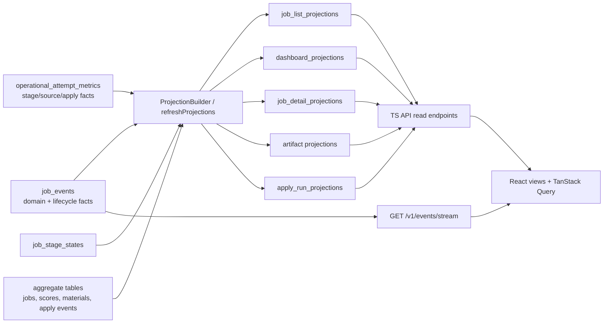

This separation is why a stage can complete before every UI card visibly
changes: the write path records durable facts first, then projection refresh and
SSE invalidation make those facts visible to the frontend.

Operational metrics are append-only rows written at pipeline boundaries rather
than inferred from dashboard labels or free-form event messages. Rows include
`stage`, `source_id`, source role, adapter, attempt kind, outcome,
operational/scrape/retryable flags, counts, durations, `error_class`,
`error_message`, `run_id`, and `job_url` when known. Discovery, enrichment,
scoring, tailoring, per-job preparation workflows, cover generation, apply dry-runs,
and orphan cleanup all record structured attempts so
`discovery_runs.status='failed'` no longer has to carry unrelated failure
causes by itself.

## Source Files

Primary implementation files:

- `apps/api/src/server.ts`: `/v1/pipeline/actions/run-stage`,
  `/v1/jobs/bulk-retry-failed`.
- `apps/api/src/local-actions.ts`: maps UI commands to JSON-RPC methods and
  interprets results.
- `apps/api/src/json-rpc-adapter.ts`: long-lived subprocess JSON-RPC adapter.
- `workers/automation/src/jobhunter/infrastructure/rpc/handlers.py`: JSON-RPC
  method registry.
- `workers/automation/src/jobhunter/actions.py`: local action wrapper for
  `run_stage` and `profile_import`.
- `workers/automation/src/jobhunter/pipeline/runner.py`: non-apply stage
  orchestration.
- `workers/automation/src/jobhunter/pipeline/workflow.py`: non-apply Temporal
  workflow path.
- `workers/automation/src/jobhunter/apply/workflow.py`: apply workflow.
- `workers/automation/src/jobhunter/apply/activities.py`: apply activity.
- `workers/automation/src/jobhunter/apply/launcher.py`: apply browser/agent
  launcher.
- `apps/api/src/projections.ts` and
  `workers/automation/src/jobhunter/infrastructure/projections/`: Operations
  read-side projection builders.
