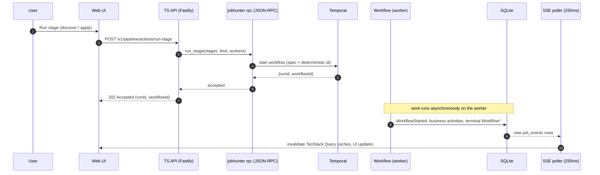
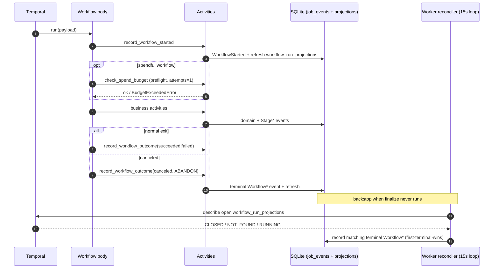
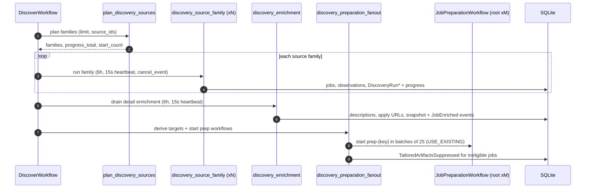
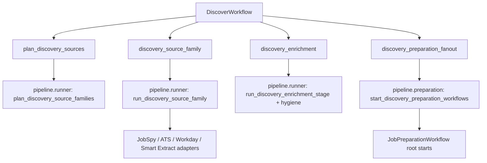
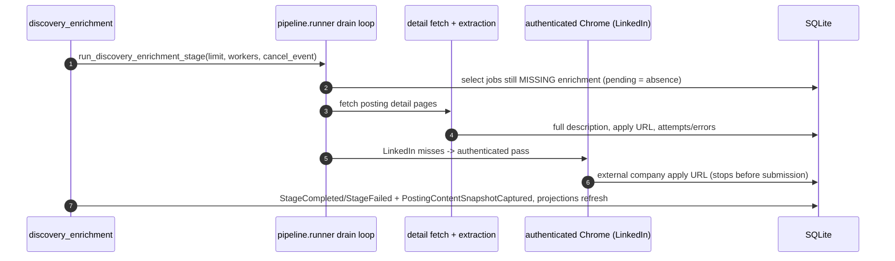
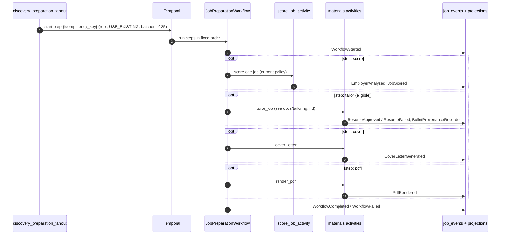
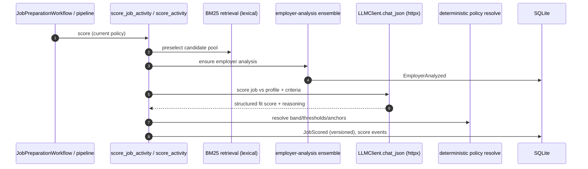
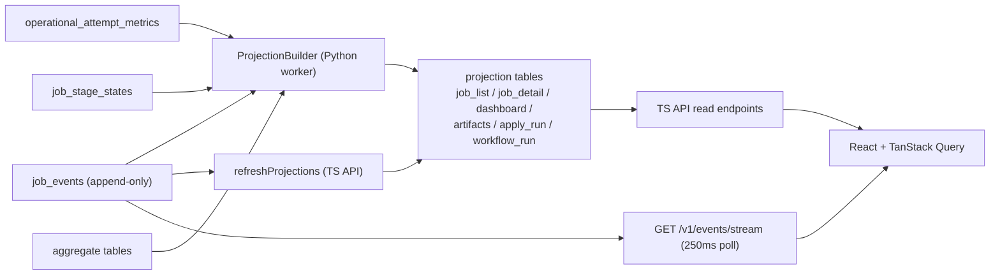

# Job Pipeline Architecture

This document explains how JobHunter's job pipeline executes today. It is the
deep-dive companion to [`architecture.md`](architecture.md): that file names the
runtime boundaries and system topology (TypeScript app/API, Python worker,
Temporal, SQLite, SSE), while this document follows the work itself — from a
button click or CLI command, through the JSON-RPC boundary, into Temporal
workflows and Python activities, and back out through persistence, events, and
projections to the UI.

The canonical domain model is [`ddd-target.md`](ddd-target.md). Resume tailoring
has its own deep-dive in [`tailoring.md`](tailoring.md); this file summarizes the
tailor stage and points there for gate depth.

Read the shared-model sections first (product shape, execution surfaces, the
universal workflow envelope, the workflow catalog, activities, and the error
taxonomy). The stage walkthrough then follows each phase end to end.

Every long-running unit of work in JobHunter is a **Temporal workflow**. There
is no in-process pipeline engine and no flag that falls back to one — the old
sequential/threaded runner was deleted. If work takes longer than an HTTP
request, it runs on the worker under Temporal.

## Product Shape: Discover → Apply

The user-facing stage order is deliberately small:

```text
discover -> apply
```

`Discover` is the single preparation stage. It finds jobs, enriches usable
postings, and then fans out durable per-job preparation (scoring, tailoring,
cover letters, PDFs) plus artifact suppression for jobs that no longer qualify.
`Apply` is separate because it can submit real applications and carries its own
safety controls.

Internally, preparation still uses a finer stage vocabulary that appears in
stage rows, low-level contracts, CLI maintenance commands, and diagnostics:

```text
discover -> enrich -> score -> tailor -> cover -> apply
```

The product UI folds `enrich`, `score`, `tailor`, and `cover` back under
`Discover` (job timelines and operational views still expose the detail). The
one exception is `cover`: when a tailored resume already exists and `cover` is
the first actionable row, the list projection advances the product stage to
`apply` while keeping `current_substage='cover'` visible for repair.

## Execution Surfaces

Every surface builds the same kind of workflow start spec and starts a workflow
on the JobHunter task queue. They differ only in which entry point is used and
which workflow is selected.

| Surface | Entry point | What it starts |
| --- | --- | --- |
| Pipelines UI | `POST /v1/pipeline/actions/run-stage` | TS API dispatches JSON-RPC `run_stage`. A `discover`-only request starts `DiscoverWorkflow`; anything else starts `JobPipelineWorkflow` (which delegates `discover` and `apply` to child workflows). |
| Jobs view pending pickup | `POST /v1/jobs/:jobKey/actions/run-stage` | Starts a job-scoped `JobPipelineWorkflow` for one visible `pending` internal substage (`enrich`/`score`/`tailor`/`cover`), gated by the API on observable eligibility. |
| Jobs bulk pending prep | `POST /v1/jobs/bulk-run-pending-preparation` | Groups selected job URLs by their first eligible pending substage and dispatches bounded `run_stage` workflows. |
| Jobs bulk failed retry | `POST /v1/jobs/bulk-retry-failed` | Resets retryable failed stages and, with `runAfter: true`, dispatches batch `run_stage` workflows for the reset job URLs. |
| CLI | `jobhunter <command>` | Builds the same spec, starts Temporal, waits for the handle, and exits non-zero on workflow failure. `jobhunter discover` / `run discover` is the normal path; `score`/`tailor`/`cover` are maintenance commands. |
| Temporal schedule | `jobhunter-discovery-local` | Optional cron schedule that starts `DiscoverWorkflow`. Off by default (see [Discovery Schedule](#discovery-schedule)). |

### Entry Points → JSON-RPC → Workflow Selection

The TS API never runs pipeline logic itself. It maps UI/CLI intent to a JSON-RPC
method over a long-lived `jobhunter rpc` subprocess (stdin/stdout, one JSON
envelope per line). The method registry in
`workers/automation/src/jobhunter/infrastructure/rpc/handlers.py` marks each
method as either `mode="workflow"` (start a workflow, return its ids) or
`mode="sync"` (run inline, return the result). The server also supports a
`streaming` generator mode; no default method currently uses it.

| JSON-RPC method | Mode | Workflow selected |
| --- | --- | --- |
| `run_stage` | workflow | `DiscoverWorkflow` if stages are exactly `["discover"]`, else `JobPipelineWorkflow` |
| `apply` | workflow | `ApplyWorkflow` (per-job, `apply-{tenant}-{jobKey}`) |
| `rescore_job`, `rescore_jobs_not_on_current_scoring_policy` | workflow | `JobPreparationWorkflow` / `JobPipelineWorkflow` (score) |
| `tailor_job`, `retailor_job`, `retailor_current_policy` | workflow | `JobPreparationWorkflow` (`tailor`,`cover`,`pdf`) |
| `refresh_compensation` | workflow | `CompensationRefreshWorkflow` |
| `profile_import` | workflow | `ProfileImportWorkflow` |
| `analyze_job` | sync | none (inline read) |
| `cancel_run` | sync | none (issues a Temporal cancel to a running handle) |

Workflow selection for `run_stage` lives in
`workers/automation/src/jobhunter/workflow_specs.py`
(`build_run_stage_workflow_spec` and `build_apply_workflow_spec`).

### Async vs Sync (202 vs 200)

The distinction matters for anyone reading the API or the UI:

- **Workflow-mode methods are asynchronous.** The method returns
  `{ runId, workflowId }` the moment Temporal accepts the start, and the HTTP
  route answers **202 Accepted**. The outcome is *not* in that response — it
  arrives later in the read model and is pushed to the UI via SSE invalidation.
  A failure to *start* (bad input, worker unreachable) returns an error status,
  not a 202; a request the API resolves **without** starting a workflow — an
  ineligible stage or a pure stage reset — answers **200 OK**, not 202.
- **Sync-mode methods block for their result** and answer **200 OK** with the
  payload inline. Only `analyze_job` and `cancel_run` are synchronous.

So a green "Run stage" click that returns 202 means "queued and running", not
"done". This is why the UI reconciles later through projections and SSE.

### End-to-End Call Path



## The Universal Workflow Envelope

Every workflow — all six — wraps its business logic in the same envelope so a
run is always visible in the read model and always terminalizes, even on crash.
The helpers live in
`workers/automation/src/jobhunter/infrastructure/temporal/finalize.py`.

1. **`record_workflow_started`** emits a `WorkflowStarted` marker at the top of
   `run`, with a compact camelCase input summary.
2. **`check_spend_budget`** runs as a preflight for spendful workflows (see
   [Spend Ceiling](#spend-ceiling)). It runs with `maximum_attempts=1`, so a
   depleted budget fails the run before any paid work.
3. **Business activities** run (stages, per-job steps, apply, import, refresh).
4. **`record_workflow_outcome`** emits exactly one terminal event on every exit
   path — `WorkflowCompleted`, `WorkflowFailed`, `WorkflowCanceled`,
   `WorkflowTimedOut`, or `WorkflowTerminated`. On the cancel path the finalize
   activity uses `ActivityCancellationType.ABANDON` so the tiny SQLite write can
   finish while the workflow unwinds.

Both finalize activities are small local writes: they append to the append-only
`job_events` log (with `job_url = NULL`, since a run is a batch, not a job) and
then explicitly call `ProjectionBuilder.refresh()` so `workflow_run_projections`
updates even in a process with no bus-subscribed builder. Workflow bodies stay
deterministic: all clock/uuid/SQLite IO happens inside activities; the bodies
only read `workflow.info()` / `workflow.now()`.



### Deterministic Workflow IDs

Deterministic IDs plus `WorkflowIDConflictPolicy.USE_EXISTING` are how JobHunter
gets idempotent starts: re-requesting the same work attaches to the in-flight
execution instead of spawning a duplicate.

| Workflow | ID scheme | Conflict policy |
| --- | --- | --- |
| `DiscoverWorkflow` (standalone / schedule) | `discover-{tenant}` | one live discovery per tenant |
| `DiscoverWorkflow` (child of pipeline) | `{parent}-discover` | scoped to the parent |
| `ApplyWorkflow` (per-job) | `apply-{tenant}-{jobKey}` | one live apply per job |
| `ApplyWorkflow` (child of pipeline) | `{parent}-apply` | scoped to the parent |
| `JobPreparationWorkflow` | `prep-{idempotency_key}` | `USE_EXISTING` |
| `JobPipelineWorkflow`, `ProfileImportWorkflow`, `CompensationRefreshWorkflow` | server-generated | — |

The preparation idempotency key
(`make_preparation_idempotency_key`, in `domain/preparation`) is derived from
tenant, job id, work-item kind, **target version**, and **source event id**:

- `target_version` is the scoring-policy version for `score` targets and the
  tailoring-policy version for `tailor`/`cover`/`pdf` targets.
- `source_event_id` is the latest of `JobDiscovered`, `JobUpdated`,
  `JobEnriched`, `PostingContentSnapshotCaptured`, or `StageCompleted` for that
  job. A new source fact yields a new key, so genuinely new work gets a new
  workflow while reruns of unchanged work dedupe onto the existing one.

### Finalize + The Describe-Based Reconciler

When a worker is killed mid-run, an activity times out, or the Temporal dev
server loses history on restart, finalize may never run. The **reconciler** is
the backstop. It is not a trigger-coupled reaper; it is a describe loop inside
the worker's 15-second heartbeat loop (`cli.py`, `_reconcile_workflow_runs`):

- For each non-terminal `workflow_run_projections` row it calls
  `describe()` on the workflow handle.
- A **CLOSED** execution records the matching terminal `Workflow*` event
  (COMPLETED→succeeded, FAILED→failed, CANCELED→canceled,
  TERMINATED→terminated, TIMED_OUT→timed_out).
- A **NOT_FOUND** execution (dev-server history loss) records
  `WorkflowTerminated` so the run stops showing as forever-running.
- A **RUNNING / CONTINUED_AS_NEW** execution is left alone.

The reconciler never overwrites terminal truth. Both `JobPipelineWorkflow` and
`ApplyWorkflow` encode stage/apply failure in their *return value*, so a failing
run still closes COMPLETED on the Temporal side even though finalize already
wrote `WorkflowFailed`. Before writing, the reconciler takes `BEGIN IMMEDIATE`
and re-reads the row; if a real terminal outcome landed since the snapshot, it
leaves it. A first-terminal-wins fold in the projection builder backstops
anything that slips past.

## Workflow Catalog

Six workflows are registered in
`workers/automation/src/jobhunter/infrastructure/temporal/registry.py`
(`WORKFLOWS`). All timeouts and retry policies below are set at the workflow's
activity call sites.

| Workflow | Business activities | Key timeouts | Retry |
| --- | --- | --- | --- |
| `DiscoverWorkflow` | `plan_discovery_sources`, `discovery_source_family` (per family), `discovery_enrichment`, `discovery_preparation_fanout` | source/enrichment 6 h; plan/fanout 30 min; heartbeat 2 min | source & enrich: 5 s→60 s ×3 |
| `JobPipelineWorkflow` | serial stage dispatch; `discover`→child `DiscoverWorkflow`, `enrich`/`score`/`tailor`/`cover`→activities, `apply`→child `ApplyWorkflow` | stage activities 30 min; heartbeat 2 min | enrich/score 5 s→60 s ×3; tailor/cover 10 s→120 s ×3 |
| `JobPreparationWorkflow` | `score_job`, `tailor_job`, `cover_letter`, `render_pdf` in fixed order | each 30 min; heartbeat 2 min | score ×3; tailor ×3; cover/pdf ×3 |
| `ApplyWorkflow` | `apply_activity` | 2 h batch / 1 h continuous batch; heartbeat 60 s | live: 1 attempt; dry-run: 2 attempts |
| `ProfileImportWorkflow` | `profile_import_activity` | 10 min | 2 attempts |
| `CompensationRefreshWorkflow` | `refresh_compensation_activity` | 20 min | 2 attempts |

A few catalog details worth calling out:

- **`JobPipelineWorkflow` is the serial batch driver.** It runs the requested
  stages in canonical order as activities, but hands `discover` and `apply` to
  child workflows so a mixed request like `score → tailor → apply` still
  preserves order while every unit runs under Temporal. After a batch `tailor`
  succeeds it derives the approved job URLs and scopes the following `cover`
  stage to exactly those jobs.
- **`JobPreparationWorkflow` reorders and validates steps.** Requested steps are
  intersected with the canonical order `("score","tailor","cover","pdf")`; an
  unknown step is a non-retryable error. Only `score`/`tailor`/`cover` trigger
  the spend preflight (`pdf` is deterministic rendering).
- **`ApplyWorkflow` continuous mode uses `continue_as_new`.** In continuous mode
  each iteration runs the launcher with an activity limit of 25; when a batch
  applies to zero jobs it sleeps 30 s before continuing-as-new, giving a
  run-forever poller with bounded history.

## Activities

Nineteen activities are registered in `registry.py` (`ACTIVITIES`).

| Activity (callable) | Module | Purpose | Timeout · retry |
| --- | --- | --- | --- |
| `plan_discovery_sources` | `discovery/activities.py` | Plan which source families to run | 30 min · ×3 |
| `discovery_source_family_activity` | `discovery/activities.py` | Run one source family (crawl/enumerate) | 6 h · ×3 |
| `discovery_enrichment_activity` | `discovery/activities.py` | Drain detail enrichment + post-hygiene | 6 h · ×3 |
| `discovery_preparation_fanout_activity` | `discovery/activities.py` | Derive targets, start prep root workflows (batches of 25) | 30 min · ×3 |
| `enrich_activity` | `enrichment/activities.py` | Standalone/maintenance enrich stage | 30 min · ×3 |
| `score_activity` | `scoring/activities.py` | Batch score stage | 30 min · ×3 |
| `score_job_activity` | `scoring/activities.py` | Score one job (prep step) | 30 min · ×3 |
| `tailor_activity` | `materials/activities.py` | Batch tailor stage | 30 min · ×3 |
| `tailor_job_activity` | `materials/activities.py` | Tailor one job (prep step) | 30 min · ×3 |
| `cover_activity` | `materials/activities.py` | Batch cover stage | 30 min · ×3 |
| `cover_letter_activity` | `materials/activities.py` | Cover letter for one job (prep step) | 30 min · ×3 |
| `render_pdf_activity` | `materials/activities.py` | Render missing PDFs (prep step) | 30 min · ×3 |
| `derive_preparation_targets` | `pipeline/preparation.py` | Deterministic per-job target list (sync) | invoked within fan-out |
| `apply_activity` | `apply/activities.py` | Drive the apply launcher (browser/agent) | 2 h / 1 h · live 1, dry 2 |
| `profile_import_activity` | `profile/activities.py` | Import resume PDF → profile draft | 10 min · ×2 |
| `refresh_compensation_activity` | `infrastructure/compensation/workflow.py` | Refresh posted comp + market estimate | 20 min · ×2 |
| `check_spend_budget` | `llm.py` | Preflight daily-spend gate | 30 s · 1 |
| `record_workflow_started` | `infrastructure/temporal/finalize.py` | Emit `WorkflowStarted` | 30 s · ×5 |
| `record_workflow_outcome` | `infrastructure/temporal/finalize.py` | Emit terminal `Workflow*` | 30 s · ×5 (ABANDON on cancel) |

### run_blocking_with_heartbeat

Most business activities call synchronous domain runners. Calling them directly
inside an `async def` activity would block the worker's event loop for the whole
stage — defeating heartbeats and starving every other activity on the worker.
`infrastructure/temporal/run_in_activity.py` solves this with
`run_blocking_with_heartbeat`, which every long-running activity uses:

- It offloads the synchronous function to a **bounded, worker-owned
  `ThreadPoolExecutor`** and emits a heartbeat every `poll_interval` (default
  **15 s**) while waiting.
- On `asyncio.CancelledError` (a Temporal cancel) it invokes the supplied
  cooperative `on_cancel` hook, waits up to `cancel_wait_seconds` (default
  **30 s**) for the thread to stop, and re-raises.
- If the thread ignores cancellation past that grace window, it logs
  `abandoned_thread` and records an `operational_attempt_metric`
  (`stage="operations"`, `attempt_kind="temporal_activity_thread"`,
  `error_class="abandoned_thread"`) so a wedged thread is observable.

This is why the discovery source-family and enrichment activities (and the apply
activity) accept a `threading.Event` cancel token: the workflow-level cancel
propagates into the running crawl/launcher cooperatively rather than being
severed mid-write. The tiny marker activities (`plan_discovery_sources`,
`derive_preparation_targets`, `check_spend_budget`,
`record_workflow_started/outcome`) run inline without the thread offload.

### The Runtime Guard

Because multiple JobHunter checkouts can point at different app dirs and DBs,
every activity that writes calls `assert_activity_runtime`
(`infrastructure/temporal/runtime_guard.py`) with the expected app dir and DB
path carried in its input. A mismatch raises a **non-retryable**
`ApplicationError(type="RuntimeIdentityMismatch")`, so an activity that landed on
the wrong worker fails fast instead of writing to the wrong database.

## Error Taxonomy → Temporal Retry

Retry behavior is driven by a small error taxonomy in
`workers/automation/src/jobhunter/domain/errors.py`. `JobHunterError` carries a
`code` and a `retryable` flag; `to_application_error` converts it to a Temporal
`ApplicationError(type=code, non_retryable=not retryable)`.

| Error | Code | Retryable? |
| --- | --- | --- |
| `ConfigurationError` | `configuration` | no |
| `AuthenticationError` | `authentication` | no |
| `MissingInputError` | `missing_input` | no |
| `BudgetExceededError` | `budget_exceeded` | no |
| `TransientNetworkError` | `transient_network` | yes |
| `BrowserTransientError` | `browser_transient` | yes |
| `LlmTransientError` | `llm_transient` | yes |
| `SourceUnavailableError` | `source_unavailable` | yes |
| unclassified exception | `unclassified` | yes |

Every retrying workflow lists
`non_retryable_error_types = ["configuration", "authentication",
"missing_input", "budget_exceeded"]` in its `RetryPolicy`. So the four
configuration/precondition errors stop immediately, while transient failures
retry up to the policy's attempt cap and then surface as a stage/workflow
failure. `RuntimeIdentityMismatch` is also non-retryable.

## Stage Walkthrough

Each stage below covers purpose, sequence, data/events, and failure behavior.

### Discover

Discover finds postings from configured sources, creates canonical job records
and source observations, drains detail enrichment for jobs that pass the initial
title/location filter, and then fans out per-job preparation. It owns source
scheduling, source-quality feedback, canonical identity, dedupe, protected-source
manual-capture queue entries, and posting hygiene. Scoring and Materials still
own their own writes.

`DiscoverWorkflow` decomposes into **four activities**, not one monolithic run:



Component shape (`DiscoverWorkflow` orchestrates activities; the activities call
runner functions in `pipeline/runner.py`, which drive the source adapters):



Key facts about the four activities:

- **`plan_discovery_sources`** compiles the plan (which source families to run,
  progress totals, and the starting job count) from the source registry, source
  quality, and the global limit. Target roles from the profile become two query
  kinds — exact queries (from saved role text) and recall queries (generated from
  target-role intent, enforcing track and seniority before scoring).
- **`discovery_source_family`** runs *one* source family under
  `run_blocking_with_heartbeat` with a cooperative `cancel_event` and a 6-hour
  window (crawls legitimately run long). Each family is isolated: a JobSpy, ATS,
  Workday, or Smart Extract failure records failure info and lets the workflow
  see a partial result rather than failing the whole batch. With `limit > 0` the
  cap is a **new-job budget** — rediscoveries record observations but do not
  consume the budget, so exact-query duplicates never starve later recall queries
  or sources.
- **`discovery_enrichment`** drains detail enrichment (below) and then runs
  post-discovery hygiene.
- **`discovery_preparation_fanout`** derives targets and starts per-job
  preparation. This is the correction most worth internalizing: **preparation
  workflows are started as independent ROOT workflows**, in batches of 25, via
  the Temporal client with `USE_EXISTING`. They are deliberately *not* children
  of `DiscoverWorkflow` — child workflows default to
  `ParentClosePolicy.TERMINATE`, which would kill preparation the instant
  discovery finished. Before fan-out, the same activity suppresses now-ineligible
  active artifacts via `SuppressTailoredArtifactsUseCase`.

Source steps additionally emit `DiscoveryRunStarted` / `DiscoveryRunCompleted` /
`DiscoveryRunFailed` for source-quality aggregation, and heartbeat a
**`DiscoveryRunProgress` payload** (completed combinations, current
query/location, raw/accepted/duplicate/filtered counts, source errors). That
progress is a heartbeat payload persisted onto the `discovery_runs` aggregate —
it is not a domain event. Discovery uses a no-overlap Temporal policy and
preserves source order so global-limit and source-budget semantics stay stable.

### Detail Enrichment

Detail enrichment turns discovered jobs into usable records by fetching full
descriptions, application URLs, and detail-page metadata. It is not a top-level
user stage — `DiscoverWorkflow` runs it via `discovery_enrichment`, and
`JobPipelineWorkflow` exposes a maintenance `enrich` activity for retries.



Two truths correct the old diagram:

- **"Pending" is the absence of an enrichment row, not a queued row.** Discovery
  does not insert placeholder `JobEnrichment` rows. The drain loop selects jobs
  that still lack enrichment and processes up to `limit` of them; `workers` sets
  concurrency. The activity output reports a `pending` count (how many remain).
- **The clean-port enrichment path is not the live path.** The live drain is the
  inline cascade in `pipeline/runner.py` plus the detail fetchers. The hexagonal
  `EnrichJobUseCase` / `DetailPageFetcherPort` / `LlmPort` wiring exists in the
  domain but is not what discovery calls, so it is not drawn here. The drain
  records `Stage*` and `PostingContentSnapshot*` events, never `JobEnriched` /
  `EnrichmentFailed` — those come from that unused use case and from the separate
  protected-source manual-capture snapshot path.

For LinkedIn rows that are failed or enriched without an application URL, a
bounded authenticated Chrome pass may click the LinkedIn apply control to
capture an external company URL — but it **stops before any form or submission**.
Individual detail failures are recorded per job so later runs retry without
crashing unrelated jobs.

### Preparation

`JobPreparationWorkflow` is the durable bridge from Discover into the Scoring and
Materials contexts. Discovery derives a deterministic, sorted target list after
enrichment, then starts one preparation workflow per job with ID
`prep-{idempotency_key}` and `USE_EXISTING`. Temporal — not a local claim loop —
owns retry, recovery, and duplicate suppression.

Targets are derived in `pipeline/preparation.py` from stage state:

- Jobs at `pending_score` get steps `["score","tailor","cover","pdf"]` keyed to
  the current **scoring-policy** version.
- Jobs at `pending_tailor` (meeting `min_score`) get steps
  `["tailor","cover","pdf"]` keyed to the current **tailoring-policy** version.



Behavior notes:

- Steps run in order; each retries its *current* failing step under Temporal
  without regenerating already-durable earlier steps. A failed score does not
  block other jobs' preparation, and a failed tailor can resume at cover/pdf.
- Threshold changes are **live eligibility changes**, not scoring changes:
  lowering the threshold can derive new `tailor`/`cover`/`pdf` work from
  persisted scores; raising it suppresses active artifacts. Neither path invokes
  the scoring LLM. Scoring-policy and tailoring-policy changes never silently
  rescore or regenerate — that is what the explicit `rescore_*` / `retailor_*`
  actions are for.
- There is no local preparation reaper. Rows already claimed by a fast worker are
  not moved backward; Temporal owns in-flight recovery.

### Score

Score assigns applicant-side fit scores and structured reasoning to enriched
jobs. It owns retrieval preselection, scoring criteria, LLM parsing, score
versioning, and user-corrected score history. In the product flow it is Discover
subwork; explicit rescore actions are maintenance controls.

The scoring path has three distinct parts, and it is worth being precise about
which model machinery each uses:

1. **Retrieval preselection is BM25-only.** `domain/scoring/retrieval.py`
   implements BM25 lexical ranking with *optional* semantic reciprocal-rank
   fusion, but the local build's default semantic adapter is a no-op (no hosted
   embedding service), so ranking is lexical. `limit` applies after preselection.
2. **Employer analysis is the mandatory front-half.** Before the fit score,
   scoring ensures a canonical employer analysis via
   `scoring/employer_analysis.py` / `scoring/scorer.py`. This is produced by the
   three-SDK agent ensemble (Claude Agent SDK + Codex SDK + Antigravity/Gemini,
   synthesized by Claude) and emits `EmployerAnalyzed`. The same analysis is
   reused by tailoring, so it is not recomputed per stage.
3. **The fit score itself comes from the httpx LLM client.** The scoring
   use-case calls `LlmPort.chat_json` (the httpx `LLMClient` behind the
   adapter), which returns a structured fit score, band, criteria, and trace.
   Deterministic policy resolution (rubric weights, thresholds, calibration
   anchors) is applied *separately* from the raw LLM output.



Score writes versioned `job_scores` rows (criteria + trace), can write a new
`scoring_policies` version when user corrections create calibration anchors, and
marks comparable uncorrected scores stale in `job_score_staleness` when a new
policy version lands. Parser warnings and failed LLM calls are recorded so a
failure never masquerades as a successful low-fit result. Scoring prompt/model/
schema/rubric/policy changes must run the local scoring eval gate documented in
[`local-reliability-qa.md`](local-reliability-qa.md).

### Tailor

Tailor creates job-specific resume materials for eligible high-fit jobs. It owns
resume generation, validation mode, retry/re-tailor decisions, and artifact
registration; it never submits applications. In the product flow it is Discover
subwork, with first-time manual tailoring exposed on the job detail page.

The mechanism, in brief: one or more configured provider/model specs draft
structured resume candidates; each candidate is validated independently against
the profile contract, the rendered-text contract, and the tailoring quality
plan; then `normal`/`strict` modes require a separate structured judge to return
`PASS` at or above the configured threshold before approval (`lenient` skips the
judge for low-cost local runs). Approved artifacts carry the selected generator,
candidate summaries, judge model, judge score/verdict, prompt/schema versions,
quality checks, and retry feedback as audit metadata; provider URLs and API keys
are never persisted.

Tailoring is where the fabrication gate and per-bullet claim grounding live.
**For gate depth — the fabrication detector, claim-grounding, judge and
adversarial personas, and repair loop — see [`tailoring.md`](tailoring.md).**
The tailor stage emits `EmployerAnalyzed` (shared with scoring), `ResumeApproved`
/ `ResumeFailed`, and `BulletProvenanceRecorded`; successful tailoring proceeds
into the cover step.

### Cover

Cover generates the job-scoped cover letter for a job that already has sufficient
score/material context, and renders its PDF, so it outputs the artifacts Apply
needs without a separate PDF-only stage. It reads score/job/profile/materials
context, writes the cover-letter row plus local text and PDF files, and emits
`CoverLetterGenerated` and `PdfRendered`. There is **no `CoverLetterFailed`
event**: a failed cover surfaces as `StageFailed` plus the workflow's
`WorkflowFailed` outcome. Failures are per job, so a retry continues from the
remaining pending cover letters.

### PDF

`render_pdf` renders missing PDFs for the current approved materials. It is the
deterministic tail of preparation (no LLM, no spend preflight) and emits
`PdfRendered`. As a prep step it retries under the cover retry policy.

### Apply

Apply drives browser/agent automation to submit or dry-run applications. It is
the riskiest, longest-running stage, so it is isolated in its own workflow with a
tighter retry policy and explicit safety controls. It owns apply-run lifecycle,
browser execution, dry-run safety, cancellation, and apply artifacts/logs.

There are **two entry paths** into `ApplyWorkflow`:

- **Pipeline route:** `run_stage(["apply"])` starts `JobPipelineWorkflow`, which
  delegates to a child `ApplyWorkflow` (`{parent}-apply`).
- **Direct per-job route:** the JSON-RPC `apply` method starts `ApplyWorkflow`
  directly with the per-job ID `apply-{tenant}-{jobKey}`.

```mermaid
sequenceDiagram
    autonumber
    participant Web as Web UI
    participant Api as TS API
    participant Rpc as JSON-RPC
    participant T as Temporal
    participant AW as ApplyWorkflow
    participant Act as apply_activity
    participant L as apply launcher
    participant Br as Browser (CDP)
    participant DB as job_events + apply_run_projections

    alt pipeline route
        Web->>Api: POST /v1/pipeline/actions/run-stage (apply)
        Api->>Rpc: run_stage(["apply"])
        Rpc->>T: JobPipelineWorkflow -> child ApplyWorkflow ({wf}-apply)
    else direct per-job route
        Web->>Api: apply action
        Api->>Rpc: apply(jobUrl, ...)
        Rpc->>T: ApplyWorkflow (apply-{tenant}-{jobKey})
    end
    T->>AW: run (approval_required, dry_run, continuous)
    AW->>Act: check_spend_budget, then apply_activity (2h / 1h)
    Act->>L: run_blocking_with_heartbeat(launcher, on_cancel)
    L->>DB: BEGIN IMMEDIATE lock, ApplyRunStarted
    L->>DB: ApplySubmitIntended (at-most-once checkpoint)
    L->>Br: fill; submit only if approved AND not dry-run
    Br-->>L: dry-run blocks non-local POST/PUT/PATCH via CDP
    L->>DB: ApplicationSubmitted / DryRunCompleted / ApplicationFailed
    opt continuous
        AW->>AW: continue_as_new (batch of 25, 30s empty poll)
    end
```

The launcher **orchestrates**; it does not fill or submit forms itself. A local
**Claude Code CLI agent** drives the CDP-controlled Chrome through **Playwright
MCP** and performs any form interaction. Terminal apply outcomes are
`ApplicationSubmitted` (live submit), `DryRunCompleted` (dry-run),
`ApplicationFailed`, or `ApplyManualSkip` (manual-ATS skip).

**Three safety invariants, and the mechanisms that enforce them:**

1. **At-most-once submission.** The launcher takes a `BEGIN IMMEDIATE` stage
   lock, guards on stage state, and writes an `ApplySubmitIntended` checkpoint
   before the actual submit, marking the result idempotently afterward. Combined
   with the per-job workflow ID (`apply-{tenant}-{jobKey}` + `USE_EXISTING`,
   one live apply per job) and the **live retry policy of exactly one attempt**,
   a submit is never silently retried into a double application. Dry-runs, which
   submit nothing, get two attempts.
2. **Binding approval gate.** `approval_required` defaults to `True`. The
   launcher requires an explicit `approve_submit` decision before it will
   submit; without approval it stops at the review/dry-run boundary. The gate is
   configurable but binding — it is enforced in the launcher, not merely surfaced
   in the UI.
3. **Browser-layer dry-run guard (CDP).** In dry-run the browser adapter
   overrides the form-submit action and uses the CDP Fetch domain to block
   non-local `POST`/`PUT`/`PATCH` requests. So dry-run safety does not rely on
   the agent choosing not to click submit — even a misbehaving agent cannot
   submit through the browser.

**Timeouts and retries.** The apply activity runs with a 2-hour window for a
normal batch and a 1-hour window per batch in continuous mode; heartbeat timeout
is 60 s. Retry is one attempt live, two attempts dry-run.

**Cancellation.** `cancel_run` (sync JSON-RPC) issues a Temporal cancel to the
workflow handle (`handle.cancel()` via the default canceler) — this is a Temporal
cancellation, not an application signal. The cancel propagates through
`run_blocking_with_heartbeat`'s `on_cancel` hook so the launcher stops
cooperatively; the terminal state is recorded as `WorkflowCanceled` (by finalize
on the cancel path, or by the reconciler). The post-hoc SQLite stage-canceled
write is the API's `cancelJobAction`.

## Spend Ceiling

A daily spend ceiling backstops LLM cost. The `check_spend_budget` activity
(`llm.py`) is the preflight in every spendful workflow. It reads the budget
status (`read_spend_budget_status`): `daily_budget_usd` defaults to **$25**
(`read_daily_budget_usd(default=25.0)`), and a value of **0 means unlimited**. If
today's `llm_spend` ledger already meets the ceiling, it raises
`BudgetExceededError` (`budget_exceeded`, non-retryable), failing the run before
any paid work. Because the preflight runs with `maximum_attempts=1`, a depleted
budget is a clean fast failure, not a retry storm.

Per-call cost is written to the `llm_spend` UPSERT ledger, keyed by day, using
per-model-family rates (`estimate_llm_cost_usd` in `llm.py`); the rates are
coarse family buckets, and models without a listed family fall back to a
generic rate, so the ledger is an estimate, not billing truth. The ceiling is a *preflight gate* per workflow, not a
mid-call interrupt: a single expensive run already in flight is not aborted, but
the next spendful workflow will not start once the day's ledger is at the cap.

## Discovery Schedule

Scheduled discovery is **off by default**. A single Temporal Schedule,
`jobhunter-discovery-local`, can run `DiscoverWorkflow` on a cron expression, but
it is reconciled from settings only at **worker startup**
(`_reconcile_discovery_schedule` in `cli.py`, before `worker.run()`):

- It reads `load_discovery_schedule_settings()` → `(enabled, cron)`.
- If **disabled**, it deletes the schedule handle (idempotent) and returns.
- If **enabled**, it creates (or updates) the schedule to start
  `DiscoverWorkflow` (`discover-local`) on the given cron, with
  `ScheduleOverlapPolicy.SKIP` so a slow run never overlaps the next tick.

**The gotcha:** because reconciliation happens once at startup, toggling the
schedule setting has no effect until the worker is restarted. Turning the
schedule on or off, or changing its cron, requires bouncing the worker.

## Persistence Map

The worker writes to a single local SQLite database. Tables group by context;
the append-only `job_events` log plus the projection tables are the read-model
spine.

| Group | Representative tables |
| --- | --- |
| Discovery | `jobs`, source observations, `source_registry_entries`, source locator / manual-capture / review queue, quarantine, `discovery_runs`, `discovery_settings`, plus target search overlaid from `candidate_profiles` |
| Enrichment | enrichment fields / rows on jobs, posting content snapshots |
| Scoring | `job_scores`, `scoring_policies`, `job_score_staleness`, employer analysis |
| Materials | materials sets / tailored resumes, cover letters, rendered PDFs, `tailoring_policies` |
| Apply | apply stage state + apply lifecycle in `job_events` (see note) |
| Orchestration / read model | `job_events` (append-only), `operational_attempt_metrics`, `job_stage_states`, `workflow_run_projections`, `job_list_projections`, `job_detail_projections`, `dashboard_projections`, artifact projections, `apply_run_projections` |
| Spend | `llm_spend` |
| Runtime | worker heartbeat / runtime identity |

Note: the legacy `apply_runs` / `apply_run_events` tables were dropped at boot.
Apply lifecycle now lives entirely in `job_events` and is projected into
`apply_run_projections`.

Operational metrics are append-only rows written at pipeline boundaries (stage,
source id, source role, adapter, attempt kind, outcome, counts, durations,
`error_class`, `error_message`, `run_id`, `job_url` when known) rather than
inferred from labels — so `discovery_runs.status='failed'` no longer has to carry
unrelated failure causes.

## Domain Events, Projections, and SSE

The authoritative event catalog is the TypeScript `DomainEventType` union in
`packages/domain-types/src/events/` — **68 event types**, guarded by an
exhaustiveness assertion and by the frontend's `every-event-has-handler` parity
test. The Python worker emits 55 of them through `create_domain_event` factories
in `workers/automation/src/jobhunter/domain/events/`; the remaining types
(preparation work-item, resume-template, `TailorRetailorRequested`,
`TailoredArtifactsSuppressed`, `TailoringPolicyUpdated`,
`CompensationFactsUpdated`) originate on other code paths. Both sides fold the
same camelCase payloads, including the six `Workflow*` lifecycle events.

Three catalog corrections, because the old doc drifted:

- **There is no `CoverLetterFailed` event.** Cover success is
  `CoverLetterGenerated`; cover failure surfaces as `StageFailed` +
  `WorkflowFailed`.
- **`StageQueued` is not a typed domain event.** It is not in the 68-type union.
  The TS bulk routes tag reset/queued rows with a `StageQueued` marker string
  (`source: "bulk_retry_failed"` / `"bulk_run_pending_preparation"`), but it is
  not folded like a domain event.
- **`DiscoveryRunProgress` is not a domain event.** It is the heartbeat progress
  payload persisted onto the `discovery_runs` aggregate; the typed discovery-run
  events are `DiscoveryRunStarted` / `Completed` / `Failed`.

The read path is projection-backed, and there are **two projection builders**:
the Python `ProjectionBuilder` (in the worker, bus-subscribed and also refreshed
explicitly by finalize/reconciler) and the TypeScript `refreshProjections` (in
the API). Both rebuild the same projection tables from the same events.



`job_list_projections.current_stage` is a *product-stage* field: builders write
only `discover` or `apply` there (the full internal stage list stays in
`job_detail_projections.stages_json`), with the `cover`→`apply` advance described
earlier. Note that `GET /v1/events/stream` is a **250 ms poller** over new
`job_events` rows, not a push stream — which is why a stage can complete a beat
before the UI card visibly changes: durable facts are recorded first, then
projections refresh and the next SSE tick invalidates the query cache. The SSE
contract is specified in [`local-ts-api.md`](local-ts-api.md).

## Failure Behavior Summary

- **Transient failures retry; preconditions fail fast.** Retryable errors retry
  up to each activity's attempt cap; `configuration`/`authentication`/
  `missing_input`/`budget_exceeded` never retry.
- **Discovery isolates sources.** One failed source family yields a partial
  result; the workflow fails only if a family fails after retries, and it fails
  with the source error, not a swallowed one.
- **Preparation isolates jobs.** A failed step fails only that job's workflow and
  resumes at the failed step; other jobs are unaffected.
- **Apply fails safe.** At-most-once + one live attempt + the CDP dry-run guard
  mean a failed or canceled apply never double-submits; cancellation is
  cooperative and terminalizes as `WorkflowCanceled`.
- **Nothing stays "running" forever.** Finalize records the terminal outcome on
  every normal/cancel path; the describe-based reconciler backstops killed
  workers, timeouts, and dev-server history loss.

## Source Files

Primary implementation files (repo-relative):

- `apps/api/src/server.ts` — `/v1/pipeline/actions/run-stage`, the bulk job
  routes, and `GET /v1/events/stream`.
- `apps/api/src/local-actions.ts` — maps UI commands to JSON-RPC methods.
- `apps/api/src/json-rpc-adapter.ts` — long-lived subprocess JSON-RPC adapter.
- `apps/api/src/projections.ts` — TS projection builder (`refreshProjections`).
- `packages/domain-types/src/events/` — the 68-type `DomainEventType` union.
- `workers/automation/src/jobhunter/infrastructure/rpc/handlers.py` — JSON-RPC
  method registry (workflow vs sync modes).
- `workers/automation/src/jobhunter/workflow_specs.py` — `run_stage` / `apply`
  workflow selection and deterministic IDs.
- `workers/automation/src/jobhunter/infrastructure/temporal/registry.py` — the
  six workflows and nineteen activities.
- `workers/automation/src/jobhunter/infrastructure/temporal/finalize.py` — the
  workflow envelope (`record_workflow_started` / `record_workflow_outcome`).
- `workers/automation/src/jobhunter/infrastructure/temporal/run_in_activity.py`
  — `run_blocking_with_heartbeat`.
- `workers/automation/src/jobhunter/infrastructure/temporal/runtime_guard.py` —
  `assert_activity_runtime`.
- `workers/automation/src/jobhunter/discovery/workflow.py`,
  `.../discovery/activities.py` — `DiscoverWorkflow` and its four activities.
- `workers/automation/src/jobhunter/pipeline/workflow.py` — `JobPipelineWorkflow`.
- `workers/automation/src/jobhunter/pipeline/preparation.py` — target derivation
  and root preparation fan-out.
- `workers/automation/src/jobhunter/preparation/workflow.py` —
  `JobPreparationWorkflow`.
- `workers/automation/src/jobhunter/apply/workflow.py`,
  `.../apply/activities.py`, `.../apply/launcher.py` — apply workflow, activity,
  and browser/agent launcher (safety invariants).
- `workers/automation/src/jobhunter/scoring/` and `.../domain/scoring/` — scoring
  runner, employer-analysis ensemble, BM25 retrieval, `chat_json` scoring.
- `workers/automation/src/jobhunter/llm.py` — httpx `LLMClient`,
  `check_spend_budget`, and the `llm_spend` ledger.
- `workers/automation/src/jobhunter/domain/errors.py` — the error taxonomy.
- `workers/automation/src/jobhunter/cli.py` — `worker`, `rpc`, the worker
  heartbeat/reconciler loop, and `_reconcile_discovery_schedule`.
- `workers/automation/src/jobhunter/infrastructure/projections/` — Python
  projection builders.
