# Job Pipeline Architecture

This document explains how JobHunter's job pipeline executes today. It is the
deep-dive companion to [`architecture.md`](architecture.md): the top-level
architecture doc names the runtime boundaries, while this document follows each
pipeline phase through the UI, API, JSON-RPC worker boundary, Python stage
runner, persistence, events, and projections.

The canonical domain model remains [`ddd-target.md`](ddd-target.md). This file
documents the implemented local execution shape.

Use the first sections for the shared execution model. Each phase section then
uses the same shape: purpose and boundary, sequence diagram, component diagram,
data/events, and failure behavior. Component diagrams include concrete classes
where the code has them and module/use-case components where the implementation
is intentionally function-based.

## Pipeline Phases

The user-facing stage order is:

```text
discover -> enrich -> score -> tailor -> cover -> apply
```

The Python batch runner's `STAGE_ORDER` covers the non-apply stages:

```text
discover -> enrich -> score -> tailor -> cover
```

`apply` is deliberately separate. Non-apply stages currently run through the
JSON-RPC `run_stage` method and the synchronous `pipeline.runner` stage
functions. `apply` runs through the JSON-RPC `apply` method, starts
`ApplyWorkflow` in Temporal, and reports lifecycle progress through
apply-specific events and projections.

## Execution Surfaces

There are four execution surfaces. They share the same Python stage
implementations where possible, but they differ in orchestration.

| Surface | Entry point | Execution model | Stages |
| --- | --- | --- | --- |
| Pipelines UI | `POST /v1/pipeline/actions/run-stage` | TS API sends the ordered stage list to JSON-RPC `run_stage`, which starts one `JobPipelineWorkflow`; apply steps run as child `ApplyWorkflow` executions. | All user-facing stages |
| CLI batch run | `jobhunter run ...` | Python `run_pipeline()` executes stages sequentially or streaming. | Non-apply stages |
| Temporal pipeline workflow | `JobPipelineWorkflow` | Serial workflow that dispatches each non-apply stage as a Temporal activity. | Non-apply stages |
| Temporal apply workflow | `ApplyWorkflow` | Per-job apply workflow with one activity and apply-specific retry policy. | Apply |

### End-To-End UI/API Call Path

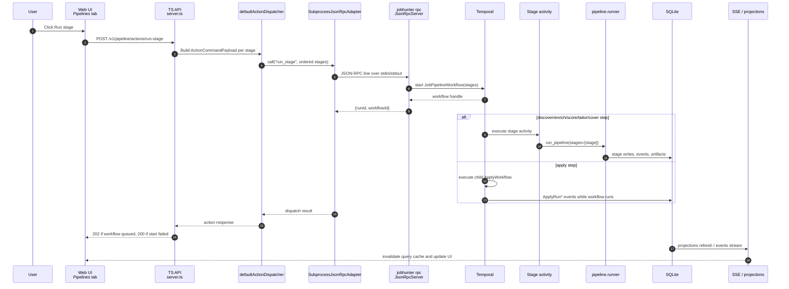

### Shared Components

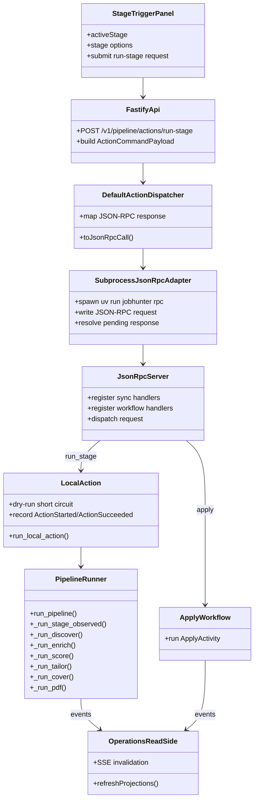

## Shared Stage Mechanics

### Stage Observation

Non-apply stages run under `_run_stage_observed()` in
`workers/automation/src/jobhunter/pipeline/runner.py`. That wrapper:

- emits `StageStarted`, `StageCompleted`, or `StageFailed` lifecycle rows to
  `job_events`;
- emits OpenTelemetry/Langfuse spans named `pipeline.stage.<stage>`;
- converts runner results into a stage status (`ok`, `partial`, or `error`);
- keeps the JSON-RPC caller informed even when downstream projections refresh
  later.

Discover source steps use `_run_discovery_source()`, a source-level variant that
also emits `DiscoveryRunStarted`, `DiscoveryRunCompleted`, and
`DiscoveryRunFailed` rows for source-quality aggregation.

### Dry Run

For non-apply stages, `dryRun=true` is handled before the stage implementation
executes. `run_local_action()` returns a planned action result and records
action lifecycle events, but it does not call `_execute_action()`.

For apply, `dryRun` is passed into `ApplyWorkflowInput` and down to the apply
launcher. The workflow still starts, but the launcher follows the dry-run path
instead of submitting applications.

### Limit

`limit` is forwarded to every stage. The meaning is stage-specific:

- Discover: global cap for observed jobs across scheduled sources. When set,
  Discover runs sources sequentially and skips remaining sources once the cap is
  consumed.
- Enrich: cap for pending detail-enrichment jobs.
- Score: cap for jobs selected for scoring after retrieval preselection.
- Tailor: cap for eligible high-fit jobs to tailor.
- Cover: cap for eligible jobs needing cover letters.
- PDF: cap for pending PDF render jobs.
- Apply: cap for apply attempts unless `continuous=true`, in which case the
  apply launcher runs continuously.

### Sequential And Streaming

`run_pipeline()` has two Python execution modes:

- Sequential: stages run one at a time in canonical stage order.
- Streaming: each selected stage runs in its own thread. Downstream stages poll
  for pending work and finish only when their upstream producers are done and
  they have no remaining work.

The UI `run-stage` endpoint preserves request order by starting one
`JobPipelineWorkflow` for the selected stage list. Non-apply stages run
serially as Temporal activities; each activity still enters the Python runner
as a single-stage `run_pipeline(stages=[stage])` invocation. `apply` remains
the dedicated `ApplyWorkflow`, executed as a child workflow when it appears in
the ordered pipeline list.

## Phase 1: Discover

### Purpose And Boundary

Discover finds postings from configured sources and creates canonical job
records plus source observations. It owns source scheduling, source-quality
feedback, canonical identity, idempotent source-control refresh, manual-capture
queue entries for protected sources, and dedupe against existing jobs. It does
not score jobs or fetch every full job description.

### Sequence

```mermaid
sequenceDiagram
    autonumber
    participant Api as TS API
    participant Rpc as JSON-RPC run_stage
    participant Action as run_local_action
    participant Runner as _run_discover
    participant Scheduler as DiscoveryScheduler
    participant JobSpy
    participant ATS as Canonical ATS APIs
    participant Workday
    participant Smart as Smart Extract
    participant DB as SQLite
    participant Ops as Operations projections

    Api->>Rpc: run_stage(stage="discover", limit, workers)
    Rpc->>Action: LocalActionRequest(stage="discover")
    Action->>Runner: run_pipeline(stages=["discover"])
    Runner->>DB: init_db(); refresh source-control rows idempotently
    Runner->>Scheduler: plan(registry, source quality, global limit)
    Scheduler-->>Runner: DiscoverySchedule

    Runner->>JobSpy: run_discovery(cfg, scheduled boards, limit)
    JobSpy->>DB: insert jobs with strategy=jobspy
    Runner->>ATS: run_scheduled_ats_sources(...)
    ATS->>DB: create canonical jobs and source observations
    Runner->>Workday: run_workday_discovery(...)
    Workday->>DB: insert/update jobs and observations
    Runner->>Smart: run_smart_extract(...)
    Smart->>DB: insert jobs, quarantine, manual-capture queue

    Runner->>DB: DiscoveryRun*, Stage*, and operational attempt metrics
    DB->>Ops: source-quality and dashboard projections refresh
    Ops-->>Api: API reads show new jobs/source health
```

### Components

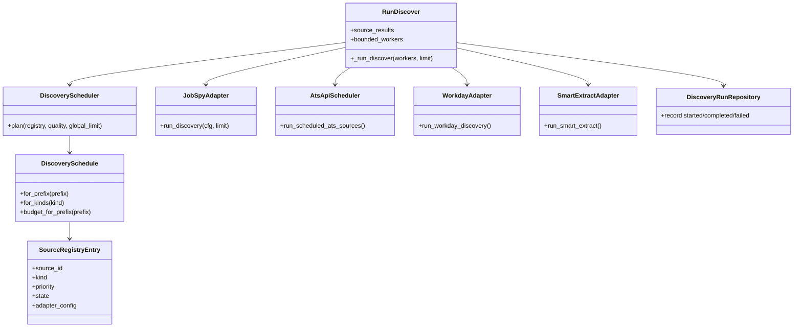

### Data And Events

- Reads source registry data from packaged YAML plus local
  `source_registry_entries`.
- Reads source-quality snapshots to schedule and budget sources.
- Reads target search from `candidate_profiles` and overlays it onto
  discovery search config.
- Upserts source registry control rows, source locator candidates, and
  manual-capture queue entries for protected/manual sources. Existing
  `imported` or `dismissed` manual-capture entries keep their status.
- Writes `jobs`, source observations, canonical identity rows, quarantine
  entries, discovery run rows, `job_events`, and source-level operational
  attempt metrics.
- Emits stage events and source-level discovery events.
- Classifies JobSpy board observations as `source_role=lead_generator` and
  root employer/ATS/API sources as `source_role=canonical_source`, so board
  discovery metrics do not collapse into canonical employer source health.

### Failure And Limits

Each source family is isolated. A failed JobSpy, ATS, Workday, or Smart Extract
step records failure information and lets the caller see a partial source
result. With `limit > 0`, the stage uses sequential source execution and skips
remaining source families once the observed-job cap is consumed.

## Phase 2: Enrich

### Purpose And Boundary

Enrich turns discovered jobs into usable job records by fetching full
descriptions, application URLs, and detail-page metadata. It owns detail-page
fetching and extraction. It does not score fit or generate materials.

### Sequence

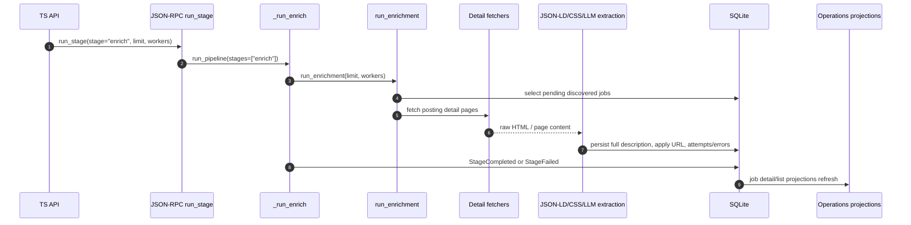

### Components

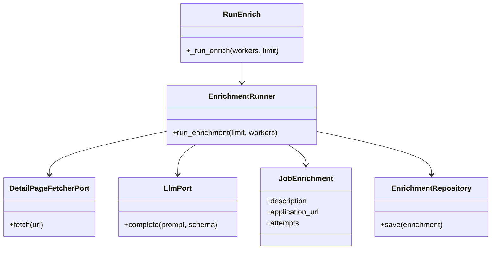

### Data And Events

- Reads pending jobs from SQLite selectors.
- Writes enriched description/application fields and canonical enrichment rows
  where available.
- Records detail scrape timestamps and errors for retry/debug visibility.
- Emits pipeline stage lifecycle events.
- Updates job list/detail projections so the UI can show richer job content.

### Failure And Limits

`limit` caps pending detail jobs. `workers` controls concurrent detail work.
Individual detail failures are recorded on the job so later runs can retry or
surface the error without crashing unrelated jobs.

## Phase 3: Score

### Purpose And Boundary

Score assigns applicant-side fit scores and structured reasoning to enriched
jobs. It owns retrieval preselection, scoring criteria, LLM parsing, score
versioning, and user-corrected score history. It does not tailor materials.

### Sequence

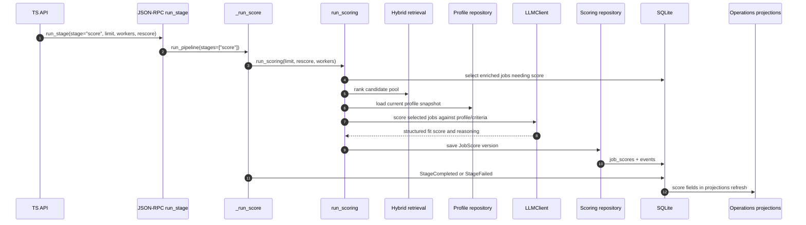

### Components

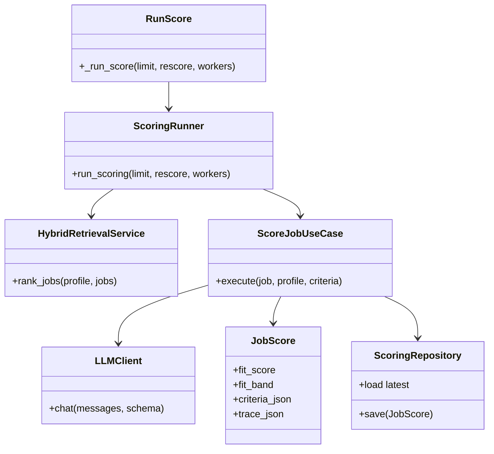

### Data And Events

- Reads enriched job content and profile target preferences.
- Writes versioned `job_scores` rows with criteria and trace metadata.
- Writes versioned `scoring_policies` rows when user corrections create
  correction-derived calibration anchors; current behavior preserves rubric
  weights and thresholds while making later score traces cite the new policy
  version and anchor IDs.
- Marks comparable latest uncorrected scores stale in `job_score_staleness`
  when a correction creates a newer scoring policy version. Corrected score
  versions are excluded. Successful uncorrected rescores under the newer policy
  resolve the stale marker; the local API can also reset active stale markers
  for explicit `jobhunter run score --rescore` processing.
- Supports a local, non-sensitive scoring governance report for QA. The report
  summarizes current policy version, rubric version, anchor count, unresolved
  and resolved stale-marker counts, correction count, and correction agreement
  signal without emitting raw job URLs, correction rationales, anchor IDs,
  resumes, generated artifacts, or local paths.
- Updates legacy-compatible score fields where needed by queue selectors.
- Publishes score events consumed by Pipeline and Operations.
- Refreshes dashboard score distributions and job list score badges.

### Failure And Limits

`limit` applies after retrieval preselection. `rescore=true` allows jobs with
existing scores back into the candidate pool. Parser warnings and failed LLM
calls are recorded so score failures do not masquerade as successful low-fit
results. Scoring prompt, model, schema, rubric, or policy changes must run the
local scoring eval gate documented in `docs/local-reliability-qa.md`; the gate
checks deterministic policy resolution separately from the raw LLM score and
pins stale-score exclusion until explicit reset/rescore.

## Phase 4: Tailor

### Purpose And Boundary

Tailor creates job-specific resume materials for high-fit jobs. It owns resume
generation, validation mode, retry/retailor decisions, and resume artifact
registration. It does not submit applications.

### Sequence

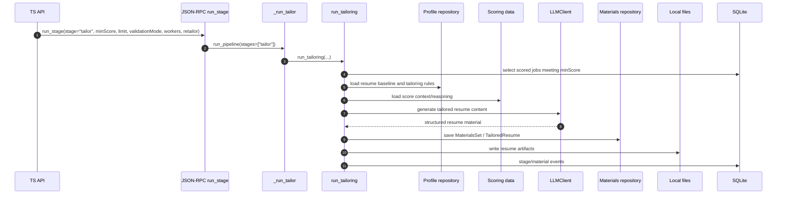

### Components

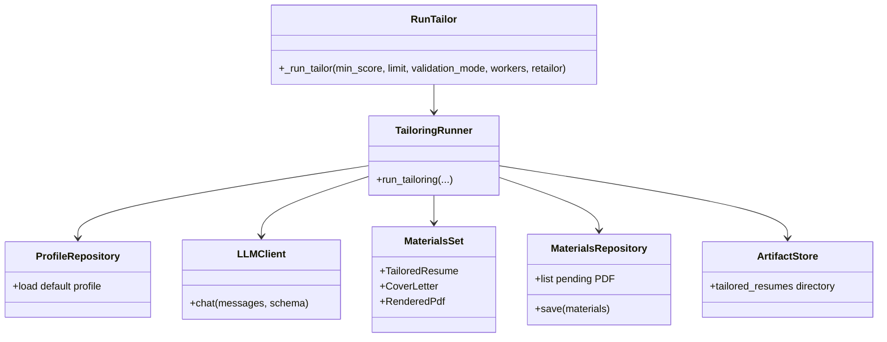

### Data And Events

- Reads jobs with score >= `minScore`.
- Reads profile resume baseline, skills, writing style, and tailoring rules.
- Writes tailored resume records and local artifacts under the JobHunter app
  directory.
- Emits material-generation events and pipeline lifecycle events.
- Updates artifact and job detail projections.

### Failure And Limits

`validationMode` controls strictness of generated-material validation.
`retailor=true` allows existing tailored materials to be regenerated. `workers`
controls parallel tailoring work. Failures are tracked per job/material so the
stage can be retried without losing successful materials.

## Phase 5: Cover

### Purpose And Boundary

Cover creates job-specific cover letters for jobs that already have sufficient
score/material context. It owns cover-letter text generation and persistence.
It also renders the cover-letter PDF, so the stage outputs the artifacts Apply
needs without relying on a later PDF-only phase.

### Sequence

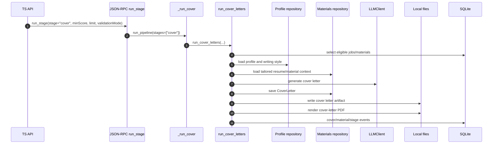

### Components

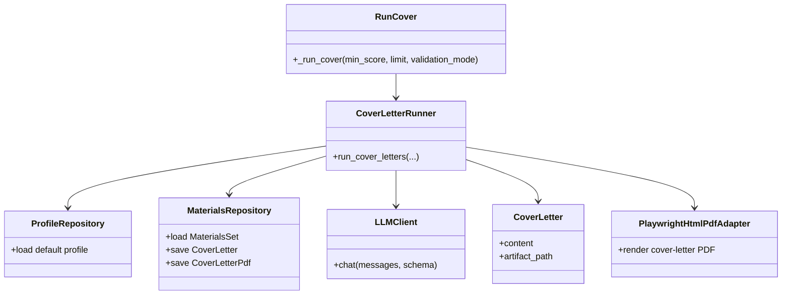

### Data And Events

- Reads score, job, profile, and existing materials context.
- Writes cover-letter material rows plus local cover-letter text and PDF files.
- Publishes cover-letter generation and PDF-rendered events.
- Refreshes artifact and job detail projections.

### Failure And Limits

`limit` caps eligible jobs. `validationMode` controls cover-letter validation.
Failures are local to individual jobs so a retry can continue from the remaining
pending cover letters.

## Phase 6: Apply

### Purpose And Boundary

Apply drives browser/agent automation to submit or dry-run applications. It is
the riskiest and longest-running phase, so it uses a Temporal workflow instead
of the synchronous `run_stage` path. It owns apply-run lifecycle, browser
execution, dry-run submission safety, cancellation, and apply artifacts/logs.

### Sequence

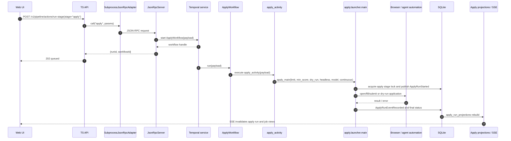

### Components

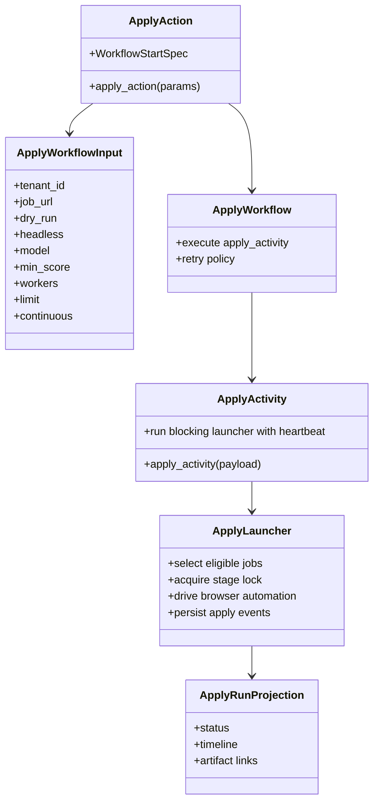

### Data And Events

- Reads eligible jobs, score/material/application URL data, and profile facts.
- Writes canonical apply stage state and `ApplyRunStarted`,
  `ApplyRunEventRecorded`, `ApplicationSubmitted`, or `ApplicationFailed`
  events.
- Writes apply logs/artifacts where available.
- Rebuilds `apply_run_projections` from lifecycle events.

### Failure, Retry, And Cancellation

`ApplyWorkflow` uses an apply-specific retry policy and a two-hour activity
timeout. Transient activity failures can retry through Temporal. Operator
errors such as no eligible job fail fast. `cancel_run` signals the workflow
runtime to cancel an in-flight run; `cancel_stage` is the post-hoc SQLite state
transition for marking a stage canceled.

## Operations Read-Side

The UI does not read directly from stage internals. It reads projection-backed
API endpoints owned by Operations:

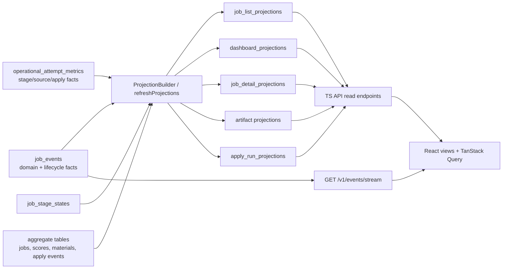

This separation is why a stage can complete before every UI card visibly
changes: the write path records durable facts first, then projection refresh and
SSE invalidation make those facts visible to the frontend.

Operational metrics are append-only rows written at pipeline boundaries rather
than inferred from dashboard labels or free-form event messages. Rows include
`stage`, `source_id`, source role, adapter, attempt kind, outcome,
operational/scrape/retryable flags, counts, durations, `error_class`,
`error_message`, `run_id`, and `job_url` when known. Discovery, enrichment,
scoring, tailoring, cover generation, apply dry-runs, and orphan cleanup all
record structured attempts so `discovery_runs.status='failed'` no longer has to
carry unrelated failure causes by itself.

## Source Files

Primary implementation files:

- `apps/api/src/server.ts`: `/v1/pipeline/actions/run-stage`.
- `apps/api/src/local-actions.ts`: maps UI commands to JSON-RPC methods and
  interprets results.
- `apps/api/src/json-rpc-adapter.ts`: long-lived subprocess JSON-RPC adapter.
- `workers/automation/src/jobhunter/infrastructure/rpc/handlers.py`: JSON-RPC
  method registry.
- `workers/automation/src/jobhunter/actions.py`: local action wrapper for
  `run_stage` and `profile_import`.
- `workers/automation/src/jobhunter/pipeline/runner.py`: non-apply stage
  orchestration.
- `workers/automation/src/jobhunter/pipeline/workflow.py`: non-apply Temporal
  workflow path.
- `workers/automation/src/jobhunter/apply/workflow.py`: apply workflow.
- `workers/automation/src/jobhunter/apply/activities.py`: apply activity.
- `workers/automation/src/jobhunter/apply/launcher.py`: apply browser/agent
  launcher.
- `apps/api/src/projections.ts` and
  `workers/automation/src/jobhunter/infrastructure/projections/`: Operations
  read-side projection builders.
