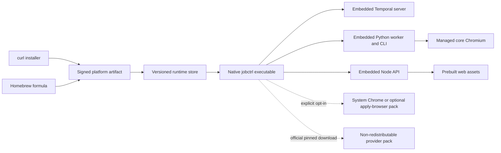

# Bundled JobCtrl Distribution Plan

- **Date:** 2026-07-10
- **Status:** Accepted / not yet delivered.
- **Anchors:** Current behavior and file ownership verified against
  `main @ 771f40c0`. Re-verify all paths against the implementation base before
  starting each phase.
- **Owner decision:** Proceed with the bundled distribution (the “Go” verdict
  in the 2026-07-06 ADR). JobCtrl will have one bundled, signed distribution and
  one public `jobctrl` executable. System Chrome is optional unless the user
  explicitly enables a capability that needs an authenticated browser.
- **Goal:** A person on a clean supported machine installs JobCtrl through curl
  or Homebrew, then uses the same `jobctrl` commands from any directory without
  installing or understanding Git, Node, pnpm, Corepack, uv, Python, Temporal,
  Poppler, Playwright, or contributor dependencies.

---

## 0. Outcome

The finished user path is:

```bash
# Channel A
curl -fsSL https://jobctrl.dev/install.sh | sh

# Channel B
brew install ebarti/tap/jobctrl

# Identical after either channel
jobctrl start
```

The public command contract is:

```text
jobctrl start [--no-open] [--foreground]
jobctrl stop
jobctrl status
jobctrl logs [component]
jobctrl open

jobctrl setup
jobctrl init
jobctrl doctor
jobctrl <domain-command>

jobctrl version
jobctrl update
jobctrl rollback
jobctrl uninstall [--remove-data]
```

Installation method is only an acquisition choice. It does not select a
different launcher, working directory, runtime, command spelling, or product
mode. `pnpm dev` and `uv --project ...` remain valid only for contributors
working from a source checkout.

The distribution is one public native executable plus a private, versioned
runtime payload. “One binary” means users invoke one real `jobctrl` binary; it
does not mean forcing Node, Python, Temporal, Chromium, and native libraries into
one Mach-O file.

---

## 1. Problem statement and root cause

### 1.1 Product invariant

The install and launch surface should prove all of the following:

1. Curl and Homebrew install the same JobCtrl build.
2. `jobctrl start` starts the complete local product from any directory.
3. That same `jobctrl` executable exposes the existing CLI.
4. A clean supported machine needs no developer toolchain.
5. Core discovery, enrichment, scoring, tailoring, review, and PDF rendering do
   not require system Chrome.
6. Auto-apply and authenticated-browser features are explicit opt-ins.
7. Updates and rollbacks preserve the user’s local state.

The current surface proves none of these as a complete set.

### 1.2 What is happening today

| Symptom | Current cause | Correct owning layer |
| --- | --- | --- |
| README says “choose how you want to start” but gives one source command | The user path is still the contributor launcher | Packaged launcher and user docs |
| Curl users run `pnpm dev` while Homebrew users run `jobctrl dev` | Homebrew installs a shell shim; curl installs only a checkout | Distribution artifact and native launcher |
| CLI examples expose `uv --project workers/automation run jobctrl` | The real Python console entry point exists only inside the uv environment | Native launcher dispatch |
| Git is required but not listed consistently | `scripts/get` clones/pulls a source checkout; production code does not need Git | Acquisition layer |
| A clean install pulls a large toolchain and development closure | `scripts/install` runs the full pnpm workspace install and `uv sync --extra dev` | Production build boundary |
| Two Playwright browser revisions are installed | Web E2E Playwright and Python runtime Playwright are both installed for users | Dependency pruning |
| Chrome looks optional, but a missing Chrome still appears in the installer’s failure summary | Core browser automation and authenticated-system-browser capabilities are conflated | Capability model and setup/doctor |
| `npx` is needed at apply time | The pinned Playwright MCP package is named, but not included in a production payload | Production Node payload |

### 1.3 Five whys

1. **Why are start commands different?** Each install path exposes a different
   wrapper around a source checkout.
2. **Why does the CLI require uv?** The `jobctrl` console entry point is installed
   only inside the Python environment.
3. **Why is Git required?** The distributed application is a mutable Git clone,
   not a release artifact.
4. **Why is the footprint so large?** User setup installs contributor,
   documentation, test, and E2E dependencies alongside runtime dependencies.
5. **Why can’t Chrome be skipped cleanly?** Setup models browsers as one tool
   check instead of separate core and opt-in capabilities.

**Root cause:** JobCtrl has no explicit production distribution boundary. The
source tree, development toolchain, runtime payload, command facade, and optional
browser capabilities are currently treated as one installable unit.

The fix therefore belongs at the build/distribution and runtime-lifecycle
layers. A README-only rewrite would hide the defect without resolving it.

---

## 2. Current dependency and footprint baseline

Planning measurements from the 2026-07-10 reference checkout are directional;
Phase 0 must reproduce them with a checked-in measurement script before any size
claim is published.

| Current source-install component | Observed logical footprint / count |
| --- | --- |
| pnpm workspace | 81 unique direct JavaScript packages; 1,428 lock records / 1,321 installed package instances; approximately 897 MiB in `node_modules` |
| Python worker environment | 22 direct runtime dependencies plus 5 direct dev dependencies; 97 installed third-party distributions; approximately 909 MiB |
| Playwright browsers | Node Playwright 1.59.1 revision 1217 plus Python Playwright 1.58.0 revision 1208; approximately 1.0 GiB combined |
| uv-managed Python | approximately 319 MiB when uv must provision Python |
| Homebrew dependency closure | 72 formulae; approximately 1.18 GiB on the reference machine |
| Google Chrome | approximately 1.3 GiB on the reference machine; should be excluded when authenticated browser features are disabled |
| Source archive | approximately 23 MiB compressed |

The current cold-machine path is therefore roughly **5–6 GiB before download
caches**, depending on what was already present. This is not the target package
size; it is evidence that the installer is provisioning a development
environment.

The release pipeline must publish, for every artifact:

- compressed download size;
- installed core size;
- each private runtime and browser component’s size;
- each optional/provider pack’s size;
- direct and transitive runtime component counts from the SBOM;
- delta from the previous release, failing CI on an unexplained material
  increase.

---

## 3. Non-negotiable product contract

### 3.1 One command surface

- The native `jobctrl` executable is the only public entry point.
- `jobctrl start` owns local runtime startup. It waits for health, prints the
  loopback URL, and opens it unless `--no-open` is supplied.
- `jobctrl start --foreground` is available for supervised terminals and CI.
- `jobctrl stop` performs graceful shutdown, then bounded process-tree cleanup.
- `jobctrl status` and `jobctrl logs` use the same runtime registry and health
  model as the supervisor.
- Existing Typer domain commands are dispatched through the embedded Python
  runtime without showing its path or requiring a working directory.
- Public commands never shell out to user-installed `git`, `node`, `pnpm`,
  `corepack`, `uv`, `python`, `temporal`, `pdftoppm`, or `npx`.

### 3.2 One artifact identity

- Curl and Homebrew resolve the same versioned platform artifact and manifest.
- `jobctrl version --json` reports the same build ID, component versions, and
  manifest digest for either channel.
- Homebrew does not build from `main` and has no `--HEAD` user path.
- Neither channel clones a repository.

### 3.3 Bundled means managed

- Everything JobCtrl is legally permitted to redistribute is in the signed
  platform payload.
- A component that cannot legally be republished is acquired by `jobctrl setup`
  from its official distribution channel, pinned by version and hash, and stored
  as a JobCtrl-managed provider pack.
- Users never run pip, uv, npm, npx, or a vendor CLI to install those packs.
- Credentials are never bundled, copied into release artifacts, or included in
  logs.

This is the honest boundary for the proprietary Claude runtime: the product
manages it, but JobCtrl does not become an unauthorized redistributor.

### 3.4 Browser capabilities

| Capability | Default | Browser source | Purpose |
| --- | --- | --- | --- |
| `core-browser` | Installed and enabled | One JobCtrl-managed Python Playwright Chromium revision | Discovery scraping, enrichment, and HTML/CSS PDF rendering |
| `auto-apply-browser` | Disabled | Explicitly adopted system Chrome/Chromium or a separately installed managed capability pack | Authenticated application submission |
| `authenticated-linkedin-browser` | Disabled | Explicitly adopted system Chrome profile | Best-effort authenticated apply-URL resolution |
| Web/extension E2E browsers | Never shipped | Contributor dependency only | Test and documentation workflows |

Missing system Chrome is not an install warning, failed doctor row, reduced
readiness tier, or startup blocker while the two authenticated-browser
capabilities are disabled.

### 3.5 State and safety

- Existing state under `~/.jobctrl` remains the source of truth and is never
  placed inside a release directory.
- Runtime files live in a separate versioned store, configurable through
  `JOBCTRL_RUNTIME_HOME`.
- Upgrades back up the SQLite database before migration.
- A failed health gate atomically returns to the previous runtime.
- `jobctrl uninstall` preserves user data by default.
- `jobctrl uninstall --remove-data` requires an explicit destructive
  confirmation and reports exactly what will be removed.
- Existing apply approval, dry-run, at-most-once, browser-profile, and audit
  invariants are unchanged.

---

## 4. Target architecture



### 4.1 Public executable

Add a small Go launcher/supervisor as the stable public process boundary. Go is
used for the launcher only: it produces a signed native binary, has no runtime
dependency, handles process groups and signals well, and can verify manifests
before starting higher-level runtimes.

The launcher must not absorb domain logic. It owns:

- manifest and signature verification;
- release selection;
- environment/path construction;
- process supervision and health;
- dispatch into the embedded Python CLI;
- lifecycle commands;
- update/rollback/uninstall orchestration.

### 4.2 Private payload

The initial Apple-silicon macOS artifact is relocatable and contains a layout
equivalent to:

```text
jobctrl-<version>-darwin-arm64/
  bin/jobctrl
  libexec/jobctrl/
    manifest.json
    api/server.mjs
    web/
    worker/
    runtimes/node/
    runtimes/python/
    runtimes/temporal/
    runtimes/poppler/
    browsers/core/
    node_modules/@playwright/mcp/
    licenses/
    sbom.cdx.json
```

The exact internal layout may change; the manifest and public command contract
may not.

### 4.3 Production runtime boundary

- Build the React app once and serve its static assets from the Fastify API.
  Vite is not a production process.
- Compile/bundle the TypeScript API to production JavaScript. `tsx`,
  TypeScript, Vitest, Storybook, VitePress, and source maps containing local
  paths do not ship.
- Build a relocatable Python runtime containing only worker/CLI runtime
  dependencies. pytest, Ruff, build tooling, and package-manager caches do not
  ship.
- Include the Temporal server binary privately; it is never required on `PATH`.
- Include Poppler privately for the current PDF-page preview adapter. A later
  replacement is allowed, but user installation of Poppler is not.
- Install exactly one Python Playwright Chromium revision under a private,
  versioned `PLAYWRIGHT_BROWSERS_PATH`.
- Include the pinned `@playwright/mcp` package under the embedded Node runtime;
  apply must not invoke `npx` or download code at execution time.

### 4.4 Supported platforms

The first release gate is `darwin-arm64`, matching the existing owner QA gate.
The manifest and build system are platform-aware from day one, but Linux,
Intel macOS, and Windows do not block the first artifact. Each later platform
must pass the same clean-machine, capability, update, and rollback contract.

---

## 5. Implementation phases

Each phase lands in its own worktree and reviewable PR. Later phases may be
stacked, but none may claim user-facing bundled behavior before the clean-machine
artifact gate passes.

### Phase 0 — lock the release contract and measure the real closure

**Changes**

- Record the owner’s Go decision in `docs/decisions.md`, superseding the
  2026-07-06 pending decision while preserving that ADR verbatim.
- Add a machine-readable bundle manifest schema with app version, build ID,
  platform, minimum OS, component versions, hashes, sizes, licenses, and
  required/optional capability flags.
- Add a reproducible dependency/footprint report for source install and
  production payload.
- Classify every shipped component as runtime, optional capability, provider
  pack, or developer-only.
- Complete redistribution/license review, especially the Claude runtime,
  Chromium, Temporal, Poppler, fonts, Codex, Antigravity, and Playwright MCP.
- Choose and document the minimum supported macOS release and signing/
  notarization identities.

**Tests and evidence**

- Manifest schema unit tests.
- Two identical builds from clean runners produce identical file inventories;
  any unavoidable non-deterministic metadata is documented.
- License inventory fails closed for unclassified files.
- Baseline report reproduces or explains the measurements in `2.

**Exit criterion**

No component can enter the payload without an owner, version, source, license,
hash, size, and capability classification.

### Phase 1 — create the production payload

**Changes**

- Add production build scripts under `packaging/`.
- Build and serve the web app from the local API.
- Compile the API and prune the Node production closure.
- Build the relocatable Python worker/CLI runtime without the dev extra.
- Embed Temporal and Poppler.
- Bundle one Python Playwright Chromium revision and remove the Node Playwright
  browser install from the user artifact.
- Bundle Playwright MCP with the private Node runtime and replace runtime `npx`
  dispatch with an absolute manifest-resolved command.
- Build official-channel provider packs for components JobCtrl cannot
  redistribute.
- Emit the manifest, SBOM, attribution files, and component-size report.

**Tests and evidence**

- API unit tests cover static web serving, SPA fallback, cache headers, and path
  traversal rejection.
- The extracted payload starts with user `PATH` reduced to stock OS locations.
- A grep/exec audit proves no production path invokes the forbidden user
  toolchain commands.
- A clean payload with network disabled can restart, discover a fixture,
  render a resume PDF, and render its page preview.
- The artifact contains no web E2E browser, Storybook, docs, test fixtures,
  pytest/Ruff, package-manager cache, Git metadata, or source checkout.

**Exit criterion**

The private payload can run the complete non-authenticated product path without
the repository or any system toolchain.

### Phase 2 — add the native launcher and centralized lifecycle

**Changes**

- Add the Go `jobctrl` launcher and cross-process runtime registry.
- Implement `start`, `stop`, `status`, `logs`, `open`, `version`, and
  transparent dispatch to the embedded Python CLI.
- Move production startup knowledge out of `scripts/dev` into an explicit
  runtime manifest consumed by the launcher.
- Start Temporal, worker, and API in dependency order; the API serves the web
  UI, so there is no production Vite process.
- Enforce one active instance per state directory using a lock.
- Bind services to loopback, detect port conflicts, propagate signals, and
  clean only JobCtrl-owned process trees.
- Provide `--foreground` for supervised execution and detached startup by
  default.

**Tests and evidence**

- Go unit tests cover manifest parsing, environment isolation, locks, PID reuse,
  signal handling, exit codes, and component log routing.
- Integration tests start from `/tmp` with no checkout and exercise every
  public lifecycle command.
- Killing the launcher or one child yields an accurate status and a recoverable
  restart.
- Existing Python CLI contract tests pass when invoked through the native
  executable.

**Exit criterion**

Every installed user, regardless of channel, can run `jobctrl start` and all
CLI commands from any directory.

### Phase 3 — split core and authenticated-browser capabilities

**Changes**

- Introduce explicit capability state and commands:

  ```text
  jobctrl capability list
  jobctrl capability enable auto-apply-browser
  jobctrl capability enable authenticated-linkedin-browser
  jobctrl capability disable <name>
  ```

- Make authenticated LinkedIn resolution default off.
- Change setup and doctor so disabled capabilities are reported as `disabled`,
  not `missing` or `failed`.
- Remove system Chrome from base installation prompts, base tier calculation,
  and core startup gates.
- Preserve the managed Playwright Chromium preflight for discovery and PDF
  rendering, but rewrite its remediation in `jobctrl` terms.
- Enabling an authenticated-browser capability offers two explicit choices:
  adopt an existing Chrome/Chromium path or install a separate managed
  capability pack where technically viable.
- Require explicit consent before reading or copying any existing browser
  profile.

**Tests and evidence**

- Clean macOS with no Chrome: install, start, doctor, discovery, enrichment, and
  PDF rendering pass.
- Enabling auto-apply without a browser fails only that capability with one
  actionable message.
- Disabling it again removes the readiness warning.
- Regression tests prove no authenticated browser launches while both
  capabilities are disabled.
- Apply approval and dry-run safety suites remain green.

**Exit criterion**

A user who never wants auto-apply is never asked to install Chrome and loses no
core JobCtrl functionality.

### Phase 4 — make curl and Homebrew acquire the same release

**Changes**

- Replace `scripts/get` cloning with a minimal installer that selects a platform
  artifact, downloads it, verifies checksum, macOS code signature,
  notarization, and signed manifest, then stages it atomically.
- Reject archive traversal, symlinks escaping the staging root, unexpected
  owners/modes, unknown manifest files, and partial downloads.
- Replace the HEAD-only Homebrew formula with a stable artifact formula using
  the same archive and digest as curl.
- Remove Homebrew dependencies on Git, Node, Corepack, uv, Temporal, and
  Poppler.
- Remove `jobctrl bootstrap` from the public path.
- Keep a one-release compatibility alias where safe:
  `jobctrl dev` warns and dispatches to `jobctrl start`; source-only
  `scripts/dev` remains unchanged for contributors.
- Move source installation and its explicit Git/Node/uv requirements to
  `docs/local-development.md` and the developer guide.

**Tests and evidence**

- A contract test compares curl and Homebrew artifact URL, version, SHA-256,
  manifest digest, and build ID.
- Curl installation passes on a clean supported macOS user account with no Git
  and no Homebrew.
- Homebrew installation has no toolchain dependency closure and passes formula
  audit/test.
- Re-running either installer is idempotent and never touches `~/.jobctrl`
  state.

**Exit criterion**

The two acquisition channels produce indistinguishable runtime and command
behavior.

### Phase 5 — updates, rollback, migration, and uninstall

**Changes**

- Store immutable runtime releases outside `~/.jobctrl` user state.
- Both channels seed the same user-owned versioned release store so runtime
  update/rollback does not depend on mutating a Homebrew Cellar.
- Implement signed update metadata, download locking, resumable staging, atomic
  activation, previous-version retention, and health-gated promotion.
- Back up SQLite before any schema migration and record the release/schema pair.
- Implement rollback that restores the matching pre-upgrade database backup
  when the prior runtime cannot read the upgraded schema.
- Implement safe uninstall and explicit data removal.
- Define launcher/payload compatibility so an older launcher refuses a payload
  it cannot safely supervise and `jobctrl update` can update the launcher
  through its acquisition-channel adapter.

**Tests and evidence**

- Interrupt update at every staging/activation boundary; the prior release
  remains runnable.
- Upgrade across a real schema migration, force the health gate to fail, and
  prove automatic rollback restores both runtime and data coherently.
- Concurrent update/start commands serialize correctly.
- Uninstall preserves `~/.jobctrl` by default.
- Old signed artifacts cannot be replayed below the configured minimum safe
  version after a security revocation.

**Exit criterion**

An update cannot strand the user between versions or silently corrupt local
state.

### Phase 6 — release supply chain

**Changes**

- Add release workflows for clean platform builds, tests, signing,
  notarization, SBOM/provenance, checksums, manifests, and GitHub Release
  publication.
- Pin all external build inputs and verify downloaded runtime hashes.
- Synchronize the stable Homebrew formula only after the release artifact is
  published and verified.
- Add artifact retention and revocation metadata.
- Make package version alignment across the launcher, root package, API, web,
  and Python worker a release check.

**Tests and evidence**

- Release candidate rebuild and artifact inventory comparison.
- `codesign`, Gatekeeper, notarization, checksum, manifest-signature, SBOM, and
  license gates.
- Install/launch smoke from the published candidate URL, not a workspace file.
- Dependency and size delta report attached to the release gate.

**Exit criterion**

No unsigned, unaudited, or source-built-on-the-user-machine artifact can become
the stable install.

### Phase 7 — documentation cutover and product QA

**Changes**

- Replace README Get Started with the two acquisition commands followed by one
  `jobctrl start` instruction.
- Remove uv/pnpm/Git/Temporal/Poppler/Chrome from user requirements.
- Explain the managed core browser and optional authenticated-browser
  capabilities.
- Update `docs/user/`, `docs/local-development.md`,
  `docs/architecture/runtime.md`, `docs/requirements.md`,
  `docs/decisions.md`, `docs/claims-ledger.md`, `ROADMAP.md`, and
  `docs/backlog.md` to distinguish shipped behavior from source development.
- Keep source commands fully documented for contributors.
- Move this plan to `docs/plans/implemented/` only after the stable artifact is
  published and all gates below pass.

**Product QA**

1. Fresh Apple-silicon macOS, curl path, no Git/Homebrew/Chrome.
2. Fresh Apple-silicon macOS, Homebrew path, no prior JobCtrl state.
3. Existing `~/.jobctrl` state upgraded from the source install.
4. Warm vendor auth and cold vendor auth.
5. Core path with authenticated-browser capabilities disabled.
6. Auto-apply capability enable/disable and explicit browser adoption.
7. Update, forced failed update, rollback, and uninstall/data-preservation.
8. First discovered/scored job and first reviewable tailored PDF using the
   real-path TTFV recorder.

**Exit criterion**

The published docs describe exactly one installed command surface, and clean
machine QA proves it.

---

## 6. PR sequence

| PR | Scope | Depends on |
| --- | --- | --- |
| P0 | Manifest schema, component inventory, measurement, license and platform gates | This plan |
| P1 | Production API/web/worker payload and pruned dependency closure | P0 |
| P2 | Native launcher and local lifecycle | P1 |
| P3 | Browser capability split | P1; may stack in parallel with P2 after manifest contract |
| P4 | Signed curl installer and stable Homebrew formula | P2, P3 |
| P5 | Update/rollback/uninstall | P2, P4 |
| P6 | Release workflow, signing, notarization, provenance | P1–P5 |
| P7 | User-doc cutover and published-artifact QA | P6 |

Each PR must include the tests for its changed behavior. P1–P7 require the
repository’s review and QA loops; user-facing claims remain “planned” until P7.

---

## 7. Acceptance matrix

| Requirement | Proof |
| --- | --- |
| One start command | `jobctrl start` works after curl and Homebrew from a directory with no checkout |
| Binary is also the CLI | `jobctrl doctor` and representative domain commands dispatch through the same native executable |
| No user toolchain | Clean-machine run passes with Git, Homebrew, Node, pnpm, Corepack, uv, Python, Temporal, Poppler, and npx absent |
| Same distribution | Both channels report identical build ID and manifest digest |
| No source clone | No `.git` directory or source checkout is created |
| No duplicated browser | Artifact inventory contains one core Playwright Chromium revision and no E2E browser |
| Chrome is optional | With no system Chrome and optional capabilities disabled, install/start/doctor/core browser flows pass |
| Apply remains explicit | Auto-apply capability cannot become ready without explicit enablement and browser consent |
| Offline restart | After installation/provider setup, restart works without package-registry access |
| Safe update | Interrupted and unhealthy updates leave or restore a coherent previous runtime/data pair |
| Safe uninstall | Default uninstall leaves `~/.jobctrl` untouched |
| Footprint is explainable | Release includes per-component size report, SBOM, licenses, and delta from prior version |
| Contributor workflow survives | `pnpm dev` and `uv --project ...` remain documented and tested as source-development commands |

---

## 8. File ownership map

| Surface | Expected changes |
| --- | --- |
| Native launcher | New `cmd/jobctrl/` or equivalent Go module |
| Production packaging | New `packaging/distribution/` manifests/builders; update release workflows |
| API/web boundary | `apps/api/` production entry/static serving; `apps/web/` production build inputs |
| Python runtime/CLI | `workers/automation/pyproject.toml`, CLI dispatch/runtime path resolution, preflight and setup probes |
| Browser capability split | `workers/automation/src/jobctrl/config.py`, setup/doctor, enrichment resolver, apply browser adapters |
| Playwright MCP | `workers/automation/src/jobctrl/domain/apply/services.py` and private Node payload |
| Installer | `scripts/get` or replacement install asset; installer contract tests |
| Homebrew | `packaging/homebrew/Formula/jobctrl.rb` and tap sync workflow |
| Lifecycle and dev separation | Native launcher plus `scripts/dev` compatibility/developer path |
| Updates/state | New release-store/update module; existing database backup/schema guards |
| Canonical docs | README, `docs/user/`, local development, runtime architecture, requirements, ADRs, claims ledger, roadmap/backlog |

---

## 9. Risks and explicit gates

| Risk | Mitigation / stop condition |
| --- | --- |
| Proprietary runtime redistribution | Never copy a component into the artifact until license review allows it; use official-channel provider pack otherwise |
| Relocatable Python/native wheels | Clean extraction test on a machine without build tools; fail P1 if any path leaks the build runner |
| Node native module compatibility | Build per target platform and test `better-sqlite3` from the extracted artifact |
| Temporal/Chromium/Poppler size | Publish component sizes; eliminate duplicate/dev closure before debating feature removal |
| Homebrew vs self-update ownership | One public `jobctrl update` contract; user-owned runtime store and private channel adapter |
| macOS trust warnings | Developer ID signing and notarization are release blockers |
| Database rollback after one-way migration | Pre-migration backup plus runtime/schema pairing; never run an older runtime against a newer unsupported schema |
| Browser-profile privacy | Capabilities default off; explicit path selection and consent; never copy profiles silently |
| Launcher becomes a second application layer | Keep launcher limited to packaging/lifecycle; domain behavior stays in existing API/worker contexts |
| “One binary” mistaken for one physical file | Document one public executable plus private payload; do not trade maintainability for a monolithic executable |

---

## 10. Non-goals

- No Electron/Tauri desktop shell in the first bundled release; the existing
  loopback web UI remains the product UI.
- No rewrite of the TypeScript API, React app, Python worker, or Temporal
  workflows into Go.
- No removal of source-development commands.
- No bundling of credentials or silent reuse/copy of browser profiles.
- No requirement that optional auto-apply dependencies ship in the core
  payload.
- No change to auto-apply approval or submission safety semantics.
- No stable-install documentation before the signed artifact actually exists.

---

## 11. Definition of done

This plan is complete only when:

1. A signed and notarized `darwin-arm64` artifact is published.
2. Curl and stable Homebrew install that exact artifact without cloning source.
3. `jobctrl start` and the full CLI work identically from any directory.
4. Clean-machine QA passes with no developer toolchain and no system Chrome.
5. The core payload contains one managed Playwright Chromium and no user E2E
   browser.
6. Provider packs are legally sourced, pinned, verified, and managed entirely by
   JobCtrl.
7. Update, rollback, migration, and uninstall/data-preservation gates pass.
8. The release includes SBOM, license inventory, component counts, size report,
   signatures, checksums, and provenance.
9. Canonical user docs contain no uv/pnpm/Git start path.
10. The required review and QA gates pass with no Blocker or High findings.
