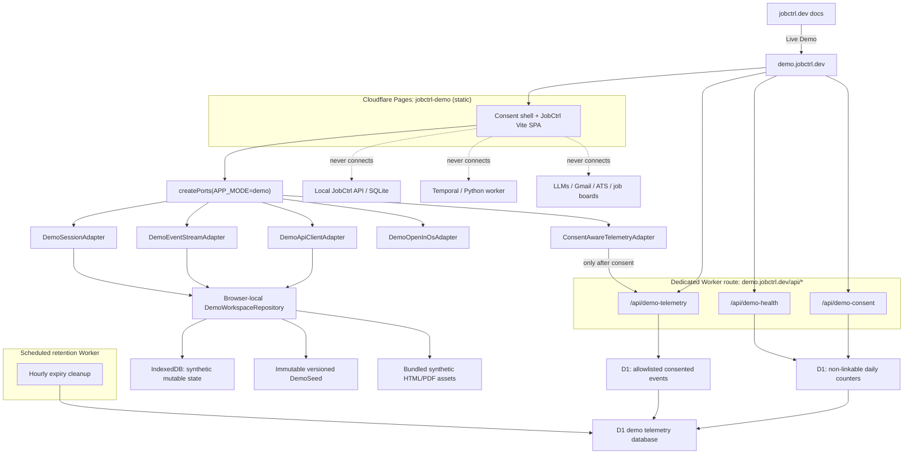
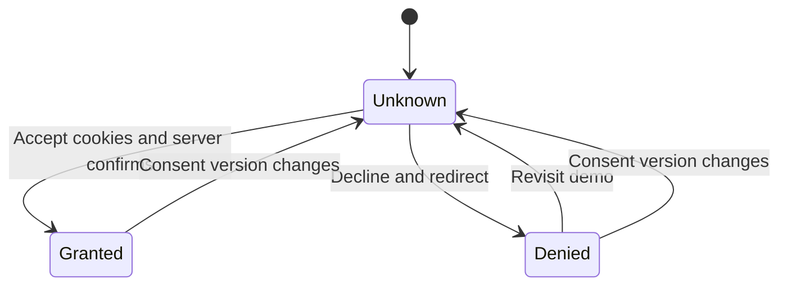

# Public JobCtrl Live Demo Plan

- **Date:** 2026-07-11
- **Status:** Accepted, amended by the owner on 2026-07-11 / not yet delivered.
- **Anchors:** Current behavior and file ownership verified against
  `main @ b513b356`. Re-verify all cited paths and contracts against the base of
  each implementation PR before coding.
- **Owner decisions:** Ship a public, browser-local JobCtrl demo backed only by
  synthetic data; isolate mutable workspaces by browser profile; instrument the
  demo with consent-aware first-party telemetry; require confirmed analytics
  consent before demo initialization; redirect visitors who decline to
  `https://jobctrl.dev`; prompt them again if they later revisit the demo; and
  deliver implementation as a bottom-up stack of reviewable PRs. Post-accept
  withdrawal and current-visitor erasure are explicitly deferred to a later
  delivery. Public cutover of this acceptance-required gate remains a
  legal/privacy stop gate.
- **Goal:** A visitor can open `https://demo.jobctrl.dev`, explore the real
  JobCtrl web application, drive representative workflows end to end, inspect
  audit and failure behavior, and understand the product without installing it
  or causing any real LLM, email, browser, job-board, ATS, or application side
  effect.

---

## 0. Outcome

The finished public path is:

```text
https://jobctrl.dev
        |
        +-- Live Demo --> https://demo.jobctrl.dev
```

Before consent, every fresh browser storage profile receives only the static
consent shell. After a confirmed grant, it receives the same immutable,
versioned synthetic starting scenario and an isolated browser-local mutable
copy. The web app is the real JobCtrl React application. Its local HTTP and SSE
adapters are replaced at the composition root by deterministic demo adapters;
feature components, views, query hooks, mutations, query keys, and invalidation
handlers remain the same.

The public deployment has one deliberately narrow server-side surface:
same-origin consent, non-linkable operational counters, and consented telemetry
served by a dedicated Worker routed only at `demo.jobctrl.dev/api/*`. It is not
a JobCtrl product API and cannot read the browser-local demo workspace. Static
application assets remain on Pages. The operational lane stores only aggregate
counters; the consented lane accepts only a small, typed, allowlisted analytics
event contract after consent.

The demo must make this boundary unmistakable:

> Demo mode starts with synthetic data. Anything you type stays in this browser.
> Nothing is submitted or sent. Do not enter personal data or secrets.

The demo is not a shared playground, a hosted JobCtrl account, a free LLM
proxy, or the first increment of the multi-tenant SaaS architecture.

---

## 1. Product invariant and current evidence

### 1.1 Product invariant

The public demo must prove all of the following at the same time:

1. After confirmed cookie acceptance, a visitor reaches a populated product
   without installation or a product API; declining redirects to
   `https://jobctrl.dev`, and revisiting opens the consent gate again.
2. The visitor can interact with JobCtrl's core discovery, scoring, evidence,
   tailoring, review, run-history, dry-run apply, outcome, and outreach
   surfaces.
3. Long-running actions visibly move through queued, running, terminal, retry,
   failure, and cancellation states.
4. The same event and cache-invalidation paths used by the local product update
   the UI.
5. One browser storage profile can never alter another profile's experience.
6. No demo control can cause an external or irreversible action.
7. Every simulated result is labelled honestly.
8. Anonymous operational counters can measure consent choice and initialization
   health, while consented product analytics can answer whether visitors reach
   and understand the key workflows. Neither lane collects profile, job,
   resume, document, or free-text content.
9. Analytics consent is informed, versioned, and enforced before either
   tracking or demo workspace initialization begins; post-accept withdrawal is
   an explicit deferred follow-up, not a shipped claim.
10. The local JobCtrl application remains behaviorally unchanged.

### 1.2 Current frontend seam

`apps/web/src/main.tsx` constructs all external dependencies once and passes
them through `PortsProvider`. `ApiClientPort`, `EventStreamPort`, `SessionPort`,
`StoragePort`, `OpenInOsPort`, `TelemetryPort`, and `FeatureFlagPort` already
form the correct replacement seam.

The current composition root always selects:

- `FetchApiClientAdapter`;
- `SseEventStreamAdapter`;
- `LocalSessionAdapter`;
- `LocalStorageAdapter`;
- `OpenArtifactAdapter`;
- `ConsoleTelemetryAdapter`;
- `StaticFeatureFlagAdapter`.

No demo mode exists. The implementation must add one composition-root choice,
not `if (demo)` branches throughout views or bounded contexts.

### 1.3 Current local API is not a public-demo backend

The TypeScript API defaults to `127.0.0.1`, rejects non-loopback hosts unless an
explicit remote-bind escape hatch is set, rejects non-loopback peers, and gates
mutations on trusted local request metadata or local capability tokens. The
event-stream tenant also resolves to the singleton local tenant.

Those are product safety invariants, not obstacles to remove. The public demo
must never point at, proxy, tunnel, weaken, or conditionally expose the local
API.

### 1.4 Existing synthetic and deterministic foundations

The repository already contains reusable foundations:

- `apps/api/test/qa-seed.ts` creates a disposable synthetic workspace with a
  profile, jobs, stages, events, workflow projections, audit facts, and
  artifacts.
- `apps/web/src/test/fixtures/` contains typed projection and feature fixtures.
- `apps/web/src/test/msw/handlers.ts` covers most REST shapes for tests and
  Storybook.
- `apps/web/src/test/testPorts.ts` contains fake event-stream, session, storage,
  clipboard, OS-open, and telemetry ports.
- `apps/api/src/e2e-dispatch.ts` acknowledges workflow commands without starting
  a worker or spending LLM tokens, while E2E drives terminal facts through the
  real event/read-model path.

These are evidence and extraction sources. Test-only MSW handlers and test
fakes must not become the production demo runtime.

### 1.5 Current hosting and telemetry gap

`jobctrl.dev` currently serves the VitePress documentation from the Cloudflare
Pages project `jobctrl-docs`. There is no `jobctrl-demo` Pages project and no
`demo.jobctrl.dev` DNS record.

The app's `TelemetryPort` currently resolves to `ConsoleTelemetryAdapter`, which
logs only in development. No browser consent surface, visitor/session cookie,
public-demo event contract, telemetry ingestion endpoint, or public product
analytics store exists.

---

## 2. Decisions

### D1. Browser-local product API

**Decision:** Implement demo behavior as `DemoApiClientAdapter implements
ApiClientPort`, backed by a browser-local `DemoWorkspaceRepository`.

There is no fake HTTP product server, public SQLite instance, public Temporal
worker, public Python worker, or MSW service worker in production. This makes
the no-product-network invariant architectural rather than conventional.

The adapter must implement the complete `ApiClientPort` and preserve every
declared success return type. The current port has no `Unsupported` result arm:
an operation that cannot be represented safely is disabled with an adjacent
reason, and the adapter defensively rejects that method with a stable
demo-capability error consumed through the existing query/mutation error path.
Introducing a new result union would require an explicit shared-contract change;
the demo adapter must not invent one. It must never fall back to
`FetchApiClientAdapter`.

### D2. Isolated anonymous workspace per browser profile

**Decision:** Every browser profile receives a locally generated anonymous
workspace ID and an independent mutable copy of the canonical seed.

The ID is a storage namespace, not an account or identity. It is never used as
the analytics visitor ID and is never transmitted. Isolation is by browser
storage profile, not by human: separate browser profiles/private contexts
cannot see, reset, corrupt, or race one another's product state, but people who
share one browser profile also share its demo workspace. The shell must explain
this local-retention boundary, discourage personal or secret input, and provide
an obvious reset/clear action.

Tabs in the same browser profile may share the same demo workspace. Cross-tab
updates must use browser-native coordination or an explicit single-tab policy;
the implementation PR must choose one and test it. A private/incognito session
starts fresh.

### D3. One canonical synthetic seed, many private copies

**Decision:** Extract or generate one typed, versioned `DemoSeed` from the
existing QA fixture and canonical API read model. Each visitor clones it.

The seed must contain enough lifecycle diversity to expose success, failure,
blocking, retry, stale policy, accepted-artifact preservation, approval,
dry-run, cancellation, interview, rejection, offer, contact, and follow-up
states.

### D4. Simulate effects; never mask or silently disable them

**Decision:** Pure UI and browser-local mutations behave normally. Expensive or
external work is represented by deterministic scenarios that emit real-shaped
run, projection, and domain-event data. Irreversible effects end in explicit
`DemoReceipt` records that say what would have happened and what did not happen.

No button may appear to submit an application, send an email, scrape a live
site, contact an LLM, save a secret, or open a host OS file without an adjacent
demo explanation and a simulated receipt.

### D5. Acceptance-required access gate

**Owner decision (amended 2026-07-11):** Block demo initialization until the
visitor explicitly accepts analytics cookies. The gate has two clear actions:

- **Accept cookies and enter the demo**;
- **Decline and return to JobCtrl.dev**.

The gate must state plainly that the live demo is available only after cookie
acceptance. Declining records the non-linkable denied choice when the edge is
available, creates no analytics identifier, and redirects to
`https://jobctrl.dev`. A visitor who later opens `demo.jobctrl.dev` sees the
gate again rather than being auto-admitted or silently redirected.

**Owner scope amendment (2026-07-11):** Post-accept withdrawal, a “Manage
privacy” control, current-visitor deletion, and retryable erasure state are
deferred to a later delivery. They are not implemented or claimed by this
stack. The approved notice must disclose the shipped lifetime/expiry behavior,
and legal/privacy approval must explicitly accept this deferred boundary before
public cutover.

This owner decision is implementation authority, not legal approval. Public
cutover remains stopped until the controller approves a lawful basis and the
published notice. GDPR Article 7 makes conditionality relevant when assessing
whether consent is freely given, and current EDPB guidance gives an explicit
cookie-wall example in which consent is not valid because access depends on
acceptance:

- [GDPR Article 7 and recitals 42–43](https://eur-lex.europa.eu/legal-content/EN/TXT/?uri=CELEX:32016R0679)
- [EDPB Guidelines 05/2020 on consent](https://www.edpb.europa.eu/documents/guideline/guidelines-052020-on-consent-under-regulation-2016679_en)
- [EDPB 2026 consent summary and cookie-wall example](https://www.edpb.europa.eu/system/files/2026-04/edpb-summary-consent_en.pdf)
- [EDPB cookie-banner taskforce report](https://www.edpb.europa.eu/system/files/2023-01/edpb_20230118_report_cookie_banner_taskforce_en.pdf)

### D6. First-party telemetry with data minimization

**Decision:** Separate strictly bounded operational measurement from optional
analytics and make their schemas impossible to join:

1. **Non-linkable operational counters in D1** record an aggregate consent
   choice inside the required consent transaction and one aggregate
   initialization result after a confirmed grant. These counters contain only
   UTC day, release, consent-contract version, a closed metric/dimension enum,
   and count. They have no request row, timestamp below day granularity, visitor
   or session ID, IP, user agent, referrer, URL, or product data. The edge must
   not log request bodies or identifying headers. Consent-choice counters
   operate for grants and denials; initialization-health counters exist only
   after a confirmed grant because a decline never initializes the demo. Both
   are disclosed as necessary service measurement and require privacy-owner
   approval before launch.
   Each consent or health operation carries a fresh random idempotency key that
   is reused only for retries of that operation. D1 stores only its digest in a
   separate non-joinable dedupe table for at most 24 hours; a unique constraint
   and atomic insert-plus-increment make a committed operation count once even
   when the response is lost. This operation key is not a visitor/session ID and
   cannot be reused across choices, initialization attempts, or analytics.
2. **A same-origin `/api/*` Worker plus D1**, enabled only after consent, accepts
   a small allowlisted product-event schema with pseudonymous consented
   visitor/session IDs, exact retention, coarse route names, and
   browser-computed Web Vitals/timing buckets.

Cloudflare Web Analytics is deliberately excluded from the first release. Its
generic browser beacon can receive landing-page URLs and SPA referrers before
the application can map dynamic job, run, artifact, contact, or event paths to
the closed route-name enum. Browser-native CSP/Reporting API endpoints are also
excluded because violation reports can contain the full document URL. Either
mechanism may be reconsidered only after a production-browser payload test
proves that dynamic path segments, queries, fragments, and referrers are
redacted before the network boundary; server-side scrubbing after receipt is
not sufficient.

The plan intentionally cannot measure unique non-consenting people or connect a
denied choice to later behavior. Landing-request volume is an aggregate delivery
metric, not a unique-person count. If privacy review rejects the non-linkable
operational lane, remove it and explicitly scope consent and initialization
queries to consented traffic; never replace it with an identifier.

Workers Analytics Engine is a later scale option for aggregate custom metrics.
It is not the first store because its fixed retention and append-oriented model
make the initial retention and population-labelled reporting contract harder to
verify locally.

### D7. Separate Cloudflare project and subdomain

**Decision:** Deploy the static demo as the separate Pages project
`jobctrl-demo` on `demo.jobctrl.dev`, linked from the docs site. Route only
`demo.jobctrl.dev/api/*` to a dedicated Worker because Pages Functions do not
support the required Rate Limiting bindings under verified Wrangler 4.107.0.
The P4 package and deployment workflow must pin that exact version; a later
upgrade requires rerunning both configuration and deployment tests.

Do not deploy under `/demo` inside `jobctrl-docs`. Separate projects provide
independent preview deployments, bindings, headers, rollout, incident response,
and rollback. Cloudflare supports custom subdomains on Pages projects:
[Pages custom domains](https://developers.cloudflare.com/pages/configuration/custom-domains/).

### D8. Stacked delivery

**Decision:** This plan PR is the base. Implementation is delivered as the
stack in §10, one coherent concern per PR, with review and QA gates at every
layer. User-facing claims remain “planned” until the production deployment and
live QA PR lands.

---

## 3. Target architecture



### 3.1 Composition modes

Model the build mode explicitly:

```ts
type JobCtrlAppMode = "local" | "demo";
```

The build selects the mode with a validated environment value such as
`VITE_JOBCTRL_APP_MODE`. Invalid or missing values retain today's local mode.
The demo build is an explicit script and output artifact; a query parameter or
client-side toggle cannot change a local build into demo mode or vice versa.

### 3.2 Demo is an adapter boundary, not another business context

Demo concepts live under a dedicated infrastructure/application package such
as `apps/web/src/demo/` or `apps/web/src/shared/adapters/demo/`. Discovery,
Enrichment, Profile, Scoring, Materials, Apply, Pipeline, Operations, and
Outreach continue to own their existing domain behavior.

Views and context hooks must not import demo storage or scenario modules. They
continue to depend only on ports and contracts.

### 3.3 Product state never crosses the network

The browser-local product state starts with synthetic profile fields, settings,
jobs, scores, evidence, materials, review drafts, contacts, outreach drafts,
runs, events, and outcomes. A visitor may replace some editable values with
their own text; those values remain product state and are never valid telemetry
inputs.

The telemetry function cannot query IndexedDB and the demo adapter cannot send
its state to telemetry. Both the client adapter and server function validate an
allowlist to make accidental leakage fail closed.

---

## 4. Demo workspace model

### 4.1 Ubiquitous language

| Term | Type | Definition | Invariants |
| --- | --- | --- | --- |
| `DemoSeed` | Immutable value | Versioned canonical synthetic starting state | Contains no real personal, employer, job, document, credential, URL, or provider data |
| `DemoWorkspace` | Aggregate root | One browser profile's mutable clone of a seed | Never transmitted; reset is atomic; schema version is explicit |
| `DemoScenario` | Value | Deterministic script for a workflow-like operation | Bounded duration; cancellable where the real operation is; emits valid contracts/events |
| `DemoCommand` | Command | A request made through `ApiClientPort` | Validated before mutation; either applies once or rejects with a stable adapter error that preserves the port return type |
| `DemoReceipt` | Immutable fact | Record of a simulated external effect | States `simulated: true` and `externalEffectOccurred: false` |
| `DemoClock` | Port | Provides scenario-relative time | Injectable and deterministic in tests |
| `DemoScheduler` | Port | Advances queued/running/terminal scenarios | No unbounded timers; cancellation disposes pending work |

### 4.2 Storage shape

Persist one versioned record per workspace:

```ts
interface DemoWorkspaceSnapshot {
  schemaVersion: number;
  seedVersion: string;
  workspaceId: string;
  createdAt: string;
  updatedAt: string;
  resetCount: number;
  state: DemoState;
  pendingScenarios: DemoPendingScenario[];
}
```

Use IndexedDB for server-shaped state and bundled artifact references. Continue
to use `StoragePort` only for the client preferences it already owns; do not
turn browser `localStorage` into a replacement database.

The workspace persists until reset, site-data deletion, incompatible migration,
or browser-profile cleanup. Shared-browser users must be told that later users
of the same profile can see edits. “Reset demo data” is the supported clear
operation; private browsing is the recommended disposable session.

### 4.3 Initialization and migration

1. Read the local workspace metadata.
2. If none exists, clone the current seed.
3. If `schemaVersion` is migratable, migrate atomically and preserve state.
4. If the seed/schema is intentionally incompatible, show an explanation and
   atomically reset.
5. Resume or deterministically finalize pending demo scenarios.
6. Clear/invalidate TanStack Query only after the workspace transaction commits.

### 4.4 Reset

“Reset demo data” must:

1. ask for confirmation;
2. cancel pending scenario timers;
3. replace the snapshot with a fresh seed clone in one transaction;
4. retain the analytics consent choice but rotate the product workspace ID;
5. clear query caches and navigate to the dashboard;
6. if analytics is consented, emit only `demo_workspace_reset`, never seed or
   visitor-edited contents.

### 4.5 Scenario execution

Every asynchronous scenario follows one pipeline:

```text
validate command
  -> persist queued run
  -> emit queued event
  -> persist running state
  -> emit progress events
  -> persist terminal result or cancellation
  -> emit terminal event
  -> existing invalidation router refreshes the UI
```

Retries and failures are first-class scenarios, not random exceptions. Use a
seeded scenario selector or explicit scenario control so tests and tours are
reproducible.

---

## 5. Capability contract

### 5.1 Interaction classes

| Class | Meaning | Demo implementation |
| --- | --- | --- |
| `browser_local` | Pure reads and reversible local mutations | Apply normally to `DemoWorkspace` |
| `simulated_async` | Worker/LLM/browser work whose lifecycle matters | Deterministic scenario + real-shaped runs/events/projections |
| `rehearsed_external` | Email, application, crawl, or OS effect | Full review/dry-run path ending in `DemoReceipt`; never execute effect |
| `unavailable` | A capability cannot be represented honestly | Disabled with adjacent reason and install/docs path; adapter rejection is a defensive fallback |

### 5.2 Surface matrix

| Surface | Required demo behavior |
| --- | --- |
| Dashboard | Populated KPIs, digest, funnel, source health, active and recent runs |
| Jobs | Filter, sort, paginate, select, save views, hide, restore, soft-delete, bulk actions |
| Job detail | Score breakdown, requirement-fit ledger, evidence, compensation, preparation, run links |
| Discovery | Edit synthetic targets/sources, preview leads, quarantine decisions, simulate discovery |
| Scoring | Correct a score, mark policy stale, rescore one/bulk jobs, show blockers and audit history |
| Evidence map | Filter evidence usage and navigate to owning jobs/artifacts |
| Profile/preferences | Edit the synthetic profile and settings with real autosave/undo behavior |
| Profile import | “Import bundled sample resume”; do not accept arbitrary personal uploads in the first release |
| Materials | Generate/re-tailor, inspect warnings and provenance, preview synthetic HTML/PDF artifacts |
| Apply Review | Edit draft, save revision, comments, render, approve/reject, preserve last accepted artifact |
| Apply | Dry-run and approval rehearsal only; final receipt says no application was submitted |
| Runs/debug | Queued/running/succeeded/failed/cancelled runs, retry details, event timeline |
| Analytics/outcomes | Populated synthetic conversion analytics and manual outcome recording |
| Contacts/outreach | Edit synthetic contacts, research, draft/revise/approve, log a simulated send, follow-ups |
| Credentials/Gmail | Explain configuration states; never accept secrets, read a mailbox, or claim a connection |
| Browser extension | Guided explanation or bundled capture fixture; never pair with a real extension |
| Artifact open | In-browser preview/download of bundled synthetic files; never call the OS opener |

Seeded values are synthetic; visitor edits are not assumed synthetic. Existing
text editors remain interactive, but demo mode applies bounded lengths, accepts
no credential/secret fields or arbitrary file uploads, and displays a concise
“local browser only; do not enter personal data or secrets” notice at first edit.
Reset must remove every visitor edit from IndexedDB and generated blobs.

### 5.3 Full port coverage

`DemoApiClientAdapter` must implement every `ApiClientPort` member. Add a
compile-time `satisfies ApiClientPort` completeness test and a route/control
coverage test. Every safe method returns its existing success type; every
unavailable control is gated and its defensive call rejects through the
existing error state. An unplanned method is a build failure, not a network
fallback.

Synchronous artifact URL helpers return same-origin bundled assets or generated
blob URLs. They never reveal filesystem paths.

---

## 6. Consent and telemetry contract

### 6.1 Consent state machine



Rules:

- The demo shell may render branding, the concise explanation, policy links,
  the acceptance-required disclosure, and both actions while consent is
  `Unknown` or `Denied`.
- The demo workspace does not initialize until a grant is confirmed by the
  same-origin consent endpoint.
- No optional script, visitor ID, product telemetry event, RUM beacon, or
  optional telemetry request starts while consent is `Unknown` or `Denied`.
- The only measurement allowed without analytics consent is the non-linkable
  choice counter update inside `POST /api/demo-consent`. The initialization
  health counter is sent only after confirmed grant and demo initialization.
  Neither may create a raw event row or include a visitor, session, product,
  route, or workspace identifier; the short-lived retry-dedupe digest is the
  sole exception.
- `Denied` redirects to `https://jobctrl.dev`; returning to the demo renders the
  consent gate again.
- A consent-contract version change returns a visitor to `Unknown`.
- Post-accept withdrawal and current-visitor deletion are deferred and absent
  from this delivery; the published notice must not claim otherwise.
- An API Worker outage never blocks the static consent shell. Declining still
  redirects without creating an identifier even if the best-effort choice
  counter cannot be confirmed. Acceptance shows a retryable unavailable state
  and does not initialize the workspace until the server confirms identifiers.
- Once admitted, telemetry delivery failures never affect product interaction.

### 6.2 Cookie contract

Use first-party cookies on `demo.jobctrl.dev` only:

| Cookie | When present | Attributes | Purpose |
| --- | --- | --- | --- |
| `__Host-jobctrl_demo_consent` | After either choice | `Secure; SameSite=Lax; Path=/`; no `Domain`; readable only if the client must gate startup | Versioned `granted` or `denied` choice; no visitor ID |
| `__Host-jobctrl_demo_vid` | After confirmed grant until bounded expiry | `Secure; HttpOnly; SameSite=Lax; Path=/`; no `Domain`; bounded `Max-Age` | Random pseudonymous returning-visitor key used only by the telemetry function |
| `__Host-jobctrl_demo_session` | After confirmed grant for the browser session | `Secure; HttpOnly; SameSite=Lax; Path=/`; no `Domain`; session lifetime | Random per-browser-session funnel key |

The implementation PR must document the exact lifetime. Initial target: six
months for consent and visitor ID, session lifetime for the session key. A
shorter value wins if legal/privacy review recommends it.

No fingerprint, email, login, IP address, full user agent, browser profile,
workspace ID, local storage key, or demo entity ID may substitute for these
random identifiers.

### 6.3 Same-origin endpoints

| Endpoint | Method | Behavior |
| --- | --- | --- |
| `/api/demo-consent` | `POST` | Validate `granted` or `denied`; idempotently increment the non-linkable daily choice counter; return the effective versioned choice |
| `/api/demo-consent` | `GET` | Return effective choice without exposing HttpOnly IDs |
| `/api/demo-health` | `POST` | Once after confirmed grant and initialization, idempotently increment a non-linkable daily `init_success` or `init_failure` counter using only release, consent version/choice, and persistent-or-memory storage mode |
| `/api/demo-telemetry` | `POST` | Accept one bounded allowlisted event only when consent cookie is granted |

All endpoints require same-origin `Origin`/Fetch Metadata, strict JSON content
type, small request bodies, schema validation, and rate limiting. Consent and
health requests use an atomic upsert into a daily aggregate table and retain no
raw request/event row. The health endpoint ignores analytics identifiers even
when granted. Invalid or unconsented optional telemetry returns a non-revealing
response and writes nothing.

The browser generates and retains one random operation key until each consent
or health request is confirmed. The function digests it, inserts the digest
into a unique 24-hour dedupe table, and increments the matching daily counter
only when that insert is new, as one atomic operation. The dedupe table has no
foreign key or query path to consented events and is unavailable to reports.

Post-accept withdrawal and current-visitor deletion endpoints are intentionally
absent from this delivery. The edge must instead enforce the documented cookie
lifetimes and scheduled raw-event expiry exactly. A later withdrawal slice must
add delete-before-expire behavior, re-acceptance semantics, and its own failure
state as a separately reviewed contract; this release must not expose a
non-functional control or claim that capability.

### 6.4 Optional event catalog

Initial consented events:

```text
demo_session_started
demo_route_viewed
demo_tour_started
demo_tour_step_completed
demo_tour_completed
demo_feature_opened
demo_action_started
demo_action_completed
demo_action_failed
demo_action_cancelled
demo_workspace_reset
demo_install_cta_clicked
demo_docs_cta_clicked
demo_client_error
demo_timing
```

Allowed dimensions are closed enums or coarse values:

- demo release/build SHA;
- route name, never raw URL or query string;
- feature and action names;
- scenario/result/error code;
- duration and viewport buckets;
- tour step;
- consent-contract version;
- coarse referrer class (`direct | jobctrl_docs | github | search | other`),
  never the full referrer.

Forbidden attributes:

- names, emails, phone numbers, locations, resume/profile text;
- job titles, companies, descriptions, application URLs;
- artifact or outreach contents;
- free-form input, comments, search queries, filter text;
- full URLs, URL parameters, fragments, local paths;
- raw exceptions, stacks, network bodies, database values;
- credential status details or secret-shaped strings;
- workspace, job, artifact, contact, workflow, or event IDs from demo state.

Both client and server maintain an allowlist. Unknown event names or attributes
are rejected. Client errors are converted to stable error codes/fingerprints
before transmission.

Send ordinary funnel events promptly in small batches. For the non-urgent
session summary, use feature-detected `fetchLater()` where supported, with a
tested `fetch(..., { keepalive: true })` / `sendBeacon()` fallback for Safari
and Firefox. Do not attach analytics to `unload`; page-lifecycle handling must
remain bfcache-safe, bounded, and invisible to product behavior.

### 6.5 Retention and rights

- Non-linkable daily operational counters: 90-day maximum retention. They are
  never expanded into raw events and cannot be joined to consented event rows.
- Operational idempotency-key digests: 24-hour maximum retention in an isolated
  dedupe table; never returned by report queries.
- Raw consented product events: 90-day maximum retention in D1.
- Aggregate reports may outlive raw events only when they cannot be traced back
  to a visitor ID.
- A scheduled cleanup deletes expired rows and is monitored.
- Post-accept withdrawal and current-visitor deletion are deferred; the notice
  states the actual expiry boundary and does not claim an in-product erasure
  control.
- The privacy notice explains Cloudflare's necessary edge processing separately
  from optional analytics.
- No session replay, heatmaps, advertising pixels, cross-site identity, or data
  sale/sharing enters the first release.

### 6.6 Metrics and funnel

The initial dashboard/query set must answer:

1. Landing-request volume from Cloudflare delivery analytics, explicitly
   labelled as requests rather than unique people.
2. Consent grant/deny share among recorded choices and initialization
   success/failure among confirmed grants from the non-linkable daily counters.
3. Unique consented visitors and sessions.
4. Route and feature reach.
5. Guided-tour start and completion.
6. Action start/completion/failure/cancellation by feature.
7. Core funnel:
   `session -> job detail -> evidence -> tailor -> Apply Review -> dry run -> install CTA`.
8. Workspace reset rate.
9. Client error rate by release and stable code.
10. Core Web Vitals and route timings.
11. Docs/demo/install CTA movement.

Never hide the decline-and-leave action or obscure that acceptance is required
for entry. Reports must label population and denominator: `all choices`,
`granted initialization attempts`, or `consented traffic`. They must never imply
a unique-all-visitor metric that the design deliberately does not collect.

---

## 7. Security, privacy, and abuse boundaries

### 7.1 Browser and network policy

- HTTPS only.
- Start CSP in report-only against preview deployments without a network report
  endpoint. Inspect `securitypolicyviolation` events and console output locally
  in Playwright, then enforce before public launch.
- If consent is granted, the app may convert a violation into a stable directive
  and blocked-origin-class event after removing the document URL, blocked URL,
  query, fragment, source sample, and line/column. Outbound-payload tests on
  every dynamic route must prove sanitization before transmission.
- `default-src 'self'`; no generic RUM or CSP-reporting origin in the first
  release.
- `frame-ancestors 'none'` and `X-Frame-Options: DENY`.
- `object-src 'none'`, `base-uri 'none'`, restrictive form targets.
- Restrictive `Permissions-Policy` disabling camera, microphone, geolocation,
  payment, USB, and other unused features.
- Strict referrer policy and `X-Content-Type-Options: nosniff`.
- No service-worker/MSW production runtime.
- An E2E network tripwire fails on any product-state request or unapproved
  external origin.

### 7.2 Telemetry ingestion

- Same-origin only; no permissive CORS.
- Enforce request method, Fetch Metadata, content type, size, schema, consent,
  and rate limit.
- Generate identifiers with cryptographic randomness.
- Do not log request bodies or cookie values.
- Do not persist IP, raw user agent, or full referrer.
- Keep operational counters in a separate closed schema with no identifier or
  raw-event table; keep retry-dedupe digests isolated and prohibit joins to
  consented event rows in report queries.
- Cap event rate per session and globally; silently drop excess telemetry rather
  than affecting the demo.
- Optional event-delivery failures never block product interaction after a
  confirmed grant. Consent confirmation stays fail-closed at the static shell.

### 7.3 Synthetic-data release gate

The release scanner must inspect:

- source fixtures;
- generated JSON snapshots;
- bundled HTML, PDF, image, and text assets;
- source maps and final build archives;
- git-tracked and untracked files.

Reject real domains, secret assignments, private-profile needles, real contact
data, browser artifacts, SQLite files, logs, and generated user documents.

### 7.4 Legal/privacy stop gate

Before production:

- identify the controller/legal entity and privacy contact;
- publish the demo privacy/cookie notice;
- verify consent copy and retention with qualified counsel or an accountable
  owner;
- approve the disclosed non-linkable consent and initialization counters as
  necessary service measurement, or remove them and narrow the metrics before
  launch;
- verify processor/transfer terms for Cloudflare and any later provider;
- do not launch the owner-requested acceptance-required gate without explicit
  legal/privacy approval of its lawful basis and copy.

This plan is engineering guidance, not legal advice.

---

## 8. Cloudflare plan and verified access

### 8.1 Verified current state (2026-07-11)

- The Cloudflare zone `jobctrl.dev` is active.
- The Pages project `jobctrl-docs` serves `jobctrl.dev` successfully.
- No Pages project named `jobctrl-demo` exists.
- No `demo.jobctrl.dev` DNS record exists.
- The connected Cloudflare MCP can read the account, zone, Pages projects, and
  DNS state. Reversible implementation preflights successfully created and
  deleted an EU D1 database, a Pages project, and a temporary TXT record; exact
  follow-up queries confirmed that no preflight resource remained.
- The Cloudflare Web Analytics API currently returns an authentication error
  through this connector. Web Analytics is out of scope for the initial release,
  so this does not block the planned deployment.
- GitHub Actions already has repository secrets named
  `CLOUDFLARE_ACCOUNT_ID` and `CLOUDFLARE_API_TOKEN`. Secret values are not and
  should not be readable.

No persistent Cloudflare state is changed by this plan PR.

### 8.2 What the agent can own during implementation

Subject to a write preflight on the implementation PR, the current Cloudflare
connector and existing GitHub path should allow the agent to:

- create the `jobctrl-demo` Pages project;
- create and migrate the D1 telemetry database;
- deploy the scheduled retention Worker and its D1 binding;
- configure the versioned same-origin API Worker and retention Worker bindings;
- deploy preview and production builds;
- attach `demo.jobctrl.dev` to the project;
- create/update the required DNS record;
- inspect deployments, domains, DNS, function bindings, and D1 queries;
- roll back a failed Pages deployment;
- add the repository workflow and use the existing GitHub Actions secret names.

Do not assume write access merely from read success. The first implementation
PR must run the narrowest reversible write preflight and report the exact result
before depending on it.

### 8.3 Owner setup or decision still required

The owner must provide or approve:

1. **Privacy identity:** controller/legal name, privacy contact, and the public
   privacy/cookie-policy URL or approved copy.
2. **Measurement and access-gate approval:** obtain explicit legal/privacy
   approval for the owner-requested acceptance-required gate and disclosed
   non-linkable choice/granted-initialization counters.
3. **GitHub token fallback:** if the existing `CLOUDFLARE_API_TOKEN` cannot
   deploy the new Pages project and bindings, replace it with a least-privilege
   token. Its value must be entered by the owner directly into GitHub Actions;
   never paste it into an issue, PR, chat, file, or log.

Everything else in the current plan can be automated from the available access.

---

## 9. Implementation phases

### Phase 0 — Demo contract and canonical seed

**Scope**

- Add typed demo mode/seed/scenario contracts.
- Build the full `ApiClientPort` capability manifest.
- Extract or generate the canonical synthetic scenario from QA seed/read-model
  outputs without importing test-only runtime code into the production bundle.
- Add bundled synthetic HTML/PDF artifacts and relative timestamp materializer.
- Add fixture schema validation and privacy/release scanning.

**Tests**

- Every fixture parses against `@jobctrl/contracts`.
- Every API port member is classified.
- Seed generation is deterministic.
- Seed contains required lifecycle arms.
- Privacy needles fail the fixture and archive checks.

**Exit criterion**

One versioned synthetic scenario can populate every major route without a live
API.

### Phase 1 — App-mode composition and workspace persistence

**Scope**

- Add validated build-time `local | demo` mode.
- Refactor `main.tsx` to a tested port factory.
- Add `DemoWorkspaceRepository`, IndexedDB schema, initialization, migration,
  reset, and storage-failure fallback.
- Add demo session, storage, feature, open/download, and event-stream adapters.
- Preserve local adapter construction byte-for-byte where practical.

**Tests**

- Local mode selects existing adapters.
- Demo mode never constructs fetch/SSE/local OS adapters.
- Fresh, reload, migration, reset, storage-denied, quota, and two-browser-context
  paths.
- Separate browser profiles/private contexts are isolated; tabs and people using
  the same profile share state by design and see the local-retention warning.
- Reset removes all visitor edits and generated blobs, not only the seed clone.
- Query cache updates only after workspace commits.

**Exit criterion**

The real application boots from browser-local state with the network product
API blocked.

### Phase 2 — Complete read API and artifact surfaces

**Scope**

- Implement every read member of `DemoApiClientAdapter`.
- Preserve filtering, sorting, pagination, URL state, detail drawers, deep links,
  analytics, evidence, runs, artifacts, contacts, and settings.
- Serve bundled synthetic HTML/PDF previews and browser downloads.

**Tests**

- One query-hook test per read path.
- Route smoke for every generated route.
- Direct-load and refresh on deep links.
- No filesystem paths or product-state network requests.

**Exit criterion**

Every read-only route is populated and coherent.

### Phase 3 — Mutations, workflows, and simulated external receipts

**Scope**

- Implement reversible mutations and optimistic rollback.
- Implement deterministic queued/running/terminal scenario engine.
- Emit existing domain-event envelopes through the demo event stream.
- Implement score, discovery, tailoring, review, apply dry-run, outcome,
  outreach, retry, failure, and cancellation scenarios.
- Add explicit receipts for application, email, crawl, LLM, and OS effects.

**Tests**

- Success and rollback for every mutation hook.
- Scenario determinism, cancellation, cleanup, and reload.
- Every event reaches the existing invalidation handler.
- Failed refresh preserves the accepted artifact.
- Apply/email/crawl tests prove no external request or effect occurs.

**Exit criterion**

The complete core journey is interactive and visibly updates across views.

### Phase 4 — Consent access gate and telemetry

**Scope**

- Add the acceptance-required consent gate, decline redirect, revisit prompt
  behavior, and privacy-notice links.
- Implement consent and identifier cookies.
- Add a typed consent-aware telemetry adapter.
- Add the same-origin `/api/*` Worker endpoints, separate non-linkable aggregate
  and consented event D1 schemas/migrations, rate limiting, scheduled retention
  cleanup, and population-labelled query/report scripts.
- Pin Wrangler 4.107.0 exactly in the edge package and deployment workflow; a
  dependency upgrade must rerun Worker config and dry-run deployment coverage.
- Collect coarse route names and browser-computed Web Vitals/timing buckets
  through the typed same-origin event contract only after consent.
- Add consent, funnel, error, and data-leak tests.

**Tests**

- Unknown/granted/denied/version-changed state machine.
- Banner copy explicitly says the demo requires cookie acceptance.
- Confirmed grant opens the demo; decline records the choice when possible,
  creates no analytics identifier, and redirects to `https://jobctrl.dev`.
- Revisiting after denial reopens the banner instead of admitting or silently
  redirecting the visitor.
- Consent endpoint unavailable on first choice and on reload: acceptance stays
  at a retryable gate until confirmed; decline still creates no analytics
  identifier and redirects away.
- Zero optional request/cookie before consent; after denial, the network
  allowlist contains only static shell delivery and consent management; no
  initialization-health event is sent for a decline.
- Browser inspection proves exact `Secure`, `HttpOnly`, `SameSite=Lax`,
  `Path=/`, no-`Domain`, host scoping, and lifetime behavior before choice,
  after decline, after grant, after expiry, and after a version change.
- Operational counter tests prove aggregate-only storage, no identifier/header
  persistence beyond the isolated short-lived operation digest,
  non-joinability, bounded retention, correct grant/deny choice queries, and
  granted-only initialization queries.
- Commit-before-response-loss tests retry the same operation key and prove the
  consent or health counter increments exactly once; a later distinct choice or
  initialization attempt uses a different key and increments separately.
- Granted events are allowlisted, rate-limited, and queryable.
- Forbidden attributes are rejected client- and server-side.
- Optional event-delivery outage does not affect an admitted demo session;
  a consent outage remains visibly retryable at the static shell.

**Exit criterion**

The approved access gate and telemetry funnel work without collecting
product-state content; denial consistently leaves the demo and re-prompts on a
later visit.

### Phase 5 — Guided demo experience

**Scope**

- Add persistent Demo Mode identity and simulated-action language.
- Add a concise guided tour and scenario shortcuts.
- Add reset, install, docs, and privacy-notice controls.
- Cover desktop/mobile, light/dark, keyboard, reduced-motion, and screen-reader
  paths.
- Add per-state Storybook stories and a11y coverage.

**Exit criterion**

A first-time visitor can reach scoring evidence, tailoring, Apply Review, dry
run, run history, and install CTA without prior JobCtrl knowledge.

### Phase 6 — Cloudflare deployment and public cutover

**Scope**

- Add demo build scripts and a separate deployment workflow.
- Create/configure `jobctrl-demo`, D1, bindings, previews, custom domain, DNS,
  CSP/security headers, and rollback path.
- Add the docs-site Live Demo CTA and narrow user/privacy documentation.
- Run preview, production smoke, responsive browser QA, release scanning, and
  rollback rehearsal.

**Exit criterion**

`https://demo.jobctrl.dev` is publicly reachable, all direct routes work, live
telemetry follows consent, and the previous deployment can be restored.

### Phase 7 — Launch hardening and closeout

**Scope**

- Run full review/QA/security loops on the integrated stack.
- Validate analytics queries and alerts with synthetic telemetry events.
- Record live browser evidence and any accepted residual risks.
- Update canonical docs from planned to shipped.
- Move this plan to `docs/plans/implemented/` only after every done criterion
  passes.

**Exit criterion**

No Blocker/High review or QA finding remains, production smoke is green, and
canonical documentation matches the live behavior.

---

## 10. Stacked PR delivery model

| PR | Suggested branch | Scope | Base / dependency |
| --- | --- | --- | --- |
| Plan | `docs/live-demo-plan` | This accepted plan and active-plan index | `main` |
| P0 | `feat/demo-p0-contract-seed` | Phase 0 contract + canonical seed | Plan branch until plan merges; then restack on `main` |
| P1 | `feat/demo-p1-browser-workspace` | Phase 1 composition + persistence | P0 |
| P2 | `feat/demo-p2-read-api` | Phase 2 complete read adapter | P1 |
| P3 | `feat/demo-p3-workflows` | Phase 3 mutations + scenarios | P2 |
| P4 | `feat/demo-p4-telemetry` | Phase 4 consent gate + API Worker + D1 | P3 |
| P5 | `feat/demo-p5-guided-experience` | Phase 5 demo UX | P4 |
| P6 | `feat/demo-p6-cloudflare-launch` | Phases 6–7 deployment, docs, launch QA | P5 |

Rules:

- Each PR owns one reviewable concern and its tests.
- Each PR body identifies its parent and the cumulative stack.
- Open PRs initially target the previous stack branch; retarget the next PR to
  `main` after its parent lands.
- This repository is squash-merge only. Merge bottom-up, then rebase/restack all
  surviving descendant commits onto the new `origin/main` before trusting
  GitHub mergeability.
- Fetch and re-anchor from current `origin/main` before starting every phase.
- Validate every cited path/symbol against that phase's base; update this plan
  PR rather than guessing when anchors drift.
- Do not claim the demo is shipped before P6 production verification.
- P0–P6 each require the repository's `pr-reviewer` and `qa` loops to
  `Gate: PASS` before completion.

---

## 11. Verification and acceptance matrix

### 11.1 Required commands

Run the narrow commands per PR and the full matrix before launch:

```bash
corepack pnpm check
corepack pnpm test
corepack pnpm --filter @jobctrl/web test
corepack pnpm --filter @jobctrl/web test-d
corepack pnpm web:build
corepack pnpm --filter @jobctrl/web e2e
corepack pnpm web:storybook:build
corepack pnpm web:storybook:test
corepack pnpm docs:build
corepack pnpm docs:check:runtime
python3 scripts/release_check.py
git diff --check
```

The demo build, API Worker, and retention Worker also need a production-mode
build plus local Wrangler/Miniflare tests with local D1. Analytics Engine is not
required for the first release.

### 11.2 Acceptance matrix

| Requirement | Proof |
| --- | --- |
| Populated after acceptance | In production-mode Playwright, a fresh browser accepts cookies, receives confirmed identifiers, records `init_success`, and reaches the populated dashboard within two seconds without installation or a product API |
| Browser-profile isolation | Two clean browser profiles/private contexts mutate/reset independently; a same-profile test proves shared state and the UI explains that boundary |
| Persistence | Reload preserves workspace and in-flight scenario policy |
| Deterministic reset | Reset returns the same seed digest and cancels timers |
| Full read surface | Every product route/direct link loads coherent synthetic data |
| Full port contract | Compile/runtime coverage proves every `ApiClientPort` method intentional |
| Realtime fidelity | Scenario events drive the existing invalidation router and cache updates |
| Failure value | Retry, cancellation, blocker, and accepted-artifact-preservation scenarios are inspectable |
| No side effects | Network tripwire observes no LLM, Gmail, ATS, job-board, local API, or OS action |
| Honest simulation | External-effect receipts always say simulated/no external effect |
| Consent before telemetry | No analytics identifier, script, or product-event request exists before explicit grant; the only pre-grant measurement is the aggregate-only consent-choice counter |
| Functional denial | Declining creates no analytics ID, redirects to `https://jobctrl.dev`, and a later demo visit opens the banner again |
| Cookie boundary | Browser assertions prove exact host-only attributes/lifetimes through unknown, denied, granted, expired, and version-changed states |
| Deferred withdrawal boundary | No post-accept withdrawal/current-visitor erasure control or claim ships in this stack; the notice discloses expiry and the follow-up remains explicit |
| Data minimization | Forbidden product fields fail client/server telemetry tests and release scans |
| Useful telemetry | Population-labelled aggregate consent/init queries and typed consented funnel, coarse route, action, error, Web Vitals/timing, and CTA queries return expected synthetic results without claiming unique non-consenting visitors or transmitting route URLs |
| Secure delivery | CSP/security headers enforce after report-only preview validation |
| Accessibility | Zero critical/serious violations on new stories and representative routes |
| Responsive | Desktop and 390×844 mobile light/dark paths have no blocking overflow/regression |
| Cloudflare readiness | Preview, production, direct deep link, D1 binding, custom domain, DNS, and rollback pass |
| Local parity | Normal local build still constructs existing adapters and passes its product paths |

---

## 12. File ownership map

| Surface | Expected changes |
| --- | --- |
| Composition | `apps/web/src/main.tsx`, new mode/port factory |
| Demo infrastructure | New `apps/web/src/demo/` and/or `shared/adapters/demo/` modules |
| Canonical synthetic data | Shared typed fixtures/generator plus `apps/api/test/qa-seed.ts` alignment |
| Browser storage | Demo workspace repository, schema, migration, reset |
| Event simulation | Demo event stream, clock, scheduler, scenarios |
| Telemetry client | Existing `TelemetryPort` adapter plus typed safe-event catalog and consent provider |
| Consent UI | Pre-initialization provider/gate, privacy-notice links, stories and a11y tests |
| Telemetry edge | Same-origin `/api/*` Worker, retention Worker, D1 schema/migrations, query/cleanup utilities |
| Artifact demo | Bundled synthetic HTML/PDF assets and preview/download adapter |
| Deployment | Demo Wrangler configuration, `.github/workflows/`, Pages `_headers`/redirects |
| Docs | README, `docs/user/`, local development, reliability QA, frontend architecture, requirements, decisions |
| Public site | VitePress hero/nav Live Demo CTA and privacy/cookie notice links |

---

## 13. Risks and stop conditions

| Risk | Mitigation / stop condition |
| --- | --- |
| Demo drifts from the real API | Generate/validate seed outputs against canonical contracts; complete port and route coverage |
| Demo logic becomes a second product implementation | Keep it as deterministic adapter/state projection; no core domain imports from demo |
| Shared visitor state | Isolation is explicitly browser-profile scoped; cross-profile E2E is a release blocker; same-profile warning, private-session guidance, and complete reset are required |
| “Simulated” is mistaken for real AI/apply | Persistent demo identity, action-level labels, immutable no-effect receipts |
| Sensitive input enters telemetry | Closed event/attribute schema at client and edge; never send raw errors/content |
| Acceptance-required consent may not be freely given | Banner discloses the condition and offers a clear decline-and-leave action; public cutover requires explicit legal/privacy approval of the lawful basis and copy |
| Telemetry blocks or degrades an admitted session | Grant must be confirmed before entry; after entry, telemetry delivery is fail-open and never owns product state |
| Analytics ID becomes identity | Random first-party ID only; no login, fingerprint, enrichment, or cross-site join |
| Retention cleanup fails | D1 exact-expiry tests and monitored cleanup before launch |
| Deferred withdrawal is mistaken for shipped behavior | No control, endpoint, test claim, or notice claim ships; track a later delete-before-expire slice explicitly |
| CSP breaks the app | Preview report-only discovery without network reports, then enforcement and live browser QA |
| Cloudflare access is incomplete | Reversible write preflight; owner updates only the missing least-privilege permission |
| Stack conflicts after squash merge | Merge bottom-up and restack every descendant onto updated `origin/main` |
| Public plan leaks private SaaS roadmap | Describe only the demo adapter/deployment; no hosted-account, billing, or commercialization plan |

---

## 14. Non-goals

- No shared mutable demo environment.
- No public local API or remote-bind relaxation.
- No hosted JobCtrl account, auth, tenant switcher, billing, or cloud product
  database.
- No real LLM inference, discovery crawl, enrichment fetch, Gmail read/send,
  browser automation, ATS interaction, application submission, or outreach send.
- No arbitrary resume/profile upload in the first demo release.
- No secret collection or credential testing.
- No session replay, advertising, fingerprinting, heatmaps, or third-party tag
  manager.
- No generic Web Analytics/RUM beacon or browser-native CSP report endpoint
  until pre-transmission URL/referrer redaction is proven in production-browser
  payload tests.
- No service-worker/MSW production fake API.
- No post-accept withdrawal or current-visitor erasure control in this delivery;
  that contract is deferred to a later reviewed slice.
- No replacement of existing local fixtures/tests with demo-only behavior.
- No public “live demo” claim until production and telemetry consent QA pass.

---

## 15. Definition of done

This plan is complete only when:

1. `https://demo.jobctrl.dev` is public and independently deployable.
2. After a confirmed grant, every fresh browser profile receives a populated
   isolated browser-local workspace, with shared-profile behavior disclosed and
   tested; before grant it receives only the static consent shell.
3. All major JobCtrl routes and the core guided journey are interactive.
4. Reads, mutations, workflow lifecycles, failures, retries, cancellations, and
   audit history remain coherent across views.
5. Every external/irreversible capability is impossible and honestly simulated.
6. No product-state value crosses the telemetry boundary.
7. Consent is explicit, versioned, required before entry, and the decline path
   redirects and re-prompts on return exactly as disclosed; this release makes
   no post-accept withdrawal or current-visitor erasure claim.
8. Non-linkable operational counters answer choice and granted-initialization
   health questions, and typed consented D1 events answer the agreed consented
   funnel, reliability, Web Vitals/timing, and CTA questions without route URLs
   or claims about unique non-consenting visitors.
9. Cookie and raw-event retention/expiry pass production tests, and the
   deferred withdrawal boundary is reflected consistently in UI, API, tests,
   and the published notice.
10. Cloudflare custom domain, DNS, bindings, deployment, security headers,
    preview, production smoke, and rollback all pass.
11. The local JobCtrl application retains its current security and behavior.
12. Canonical docs describe the shipped boundary and synthetic-data policy.
13. Every stack PR has passed its required checks, `pr-reviewer`, and `qa` gates,
    with no Blocker or High findings left unresolved.
