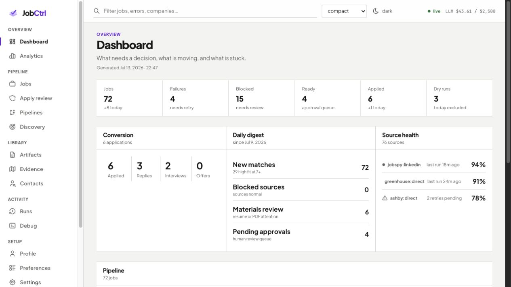
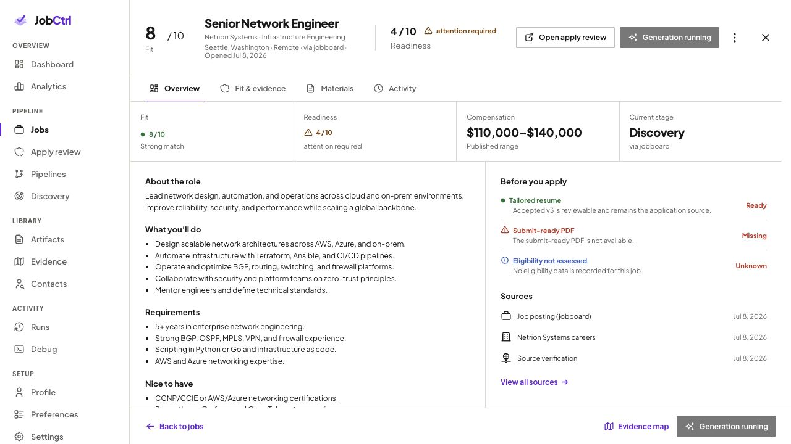
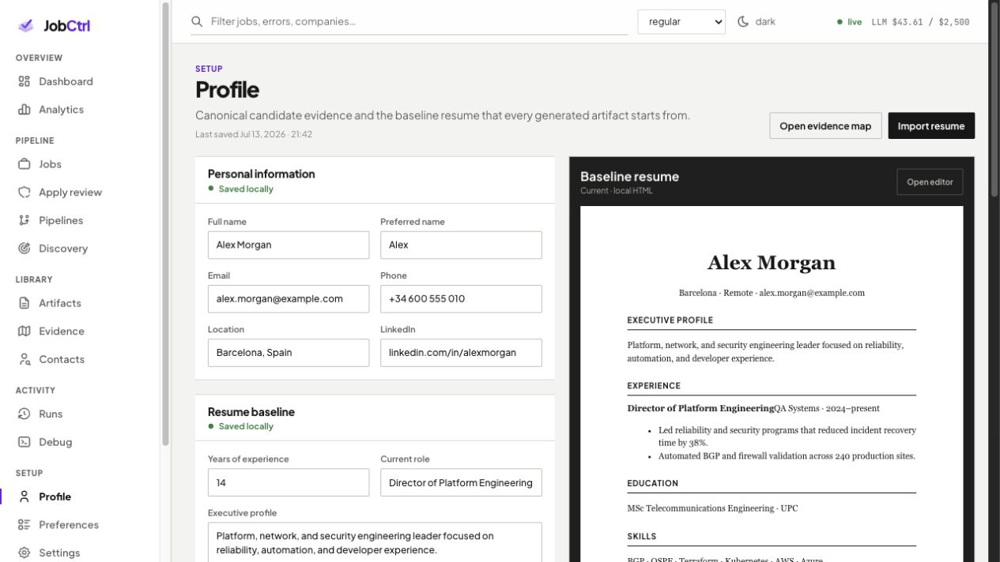
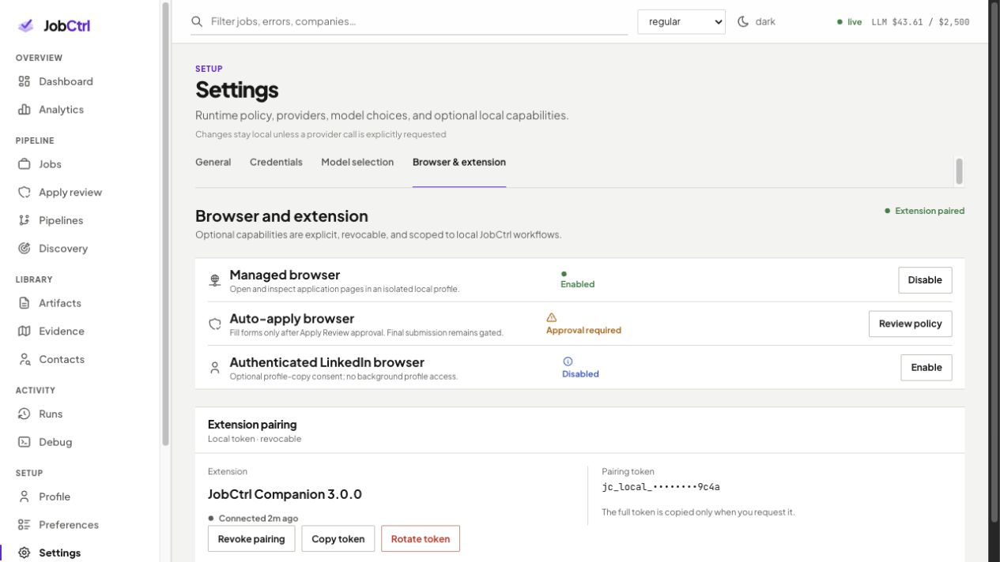
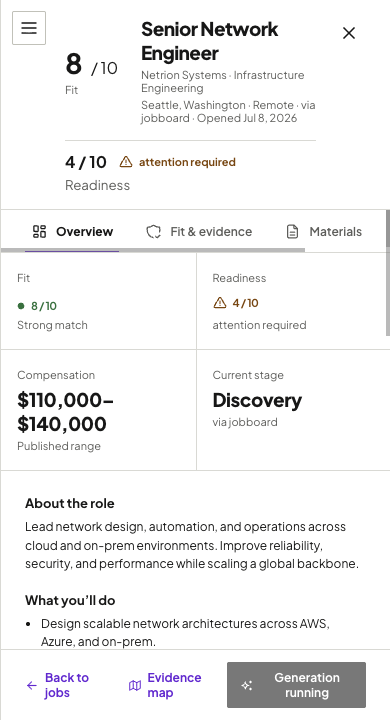
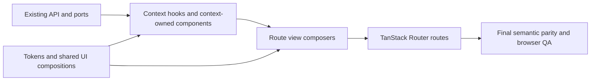

# End-to-End Product Redesign

- **Status:** Active — implementation assembled in the open redesign stack; canonical documentation and cumulative Tier 3 QA are in progress.
- **Date:** 2026-07-14
- **Owner ask:** turn the approved full-application prototype and browser annotations into the production JobCtrl UI without losing any existing data, controls, states, or audit evidence.
- **Predecessor:** [2026-07-08 Web UI/UX Revamp](implemented/2026-07-08-web-ui-revamp-plan.md), delivered by #356.

### Delivery status — 2026-07-15

- The primitive migration is published as #453–#457, the Rhea redesign as
  #458, pipeline-operations delivery as #459–#462, and the cumulative cohesion
  layer as #463. These PRs are open and stacked; implementation-complete does
  not mean merged-to-`main`.
- The owner subsequently approved moving the primitive substrate from Radix to
  Base UI before the visual pass. The production system remains shadcn-style
  owned composition, but its accessible primitives are now Base UI rather than
  Radix. Canonical architecture and decision docs record that deviation.
- Browser annotations and manual review produced additional cumulative fixes
  for Apply Review, discovery/preferences layouts, status treatments,
  provider setup, and explicit browser adoption. These refinements belong to
  the final documentation/QA tip and must remain part of the parity gate.
- Canonical documentation is updated first. Full static, integration, browser,
  visual, accessibility, reviewer, and QA gates run only after that update is
  complete, matching the delivery sequence approved by the owner.

## 1. Outcome

Ship the redesign across every production route while preserving the current
TanStack/context architecture and every user-visible production capability.
The result must feel like one coherent operational product rather than a set of
independently styled forms, tables, cards, and drawers.

The approved prototype is a composition and interaction reference, not a new
data source. Production code, API contracts, tests, and current rendered
screens remain authoritative for what data and controls exist.

This plan adds one binding rule to the previous revamp:

> A visual migration is incomplete until every value, action, state, warning,
> source, audit record, and unavailable/empty/error state visible before the
> redesign is present and reachable afterward. It may move to a better surface,
> disclosure, tab, inspector, or detail route, but it may not disappear.

## 2. Design sources

The implementation uses these sources in priority order:

1. **Production behavior on `main`** for the complete capability and data
   contract.
2. **The annotated redesign prototype** for hierarchy, information density,
   responsive behavior, and interaction direction.
3. [`DESIGN.md`](../../DESIGN.md) and
   `apps/web/src/styles/{tokens,globals}.css` for brand, tokens, typography,
   spacing, status semantics, and component language.
4. The [frontend architecture](../architecture/frontend/index.md) for state,
   contexts, ports, routing, realtime invalidation, and test ownership.
5. The [requirements](../requirements.md), especially TR-018 through TR-021,
   TR-029, and TR-032, for product-path QA, accessibility, settings autosave,
   and accepted-artifact preservation.

Representative prototype frames are committed with this plan so the design
direction remains reviewable after the local prototype is gone:

| Surface | Reference |
| --- | --- |
| Dashboard composition |  |
| Route-level Job Detail workspace |  |
| Profile with the real resume editor |  |
| Settings composition |  |
| Mobile detail reflow |  |

The browser annotations add these explicit design requirements:

- replace raw/native-looking checkboxes with a consistent accessible choice
  control;
- replace visually plain selects with the shared production Select primitive;
- make long preference forms collapsible at meaningful section boundaries;
- use a small number of semantic tabs inside dense settings groups where they
  improve scanning;
- use adaptive layouts that consume available width instead of forcing every
  control to a full row or a rigid two-column grid;
- link setting groups to the documentation section that explains them;
- put resume-template controls in a compact full-width toolbar above a
  full-width real resume preview;
- preserve every field from the original production screen even when its new
  location changes.

## 3. Diagnosis and owning layer

### 3.1 Observed failure

The prototype exposed a structural problem that also exists in parts of the
current production UI: dense configuration data is rendered through generic
full-width fields, raw choice controls, rigid grids, and repeated framed
sections. Wide screens accumulate unused space while narrower widths compress
labels and controls. Resume-template controls compete horizontally with the
document they configure.

### 3.2 First-principles invariant

The Preferences user is changing policy, not filling out a one-off form. The
surface must therefore:

- keep every current value and constraint reachable;
- make the consequence and ownership of each setting legible;
- let the user scan one policy concern at a time;
- adapt to the width of the settings container, not only the viewport;
- preserve native keyboard/form semantics and TanStack Form validation;
- keep the real rendered resume as the final visual feedback surface;
- never disguise a missing, disabled, blocked, or unsupported state.

### 3.3 Five whys

1. **Why do controls look broken or unfinished?** Several screens compose raw
   browser controls and one-off class rules instead of the shared choice,
   select, field, disclosure, and tabs primitives.
2. **Why does the layout waste and compress space at the same time?** Fixed
   column templates and unconditional full-width fields ignore the component's
   actual container width and content shape.
3. **Why did that reach the user-facing screen?** View and context components
   own their own layout fragments without a small shared set of adaptive form
   and inspector compositions.
4. **Why is it especially visible in Preferences and resume editing?** Those
   screens combine many heterogeneous controls with a large fixed-format
   document, so generic card and grid rules amplify their mismatch.
5. **Why is a CSS-only patch insufficient?** The hierarchy is wrong: related
   settings need disclosures, tabs, help links, and a preview workbench. Those
   are component contracts, not spacing overrides.

**Fix-layer decision:** preserve all existing context hooks, mutations, ports,
queries, form schemas, and route state. Add or strengthen shared UI composition
primitives, then recompose views and context-owned forms around them. No API or
domain-model changes are planned.

## 4. Non-goals

- No backend, schema, API, Temporal, SSE, or domain-event changes.
- No route removal or route renaming.
- No replacement of TanStack Query, Router, Form, Zustand, or the owned shadcn
  component layer. The later owner-approved Radix-to-Base-UI migration changes
  the primitive substrate without changing those state or ownership boundaries.
- No change to application safety, approval, credential, or privacy policy.
- No invented data to make a screen look full.
- No replacement of the production Plate resume editor or PDF viewer.
- No eager resume regeneration when a template preference changes; TR-032 and
  accepted-artifact preservation remain binding.
- No decorative card proliferation, colored status decoration, or broad
  rounded rectangles.

## 5. Design-system contract

The redesign extends the current JobCtrl system instead of creating a second
one.

### 5.1 Foundations that remain

- Geist Variable for product text and JetBrains Mono Variable for IDs, paths,
  logs, and payloads. This supersedes the prototype's Plus Jakarta typography
  after the owner-approved Rhea preset selection.
- Existing semantic color tokens in `tokens.css`; violet is interaction/brand,
  while green, amber, blue, and red remain status-only.
- 4px base rhythm with 8/12/16/24/32px primary steps; the 10px Rhea base
  radius maps to 6–10px controls, 14–18px callouts, and cards capped at 24px.
  Density rows remain stable at 32/40/48px.
- Persistent rail, slim top bar, light/dark themes, three density modes, and
  the current mobile navigation contract.
- Tabler icons only for product controls.

### 5.2 Shared compositions to add or standardize

| Primitive/composition | Purpose | Accessibility contract |
| --- | --- | --- |
| `DisclosureSection` | Full-width page section with title, summary facts, help/action slot, and collapsible body | Owned Base UI Collapsible wrapper or native `details/summary`; visible focus; `aria-expanded`; content remains in DOM when appropriate for form state |
| `AdaptiveFieldGrid` | Container-aware form layout using `repeat(auto-fit, minmax())` and named wide spans | One column at narrow width; no clipped labels; source order stays reading order |
| `ChoiceControl` | Checkbox/radio row with custom visual, label, hint, disabled reason, and optional locked state | Real input remains focusable/announced; 24px minimum target, larger on coarse pointers; non-color checked and disabled states |
| `SelectField` | Shared shadcn Rhea/Base Select trigger, popup, label, hint, and error treatment | Full keyboard navigation, associated label, visible selected value, no custom div-only listbox |
| `SegmentedField` | Two-to-four mutually exclusive compact choices | Radio semantics or existing ToggleGroup semantics; arrow/Tab behavior matches the chosen primitive |
| `SectionTabs` | A small semantic tab set within one complex surface | Owned Base UI Tabs wrapper; arrow-key navigation; active panel labelled by its trigger |
| `HelpLink` | Contextual deep link to the owning documentation section | Descriptive accessible name; external-link indicator; never icon-only without a tooltip |
| `InspectorLedger` | Dense label/value/source/status rows without nested cards | Definition-list/table semantics; missing values explicit |
| `PreviewWorkbench` | Compact control deck above a full-width editor/PDF/HTML preview | Toolbar groups labelled; document region named; independent overflow; actions remain reachable on mobile |
| `RouteWorkspace` | Full route-level detail area with header, ledger, tabs, content split, and close/back action | One `h1`; landmark/region labels; URL-backed selected tab where currently bookmarkable |

No primitive may own server data, query keys, mutations, or cross-context state.
Shared UI remains presentational; context components keep behavior ownership.

## 6. Preferences redesign specification

Preferences is the reference implementation for dense product configuration.

### 6.1 Page structure

1. `PageHead` with the current title/subtitle and autosave/undo state.
2. A compact sticky save-state bar only while dirty, saving, failed, or undoable.
3. Four `DisclosureSection`s:
   - Application configuration
   - Tailoring controls
   - Resume style
   - Resume templates
4. The user's last open/closed state is client-only UI state. It does not alter
   the profile or settings payload.

### 6.2 Application configuration

Use `AdaptiveFieldGrid` with automatic columns. Preserve exactly:

- legally authorized to work;
- requires sponsorship;
- work permit type;
- job-site login password;
- earliest start date;
- available full-time;
- available for contract;
- salary expectation;
- salary currency;
- salary range minimum;
- salary range maximum;
- currency note.

Short enumerations use `SegmentedField` where space permits; password, date,
text, and numeric fields keep their current input types and validation.

### 6.3 Tailoring controls

The section body uses three semantic tabs rather than one rigid matrix:

| Tab | Existing settings preserved | Documentation |
| --- | --- | --- |
| **Content rules** | Enable profile enhancement; rewrite executive summary; rewrite achievement bullets; select/order existing skills; disabled change-experience-titles control and reason; required Impact, Technical depth, and Leadership bullet standards | [Tailoring inputs](https://jobctrl.dev/architecture/tailoring#inputs-to-tailoring) |
| **Voice & language** | Writing tone (Direct, Executive, Technical, Confident, Warm); verbosity (Concise, Balanced, Detailed); keyword emphasis (Natural, Moderate, High); avoid first-person language | [Tailoring inputs](https://jobctrl.dev/architecture/tailoring#inputs-to-tailoring) |
| **Quality gates** | Minimum fit score; must-have coverage; revision attempts; additional guidance | [Post-generation fit gate](https://jobctrl.dev/architecture/tailoring#6-post-generation-fit-gate) |

Tabs change presentation only. Every field remains mounted through the owning
TanStack Form or preserves its value when its panel is not active. Bullet
standards remain visibly locked/required rather than looking accidentally
disabled.

### 6.4 Resume style

Use an adaptive property grid: four columns when the container can support
them, two at medium width, and one on mobile. Controls use intrinsic minimums,
not unconditional full-width rows.

Preserve exactly:

- text size: Small / Regular / Large;
- text font: Sans / Serif;
- body alignment: Justified / Left aligned;
- template style: Banking / Classic / Casual / Oldstyle / Fancy;
- accent color: Black / Blue / Burgundy / Green / Grey / Orange / Purple / Red;
- paper: A4 / Letter;
- page scale: 0.70–1.00;
- date column width: 1.5–5.0 cm.

Two- and three-option values use segmented controls. Larger option sets use the
shared Select. Numeric values retain their bounds and step sizes.

### 6.5 Resume templates

Replace the horizontal control/sidebar split with `PreviewWorkbench`:

1. full-width compact toolbar above the document;
2. primary row: Template, Name, Default state, Save version, Save default, Set
   default;
3. appearance row: Font, Density, Header, Headings, Alignment, Bullets;
4. collapsible Advanced row: Font scale, Accent, Top margin, Side margin;
5. full-width production `ResumeStandalonePlateEditor` below the toolbar;
6. the editor's own formatting toolbar remains intact and wraps compactly;
7. every template selection loads its complete production theme fixture/state,
   not a partial name-only change.

## 7. Production surface parity matrix

This matrix is the minimum content contract. Implementation PRs must refine it
into route/component tests that assert roles, labels, and visible states from
production-shaped fixtures.

| Surface | Data and controls that must survive | Target composition |
| --- | --- | --- |
| **Global shell** | 14 labelled destinations; grouped rail; global search; density; theme; connection state; local-mode/privacy notice; demo notices/guide/receipts; runtime/spend facts where supplied | Persistent rail + slim topbar; mobile sheet; no duplicated navigation |
| **Dashboard** | KPI values; funnel; digest; work status; source health; active workflow runs; apply runs; conversion/outcome facts; recent activity; all loading/empty/error states and links | Operational ledger + continuous panels; no isolated KPI-card soup |
| **Analytics** | Date/window filters; dimension selection; outcome rates; counts; confidence/sample warnings; group rows; totals; empty/loading/error states | Compact controls above one comparative table/visual work area |
| **Jobs list** | Query, stage, state, apply status, deleted scope, sort, direction, page, page size, saved views, selection, bulk actions, all current columns/cell badges, totals, empty/error/loading | Shared data grid with stable tool row and URL-backed state |
| **Job Detail** | Identity, employer/location/source/timestamps, stage/score/apply/material states, compensation, description, prerequisites, score breakdown/reasoning, requirement evidence, source/provenance, employer analysis, audit triage, materials, actions, stage timeline, related run links, accepted-artifact history, warnings/blockers | Full route workspace with header ledger, tabs, balanced split, audit/action adjacency |
| **Job run timeline** | Run identity, status, stage events, timestamps, errors, retries, and job relationship | Route workspace/timeline; never a detached generic fallback |
| **Apply Review** | Queue and URL-selected job; compensation; score and score basis; ideal candidate; per-requirement job/profile evidence; tailoring directives and coverage; accepted/current artifacts; grounding, fabrication, warning, revision, and persona/judge audit; comparison; resume editor/comments; cover letter; email; approval binding; dry-run evidence; approve/defer/decline/stop/reset actions; explicit blockers | Queue + review workspace; evidence, artifact, and approval facts remain adjacent; accepted artifact never hidden by retry |
| **Pipelines** | Pipeline/stage status, controls, progress, concurrency/worker facts, diagnostics, retry/stop actions, current and historical outcome states | Dense stage ledger with expandable diagnostics |
| **Discovery** | Target-search preferences, sources, source health, schedules, runtime/automation controls, crawl policy, manual capture, diagnostics, actions, loading/error states | Target/source/runtime sections with shared disclosures and status ledgers |
| **Artifacts list** | Search/filter/sort/page state; type/version/status/job/company/created/path/size facts currently rendered; open and related-job actions; empty/loading/error | Shared data grid |
| **Artifact Detail** | Status, artifact ID, job, local path, size, created time, provenance, preview/open behavior, full tailoring explanation, annotations, keyword/evidence coverage, bullet provenance, safety, warning lifecycle, judge/persona prompt and response, generation models, comparison and coverage delta, explicit unavailable preview | Route workspace with audit inspector and real resume/PDF/text preview |
| **Evidence Map** | Search/filter state; evidence entries; canonical story; source pin; skills; freshness; requirement and artifact uses; linked artifacts/jobs; evidence gaps; empty/loading/error | Master-detail workspace with source ledger |
| **Contacts** | Search/filter state; contacts, employer, role, relationship, follow-up state; import/create controls; due follow-ups; research tasks and provenance; detail thread; draft generations/revisions/approval/rejection; user-attested send log; scheduling/dismissal; empty/loading/error | List + route detail workspace; supervision boundary remains explicit |
| **Runs** | Filters/page state; workflow/run identity, type, status, start/update/end, progress, errors; cancel and related-record actions; full timeline/detail | Data grid + route detail workspace |
| **Debug / Activity** | Query/level/stage/event type/sort/page filters; time, event, level, stage, job/run references, payload/audit data, direct detail and job handoff | Data grid + evidence drawer/workspace |
| **Profile** | Every personal/contact/address field; work authorization and attestations owned there; executive baseline; experience, dates, bullets, education, skills, verified metrics, search targets, EEO data, evidence/source pins, add/remove/reorder controls, save/discard/import actions, real editable resume preview | Structured editor + full-height preview workbench; adaptive sections and resizer |
| **Resume import** | Upload source, include/exclude choices, parse/preview diagnostics, conflicts, backup/version facts, confirm/cancel/back actions, progress/error/success | Three-step route-backed wizard using existing store and mutations |
| **Preferences** | Exact field inventory in §6 plus autosave/undo/save/discard and template version/default actions | Disclosures + semantic tabs + adaptive property grids + full-width preview |
| **Settings — General** | Current settings fields, apply runtime controls, scoring guidance, compensation source policy, effective/default/override/source facts, validation, autosave/undo/reset | Settings tabs + context-owned disclosure panels |
| **Settings — Credentials** | Provider states, supported auth modes, secret-presence metadata, add/update/delete/verify actions, readiness/errors, local secret-boundary copy | Provider ledger and focused setup forms; no secret values displayed |
| **Settings — Models** | Provider/model catalogs, generator/judge selections, analysis legs, ready/unready/invalid states, execution policy and cost/concurrency controls | Model matrix + policy inspector |
| **Settings — Browser** | Browser capabilities, paired/unpaired/expired states, create/revoke/rotate actions, extension pairing instructions/token metadata, capability restrictions and reasons | Capability ledger + pairing workbench |

### 7.1 Parity enforcement

Add a production test manifest keyed by route/surface. Each entry records the
labels, roles, status discriminants, and fixture values that proved the old
surface. During migration:

1. render the pre-redesign component against the canonical fixture and capture
   its manifest;
2. render the redesigned component against the same fixture;
3. require every old manifest entry to appear in the new surface or in a
   documented, keyboard-reachable tab/disclosure/detail route;
4. add new entries for newly explicit states, never delete old entries to make
   parity pass;
5. keep the existing stage/event parity tests non-negotiable.

This is a semantic parity gate, not a brittle DOM snapshot. Layout may change;
data and behavior may not disappear.

## 8. Architecture and ownership



- **Routes** continue to own typed path/search state and loader prefetching.
- **Views** compose; they do not gain direct API, query-client, or mutation
  calls.
- **Contexts** keep query/mutation/form ownership. A redesign may split a large
  context component into smaller context-owned components without crossing
  context boundaries.
- **Shared UI/layout** owns visual primitives and compositions only.
- **Operations** remains the read-side and invalidation exception described by
  the frontend architecture.
- **Ports** remain the only path to browser, clipboard, storage, event stream,
  and OS behavior.

### 8.1 Pipeline operations visibility adaptation

The redesign stack also absorbs the accepted semantic contract from
[#439](https://github.com/ebarti/JobCtrl/pull/439) before documentation and
final QA. Its domain invariant remains unchanged: Pipelines must distinguish
source-family progress, the current execution's preparation drain, older
backlog competing for capacity, shared Temporal activity capacity, telemetry
freshness, and a calibrated ETA state. A source workflow that has finished
while required job preparation is still active is **draining**, not complete.

The implementation is adapted to this redesign rather than reproducing the
plan's illustrative cards or table:

- `PipelinesView` remains a route composer and uses the shared `RouteWorkspace`
  composition instead of adding a page-specific dashboard shell.
- The workspace header owns the concise execution phase, current cohort
  counts, source progress, and overall ETA. It is the only polite live region.
- The main workspace content owns the operational-step ledger. Every step keeps
  separate current-execution and existing-backlog counts, processing state,
  capacity semantics, and typed ETA; visual simplification may not merge those
  facts.
- The inspector uses `InspectorLedger` for shared worker capacity, task-queue
  observations, freshness, and estimator basis. It uses neutral hierarchy and
  typography rather than a grid of colored rounded cards.
- `DisclosureSection` owns detailed active work and runtime diagnostics, so the
  default surface is concise without making evidence unreachable.
- Existing trigger controls remain in a compact `ToolRow`. **Workers** becomes
  **Internal concurrency**, with helper copy separating in-activity parallelism
  from Temporal worker slots.
- Loading, unsupported, stale, calibrating, paused, unavailable, and
  completed-with-issues remain explicit typed states. Unknown data is never
  rendered as zero and an exact finish timestamp is never fabricated.

The data path stays architectural: durable `DiscoveryExecutionRef` lineage and
step lifecycle originate in the Python orchestration layer; worker heartbeats
and Temporal task-queue sampling provide bounded privacy-safe runtime facts;
the TypeScript Operations read model exposes
`GET /v1/pipeline/operations`; an Operations hook and pipeline query key feed
the view. The legacy `preparation_work_items` queue and mutable latest source
observation remain non-authoritative for Temporal-native work.

## 9. Delivery stack

The implementation is a stacked sequence so each review has a coherent owner,
while the final QA gate runs only on the assembled stack tip.

### PR 0 — plan and visual contract

- This document and representative prototype frames.
- No production behavior change.

### PR 1 — shared foundation and shell

- Add/standardize the shared compositions from §5.2.
- Consolidate relevant global CSS into token-driven component rules.
- Preserve all existing primitive APIs unless a typed additive prop is needed.
- Recompose shell/page furniture without changing routes or state ownership.
- Add stories and tests while implementing; defer the full QA run.

### PR 2 — operational lists and dashboards

- Dashboard, Analytics, Jobs list, Pipelines, Discovery, Artifacts list,
  Contacts list, Runs, and Debug.
- Move each route onto the shared page head, tool row, data grid, section,
  status, and empty/error patterns.
- Preserve every URL search parameter and table action.

### PR 3 — route workspaces and audit surfaces

- Job Detail, Apply Review, Artifact Detail, Evidence Map, Contact Detail, Run
  Detail, Activity Detail, and job-run timeline.
- Replace modal-looking expanded details with route workspaces.
- Keep score, provenance, judge, warning, comparison, approval, and accepted
  artifact data fully inspectable.

### PR 4 — setup, forms, and document workbenches

- Profile, resume import, Preferences, and all Settings routes.
- Implement the Preferences specification in §6.
- Reuse the real Plate resume editor and PDF preview components.
- Add contextual documentation links.
- Preserve settings autosave/undo and profile save/discard/import behavior.

### PR 5 — pipeline lineage foundation

- Add the typed `DiscoveryExecutionRef` and thread it through discovery,
  enrichment, preparation fan-out, and per-job preparation inputs.
- Persist current-execution versus existing-backlog membership in an additive,
  indexed `discovery_execution_jobs` projection owned by Discovery.
- Make observed-this-run promotion transactional and idempotent; workflow ID
  reuse is disambiguated by the Temporal run ID.
- Record work-plan state and required steps so a missing or failed plan cannot
  be mistaken for no work.

### PR 6 — pipeline lifecycle and runtime telemetry

- Add typed queued/started/completed/failed events for orchestration substeps
  without canonical job-stage rows and fold them identically in Python and
  TypeScript projections.
- Add a bounded, allowlisted active-activity inventory and fresh per-process
  worker heartbeats.
- Aggregate exact shared activity slots and active counts across fresh worker
  processes; keep bounded display details separate from authoritative totals.
- Sample Temporal task-queue statistics with explicit unsupported,
  unavailable, and stale states. Never persist or export raw job URLs,
  descriptions, profiles, prompts, provider output, artifact paths, or secrets.

### PR 7 — pipeline operations read model and ETA

- Add the shared `PipelineOperationsSnapshot` contract, API client/port method,
  Operations read model, and `GET /v1/pipeline/operations`.
- Keep current-execution domain backlog, existing backlog, and approximate
  Temporal task counts separate in both type and unit.
- Derive source progress from planned families and show terminal reconciliation
  independently from the legacy crawl spine.
- Implement an auditable ETA union: available range, calibrating, paused,
  unavailable, or stale, always carrying basis, sample size, confidence, and
  observation time when applicable.

### PR 8 — redesigned pipeline operations workspace

- Add the Operations query hook, hierarchical query key, SSE invalidation, and
  polling freshness backstop.
- Recompose Pipelines with the workspace mapping in §8.1 while preserving all
  trigger actions, current error behavior, and operational facts.
- Rename **Workers** to **Internal concurrency** without changing the request or
  CLI contract.
- Author the original 3/6 regression fixture and the loading, discovering,
  draining, completed, issues, stale, calibrating, unavailable, and
  multi-worker stories; defer the full QA run.

### PR 9 — integrated cutover and documentation

- Rebase/merge the stack into one integration tip.
- Remove superseded CSS and unreachable compatibility markup only after parity
  proves it dead.
- Complete all redesign and pipeline-operations documentation, user
  screenshots, architecture/API references, product tour, and QA matrix on the
  assembled implementation.
- Only after this final documentation PR is complete, run the gate in §12 on
  its stack tip, fix findings there, and publish final evidence.

Implementation branches should be based on the preceding stack branch until
lower PRs merge. Each PR body must name its base and successor.

## 10. Implementation sequence inside each surface

1. Record the current visible data/control manifest from production-shaped
   fixtures.
2. Identify the owning view/context/shared layer.
3. Move composition only; do not change query, mutation, or domain semantics.
4. Replace ad-hoc controls with shared primitives while retaining names,
   validation, disabled reasons, and default values.
5. Preserve loading, empty, error, unavailable, blocked, residual-warning, and
   historical states.
6. Add the post-redesign manifest assertion and state stories.
7. Do not run route-by-route browser QA yet; assemble the full redesign first.

## 11. Documentation changes at cutover

This is the final PR in the stack. Product documentation is not updated
piecemeal on lower implementation branches.

- Regenerate the synthetic product screenshots and update
  `docs/user/product-tour.md`.
- Update `README.md` only if the visible product tour or behavior wording is no
  longer accurate.
- Update `docs/user/candidate-profile.md`,
  `docs/user/materials-and-tailoring.md`, and `docs/user/configuration.md` for
  relocated settings/help links, without duplicating concept ownership.
- Update `docs/local-reliability-qa.md` and the browser/frontend QA guides with
  the semantic parity manifest and complete-route sweep.
- Update `README.md`, `docs/user/normal-flows.md`, `docs/local-ts-api.md`,
  `docs/api/operations-and-events.md`, the owning pipeline/read-model/
  observability/frontend architecture pages, `docs/requirements.md`, and
  `docs/decisions.md` for the delivered pipeline-operations contract.
- Move this plan to `docs/plans/implemented/` only after the implementation
  stack and final QA gate are complete.

## 12. Final QA and review gate

Per the owner's instruction, full QA begins only after PRs 1–9 are assembled
on the integration tip **and** the final documentation and screenshot PR in
§11 is complete. Unit/component/type tests may be authored during
implementation, but the complete gate is intentionally deferred until the
whole redesign and its documentation can be evaluated as one system.

### 12.1 Static and component gates

```bash
corepack pnpm check
corepack pnpm test
corepack pnpm --filter @jobctrl/web test
corepack pnpm --filter @jobctrl/web test-d
corepack pnpm web:build
corepack pnpm web:storybook:build
corepack pnpm web:storybook:test
git diff --check
```

### 12.2 Browser and product-path gate

- Run every existing web E2E spec, including token foundation, route visual QA,
  settings, profile edit/import, jobs drawer, Apply Review, materials, artifact
  comparison, outreach, runs, analytics, discovery, and mobile connection.
- Use an isolated synthetic JobCtrl directory and stubbed worker/LLM paths; do
  not submit an application, use real credentials, spend against a live model,
  or mutate a real profile/database.
- Walk every production route in light/dark and compact/regular/comfy density.
- Verify 1440px, 1280px, collapsed-rail, and 390×844 layouts.
- Verify keyboard navigation, focus visibility, disclosures, tabs, select
  popovers, dialog/drawer focus management, and mobile navigation.
- Compare the final implementation to the approved prototype frames at the
  same route, state, and viewport.
- Verify the semantic parity manifest for every surface in §7.
- Confirm browser console errors/warnings are empty for the route sweep.

### 12.3 Human-gate loops

- `pr-reviewer` must return `Gate: PASS` with no Blocker or High findings.
- `qa` must return `Gate: PASS` with no Blocker or High findings.
- Medium/Low findings are fixed or listed explicitly in the final PR body.

## 13. Risks and mitigations

| Risk | Mitigation |
| --- | --- |
| Data or controls disappear during visual simplification | Semantic pre/post parity manifest; same production-shaped fixtures; owner rule in §1 |
| Large `globals.css` edits cause cross-route regressions | Shared compositions first; remove old rules only after adoption; final all-route/theme/density sweep |
| Settings form state resets when tabs/disclosures change | Keep TanStack Form as owner; panels preserve mounted state or use controlled values; add tab/disclosure persistence tests |
| Custom controls reduce accessibility | Owned shadcn Rhea/Base UI wrappers; real inputs; Storybook a11y plus final keyboard/axe gate |
| New layout violates context boundaries | Views compose; contexts own behavior; architecture review per PR |
| Resume template change hides accepted material | Preserve TR-032; lazy ensure-current behavior; accepted artifact remains visible until replacement approval |
| Prototype fixtures drift from production | Production code and canonical MSW/demo fixtures are the parity authority; prototype only directs composition |
| Stacked PRs drift while other work lands | Rebase each branch before review and again before integration; explicitly name stack bases |
| Delayed QA permits compounded visual defects | Keep changes phase-owned and test-authored; run one exhaustive gate immediately after assembly before publication is called complete |

## 14. Definition of done

The redesign is done only when:

- every production route in §7 uses the unified system;
- every pre-redesign visible field, value, action, and state remains reachable;
- the Preferences annotations in §6 are implemented;
- the real resume and PDF components are used everywhere they own the preview;
- no API/domain/state architecture boundary changed without a separate approved
  decision;
- all final static, component, E2E, visual, accessibility, reviewer, and QA
  gates pass;
- Pipelines distinguishes source crawl, current preparation drain, existing
  backlog, shared worker capacity, telemetry freshness, and honest ETA states;
- screenshots and owning documentation are current;
- plan and implementation PRs are published with exact validation evidence and
  no unresolved Blocker/High finding.
