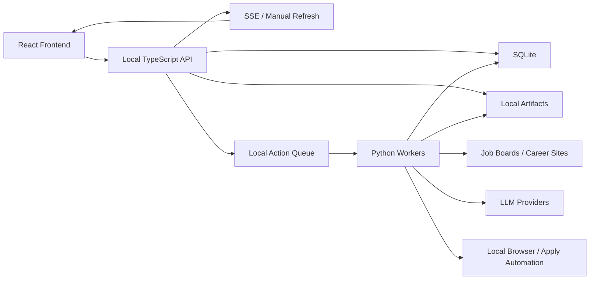

# TypeScript Product API + Python Workers Architecture Plan

## Purpose

This document describes the near-term architecture for validating JobHunter
locally before SaaS hardening.

The immediate goal is to make the automation reliable:

- every job has clear per-stage state,
- failed stages can be retried without rerunning the whole pipeline,
- the UI can trigger real actions instead of only showing copyable commands,
- generated artifacts are visible and easy to inspect locally,
- profile and resume-style configuration remain usable from the UI,
- the Python automation code keeps doing the work it already does.

Production-only work has been moved to `../../BACKLOG.md`. That includes
tenancy, auth, billing, hosted deployment, Postgres migration, object storage,
secret vaulting, audit logs, retention policy, and hosted apply hardening.

## Delivered Local Slice

The local-first architecture slice is implemented for the current TypeScript API
and React shell:

- the TypeScript API exposes structured local job action endpoints for retry,
  material generation, dry-run apply, cancel, mark-applied, and mark-skipped;
- profile, resume style, and LaTeX template writes persist through the
  TypeScript API with JSON validation;
- resume PDF import is routed through an explicit local action/import interface
  and returns an unsaved draft to the UI;
- artifact opening goes through a TypeScript API action that only opens
  DB-backed or legacy-known artifact paths that still exist locally;
- the React shell uses the typed client for job actions, artifact open, and
  profile save/discard/import controls.

Hosted/SaaS concerns remain deferred to `../../BACKLOG.md`.

## Executive Recommendation

Use a TypeScript product API for local product/UI concerns and keep Python for
automation work.

Recommended local-first stack:

- Frontend: React with Vite, TanStack Router, and TanStack Query.
- Product API: TypeScript with Fastify and Zod or TypeBox validation.
- Contracts: OpenAPI or schema-first DTOs shared by frontend and API.
- Workers: Python modules wrapping the current discovery, enrichment, scoring,
  tailoring, PDF, apply, and resume-import code.
- Database: keep local SQLite for the first validation loop.
- Artifacts: keep local files, but register them in a normalized artifact table.
- Realtime: Server-Sent Events from the local API, or explicit manual refresh
  where SSE is not implemented yet.

Fastify is the pragmatic default for this stage because the local product API
needs clear routing and validation without pulling in SaaS-scale framework
structure. If the product later needs larger auth, billing, admin, and tenant
modules, the future SaaS architecture can revisit NestJS.

## Local Validation Scope

In scope now:

- split generated dashboard HTML from the API,
- build a real frontend app,
- build a local TypeScript API,
- keep SQLite as the local persistence layer,
- make `job_stage_states` the operational source of truth,
- expose structured UI actions for retry/generate/apply,
- keep local artifact paths but record artifact metadata,
- make worker runs observable,
- stabilize dry-run behavior,
- stabilize targeted apply behavior,
- add tests around state transitions and UI actions.

Out of scope now:

- multi-tenant product model,
- hosted authentication and authorization,
- subscription billing,
- hosted deployment,
- Postgres migration,
- object storage,
- encrypted secret vault,
- formal audit log,
- production retention policy,
- hosted browser isolation.

See `../../BACKLOG.md` for those deferred items.

## Current Architecture Review

### P0: The Current Dashboard Server Owns Too Many Responsibilities

`src/jobhunter/dashboard_server.py` currently acts as router, controller,
static server, local API, profile editor, PDF import endpoint, command runner,
and local artifact opener.

Current endpoints include:

- `GET /`
- `GET /api/health`
- `GET /api/dashboard`
- `GET /api/jobs`
- `GET /api/artifacts`
- `GET /api/job`
- `GET /api/profile-config`
- `PATCH /api/config`
- `PATCH /api/profile-config`
- `POST /api/profile-import`
- `POST /api/retry`
- `POST /api/command`
- `POST /api/open-artifact`
- `DELETE /api/jobs`

Local implication:

This should be split into a real API service and a frontend app. The API can
remain local-only, but it should expose structured actions instead of mixing
HTML serving, command execution, state mutation, and file opening in one request
handler.

### P0: Per-Job State Is Still Not Clean Enough

`src/jobhunter/database.py` stores a wide `jobs` table keyed by URL. That row
contains fields for discovery, enrichment, scoring, tailoring, cover letter,
PDF, and apply.

The newer state model adds:

- `job_stage_states`
- `job_events`
- `job_artifacts`

`src/jobhunter/state.py` still derives state from legacy nullable columns and
merges that with explicit state rows.

Local implication:

For local validation, `job_stage_states` should become the operational source
of truth. Legacy fields can stay for compatibility, but retries, next actions,
dashboard counts, and UI state should come from normalized stage state.

### P1: Pipeline Execution Is Still Too Coupled To One Process

`src/jobhunter/pipeline.py` orchestrates stages in-process. It has stage
helpers, a streaming mode, and a single-job mode, but the execution model is
still local process orchestration with DB polling and threads.

Local implication:

Do not build hosted workflow infrastructure yet. Instead, introduce an explicit
local command/run model:

- API records a requested action,
- Python worker code claims or executes the action,
- stage state updates are recorded consistently,
- the UI reads state and events,
- retries target one stage at a time.

This gives the project workflow discipline without committing to production
workflow infrastructure before the local automation works.

### P1: The Frontend Is Generated HTML And JavaScript

`src/jobhunter/view.py` generates CSS, JavaScript, and HTML as Python strings.
The frontend currently owns dashboard rendering, jobs, artifacts, profile
editing, job drawer behavior, retry actions, delete actions, and dashboard
polling.

Local implication:

Move this into a real React frontend. The local API should serve JSON only.
The UI should use typed API calls and should preserve filters, pagination, and
selection state while updates arrive.

### P1: Product Actions Are Still Command Strings

The dashboard still exposes copyable commands and some direct command execution.

Local implication:

Copyable commands are useful and should stay, but UI buttons should call
structured endpoints:

- retry this stage,
- generate materials,
- apply to this job,
- cancel this run,
- delete selected jobs,
- import profile from resume,
- preview resume.

The API should translate actions into local worker commands. The frontend
should not need to know shell syntax.

### P1: Artifacts Need Metadata Even If They Stay Local

Generated resumes, cover letters, PDFs, LaTeX files, reports, logs, and upload
copies are currently represented primarily as filesystem paths.

Local implication:

Keep local files for now, but make artifact records first-class. The UI should
load artifact metadata from the database and open local files through an API
action only when the path is known to JobHunter.

## Target Local System Boundaries

### TypeScript Product API Owns

- local HTTP routing,
- DTO validation,
- dashboard read models,
- job list/detail APIs,
- global filtering and sorting,
- pagination,
- profile and resume-style APIs,
- local artifact metadata APIs,
- structured action endpoints,
- worker run visibility,
- SSE event stream where practical.

### Python Workers Own

- job discovery,
- job-detail enrichment,
- LLM scoring,
- resume tailoring,
- cover-letter generation,
- PDF generation,
- resume PDF import/extraction,
- apply automation,
- provider-specific browser or scraping behavior.

### Frontend Owns

- dashboard UX,
- jobs list UX,
- artifacts list UX,
- job drawer UX,
- profile editor UX,
- resume style editor UX,
- action buttons,
- filter/sort/pagination state,
- local artifact open/preview controls,
- realtime or manual refresh behavior.

### SQLite Owns

- local jobs,
- local stage state,
- local events,
- local artifacts,
- local worker/action runs,
- local dashboard settings.

## Proposed Local Monorepo Layout

```text
apps/
  web/
    src/
      components/
      features/
      routes/
      api-client/
      styles/

services/
  api/
    src/
      modules/
        dashboard/
        jobs/
        stages/
        actions/
        profiles/
        artifacts/
        events/
        settings/
      main.ts

packages/
  contracts/
    schemas/
    generated/

src/
  jobhunter/
    discovery/
    enrichment/
    scoring/
    apply/
```

The current Python package can stay where it is initially. The important split
is behavioral: TypeScript owns the product API and frontend contract; Python
owns automation execution.

## TypeScript API Decision

Use Fastify for the local product API.

Reasons:

- small surface area,
- fast local startup,
- clear route registration,
- good JSON performance,
- easy schema validation,
- easy OpenAPI generation,
- no large framework structure before the product shape stabilizes.

Use Zod or TypeBox for DTO validation. Pick one and generate frontend client
types from the same schemas.

Recommended local modules:

- `dashboard`
- `jobs`
- `stages`
- `actions`
- `profiles`
- `artifacts`
- `events`
- `settings`

Do not build auth, tenants, billing, admin, or hosted secrets modules in this
local validation pass.

## Frontend Decision

Use React with Vite.

Recommended libraries:

- TanStack Router for routes,
- TanStack Query for API state,
- React Hook Form for profile/style forms,
- Zod or generated schemas for validation,
- Playwright for end-to-end checks,
- Vitest for component and data-transform tests.

Core routes:

- `/dashboard`
- `/jobs`
- `/jobs/:jobKey`
- `/artifacts`
- `/profile`
- `/runs`

The job drawer can be route-backed so deep links keep working.

## Local Runtime Architecture



## Core Local API Contract

### Dashboard

```http
GET /v1/dashboard/summary
```

Returns:

- totals,
- funnel counts,
- stage failure counts,
- blocked counts,
- ready-to-apply queue count,
- recent activity,
- active worker/apply runs.

### Jobs

```http
GET    /v1/jobs
POST   /v1/jobs
GET    /v1/jobs/:jobKey
PATCH  /v1/jobs/:jobKey
DELETE /v1/jobs/:jobKey
POST   /v1/jobs/bulk-delete
```

List query parameters:

- `cursor` or `page`,
- `pageSize`,
- `sort`,
- `dir`,
- `q`,
- `stage`,
- `state`,
- `source`,
- `company`,
- `minFitScore`,
- `maxFitScore`.

Sorting should be handled by the API over the full matching set, not by sorting
only the currently displayed page.

### Job Actions

```http
POST /v1/jobs/:jobKey/actions/retry-stage
POST /v1/jobs/:jobKey/actions/generate-materials
POST /v1/jobs/:jobKey/actions/apply
POST /v1/jobs/:jobKey/actions/cancel
POST /v1/jobs/:jobKey/actions/mark-applied
POST /v1/jobs/:jobKey/actions/mark-skipped
```

Actions return:

- `runId`,
- accepted command payload,
- current stage state,
- optional event cursor.

### Artifacts

```http
GET  /v1/artifacts
GET  /v1/artifacts/:artifactId
POST /v1/artifacts/:artifactId/open
```

Artifact rows should expose:

- `artifactId`,
- `jobKey`,
- `stage`,
- `type`,
- `status`,
- `localPath`,
- `sizeBytes`,
- `createdAt`,
- `createdByRunId`.

### Profile

```http
GET   /v1/profile
PATCH /v1/profile
POST  /v1/profile/import-resume
POST  /v1/profile/preview
POST  /v1/profile/style/preview
```

Profile writes should preserve the existing local `profile.json` and
`resume_style.json` behavior until the local editor is stable.

### Runs And Events

```http
GET /v1/runs
GET /v1/runs/:runId
GET /v1/jobs/:jobKey/events
GET /v1/events/stream
```

The event stream is local convenience, not hosted realtime infrastructure.

## Local Data Model

Keep SQLite for now. Normalize only what is needed to make local automation
reliable.

### Jobs

Keep the existing `jobs` table initially.

Near-term improvements:

- avoid mutating primary job identity during enrichment,
- define a canonical `jobKey` used by the API,
- keep original URL and application URL separate,
- make stage state read paths prefer `job_stage_states`.

### Stage State

`job_stage_states` should become the source used by the dashboard and actions.

Required fields:

```text
job_key
stage
state
attempt_count
max_attempts
started_at
updated_at
finished_at
duration_ms
error_code
error_message
retryable
blocked_by_json
next_action
metadata_json
```

Canonical stages:

```text
discover
enrich
score
tailor
cover
pdf
apply
```

Canonical states:

```text
pending
queued
running
succeeded
failed
blocked
skipped
exhausted
canceled
stale
```

### Events

Use `job_events` as an append-only local history:

```text
id
job_key
run_id
stage
event_type
severity
message
payload_json
occurred_at
```

### Runs

Add or normalize local run records:

```text
run_id
job_key
action
stage
status
requested_at
started_at
finished_at
error_code
error_message
metadata_json
```

The exact table can evolve from current `apply_runs` and existing event tables,
but the UI needs a unified way to show current and recent work.

### Artifacts

Keep local files, but record metadata:

```text
artifact_id
job_key
stage
artifact_type
local_path
status
size_bytes
created_by_run_id
created_at
updated_at
```

Artifact types:

- `base_resume_pdf`
- `base_resume_text`
- `tailored_resume_text`
- `tailored_resume_pdf`
- `cover_letter_text`
- `cover_letter_pdf`
- `resume_template`
- `tailoring_report`
- `apply_log`
- `profile_import_source_pdf`
- `profile_import_extraction`

## Local Workflow Design

### Job Workflow

Each job should progress through:

```text
discover -> enrich -> score -> tailor -> cover -> pdf -> apply
```

The local workflow should:

- evaluate prerequisites before each stage,
- mark blocked states explicitly,
- retry retryable failures,
- stop on exhausted failures,
- emit events after every transition,
- record artifact metadata for generated files,
- support manual retry from any failed or exhausted stage,
- support canceling queued or running local actions where practical.

### Batch Workflow

A local batch run should:

- discover jobs from configured sources,
- create or update job rows,
- create stage state rows,
- process each stage without requiring a whole-pipeline rerun,
- record aggregate progress,
- expose batch status to the UI.

### Apply Workflow

Local apply automation should:

- support dry run without marking jobs applied,
- show exact failure and next action,
- record run output in local logs/artifacts,
- allow retrying a single job,
- avoid blocking forever on a silent child process,
- make target URL apply work for fresh jobs.

Hosted apply concerns are tracked in `../../BACKLOG.md`.

## Python Worker Contract

Python workers should accept explicit local action payloads and return explicit
results. They do not need hosted service contracts yet.

Example action input:

```json
{
  "runId": "run_...",
  "jobKey": "https://example.com/job",
  "stage": "tailor",
  "profilePath": "~/.jobhunter/profile.json",
  "options": {
    "minFitScore": 7,
    "dryRun": false,
    "model": "default"
  }
}
```

Example action result:

```json
{
  "status": "succeeded",
  "stage": "tailor",
  "artifacts": [
    {
      "type": "tailored_resume_pdf",
      "localPath": "~/.jobhunter/tailored_resumes/example.pdf",
      "sizeBytes": 190700
    }
  ],
  "metrics": {
    "durationMs": 42000,
    "inputTokens": 1200,
    "outputTokens": 800
  },
  "warnings": []
}
```

Workers should update stage state through one shared helper path, not by each
stage inventing its own success/failure semantics.

## Local Realtime Model

Use SSE when practical.

Event types:

- `job.created`
- `job.updated`
- `job.deleted`
- `job.stage.queued`
- `job.stage.started`
- `job.stage.succeeded`
- `job.stage.failed`
- `job.stage.blocked`
- `job.stage.exhausted`
- `artifact.created`
- `artifact.updated`
- `run.started`
- `run.updated`
- `run.finished`
- `profile.updated`

Frontend behavior:

- lists should not reload wholesale on a timer,
- filters and sort state should remain stable,
- incoming events should patch visible rows,
- counts should update without resetting user selection,
- manual refresh should remain available.

## Migration Plan

### Phase 0: Freeze Current Local Behavior

Add contract snapshots for:

- dashboard summary,
- jobs list,
- job detail,
- artifacts list,
- profile config,
- profile import,
- retry,
- delete.

This protects the local product while replacing the server and UI.

### Phase 1: Define Local Contracts

Create `packages/contracts` with:

- route DTOs,
- event DTOs,
- generated TypeScript client,
- Python validation models where useful.

Do this before building the new API.

### Phase 2: Build Read-Only TypeScript API

Implement:

- dashboard summary,
- jobs list/detail,
- artifacts list/detail,
- profile read,
- settings read,
- health endpoint.

Read from the existing SQLite database first.

### Phase 3: Move Frontend To React

Port:

- dashboard,
- jobs list,
- artifacts list,
- job drawer,
- profile editor,
- style editor,
- profile import,
- action buttons.

Use the generated TypeScript API client.

### Phase 4: Make Stage State Canonical

Update local read and action paths so they use `job_stage_states` for:

- current stage,
- current state,
- blocked reason,
- failed reason,
- retryability,
- next action,
- stage counts.

Legacy columns can remain, but should stop driving UI truth.

### Phase 5: Wrap Python Stage Functions

Wrap existing Python stage modules behind local action entrypoints:

- discovery,
- enrichment,
- scoring,
- tailoring,
- cover letters,
- PDF generation,
- apply,
- profile import.

Each wrapper should:

- accept explicit input,
- record run start,
- update stage state,
- record artifacts,
- record events,
- return explicit success/failure.

### Phase 6: Replace Command Execution With Structured Actions

Replace UI command execution with API actions:

- retry stage,
- generate materials,
- apply,
- cancel,
- delete jobs,
- import profile.

Keep copyable CLI commands as secondary affordances.

### Phase 7: Local Reliability QA

Before moving toward SaaS hardening, verify:

- dry run never marks a job applied,
- apply timeout stops silent hangs,
- stages can retry individually,
- enrichment failures are not terminal by accident,
- PDFs are generated only from approved artifacts,
- cover letters do not silently fall back to the wrong resume,
- targeted apply includes fresh jobs,
- filters and selections survive live updates,
- generated artifacts open from the UI,
- local profile/style save and discard flows work.

The repeatable Phase 7 checklist lives in `docs/plans/implemented/2026-05-03-local-reliability-qa.md`.

## Test Strategy

### API Tests

- route validation,
- pagination,
- global sorting,
- filtering,
- profile read/write,
- artifact lookup/open,
- structured action dispatch,
- invalid action payloads.

### Contract Tests

- schema snapshots,
- generated client compatibility,
- legacy DTO parity while migrating from the Python dashboard server.

### Worker Tests

- action input validation,
- stage success path,
- stage failure path,
- retry behavior,
- timeout behavior,
- artifact output correctness,
- idempotent rerun where practical.

### Workflow Tests

- full local happy path,
- stage failure,
- retry one stage,
- exhausted stage,
- blocked stage,
- cancellation where supported,
- duplicate command handling.

### Frontend Tests

- dashboard render,
- jobs pagination,
- global sort,
- filters persist through events,
- job drawer deep link,
- artifact open,
- profile field save/discard,
- save all/discard all,
- profile import,
- workflow action buttons,
- realtime updates.

## Risks And Mitigations

### Risk: Big-Bang Rewrite

Mitigation: migrate in slices. Keep Python automation intact while replacing
the API and frontend around it.

### Risk: State Parity Bugs

Mitigation: freeze legacy outputs and compare new API DTOs against current
dashboard data during migration.

### Risk: Apply Automation Remains Fragile

Mitigation: isolate apply as its own worker action, enforce timeouts, preserve
logs locally, and make dry-run behavior testable.

### Risk: Unbounded Lists

Mitigation: implement API-backed pagination, indexed local queries where useful,
global sorting, and stable filter state in the UI.

### Risk: Custom LaTeX Breaks Local PDF Generation

Mitigation: keep template validation, surface PDF errors in stage state, and
store failed build logs as local artifacts.

## Open Local Decisions

1. Should the local API use Fastify with Zod or Fastify with TypeBox?
2. Should the first frontend route system be TanStack Router or plain React
   Router?
3. Should local job identity remain URL-based for the first pass, or should a
   local `job_key` abstraction be introduced immediately?
4. Should worker actions run inline from the API during the first slice, or via
   a local queue table from the beginning?
5. Should SSE be implemented immediately, or should manual refresh be used
   until action/state behavior is stable?

## Recommended First Implementation Slice

The first slice should not change automation behavior.

Build:

1. route and DTO schemas,
2. read-only TypeScript API over the existing SQLite database,
3. generated frontend API client,
4. React dashboard/jobs/artifacts/profile shell,
5. parity tests against the current dashboard server responses.

Only after read parity is verified should structured action endpoints start
replacing command execution.
