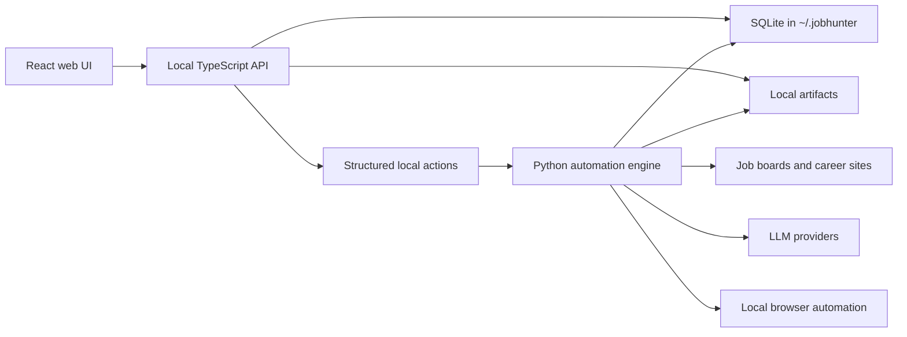

# Remove Python Dashboard Compatibility Implementation Plan

**Goal:** Remove the Python web dashboard compatibility layer so JobHunter has only the TypeScript API, TypeScript UI, and Python automation engine.

**Architecture:** The TypeScript API and React UI are the only local product surface. Python remains responsible for CLI automation, workers, state transitions, profile import, PDF generation, and apply execution. The removed layer is the Python HTTP dashboard server, generated/static dashboard HTML, its CLI command, and tests/docs that describe it as a supported surface.

**Tech Stack:** Python 3.11+ with Typer/Rich/Pytest/Ruff, TypeScript with Fastify/React/Vite/Vitest, SQLite local data.

---

## File Structure

- Delete `src/jobhunter/dashboard_server.py`: old Python HTTP dashboard server.
- Delete `src/jobhunter/view.py`: generated/static dashboard HTML and opener.
- Modify `src/jobhunter/cli.py`: remove the `dashboard` Typer command and remove dashboard from legacy command metadata.
- Modify `src/jobhunter/state.py`: remove dashboard-only payload/list/detail/delete helpers that are no longer used after the server/static UI deletion, while preserving canonical stage-state helpers used by the automation engine and tests.
- Modify `tests/test_state_dashboard.py`: rename/refocus tests around stage state instead of dashboard payload generation, and remove static dashboard assertions.
- Delete `tests/test_dashboard_server.py`: old Python dashboard server coverage.
- Modify docs: `README.md`, `docs/ARCHITECTURE.md`, `docs/BACKLOG.md`, `docs/DELIVERED.md`, `docs/plans/implemented/2026-05-02-local-ts-api.md`, and `docs/plans/implemented/2026-05-03-local-reliability-qa.md` to remove Python dashboard compatibility instructions and describe the three-component architecture.
- Move this plan from `docs/plans/proposed/` to `docs/plans/implemented/` once the change ships in the PR.

## Task 1: Remove CLI And Python Dashboard Modules

**Files:**
- Delete: `src/jobhunter/dashboard_server.py`
- Delete: `src/jobhunter/view.py`
- Modify: `src/jobhunter/cli.py`

- [ ] **Step 1: Delete the old modules**

Run:

```bash
git rm src/jobhunter/dashboard_server.py src/jobhunter/view.py
```

Expected: both paths are staged as deleted.

- [ ] **Step 2: Remove the Typer dashboard command**

In `src/jobhunter/cli.py`, delete the full `@app.command()` function named `dashboard`, including its options:

```python
@app.command()
def dashboard(
    host: str = typer.Option("127.0.0.1", "--host", help="Host/interface for the live dashboard server."),
    port: int = typer.Option(8765, "--port", "-p", help="Port for the live dashboard server."),
    no_open: bool = typer.Option(False, "--no-open", help="Do not open the browser automatically."),
    static: bool = typer.Option(False, "--static", help="Generate the old static HTML dashboard and exit."),
) -> None:
    """Open the live local dashboard backed by the SQLite API."""
    _bootstrap()

    if static:
        from jobhunter.view import open_dashboard

        open_dashboard()
        return

    from jobhunter.dashboard_server import serve_dashboard

    serve_dashboard(host=host, port=port, open_browser=not no_open)
```

- [ ] **Step 3: Remove dashboard from compatibility command lists**

In `src/jobhunter/config.py`, remove `"dashboard"` from the versioned CLI command map:

```python
1: ["init", "discover", "enrich", "run", "status"],
```

Expected: no supported CLI command metadata references the removed dashboard command.

- [ ] **Step 4: Verify imports no longer reference removed modules**

Run:

```bash
rg -n "dashboard_server|jobhunter\\.view|from jobhunter.view|serve_dashboard|open_dashboard|generate_dashboard|dashboard_html" src tests
```

Expected: no matches, except any tests that will be handled in later tasks before final verification.

## Task 2: Remove Dashboard-Only State Helpers And Refocus Tests

**Files:**
- Modify: `src/jobhunter/state.py`
- Modify: `tests/test_state_dashboard.py`
- Delete: `tests/test_dashboard_server.py`

- [ ] **Step 1: Delete old dashboard server tests**

Run:

```bash
git rm tests/test_dashboard_server.py
```

Expected: the removed Python HTTP dashboard server has no test file.

- [ ] **Step 2: Remove unused dashboard helper functions from state**

In `src/jobhunter/state.py`, remove functions only used by deleted dashboard UI/server tests:

```python
list_dashboard_jobs
list_dashboard_artifacts
build_dashboard_job_detail
delete_dashboard_jobs
build_dashboard_data
```

Also remove private helpers that become unused only because those functions are removed. Preserve these public helpers because they are used by automation/tests:

```python
derive_legacy_stage_states
ensure_job_stage_rows
get_job_stage_states
initialize_missing_state_rows
record_job_artifact
record_job_event
set_stage_state
reset_stage_for_retry
```

- [ ] **Step 3: Refocus tests on stage-state behavior**

In `tests/test_state_dashboard.py`:

- Remove imports of `build_dashboard_data` and `generate_dashboard`.
- Remove `test_dashboard_data_builds_triage_and_ready_queues`.
- Remove `test_generate_dashboard_embeds_payload`.
- Rename the file to `tests/test_state.py` only if the import/test names become clearer; otherwise keep the file to avoid unnecessary churn.
- In `test_explicit_stage_state_overrides_legacy_success`, replace dashboard payload assertions with direct `get_job_stage_states(conn, job)` assertions:

```python
states = get_job_stage_states(conn, job)
score = next(item for item in states if item["stage"] == "score")

assert score["state"] == "failed"
assert score["error_code"] == "LLM_ERROR"
assert score["error_message"] == "score failed"
```

- In `test_placeholder_stage_rows_are_upgraded_from_legacy_columns`, remove `data = build_dashboard_data(conn)` and replace that trigger with:

```python
updated = initialize_missing_state_rows(conn)
after = get_job_stage_states(conn, job)

assert updated == 0
```

Keep the existing assertions that score, tailor, and apply state are derived correctly.

- [ ] **Step 4: Run focused Python tests**

Run:

```bash
uv run pytest tests/test_state_dashboard.py tests/test_actions.py tests/test_profile_import.py -q
```

Expected: all selected tests pass.

## Task 3: Update Product Documentation To Three Components

**Files:**
- Modify: `README.md`
- Modify: `docs/ARCHITECTURE.md`
- Modify: `docs/BACKLOG.md`
- Modify: `docs/DELIVERED.md`
- Modify: `docs/plans/implemented/2026-05-02-local-ts-api.md`
- Modify: `docs/plans/implemented/2026-05-03-local-reliability-qa.md`
- Move: `docs/plans/proposed/2026-05-03-remove-python-dashboard-compat.md` to `docs/plans/implemented/2026-05-03-remove-python-dashboard-compat.md`

- [ ] **Step 1: Update README system shape**

In `README.md`, replace dashboard compatibility language with three components:

```markdown
JobHunter is split by responsibility:

- `services/api`: local TypeScript/Fastify API for typed read models, local product actions, profile/settings, artifacts, and worker invocation.
- `apps/web`: React/Vite local web UI.
- `src/jobhunter`: Python automation engine, CLI, workers, profile import, PDF creation, and apply automation.
```

Remove the `uv run jobhunter dashboard` and `uv run jobhunter dashboard --static` instructions from "Dashboards And Local UI". Rename the section to "Local UI" and keep only:

```bash
npm run api:dev
npm run web:dev
```

- [ ] **Step 2: Update architecture diagram and runtime boundaries**

In `docs/ARCHITECTURE.md`, remove `PyDash` from the Mermaid diagram and delete the "Python Dashboard Server" section. The data flow should be:



Update local commands to remove `uv run jobhunter dashboard`.

- [ ] **Step 3: Remove stale backlog/delivered dashboard migration items**

In `docs/BACKLOG.md`, remove items that say artifact opening, profile PDF import, or profile/style persistence still need migration from the Python dashboard server.

In `docs/DELIVERED.md`, replace claims about Python dashboard smoke with React/API product checks, and remove `/api/action` Python dashboard endpoint references.

- [ ] **Step 4: Update implemented plan history docs**

In `docs/plans/implemented/2026-05-02-local-ts-api.md`, remove statements that the Python dashboard remains production UI and update verification to the TS API/web checks.

In `docs/plans/implemented/2026-05-03-local-reliability-qa.md`, delete the "Python Dashboard Smoke" section and update the reliability matrix entries for artifact opening and profile/style save to point to `services/api/test/server.test.ts` plus React browser smoke.

- [ ] **Step 5: Move this plan to implemented**

Run:

```bash
mkdir -p docs/plans/implemented
git mv docs/plans/proposed/2026-05-03-remove-python-dashboard-compat.md docs/plans/implemented/2026-05-03-remove-python-dashboard-compat.md
```

Expected: the implementation plan ships as historical context under `docs/plans/implemented/`.

## Task 4: Final Verification And PR

**Files:**
- All touched files.

- [ ] **Step 1: Search for removed compatibility references**

Run:

```bash
rg -n "Python dashboard|python dashboard|dashboard_server|jobhunter dashboard|dashboard --static|/api/dashboard|/api/profile-config|/api/open-artifact|/api/command|/api/action|generate_dashboard|dashboard_html|open_dashboard|serve_dashboard" README.md docs src tests services apps packages
```

Expected: no active references to the removed Python dashboard compatibility layer. References in historical implemented-plan docs are acceptable only when they clearly describe past state rather than current behavior.

- [ ] **Step 2: Run required verification**

Run:

```bash
npm test
uv run pytest -q
uv run ruff check .
git diff --check
```

Expected: all commands exit 0.

- [ ] **Step 3: Commit with Conventional Commits**

Run:

```bash
git status --short
git add README.md docs src tests package.json package-lock.json pyproject.toml
git commit -m "refactor: remove python dashboard compatibility layer"
```

Adjust `git add` paths to only stage changed tracked files. Do not stage local secrets, generated user data, logs, databases, resumes, cover letters, PDFs, browser profiles, or worker directories.

- [ ] **Step 4: Push and create PR**

Run:

```bash
git push -u origin remove-python-dashboard-compat
gh pr create --base main --head remove-python-dashboard-compat --title "refactor: remove python dashboard compatibility layer" --body-file /tmp/remove-python-dashboard-pr-body.md
```

PR body must include:

- what changed;
- why the Python Dashboard compatibility layer was removed;
- verification commands and results;
- review and QA gate results.
