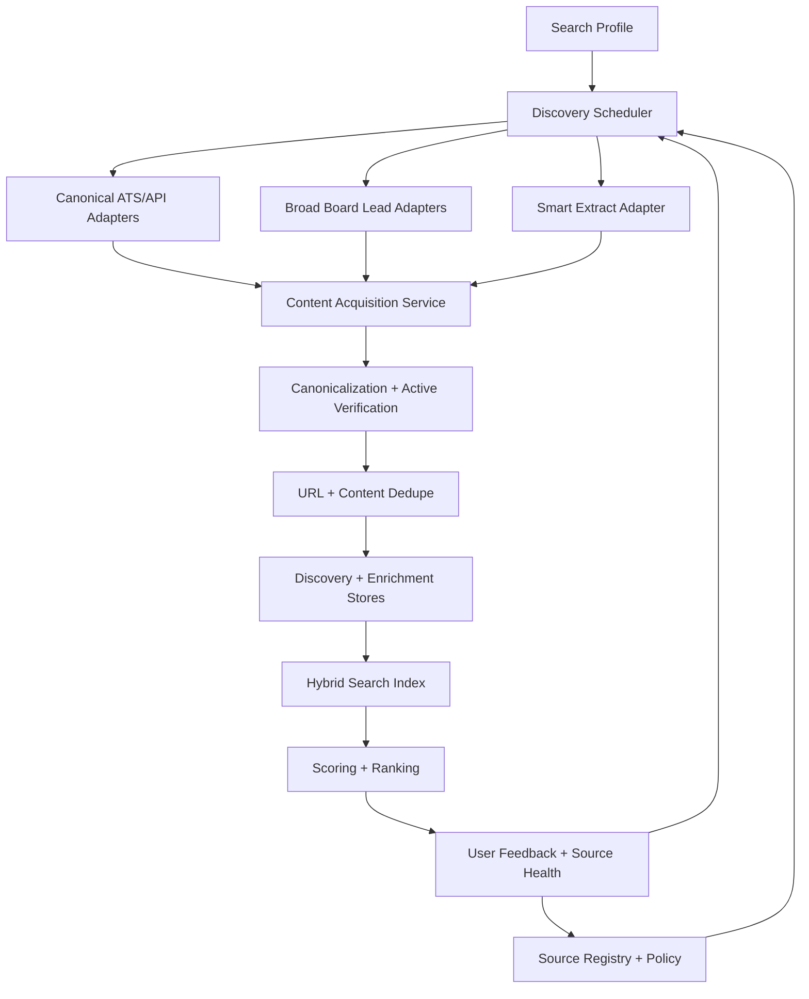

# RFC: Ideal Job Search Discovery Setup

> **Status:** proposed RFC.
> **Date:** 2026-05-12.
> **Owner:** JobHunter.
> **Scope:** job discovery, source indexing, content acquisition, deduplication,
> source-quality measurement, and the handoff into enrichment/scoring.

## Decision Summary

Adopt a direct-source-first discovery architecture: index canonical employer
career systems and official job APIs before broad job boards, treat broad boards
as lead generators that must be verified against canonical postings, and make
source quality observable enough that low-yield sources can be demoted or
quarantined automatically.

The ideal setup has five operating principles:

1. Prefer employer-owned or ATS-owned postings over aggregator copies.
2. Keep full posting content as a versioned enrichment artifact, not a lossy
   scraper side effect.
3. Separate "can discover a lead" from "can verify an active, applyable job".
4. Use policy-controlled content acquisition, including internal filter
   overrides, but do not evade third-party access controls.
5. Measure source quality continuously: active rate, duplicate rate, full
   description rate, canonical URL rate, apply URL success, and user feedback.

## Current State

JobHunter currently has three discovery lanes:

- `JobSpy` through `jobhunter.discovery.jobspy`, advertised as Indeed,
  LinkedIn, Glassdoor, and ZipRecruiter coverage. The default full crawl uses
  `indeed`, `linkedin`, and `zip_recruiter` when no `sites` setting is present.
- `Workday` through `jobhunter.discovery.workday`, using Workday CXS APIs and
  the packaged employer registry in
  `workers/automation/src/jobhunter/config/employers.yaml`.
- `Smart Extract` through `jobhunter.discovery.smartextract`, expanding
  configured search/static URLs from
  `workers/automation/src/jobhunter/config/sites.yaml` and using Playwright,
  deterministic extraction, and LLM fallback for arbitrary job pages.

The DDD target already names the right boundary:
`JobBoardScraperPort` should yield `ScrapedJobPosting` values into the
Discovery context, while Enrichment owns full descriptions and application
URLs. That port is still a placeholder; the existing scrapers still write
directly to storage.

Important gaps:

- `searches.example.yaml` uses `boards`, but `jobspy.run_discovery()` reads
  `sites`; source selection is therefore not yet a clean product contract.
- Source health is implicit in logs rather than stored as queryable data.
- Discovery stores a posting, but canonical verification and full content
  acquisition are split across later enrichment paths without a first-class
  content snapshot model.
- Smart Extract has useful reach, but arbitrary web extraction should be
  source-health gated and policy-labeled so it does not pollute the job set.
- Broad boards can produce stale, duplicated, incomplete, or redirected jobs;
  they need downstream canonicalization instead of direct trust.

## Goals

- Maximize high-quality jobs that are active, canonical, applyable, and relevant
  to the user's search profile.
- Expand source coverage without letting low-quality or blocked sources degrade
  the database.
- Capture enough posting content to support scoring, tailoring, deduplication,
  auditability, and future search/ranking evaluation.
- Make source policies explicit: allowed collection method, rate budget,
  authentication mode, robots handling, attribution requirements, and fallback
  behavior.
- Preserve local-first operation while leaving a clear future path for hosted
  source registries, shared source-health metadata, and licensed data feeds.

## Non-Goals

- This RFC does not change auto-apply behavior.
- This RFC does not authorize evasion of third-party CAPTCHAs, paywalls,
  authentication controls, bot-detection systems, or explicit technical blocks.
- This RFC does not propose storing user resumes, applications, cover letters,
  browser profiles, or generated PDFs in any shared index.
- This RFC does not make broad job boards the source of truth for job identity.

## Source Hierarchy

### Tier 0: User-Curated Targets

These are the user's known target employers, sectors, geographies, and role
families. They should drive the crawl plan instead of being only post-hoc score
filters.

Examples:

- target employer lists;
- target ATS slugs such as Greenhouse board tokens, Lever site names, Ashby job
  board names, or Workday tenant URLs;
- role profiles such as "staff platform engineer", "AI infrastructure", or
  "security engineering";
- hard exclusions such as staffing agencies, onsite-only roles, or unwanted
  geographies.

Expected behavior:

- Highest priority in scheduling.
- Strict active-job verification.
- User feedback directly tunes future crawl budgets.

### Tier 1: Canonical ATS And Employer APIs

These should be the primary indexing surface because they are closest to the
employer's source of truth and usually expose full job details with stable
identifiers.

Initial targets:

| Source | Why It Matters | Access Pattern |
| --- | --- | --- |
| Workday CXS | Already implemented, common among large employers. | Per-employer CXS endpoint. |
| Greenhouse | Public Job Board API exposes board jobs and job detail endpoints. | `boards-api.greenhouse.io` by board token. |
| Lever | Postings API lists published postings and detail by posting ID. | `api.lever.co/v0/postings/{site}`. |
| Ashby | Public Job Posting API exposes job boards and posting details. | `api.ashbyhq.com/posting-api/job-board/{name}`. |
| SmartRecruiters | Posting API exposes public postings for custom career sites. | Public posting/feed endpoints, usually with customer/API setup constraints. |
| Workable | API can expose open jobs and details for a company's careers page. | API token and `r_jobs` scope when permissioned. |
| Recruitee | Careers Site API supports jobs on a customer careers site. | Careers-site API by company setup. |
| Teamtailor | API can fetch jobs from Teamtailor accounts. | API key and region-specific endpoint when permissioned. |

Rules:

- Use ATS APIs before scraping rendered career pages.
- Store source-native IDs and canonical apply URLs.
- Fetch job detail, not just listing cards.
- Treat authentication-required APIs as permissioned integrations, not scraping
  targets.

### Tier 2: Official Job APIs And Licensed Feeds

These are useful for coverage and freshness, especially where they expose clear
terms, rate limits, and attribution requirements.

Initial targets:

- USAJOBS Search API for U.S. federal roles.
- Adzuna API for broad indexed jobs and standardized metadata.
- Remotive public API for remote roles, respecting attribution and frequency
  guidance.
- Job Bank Canada or other government/official job APIs where available.
- Paid or partner feeds for sources that block general scraping but offer a
  legitimate data route.

Rules:

- Store source attribution requirements with the source policy.
- Use provider-provided pagination and freshness windows.
- Prefer official API detail endpoints over crawling result pages.

### Tier 3: Curated Niche Boards

These are useful when they are high signal for the user's role and produce
fresh, complete postings.

Examples from the current registry include RemoteOK, WeWorkRemotely, Remotive,
Hacker News Jobs, BuiltIn Remote, Startup.jobs, Wellfound, Arc.dev, Otta,
Jobspresso, and FlexJobs.

Rules:

- Add a source only with an owner, expected role fit, expected geography fit,
  and an initial health budget.
- Promote sources that produce canonical, active, user-approved jobs.
- Demote sources that produce stale links, poor descriptions, spam, duplicates,
  or frequent extraction failures.

### Tier 4: Broad Boards Through JobSpy

JobSpy should remain a useful lead generator, not the canonical source of truth.
Indeed, LinkedIn, ZipRecruiter, and similar boards can surface opportunities
the target list misses, but they also produce more duplication, redirects, and
incomplete descriptions.

Rules:

- Store the broad-board posting as a lead.
- Resolve employer, canonical ATS URL, and full job detail before scoring.
- Do not let broad-board-only jobs bypass canonical verification unless the
  user explicitly enables that behavior for a run.
- Track source-specific closed/stale rates so low-quality boards are throttled.

### Tier 5: Smart Extract For Arbitrary Sites

Smart Extract is the escape hatch for useful sources without clean APIs. It
should be supervised by source policy and source health, not run as an unbounded
general crawler.

Rules:

- Require an explicit source registry entry.
- Use deterministic extraction before LLM extraction.
- Store extraction strategy, confidence, selector/API evidence, and content
  snapshot hash.
- Quarantine low-confidence results until verified.

## Policy For Content Acquisition

This RFC uses "filter override" in a narrow, product-internal sense: a user may
override JobHunter's own source filters or extraction confidence gates for a
trusted source. It does not mean bypassing a third party's technical controls.

Allowed:

- Override JobHunter's own locally disabled-source, low-confidence, or
  insufficient-text filter when the user explicitly marks a source as trusted
  for discovery and the acquisition method remains policy-compliant.
- Fall through from API extraction to rendered-browser extraction when the
  source is accessible to a normal browser session and not technically blocked.
- Use user-provided, permissioned credentials or API keys where the user is
  authorized to access the source.
- Import pages, URLs, exports, emails, or saved HTML that the user manually
  provides.
- Use paid/licensed APIs or data partnerships for sources that restrict public
  crawling.
- Keep a human-in-the-loop capture path for sources that require manual review.

Not allowed:

- Circumventing CAPTCHA, paywall, login, rate-limit, bot-detection, or access
  controls for discovery scraping.
- Masking JobHunter as a different crawler or user in order to access blocked
  content.
- Proxy rotation or browser fingerprint manipulation for the purpose of evading
  source defenses.
- Collecting private/internal postings that the user is not authorized to view.
- Bulk redistributing provider content against API or site terms.

Proposed source policy fields:

```yaml
sources:
  - id: greenhouse:acme
    kind: ats_api
    display_name: Acme Greenhouse
    priority: canonical
    allowed_methods: [api, rendered_detail]
    authentication: none
    attribution: none
    robots_policy: honor
    max_pages_per_run: 500
    max_run_frequency: "PT6H"
    content_filter_override:
      allowed: true
      requires_reason: true
      allowed_filters: [low_confidence_extraction, missing_salary, short_description]
    third_party_control_bypass: false
```

`third_party_control_bypass` is intentionally fixed to `false`. If a source
cannot be accessed without evasion, JobHunter should switch to a permissioned
API, licensed feed, manual import, or user-mediated capture flow.

## Target Architecture



### Core Components

| Component | Responsibility |
| --- | --- |
| Source Registry | Declarative catalog of source type, policy, credentials mode, crawl budget, and quality state. |
| Discovery Scheduler | Chooses what to crawl based on source priority, freshness, prior yield, and user search profile. |
| Source Adapters | Implement source-specific listing and detail fetches behind `JobBoardScraperPort`. |
| Content Acquisition Service | Retrieves full descriptions and apply URLs through API, structured data, selectors, rendered browser, or LLM extraction. |
| Canonicalization Service | Resolves employer, ATS, source-native ID, canonical posting URL, and active/closed state. |
| Dedupe Service | Collapses duplicates by canonical URL, source-native ID, normalized title/company/location, and content hash. |
| Hybrid Search Index | Supports keyword and semantic retrieval for ranking, review, and future evals. |
| Source Quality Monitor | Stores per-source run metrics and feeds source demotion/promotion. |

## Domain Model Additions

The current DDD model should remain: Discovery owns job discovery metadata,
Enrichment owns full descriptions/application URLs, Scoring owns fit, and
Operations owns projections. The RFC adds explicit records around source
quality and content snapshots.

Proposed entities/value objects:

| Name | Context | Purpose |
| --- | --- | --- |
| `SourceRegistryEntry` | Discovery | Source ID, kind, display name, owner, policy, priority, and adapter config. |
| `SourcePolicy` | Discovery | Allowed methods, rate budget, robots handling, auth mode, attribution, and filter override rules. |
| `DiscoveryRun` | Discovery/Operations | One scheduled run with source IDs, query/profile snapshot, status, counts, and error classes. |
| `DiscoveredPosting` | Discovery | Raw source result with source-native ID, listing URL, title/company/location, and strategy. |
| `CanonicalJobIdentity` | Discovery | Canonical URL, ATS type, employer identity, source-native ID, and dedupe keys. |
| `PostingContentSnapshot` | Enrichment | Full description, structured fields, raw/cleaned text hashes, extraction method, and confidence. |
| `SourceQualityStats` | Operations | Rolling active rate, duplicate rate, detail success, apply URL success, stale rate, and user approval/dismissal. |
| `DiscoveryFeedback` | Discovery/Operations | User or system feedback: saved, applied, dismissed, bad source, duplicate, stale, irrelevant. |

## Content Acquisition Pipeline

The content pipeline should be deterministic first and LLM-assisted only when
needed.

1. **Listing capture:** collect source-native ID, listing URL, title, company,
   locations, remote flags, posted date, and source timestamp.
2. **Canonical detail fetch:** prefer official detail APIs or ATS detail
   endpoints.
3. **Structured data extraction:** parse JSON-LD, embedded application state,
   OpenGraph metadata, and known ATS payloads.
4. **Deterministic selectors:** use source-specific CSS/DOM selectors from the
   source registry.
5. **Rendered browser extraction:** use Playwright for normal user-visible pages
   where content is rendered client-side.
6. **LLM extraction:** map messy visible content into a strict schema with
   evidence and confidence.
7. **Active verification:** confirm the posting is not closed, expired, removed,
   location-incompatible, or redirecting to an unrelated application.
8. **Snapshot persistence:** store raw text hash, cleaned text hash, extracted
   fields, extraction method, source policy ID, and confidence.
9. **Quarantine:** hold low-confidence, policy-overridden, or broad-board-only
   results until canonical verification passes or the user approves them.

Required extraction schema:

```json
{
  "title": "string",
  "company": "string",
  "locations": ["string"],
  "work_mode": "remote|hybrid|onsite|unknown",
  "employment_type": "full_time|contract|part_time|internship|unknown",
  "description_text": "string",
  "requirements": ["string"],
  "responsibilities": ["string"],
  "salary": {"min": 0, "max": 0, "currency": "string", "period": "year|hour|unknown"},
  "apply_url": "string",
  "active_state": "active|closed|unknown",
  "confidence": "high|medium|low",
  "evidence": ["string"]
}
```

## Retrieval And Ranking

The discovery store should support search and ranking separately from scoring:

- Hard filters: location, work mode, authorization, employment type, salary
  floor, excluded companies, excluded titles, and explicit user exclusions.
- Keyword retrieval: BM25 or equivalent lexical index over title, company,
  skills, requirements, responsibilities, and source metadata.
- Semantic retrieval: embeddings over normalized posting content and the user's
  search profile.
- Hybrid merge: reciprocal rank fusion or weighted combination of lexical,
  semantic, recency, and source trust signals.
- Reranking: deterministic source-quality and fit signals first; LLM reranking
  only for short candidate sets and with traceable evidence.
- Feedback learning: saves, applies, dismissals, corrections, stale flags, and
  duplicate reports adjust source budgets and ranking features.

## Source Quality Metrics

Every discovery run should emit metrics that can be inspected locally and later
aggregated in a hosted control plane.

| Metric | Why It Matters |
| --- | --- |
| `new_jobs_count` | Measures useful yield. |
| `existing_jobs_count` | Tracks duplicate pressure. |
| `canonical_url_rate` | Shows whether a source yields employer-owned URLs. |
| `active_verification_rate` | Separates live postings from stale leads. |
| `full_description_success_rate` | Indicates whether scoring has enough evidence. |
| `apply_url_success_rate` | Indicates downstream apply readiness. |
| `quarantine_rate` | Tracks low-confidence or policy-overridden results. |
| `user_save_rate` | Product signal that source output is valuable. |
| `user_dismiss_rate` | Product signal that source output is noisy. |
| `stale_or_closed_rate` | Penalizes sources that waste review time. |
| `manual_intervention_rate` | Measures how often the source requires user action. |

Source states:

- `trusted`: high active rate, high full-content rate, low duplicate/stale rate.
- `normal`: acceptable yield, no special treatment.
- `experimental`: newly added or insufficient evidence.
- `quarantined`: results require review before scoring/downstream actions.
- `disabled`: repeated failure, policy conflict, or user-disabled.

## Product Experience

The product should expose discovery controls without turning source management
into a raw YAML-only workflow.

Minimum UX:

- Source registry view with source status, last run, yield, error class, and
  quality trend.
- Search profile editor for target roles, locations, work modes, industries,
  companies, excluded titles, and source preferences.
- Discovery preview before a new source is promoted from `experimental`.
- Quarantine queue for low-confidence or policy-overridden postings.
- Feedback actions: save, dismiss, mark stale, mark duplicate, wrong company,
  wrong location, bad source, and source is useful.
- Per-source policy labels: official API, permissioned API, public page,
  broad-board lead, user import, licensed feed.

## Local-First And Hosted-Future Boundary

Local-first behavior remains the default:

- job data stays in the user's local database;
- source credentials stay local unless the user opts into a hosted integration;
- source runs execute locally;
- generated artifacts stay local.

Hosted future:

- shared source registry templates;
- aggregate source-health metadata without user job content;
- licensed feed management;
- hosted scheduling for users who opt in;
- per-tenant policy controls and entitlements.

## Proposed PR Stack

### PR 1: Source Registry And Config Contract

- Add a typed source registry model that covers current `sites.yaml`,
  `employers.yaml`, and JobSpy board selection.
- Resolve `boards` versus `sites` naming so `searches.yaml` is a stable product
  contract.
- Add `SourcePolicy`, source states, and source-quality placeholders.
- Add tests for config loading, policy validation, and migration from existing
  packaged YAML.
- Documentation: update README and `docs/local-reliability-qa.md` only if the
  user-facing config surface changes in the PR.

### PR 2: Canonical ATS API Adapters

- Materialize `JobBoardScraperPort` adapters for Workday, Greenhouse, Lever,
  and Ashby first.
- Preserve the current Workday behavior while moving the write boundary behind
  the Discovery use case.
- Add fixture-backed adapter tests with recorded/synthetic payloads.
- Store source-native IDs and canonical URLs.

### PR 3: Content Snapshot And Active Verification

- Add `PostingContentSnapshot` persistence in the Enrichment context.
- Move full-description/apply-URL extraction into a reusable content acquisition
  service.
- Add active/closed verification and quarantine states.
- Add policy-compliant internal filter override logging.
- Tests: parser fixtures, active-state examples, low-confidence quarantine, and
  override audit records.

### PR 4: Source Quality And Scheduler

- Persist `DiscoveryRun` and `SourceQualityStats`.
- Use source quality to schedule crawl budgets and demote bad sources.
- Add Operations projections/API fields so the web app can show source health.
- Tests: source-quality aggregation and scheduling decisions.

### PR 5: Hybrid Search Index

- Add lexical search over normalized posting fields.
- Add optional embedding index behind a port so local operation can run without
  a hosted service.
- Use hybrid retrieval before expensive LLM scoring/reranking.
- Add an evaluation fixture set for expected top-k jobs per profile/query.

### PR 6: Product Controls

- Add source registry/status UI.
- Add discovery preview and quarantine review UI.
- Add feedback actions that feed source-quality metrics.
- QA: browser path for adding/enabling a source, running discovery, reviewing
  quarantined jobs, and confirming source health updates.

## Verification Strategy

For implementation PRs:

- Unit tests for source config parsing, source policy validation, adapter
  parsing, content extraction, active-state detection, dedupe, and source-health
  aggregation.
- Integration tests with mocked HTTP/Playwright responses; no live scraping in
  normal unit tests.
- Contract tests for API/read-model additions.
- Web component/hook tests for source registry, quarantine queue, and feedback
  actions.
- Product-level QA for any user-facing source-management or discovery workflow.
- A small redacted evaluation set with synthetic jobs and profiles to measure
  active rate, duplicate rate, full-description success, and top-k relevance.

## Research References

- [Greenhouse Job Board API](https://developer.greenhouse.io/job-board.html)
- [Greenhouse API overview](https://support.greenhouse.io/hc/en-us/articles/10568627186203-Greenhouse-API-overview)
- [Lever Postings API](https://github.com/lever/postings-api)
- [Ashby Public Job Posting API](https://developers.ashbyhq.com/docs/public-job-posting-api)
- [SmartRecruiters Posting API](https://developers.smartrecruiters.com/docs/posting-api)
- [Workable API careers page guide](https://help.workable.com/hc/en-us/articles/115012771647-Using-the-Workable-API-to-create-a-careers-page)
- [Recruitee API documentation](https://support.recruitee.com/en/articles/1066282-api-documentation)
- [Teamtailor API documentation](https://support.teamtailor.com/en/articles/5963369-use-our-teamtailor-api/)
- [Remotive public jobs API](https://github.com/remotive-io/remote-jobs-api)
- [USAJOBS Search API](https://developer.usajobs.gov/api-reference/get-api-search)
- [Adzuna API](https://developer.adzuna.com/)
- [RFC 9309: Robots Exclusion Protocol](https://www.ietf.org/rfc/rfc9309.html)
- [Google robots.txt documentation](https://developers.google.com/search/docs/crawling-indexing/robots/intro)

## Open Questions

- Which geographies and role families should be optimized first?
- Should the first ATS expansion prioritize target companies or broad slug
  discovery?
- Are paid APIs or licensed feeds acceptable for high-value blocked sources?
- Should source health be visible in the main dashboard or only in an
  operations/settings view?
- What user approval should be required before a source can use permissioned
  credentials or user-mediated page capture?
