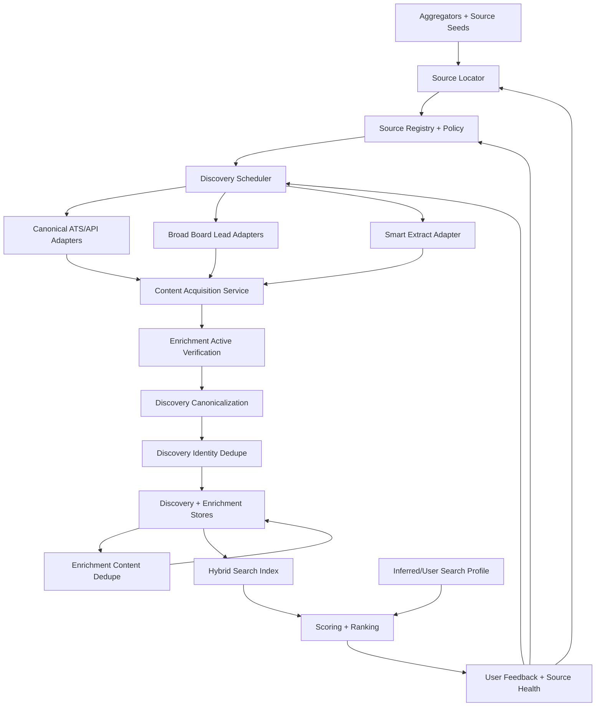

# RFC: Ideal Job Search Discovery Setup

> **Status:** proposed RFC.
> **Date:** 2026-05-12.
> **Owner:** JobHunter.
> **Scope:** job discovery, source indexing, content acquisition, deduplication,
> source-quality measurement, and the handoff into enrichment/scoring.

## Decision Summary

Adopt an aggregator-assisted, source-verified discovery architecture: use
aggregators and broad boards to find wide job leads quickly, then verify the
surviving leads against canonical employer career systems, ATS APIs, or official
posting pages before scoring or downstream automation. Source quality must be
observable enough that low-yield sources can be demoted or quarantined
automatically.

The ideal setup has six operating principles:

1. Use aggregators for breadth, but prefer employer-owned or ATS-owned postings
   as the verified canonical record.
2. Keep full posting content as a versioned enrichment artifact, not a lossy
   scraper side effect.
3. Separate "can discover a lead" from "can verify an active, applyable job".
4. Use policy-controlled content acquisition, including internal filter
   overrides, but do not evade third-party access controls.
5. For v1, prioritize jobs relevant to the project owner: Barcelona, Spain, and
   tech leadership roles. Non-local, non-Spain, and non-tech-leadership source
   work belongs in a low-priority backlog unless it directly improves this
   search.
6. Measure source usefulness continuously: lead yield, verified-active rate,
   duplicate rate, full-description rate, canonical URL rate, apply URL success,
   and user feedback.

## Current State

JobHunter currently has three discovery lanes:

- `JobSpy` through `jobhunter.discovery.jobspy`, advertised as Indeed,
  LinkedIn, Glassdoor, and ZipRecruiter coverage. The default full crawl uses
  `indeed`, `linkedin`, and `zip_recruiter` when no `sites` setting is present.
- `Workday` through `jobhunter.discovery.workday`, using Workday CXS APIs and
  the packaged employer registry in
  `workers/automation/src/jobhunter/config/employers.yaml`.
- `Smart Extract` through `jobhunter.discovery.smartextract`, expanding
  configured search/static URLs from
  `workers/automation/src/jobhunter/config/sites.yaml` and using Playwright,
  deterministic extraction, and LLM fallback for arbitrary job pages.

The DDD target already names the right boundary:
`JobBoardScraperPort` should yield `ScrapedJobPosting` values into the
Discovery context, while Enrichment owns full descriptions and application
URLs. That port is still a placeholder; the existing scrapers still write
directly to storage.

Important gaps:

- `searches.example.yaml` uses `boards`, but `jobspy.run_discovery()` reads
  `sites`; source selection is therefore not yet a clean product contract.
- Source health is implicit in logs rather than stored as queryable data.
- Discovery stores a posting, but canonical verification and full content
  acquisition are split across later enrichment paths without a versioned
  content snapshot lifecycle.
- Smart Extract has useful reach, but arbitrary web extraction should be
  source-health gated and policy-labeled so it does not pollute the job set.
- Broad boards can produce stale, duplicated, incomplete, or redirected jobs;
  they need downstream canonicalization instead of direct trust.

## Goals

- Maximize high-quality jobs that are active, canonical, applyable, and relevant
  to the project owner's immediate search: Barcelona, Spain tech leadership.
- Expand source coverage without letting low-quality or blocked sources degrade
  the database.
- Capture enough posting content to support scoring, tailoring, deduplication,
  auditability, and future search/ranking evaluation.
- Make source policies explicit: allowed collection method, rate budget,
  authentication mode, attribution requirements, and fallback
  behavior.
- Preserve local-first operation while leaving a clear future path for hosted
  source registries, shared source-health metadata, and licensed data feeds.

## Non-Goals

- This RFC does not change auto-apply behavior.
- This RFC does not authorize evasion of third-party CAPTCHAs, paywalls,
  authentication controls, bot-detection systems, or explicit technical blocks.
- This RFC does not propose storing user resumes, applications, cover letters,
  browser profiles, or generated PDFs in any shared index.
- This RFC does not make broad job boards the source of truth for job identity.

## Source Locator

The source locator is pre-indexing infrastructure, not a source tier. Its job
is to answer: "where do job lists live on the public and permissioned web?"
For v1, locator work should be optimized for Barcelona, Spain tech-leadership
coverage. Broader source discovery is useful only insofar as it helps find or
verify those jobs.

The locator should not require the user to know target companies, roles, ATS
slugs, or careers-page URLs. Aggregators solve most of the breadth problem:
JobHunter should pull leads from aggregators first, then use locator logic to
find and verify the canonical employer/ATS source for promising leads.
User-provided companies or domains are useful optional seeds, but they are not
the boundary of discovery.

Locator outputs are source registry candidates with evidence and confidence:
ATS board tokens, Workday tenant URLs, official careers pages, official APIs,
licensed feeds, or manual-review candidates.

Locator methods:

- **Known-pattern probing:** check common careers paths such as `/careers`,
  `/jobs`, `/company/careers`, `/about/careers`, and sitemap links.
- **Aggregator-led discovery:** pull broad leads from aggregators, job boards,
  and feed APIs, then backtrace each promising lead to the employer career page,
  ATS board, or official posting URL.
- **Search-result discovery:** query the open web for career pages,
  ATS-hosted boards, and job-list indexes when aggregator coverage is missing or
  a lead needs canonical-source verification.
- **ATS fingerprinting:** detect Workday, Greenhouse, Lever, Ashby,
  SmartRecruiters, Workable, Recruitee, Teamtailor, iCIMS, Taleo, Oracle, and
  BambooHR from links, scripts, forms, redirects, and embedded data.
- **API endpoint derivation:** turn a discovered board token or tenant URL into
  the source-specific listing/detail API and validate it with a low-volume
  metadata or listing fetch.
- **Aggregator backtrace:** use broad boards to discover canonical employer or
  ATS URLs, not as final job identity.
- **Manual confirmation:** if the locator finds several plausible career
  systems or a protected/internal site, queue it for user review before adding
  it to the active source registry.

Expected behavior:

- Produces `SourceRegistryEntry` candidates; it does not directly enqueue jobs
  for scoring.
- Stores evidence: matched URL, page title, detected ATS kind, source-native
  token, employer-domain match, redirect chain, and confidence.
- Requires confidence thresholds before promoting a candidate into crawling.
- Uses Barcelona/Spain tech-leadership as the v1 source-build priority, but does
  not require the user to hand-enumerate target companies. Target companies are
  inferred later from recurring high-fit employers and user feedback.
- Lets the user provide optional seeds without making seeds the definition of
  coverage.
- Feeds user corrections back into the locator so future source discovery gets
  better.

### Locator Policy Guardrails

The locator runs before a promoted source has a `SourcePolicy`, so it needs its
own conservative policy envelope:

- Use a declared regular browser user agent. 
- Enforce a locator-level per-domain budget independent of
  `SourcePolicy.max_pages_per_run`. The default should be a small number of
  HEAD/GET requests per domain per run with backoff on 429, 403.
- Run autonomous search-result discovery and aggregator backtraces only when a
  domain allowlist, user-enabled broad-discovery mode, or high-confidence
  employer-domain match is present. Otherwise, store a candidate for manual
  confirmation.

  
## Source Hierarchy

### Tier 1: Canonical ATS And Employer APIs

These should be the primary indexing surface because they are closest to the
employer's source of truth and usually expose full job details with stable
identifiers.

Initial targets:

| Source | Why It Matters | Access Pattern |
| --- | --- | --- |
| Workday CXS | Already implemented, common among large employers. | Per-employer CXS endpoint. |
| Greenhouse | Public Job Board API exposes board jobs and job detail endpoints. | `boards-api.greenhouse.io` by board token. |
| Lever | Postings API lists published postings and detail by posting ID. | `api.lever.co/v0/postings/{site}`. |
| Ashby | Public Job Posting API exposes job boards and posting details. | `api.ashbyhq.com/posting-api/job-board/{name}`. |
| SmartRecruiters | Posting API exposes public postings for custom career sites. | Public posting/feed endpoints, usually with customer/API setup constraints. |
| Workable | API can expose open jobs and details for a company's careers page. | API token and `r_jobs` scope when permissioned. |
| Recruitee | Careers Site API supports jobs on a customer careers site. | Careers-site API by company setup. |
| Teamtailor | API can fetch jobs from Teamtailor accounts. | API key and region-specific endpoint when permissioned. |

Rules:

- Use ATS APIs before scraping rendered career pages.
- Store source-native IDs and canonical apply URLs.
- Fetch job detail, not just listing cards.
- Treat authentication-required APIs as permissioned integrations, not scraping
  targets.

### Tier 2: Official Job APIs And Licensed Feeds

These are useful for coverage and freshness, especially where they expose clear
terms, rate limits, and attribution requirements.

Initial targets:

- Spain/Barcelona-relevant official, licensed, or feed-backed sources first.
- Adzuna API for broad indexed jobs and standardized metadata, constrained to
  Spain/Barcelona and tech-leadership query slices.
- Remotive public API for remote roles, respecting attribution and frequency
  guidance, but only as a low-priority fallback for roles compatible with
  Barcelona-based work.
- USAJOBS, Job Bank Canada, and other non-Spain official feeds belong in the
  low-priority backlog unless they directly improve the owner's search.
- Paid or partner feeds for sources that block general scraping but offer a
  legitimate data route.

Rules:

- Store source attribution requirements with the source policy.
- Use provider-provided pagination and freshness windows.
- Prefer official API detail endpoints over crawling result pages.

### Tier 3: Curated Niche Boards

These are useful when they are high signal for Barcelona/Spain tech leadership
or produce remote roles compatible with being based in Barcelona.

Examples from the current registry include RemoteOK, WeWorkRemotely, Remotive,
Hacker News Jobs, BuiltIn Remote, Startup.jobs, Wellfound, Arc.dev, Otta,
Jobspresso, FlexJobs, and Simplify. Spain-specific boards such as InfoJobs,
Tecnoempleo, Barcelona Activa/Cibernarium job surfaces, Jobfluent, and
Welcome to the Jungle Spain should be evaluated before generic non-local boards.

Rules:

- Add a source only with an owner, expected coverage category, expected
  geography coverage, and an initial health budget.
- Promote sources that produce canonical, active, user-approved jobs.
- Demote sources that produce stale links, poor descriptions, spam, duplicates,
  or frequent extraction failures.

### Tier 4: Broad Boards Through JobSpy

JobSpy should remain a useful lead generator, not the canonical source of truth.
Indeed, LinkedIn, ZipRecruiter, and similar boards can surface opportunities
that canonical ATS/API coverage misses, but they also produce more duplication,
redirects, and incomplete descriptions.

For v1, broad-board usage should focus on the owner's immediate market:
Barcelona, Spain, tech leadership, and remote roles compatible with that base.
Broad non-local boards remain useful as discovery accelerators only when they
produce leads that can be verified against a canonical employer or ATS source.

Rules:

- Store the broad-board posting as a lead.
- Resolve employer, canonical ATS URL, and full job detail before scoring.
- Do not let broad-board-only jobs bypass canonical verification unless the
  user explicitly enables that behavior for a run.
- Track source-specific closed/stale rates so low-quality boards are throttled.

### Tier 5: Smart Extract For Arbitrary Sites

Smart Extract is the escape hatch for useful sources without clean APIs. It
should be supervised by source policy and source health, not run as an unbounded
general crawler.

Rules:

- Require an explicit source registry entry, but do not break existing
  `sites.yaml` behavior. PR 1 should migrate current `sites.yaml` entries into
  generated `SourceRegistryEntry` records with `state=experimental` and
  `policy=smart_extract_experimental`; user-provided arbitrary URLs keep working
  through that compatibility path until promoted or rejected.
- Smart Extract candidates come from four places: migrated `sites.yaml` entries,
  aggregator leads that need canonical-source verification, locator-discovered
  career pages, and explicit user source seeds. The RFC does not require humans
  to know every source in advance; it requires every source to become explicit
  before repeated crawling.
- Use deterministic extraction before LLM extraction. For arbitrary URLs this
  means: fetch allowed structured data first, parse JSON-LD/schema.org JobPosting
  and embedded application state when present, apply any configured selectors,
  then fall back to stable visible-DOM heuristics. LLM extraction is only the
  final mapping step when deterministic evidence exists but is messy.
- Store extraction strategy, confidence, selector/API evidence, and content
  snapshot hash.
- Quarantine low-confidence results until verified.

## Policy For Content Acquisition

This RFC uses "filter override" in a narrow, product-internal sense: a user may
override JobHunter's own source filters or extraction confidence gates for a
trusted source. It does not mean bypassing a third party's technical controls.

Allowed:

- Override JobHunter's own locally disabled-source, low-confidence, or
  insufficient-text filter when the user explicitly marks a source as trusted
  for discovery and the acquisition method remains policy-compliant.
- Fall through from API extraction to rendered-browser extraction when the
  source is accessible to a normal browser session and not technically blocked.
- Use user-provided, permissioned credentials or API keys where the user is
  authorized to access the source.
- Import pages, URLs, exports, emails, or saved HTML that the user manually
  provides.
- Use paid/licensed APIs or data partnerships for sources that restrict public
  crawling.
- Keep a human-in-the-loop capture path for sources that require manual review.

Not allowed:

- Circumventing CAPTCHA, paywall, login, rate-limit, bot-detection, or access
  controls for discovery scraping.
- Masking JobHunter as a different crawler or user in order to access blocked
  content.
- Proxy rotation or browser fingerprint manipulation for the purpose of evading
  source defenses.
- Collecting private/internal postings that the user is not authorized to view.
- Bulk redistributing provider content against API or site terms.

### Human-In-The-Loop Blocked Source Path

Blocked sources should not become dead ends. When a lead looks useful but the
autonomous path hits CAPTCHA, login, paywall, bot-detection,
rate-limit, or another access boundary, JobHunter should first try to circumvent 
the blockage, and, if not, ccreate a`manual_action_required` item instead of silently 
discarding the lead.

The manual path:

1. Preserve the lead URL, source, reason, and retry context.
2. Show the item in a local manual-capture queue.
3. Let the user open the page in their own local browser session.
4. Let the user complete any login, CAPTCHA, consent, or navigation step
   themselves.
5. Accept one of these user-provided inputs: capture current visible page, saved
   HTML, copied URL, exported job record, email, or pasted job text.
6. Run normal content extraction, dedupe, active verification, scoring, and
   provenance labeling on that user-provided artifact.

Manual capture is not an automated bypass mode. It is a user-mediated import
path for content the user can access and provide locally. Provenance must record
`source_kind=user_mediated_capture`, the originating URL, capture timestamp,
and whether the source still needs future manual action.

Proposed source policy fields:

```yaml
sources:
  - id: greenhouse:acme
    kind: ats_api
    display_name: Acme Greenhouse
    priority: canonical
    allowed_methods: [api, rendered_detail]
    authentication: none
    attribution: none
    max_pages_per_run: 500
    max_run_frequency: "PT6H"
    manual_intervention:
      allowed: true
      triggers: [captcha, login_required, paywall, bot_detection]
      capture_modes: [current_page, saved_html, copied_url, pasted_text, email_import]
    content_filter_override:
      allowed: true
      requires_reason: true
      allowed_filters: [low_confidence_extraction, missing_salary, short_description]
    third_party_control_bypass: false
```

`third_party_control_bypass` is intentionally fixed to `false`. If a source
cannot be accessed without evasion, JobHunter should switch to a permissioned
API, licensed feed, manual import, or user-mediated capture flow.

## Target Architecture



### Core Components

| Component | Responsibility |
| --- | --- |
| Source Locator | Resolves aggregator leads, public web results, and source seeds into candidate ATS boards, official career pages, APIs, feeds, or manual-review candidates. |
| Source Registry | Declarative catalog of source type, policy, credentials mode, crawl budget, and quality state. |
| Discovery Scheduler | Chooses what to crawl based on source priority, freshness, prior yield, crawl budget, and source health. |
| Source Adapters | Implement source-specific listing and detail fetches behind `JobBoardScraperPort`. |
| Content Acquisition Service | Retrieves full descriptions and apply URLs through API, structured data, selectors, rendered browser, or LLM extraction. |
| Enrichment Active Verification | Enrichment-owned check that records whether the detail/apply path is active, closed, expired, removed, or incompatible, then emits state changes for Discovery, Scoring, Apply, and Operations consumers. |
| Canonicalization Service | Discovery-owned identity service that resolves employer, ATS, source-native ID, and canonical posting URL. It consumes Enrichment-owned active state; it does not own active/closed state. |
| Discovery Identity Dedupe | The first authoritative duplicate gate. It collapses listings by tenant, source-native ID, canonical URL, ATS identity, and normalized employer/title/location before a new Job aggregate is created. |
| Enrichment Content Dedupe | The second-pass merge after full content exists. It catches duplicates missed at listing time through description hashes, apply URLs, and high-confidence content similarity. |
| Hybrid Search Index | Supports keyword and semantic retrieval for ranking, review, and future evals. |
| Source Quality Monitor | Stores per-source run metrics and feeds source demotion/promotion. |

## Domain Model Additions

The current DDD model should remain: Discovery owns job discovery metadata and
identity, Enrichment owns full descriptions, application URLs, content snapshots,
and active state, Scoring owns fit, and Operations owns projections. The RFC
adds explicit records around source discovery, source observations, source
quality, and content snapshots without creating co-owned aggregates.

Proposed entities/value objects:

| Name | Kind | Owning context | Identity / parent | Purpose |
| --- | --- | --- | --- | --- |
| `SourceLocationCandidate` | Entity | Discovery | `(TenantId, candidateId)` | Candidate career system discovered from the public web, a source seed, or an aggregator backtrace, with detected source kind, URL, confidence, and promotion state. |
| `SourceDiscoveryEvidence` | Value object | Discovery | Owned by `SourceLocationCandidate` | Evidence supporting a locator candidate: matched links, employer-domain checks, redirect chain, detected ATS tokens, and validation fetch result. |
| `SourceRegistryEntry` | Aggregate | Discovery | `(TenantId, sourceId)` | Source ID, kind, display name, owner, policy, priority, adapter config, and source state. |
| `SourcePolicy` | Value object | Discovery | Owned by `SourceRegistryEntry`; persisted by policy version when needed | Allowed methods, locator/crawl rate budgets, auth mode, attribution, and filter override rules. |
| `DiscoveryRun` | Aggregate | Discovery | `(TenantId, runId: UUID)` | One scheduled run with source IDs, query/profile snapshot, status, counts, and error classes. Operations builds read-side run projections from Discovery events. |
| `DiscoveredPosting` | Value object | Discovery | Owned by `DiscoveryRun` result pages | Raw source result with source-native ID, listing URL, title/company/location, and strategy. |
| `CanonicalJobIdentity` | Value object | Discovery | Owned by the Discovery `Job` decision | Canonical URL, ATS type, employer identity, source-native ID, and dedupe keys. |
| `JobSourceObservation` | Entity | Discovery | Child of `Job`, `(TenantId, JobId, sourceObservationId)`; persisted through `JobRepository`, not a sibling repository | Per-source evidence for a canonical job, preserving broad-board leads, ATS records, run IDs, source URLs, timestamps, and raw metadata without creating duplicate jobs. |
| `DuplicateJobLink` | Aggregate | Discovery | `(TenantId, duplicateLinkId: UUID)` | Records a duplicate relationship, merge reason, confidence, surviving canonical job, and superseded source/job reference. Enrichment may propose content duplicate candidates, but Discovery confirms or rejects the link. |
| `PostingSnapshotSet` | Aggregate | Enrichment | `(TenantId, JobId)` | Versioned live-state/content snapshot aggregate for one job. It owns `PostingContentSnapshot` values and recurring active-state changes without changing the terminal lifecycle of `JobEnrichment`. |
| `PostingContentSnapshot` | Value object | Enrichment | Owned by `PostingSnapshotSet`, identified by `snapshotVersion` inside the set | Versioned detail/apply/content extraction result used for content dedupe, active-state history, and optional first-time population of `JobEnrichment`. |
| `SourceQualityStats` | Projection | Operations | `(TenantId, sourceId, windowStart, windowEnd)` | Rolling active rate, duplicate rate, detail success, apply URL success, stale rate, user approval/dismissal, and cost/latency summaries derived from events and spans. |
| `DiscoveryFeedback` | Aggregate | Discovery | `(TenantId, feedbackId: UUID)` | User or system feedback: saved, applied, dismissed, bad source, duplicate, stale, irrelevant. Operations projects it for dashboards. |

### Domain Events

New domain events must be enumerated before implementation so Operations
projections and the SSE invalidation router can stay exhaustive.

| Event | Owner | Payload sketch | Consumers |
| --- | --- | --- | --- |
| `SourceLocationCandidateDiscovered` | Discovery | `tenantId`, `candidateId`, `candidateUrl`, `sourceKind`, `confidence`, `evidenceRef`, `discoveredAt` | Operations source-locator projection. |
| `SourceLocationCandidatePromoted` | Discovery | `tenantId`, `candidateId`, `sourceId`, `promotedAt` | Discovery scheduler, Operations source registry projection. |
| `SourceRegistryEntryCreated` | Discovery | `tenantId`, `sourceId`, `kind`, `policyId`, `state`, `createdAt` | Scheduler, Operations, web source registry invalidation. |
| `SourceRegistryEntryUpdated` | Discovery | `tenantId`, `sourceId`, `changedFields`, `updatedAt` | Scheduler, Operations. |
| `SourceStateChanged` | Discovery | `tenantId`, `sourceId`, `fromState`, `toState`, `reason`, `changedAt` | Scheduler, Operations, web source-health invalidation. |
| `DiscoveryRunStarted` | Discovery | `tenantId`, `runId`, `sourceIds`, `profileSnapshotId`, `startedAt` | Operations, observability correlation. |
| `JobSourceObserved` | Discovery | `tenantId`, `jobId`, `sourceObservationId`, `sourceId`, `sourceNativeId`, `observedUrl`, `runId`, `observedAt` | Operations, source quality aggregation, canonical job projections. |
| `CanonicalJobIdentityResolved` | Discovery | `tenantId`, `jobId`, `canonicalUrl`, `atsKind`, `sourceNativeId`, `confidence` | Operations, dedupe diagnostics. |
| `DuplicateJobLinked` | Discovery | `tenantId`, `duplicateLinkId`, `survivingJobId`, `supersededJobOrObservationId`, `reason`, `confidence` | Operations, source quality aggregation, web job-list invalidation. |
| `DuplicateJobLinkRejected` | Discovery | `tenantId`, `duplicateLinkId`, `candidateIds`, `reason`, `rejectedAt` | Operations, dedupe diagnostics. |
| `DiscoveryFeedbackRecorded` | Discovery | `tenantId`, `feedbackId`, `jobId`, `sourceId`, `kind`, `recordedAt` | Source quality aggregation, ranking, Operations. |
| `DiscoveryRunCompleted` | Discovery | `tenantId`, `runId`, `counts`, `errorClasses`, `completedAt` | Operations source run projection, source quality aggregation. |
| `DiscoveryRunFailed` | Discovery | `tenantId`, `runId`, `sourceId`, `errorClass`, `retryable`, `failedAt` | Scheduler, Operations, source quality aggregation. |
| `PostingContentSnapshotCaptured` | Enrichment | `tenantId`, `jobId`, `snapshotVersion`, `snapshotRef`, `sourceId`, `extractionTier`, `capturedAt` | Enrichment content dedupe, Operations, source quality aggregation. |
| `PostingContentSnapshotFailed` | Enrichment | `tenantId`, `jobId`, `sourceId`, `errorClass`, `retryable`, `failedAt` | Operations, source quality aggregation, scheduler retry policy. |
| `JobEnriched` | Enrichment | Existing event, unchanged unless the first usable snapshot creates the current `JobEnrichment` summary with `fullDescription`, `applicationUrl`, `extractionTier`, `enrichedAt` | Scoring, Pipeline Orchestration, Operations. |
| `EnrichmentFailed` | Enrichment | Existing event with `tenantId`, `jobId`, `error`, `attemptNumber`; reserved for `JobEnrichment` attempts, not every recurring snapshot refresh | Pipeline Orchestration, Operations. |
| `JobActiveStateChanged` | Enrichment | `tenantId`, `jobId`, `activeState`, `previousState`, `verificationMethod`, `verifiedAt` | Discovery, Scoring, Apply, Operations, source quality aggregation. |
| `ContentDuplicateCandidateDetected` | Enrichment | `tenantId`, `jobId`, `candidateJobId`, `evidence`, `confidence`, `detectedAt` | Discovery dedupe use case, Operations diagnostics. |

## Deduplication Boundary

Deduplication should happen in two places, with different authority:

1. **Discovery write boundary:** this is the first authoritative gate. Before a
   `DiscoveredPosting` becomes a new Job aggregate, Discovery resolves
   `CanonicalJobIdentity` and checks tenant-scoped identity keys. Existing
   behavior already rejects duplicate posting URLs; the target model should
   extend that to source-native IDs, ATS identity, canonical detail URLs, and
   normalized employer/title/location candidates. Enrichment-owned apply URL
   evidence may confirm identity but remains owned by Enrichment.
2. **Enrichment content boundary:** this is the second-pass merge. After the
   full description and apply URL are fetched, Enrichment can catch duplicates
   that listing metadata could not prove, using cleaned-description hashes,
   apply URL matches, structured requirement/responsibility overlap, and
   high-confidence content similarity.

Adapters may dedupe within one response page or one run for efficiency, but
adapter-level dedupe is not authoritative. It can only reduce noise before the
Discovery use case decides whether a posting is new, an update to an existing
canonical job, or another source observation for a job already known.

This RFC explicitly authorizes changing the current `Job` aggregate URL-dedupe
invariant, but only through a backwards-compatible cutover. Today, a `Job` has
exactly one `PostingUrl` and duplicate `(tenant_id, posting_url)` is rejected.
The target model keeps `jobs.posting_url` as the canonical/display posting URL
during the migration window and moves observed-source URL uniqueness to
`JobSourceObservation`.

Cutover rules:

- Add `job_source_observations` before changing existing `jobs` uniqueness.
- Backfill exactly one `JobSourceObservation` for every existing `jobs` row using
  its current `posting_url`, source, discovery metadata, and discovered time.
- Keep `Job.postingUrl` non-null through the compatibility window; after
  canonicalization is available it represents the surviving canonical posting
  URL, not every observed board URL.
- Enforce uniqueness on observations with `(tenant_id, normalized_observed_url)`
  and, when present, `(tenant_id, source_id, source_native_id)`.
- Keep `load_by_url` resolving both the canonical `jobs.posting_url` and
  observation URLs for at least one release so existing callers and local
  databases continue to work.
- Keep `JobDiscovered.postingUrl` as the canonical URL in the published language;
  add `JobSourceObserved` for additional source URLs instead of silently changing
  the existing event shape.

Canonical record rules:

- The user-facing job list, scoring, tailoring, materials, and apply pipeline
  operate on the surviving canonical Job aggregate.
- Every source hit is still preserved as a `JobSourceObservation` so source
  quality, attribution, provenance, and broad-board backtraces are not lost.
- A broad-board copy should usually merge into the employer/ATS canonical job
  once the canonical URL or content evidence is available.
- Low-confidence fuzzy matches should be quarantined as duplicate candidates
  rather than merged automatically.
- User feedback such as "duplicate" creates or confirms a `DuplicateJobLink`
  and should improve future dedupe thresholds.

Recommended identity checks, in order:

| Stage | Key | Owner |
| --- | --- | --- |
| Listing ingest | `(tenant_id, source_id, source_native_id)` | Discovery |
| Canonical URL | normalized employer/ATS detail URL; Enrichment-originated apply URL can confirm identity evidence | Discovery |
| ATS identity | ATS kind plus board/tenant/posting ID | Discovery |
| Metadata candidate | normalized company, title, location/work-mode, and posted date window | Discovery quarantine unless high confidence |
| Content candidate | cleaned description hash, structured field overlap, and apply URL | Enrichment |
| User correction | manual duplicate confirmation or rejection | Discovery |

## Content Acquisition Pipeline

The content pipeline is Enrichment-owned, but versioned posting snapshots should
not be written through the existing `JobEnrichment` aggregate. `JobEnrichment`
keeps the canonical invariant from `docs/ddd-target.md` §4.2: once an
`EnrichmentAttempt` succeeds, the aggregate is `Enriched` and further attempts
are rejected unless explicitly reset.

Recurring detail refreshes, active/closed-state transitions, and content-dedupe
signals belong to the Enrichment-owned `PostingSnapshotSet` aggregate keyed by
`(TenantId, JobId)`. `PostingSnapshotSet` owns versioned
`PostingContentSnapshot` values and emits `PostingContentSnapshotCaptured`,
`PostingContentSnapshotFailed`, `JobActiveStateChanged`, and
`ContentDuplicateCandidateDetected`. A first usable snapshot may populate
`JobEnrichment` and emit the existing `JobEnriched` event if that aggregate has
not already reached `Enriched`; later snapshots do not bypass the
`JobEnrichment` terminal lifecycle.

The pipeline should be deterministic first and LLM-assisted only when needed.

1. **Listing capture:** collect source-native ID, listing URL, title, company,
   locations, remote flags, posted date, and source timestamp.
2. **Canonical detail fetch:** prefer official detail APIs or ATS detail
   endpoints.
3. **Structured data extraction:** parse JSON-LD, embedded application state,
   OpenGraph metadata, and known ATS payloads.
4. **Deterministic selectors:** use source-specific CSS/DOM selectors from the
   source registry.
5. **Rendered browser extraction:** use Playwright for normal user-visible pages
   where content is rendered client-side.
6. **LLM extraction:** map messy visible content into a strict schema with
   evidence and confidence.
7. **Active verification:** Enrichment confirms the posting is not closed,
   expired, removed, location-incompatible, or redirecting to an unrelated
   application. State changes emit `JobActiveStateChanged`.
8. **Snapshot persistence:** append a `PostingContentSnapshot` in
   `PostingSnapshotSet` with raw text hash, cleaned text hash, extracted fields,
   extraction method, source policy ID, and confidence.
9. **Quarantine:** hold low-confidence, policy-overridden, broad-board-only, or
   unknown-active-state results until canonical identity plus Enrichment-owned
   active verification passes or the user approves them for manual review.

Required extraction schema:

```json
{
  "title": "string",
  "company": "string",
  "locations": ["string"],
  "work_mode": "remote|hybrid|onsite|unknown",
  "employment_type": "full_time|contract|part_time|internship|unknown",
  "description_text": "string",
  "requirements": ["string"],
  "responsibilities": ["string"],
  "salary": {"min": 0, "max": 0, "currency": "string", "period": "year|hour|unknown"},
  "apply_url": "string",
  "active_state": "active|closed|unknown",
  "confidence": "high|medium|low",
  "evidence": ["string"]
}
```

## Retrieval And Ranking

The discovery store should support search and ranking separately from scoring:

- Hard filters: location, work mode, authorization, employment type, salary
  floor, excluded companies, excluded titles, and explicit user exclusions.
- Keyword retrieval: BM25 or equivalent lexical index over title, company,
  skills, requirements, responsibilities, and source metadata.
- Semantic retrieval: embeddings over normalized posting content and the user's
  search profile.
- Hybrid merge: reciprocal rank fusion or weighted combination of lexical,
  semantic, recency, and source trust signals.
- Reranking: deterministic source-quality and fit signals first; LLM reranking
  only for short candidate sets and with traceable evidence.
- Feedback learning: saves, applies, dismissals, corrections, stale flags, and
  duplicate reports adjust source budgets and ranking features.

## Source Quality Metrics

Every discovery run should emit metrics that can be inspected locally and later
aggregated in a hosted control plane. These metrics measure the source and
pipeline's ability to produce usable job leads for the target search, not the
user's manual search ability.

| Metric | Why It Matters |
| --- | --- |
| `new_jobs_count` | Measures useful yield. |
| `existing_jobs_count` | Tracks duplicate pressure. |
| `canonical_url_rate` | Shows whether a source yields employer-owned URLs. |
| `active_verification_rate` | Separates live postings from stale leads. |
| `full_description_success_rate` | Indicates whether scoring has enough evidence. |
| `apply_url_success_rate` | Indicates downstream apply readiness. |
| `quarantine_rate` | Tracks low-confidence or policy-overridden results. |
| `user_save_rate` | Product signal that source output is valuable. |
| `user_dismiss_rate` | Product signal that source output is noisy. |
| `stale_or_closed_rate` | Penalizes sources that waste review time. |
| `manual_intervention_rate` | Measures how often the source requires user action. |

Source states:

- `trusted`: high active rate, high full-content rate, low duplicate/stale rate.
- `normal`: acceptable yield, no special treatment.
- `experimental`: newly added or insufficient evidence.
- `quarantined`: results require review before scoring/downstream actions.
- `disabled`: repeated failure, policy conflict, or user-disabled.

`SourceQualityStats` is an Operations projection, not a domain aggregate. It is
computed from `DiscoveryRunCompleted`, `DiscoveryRunFailed`,
`JobSourceObserved`, `DuplicateJobLinked`, `DiscoveryFeedbackRecorded`,
`PostingContentSnapshotCaptured`, `PostingContentSnapshotFailed`,
`JobEnriched`, `EnrichmentFailed`, and `JobActiveStateChanged`, with span
attributes used for latency, cost, retry, and error-class rollups.

### Observability

Discovery must integrate with the existing OpenTelemetry -> Langfuse layer
documented in `docs/architecture.md`.

Required spans:

| Stage | Span name | Required non-sensitive attributes |
| --- | --- | --- |
| Locator probe | `discovery.locator.probe` | `tenant.id`, `source.candidate_id`, `url.domain`, `locator.method`, `http.status_code`, `confidence` |
| Source validation | `discovery.source.validate` | `tenant.id`, `source.id`, `source.kind`, `policy.id`, `validation.result` |
| Scheduled run | `discovery.run` | `tenant.id`, `run.id`, `source.ids`, `profile.snapshot_id`, `source.count` |
| Adapter fetch | `discovery.adapter.fetch` | `tenant.id`, `run.id`, `source.id`, `adapter.kind`, `page.count`, `result.count`, `error.class` |
| Content acquisition | `enrichment.content.acquire` | `tenant.id`, `job.id`, `source.id`, `extraction.tier`, `policy.id`, `snapshot.hash` |
| Rendered browser extraction | `enrichment.content.render` | `tenant.id`, `job.id`, `source.id`, `render.result`, `http.status_code` |
| LLM fallback extraction | `llm.<model>` through `llm_generation_span` | GenAI semantic-convention attributes plus `tenant.id`, `job.id`, `source.id`, `extraction.tier=llm_assisted`, `schema.version`, `parse.result` |
| Discovery canonicalization | `discovery.canonicalize` | `tenant.id`, `job.id`, `source.id`, `canonical.url.present`, `ats.kind`, `confidence` |
| Discovery dedupe | `discovery.dedupe` | `tenant.id`, `job.id`, `dedupe.stage`, `dedupe.result`, `confidence` |
| Active verification | `enrichment.active.verify` | `tenant.id`, `job.id`, `source.id`, `active.state`, `verification.method`, `http.status_code` |
| Source quality aggregation | `operations.source_quality.aggregate` | `tenant.id`, `source.id`, `window`, `event.count`, `span.count` |

LLM fallback extraction must reuse `llm_generation_span(...)` so
`langfuse.observation.type=generation`, `gen_ai.request.model`,
`gen_ai.response.model`, `gen_ai.usage.input_tokens`, and
`gen_ai.usage.output_tokens` remain populated. The extraction span must not carry
raw job text, private notes, resumes, cover letters, or credentials; it should
carry only IDs, schema versions, parse result, token/cost metadata, and source
attribution.

Temporal activities and workflows should keep using
`temporalio.contrib.opentelemetry.TracingInterceptor` on both client and worker
paths so trace context propagates across locator, scheduler, adapter, content
acquisition, canonicalization, dedupe, and active-verification activities.

## Product Experience

The product should expose discovery controls without turning source management
into a raw YAML-only workflow.

Minimum UX:

- Source-seed intake where the user can optionally add company domains, ATS
  URLs, board URLs, feeds, or imported lists without making those seeds the
  boundary of discovery.
- Owner-search settings for v1: Barcelona, Spain; tech leadership; local,
  hybrid, or remote-compatible roles. These settings prioritize source-build
  work and source budgets before generic global expansion.
- Source locator review with candidate careers pages, detected ATS type,
  evidence, confidence, and promote/reject actions.
- Source registry view with source status, last run, yield, error class, and
  quality trend.
- Search profile editor for inferred and user-edited target roles, locations,
  work modes, industries, companies, excluded titles, and source preferences.
- Discovery preview before a new source is promoted from `experimental`.
- Quarantine queue for low-confidence or policy-overridden postings.
- Manual-capture queue for blocked but useful leads where the user can open the
  page locally, complete interactive steps, and import or capture the visible
  posting.
- Feedback actions: save, dismiss, mark stale, mark duplicate, wrong company,
  wrong location, bad source, and source is useful.
- Per-source policy labels: official API, permissioned API, public page,
  broad-board lead, user import, licensed feed.

## Local-First And Hosted-Future Boundary

Local-first behavior remains the default:

- job data stays in the user's local database;
- source credentials stay local through the `SecretPort` adapter. Local storage
  should use macOS Keychain where available or `.env` for developer setups;
  credentials must not be stored in SQLite, snapshots, logs, traces, or generated
  artifacts;
- source runs execute locally;
- generated artifacts stay local.

Hosted future:

- shared source registry templates;
- aggregate source-health metadata without user job content;
- licensed feed management;
- hosted scheduling for users who opt in;
- per-tenant policy controls and entitlements.

## Success Metrics

RFC implementation is successful when the discovery stack improves usable job
quality without reducing local safety or breaking existing local data.

Target metrics for the first complete Barcelona/Spain tech-leadership rollout:

| Metric | Target |
| --- | --- |
| Barcelona/Spain-compatible share | >= 80% of surfaced jobs are local, Spain-based, or remote-compatible from Barcelona. |
| Tech-leadership relevance | >= 70% of surfaced jobs match leadership, staff-plus, engineering management, founder/early-team, platform, AI, or adjacent senior technical leadership criteria. |
| Tier 1/2 `canonical_url_rate` | >= 90% of surviving canonical jobs have an employer, ATS, official API, or licensed-feed canonical URL. |
| Aggregator lead verification | >= 75% of aggregator/broad-board leads are matched to canonical employer/ATS sources, quarantined, or explicitly user-approved before scoring. |
| Broad-board canonicalization | >= 75% of Tier 4 leads are either matched to a canonical source, quarantined, or explicitly user-approved before scoring. |
| Duplicate aggregate reduction | >= 50% reduction in duplicate `Job` aggregates on the regression fixture set compared with current URL-only dedupe. |
| Full-description success | >= 85% of canonical active jobs have a `JobEnrichment` snapshot with usable description text. |
| Active-state coverage | <= 10% of scoreable jobs remain `unknown` after Enrichment active verification. |
| Source demotion accuracy | Repeated stale/closed or low-confidence sources move to `quarantined` or `disabled` without disabling trusted canonical sources in fixtures. |
| Regression safety | Existing `sites.yaml`, `employers.yaml`, and user `searches.yaml` examples load during the compatibility window. |

These targets should be validated with synthetic and redacted fixtures before
any live-source dogfood. Live-source runs may be used for smoke evidence, but
they should not be the only acceptance gate.

## Rollout And Rollback

The rollout must be additive first, then migratory:

1. **Source registry compatibility:** PR 1 creates the source registry and
   backfills generated entries from packaged `sites.yaml`, `employers.yaml`, and
   JobSpy board settings. Existing YAML remains loadable while the registry is
   introduced.
2. **`boards` / `sites` compatibility:** PR 1 chooses the stable public key and
   accepts both `boards` and `sites` for at least one release. It must document
   the canonical key in `README.md`, add a migration/regression row to
   `docs/local-reliability-qa.md`, and warn rather than fail when the legacy key
   is used.
3. **Job identity migration:** PR 2 adds `job_source_observations`, backfills one
   observation per existing `jobs` row, and keeps `jobs.posting_url` plus
   `load_by_url` compatibility until all callers can resolve both canonical and
   observed URLs.
4. **Enrichment snapshot migration:** PR 3 adds `PostingSnapshotSet` alongside
   existing `JobEnrichment` persistence rather than replacing it. Existing
   `job_enrichments` rows remain valid and may seed snapshot version 1 during
   reads/backfill.
5. **Operations projections:** PR 4 builds read-side source quality from domain
   events and spans. Projection rebuilds must be idempotent because rollback can
   drop and rebuild projection tables without losing domain data.
6. **UI rollout:** PR 6 ships source registry, preview, and quarantine controls
   behind normal local API/web verification and product-level QA.

Rollback rules:

- Schema PRs must be backward-readable by the previous release until the
  compatibility window ends.
- Rollback of source quality projections may discard projections, not domain
  events or source observations.
- Rollback of a misbehaving source should set the source to `disabled` or
  `quarantined`; it should not delete source observations or user feedback.
- Breaking removal of legacy config keys requires a separate PR that explicitly
  removes compatibility after the documented window.

## Failure Modes

| Failure | Mitigation |
| --- | --- |
| Locator floods a domain or triggers blocking | Locator-level per-domain budgets, RFC 9309 checks for autonomous probes, clear user agent, exponential backoff, automatic source quarantine after 429, CAPTCHA, bot-detection, or repeated 403 responses, and `manual_action_required` for useful blocked leads. |
| Search-result discovery finds the wrong employer domain | Require employer-domain evidence and confidence thresholds before promotion; otherwise queue for manual review. |
| Canonicalization merges distinct jobs | Only high-confidence identity matches auto-merge. Fuzzy metadata/content matches create duplicate candidates, not confirmed links. `DuplicateJobLink` must be reversible and auditable. |
| A duplicate link points to a job the user later dismisses | Keep all `JobSourceObservation` records. User feedback can reject the duplicate link or split the candidate so the alternate observation can survive as its own canonical job. |
| Broad-board-only lead reaches downstream automation | Broad-board-only or unknown-active-state results stay quarantined unless the user explicitly approves scoring/review for that run. Apply automation remains gated by canonical identity, active state, materials policy, and existing safety controls. |
| Permissioned credentials fail or expire | `SecretPort` returns a typed unavailable/expired error. The source moves to manual action or disabled state without logging the secret or retrying aggressively. |
| Useful source requires interactive access | Move the lead to the manual-capture queue. The user opens the page locally, completes interactive steps, and imports visible content as user-provided evidence. |
| LLM extraction invents fields | Parser requires evidence references and confidence. Unsupported fields lower confidence or quarantine the snapshot; traces record parse outcome without raw private text. |

## Security Considerations

- Permissioned source credentials are retrieved through `SecretPort` only. Local
  adapters read macOS Keychain or `.env`; hosted adapters read AWS Secrets
  Manager. Credentials are never stored in SQLite, source snapshots, source
  registry rows, traces, logs, screenshots, or generated artifacts.
- A source that needs credentials must require explicit user approval, source ID,
  credential name, allowed method, and attribution/terms metadata before it can
  run.
- Source policies must keep `third_party_control_bypass=false`. CAPTCHA,
  paywall, login, rate-limit, bot-detection, and access-control evasion remain
  out of scope for autonomous collection. User-mediated capture is the supported
  path when an otherwise useful lead requires interactive access.
- User-provided saved HTML, URLs, exports, or emails stay local unless the user
  explicitly opts into a hosted integration. They must be labeled as user import,
  not redistributed as shared source content.
- Observability must not leak resumes, cover letters, generated materials,
  private job text, browser profile paths, credentials, or application logs.
- Hosted source-health aggregation may collect source IDs, domains, coarse error
  classes, latency, and aggregate rates, but not user job content or application
  artifacts.

## Proposed PR Stack

### PR 1: Source Locator, Registry, And Config Contract

- Add a source locator model that turns aggregator leads, public web results, and
  source seeds into `SourceLocationCandidate` records with evidence and
  confidence.
- Enforce locator policy guardrails: locator-level per-domain budgets, and manual-review thresholds for
  autonomous search/backtrace results.
- Add `manual_action_required` and manual-capture provenance fields for useful
  leads that hit boundaries
- Add a typed source registry model that covers current `sites.yaml`,
  `employers.yaml`, and JobSpy board selection.
- Resolve `boards` versus `sites` naming so `searches.yaml` is a stable product
  contract while accepting both keys for at least one release.
- Auto-generate `SourceRegistryEntry` records from existing `sites.yaml` entries
  with `state=experimental` so Smart Extract compatibility is preserved.
- Add `SourcePolicy`, source states, and source-quality placeholders.
- Publish the PR 1 event set in the same change:
  `SourceLocationCandidateDiscovered`, `SourceLocationCandidatePromoted`,
  `SourceRegistryEntryCreated`, `SourceRegistryEntryUpdated`, and
  `SourceStateChanged`, with `DomainEventUnion` entries, operations
  invalidation handlers, parity tests, and locator/source-validation spans.
- Add tests for locator candidate validation, config loading, policy validation,
  and migration from existing packaged YAML.
- Documentation: update README for the stable config key and update
  `docs/local-reliability-qa.md` with the compatibility-window regression.

### PR 2: Canonical ATS API Adapters

- Materialize `JobBoardScraperPort` adapters for Workday, Greenhouse, Lever,
  and Ashby first.
- Preserve the current Workday behavior while moving the write boundary behind
  the Discovery use case.
- Add fixture-backed adapter tests with recorded/synthetic payloads.
- Store source-native IDs and canonical URLs.
- Add Discovery identity dedupe so repeated source-native IDs, canonical URLs,
  and ATS identities update or attach `JobSourceObservation` records instead of
  creating duplicate Job aggregates.
- Add the additive `job_source_observations` migration, backfill observations
  from existing `jobs` rows, and preserve `load_by_url` compatibility.
- Publish the PR 2 event set in the same change: `JobSourceObserved`,
  `CanonicalJobIdentityResolved`, `DuplicateJobLinked`, and
  `DuplicateJobLinkRejected`, with `DomainEventUnion` entries, operations
  invalidation handlers, parity tests, and adapter/canonicalization/dedupe
  spans. PR 2 must not add an event type without its handler and span coverage.

### PR 3: Content Snapshot And Active Verification

- Add `PostingSnapshotSet` as an Enrichment-owned aggregate keyed
  `(TenantId, JobId)`, with versioned `PostingContentSnapshot` values. Keep
  `JobEnrichment`'s terminal `Enriched` invariant unchanged.
- Move full-description/apply-URL extraction into a reusable content acquisition
  service.
- Add Enrichment-owned active/closed verification, `JobActiveStateChanged`, and
  quarantine states.
- Add Enrichment content dedupe for cleaned-description hashes, apply URL
  matches, and high-confidence content similarity.
- Publish the PR 3 event set in the same change:
  `PostingContentSnapshotCaptured`, `PostingContentSnapshotFailed`,
  `JobActiveStateChanged`, and `ContentDuplicateCandidateDetected`, with
  `DomainEventUnion` entries, operations invalidation handlers, parity tests,
  and content-acquisition/render/LLM-fallback/active-verification spans.
- Add policy-compliant internal filter override logging.
- Tests: parser fixtures, active-state examples, low-confidence quarantine,
  duplicate candidate handling, and override audit records.

### PR 4: Source Quality And Scheduler

- Persist `DiscoveryRun` and `SourceQualityStats`.
- Use source quality to schedule crawl budgets and demote bad sources.
- Add Operations projections/API fields so the web app can show source health.
- Publish the PR 4 event set in the same change: `DiscoveryRunStarted`,
  `DiscoveryRunCompleted`, and `DiscoveryRunFailed`, with `DomainEventUnion`
  entries, operations invalidation handlers, parity tests, scheduled-run spans,
  and source-quality aggregation spans. PR 4 consumes the PR 1-3 events for
  projections; it does not defer handlers for events introduced earlier.
- Tests: source-quality aggregation and scheduling decisions.

### PR 5: Hybrid Search Index

- Add lexical search over normalized posting fields.
- Add optional embedding index behind a port so local operation can run without
  a hosted service.
- Use hybrid retrieval before expensive LLM scoring/reranking.
- Add an evaluation fixture set for expected top-k jobs per profile/query.

### PR 6: Product Controls

- Add source registry/status UI.
- Add discovery preview and quarantine review UI.
- Add manual-capture queue UI for blocked leads, including open-in-local-browser,
  current-page capture/import, saved HTML/text/email import, and provenance
  labeling.
- Add feedback actions that feed source-quality metrics.
- QA: browser path for adding/enabling a source, running discovery, reviewing
  quarantined jobs, and confirming source health updates.

## Verification Strategy

For implementation PRs:

- Unit tests for source config parsing, source policy validation, locator rate budgets, adapter parsing, content extraction, active-state detection, dedupe, and source-health aggregation.
- Migration tests for existing `jobs` rows, generated `JobSourceObservation`
  rows, existing `sites.yaml` / `employers.yaml`, and `boards` / `sites`
  compatibility in user `searches.yaml`.
- Integration tests with mocked HTTP/Playwright responses; no live scraping in
  normal unit tests.
- JSON-RPC contract tests for source registry, discovery preview, quarantine,
  feedback, source health, and any changed job/enrichment read-model payloads.
- API/read-model tests proving Operations projections rebuild from
  `DiscoveryRunCompleted`, `JobSourceObserved`, `DuplicateJobLinked`,
  `PostingContentSnapshotCaptured`, `JobActiveStateChanged`, and feedback events.
- Event parity tests in the same PR that introduces each event type: update
  `DomainEventUnion`, add invalidation handlers for every new event type, and
  keep `every-event-has-handler.test.ts` passing.
- Repository/use-case tests covering the `Job` invariant migration:
  `jobs.posting_url` remains readable, observation URL uniqueness is enforced,
  and `load_by_url` resolves both canonical and observed URLs during the
  compatibility window.
- Enrichment aggregate tests proving `PostingSnapshotSet` persists versioned
  `PostingContentSnapshot` values, later snapshots do not bypass the existing
  `JobEnrichment` terminal lifecycle, first-time population still emits
  `JobEnriched`, active-state changes emit `JobActiveStateChanged`, and snapshot
  failures emit `PostingContentSnapshotFailed`.
- Observability tests with a fake OTel exporter proving locator, adapter,
  acquisition, LLM fallback, canonicalization, dedupe, active verification, and
  source-quality spans are emitted without private text or credentials.
- Web component/hook tests for source registry, quarantine queue, feedback
  actions, and source-health projections.
- Web/API tests for manual-capture queue behavior: blocked lead creates
  `manual_action_required`, user import attaches provenance, extraction runs on
  the user-provided artifact, and no credentials or raw private content enter
  traces/logs.
- Product-level QA for any user-facing source-management or discovery workflow:
  add or enable a source, run discovery against mocked/local fixtures, review
  quarantined jobs, complete one manual-capture import, mark stale/duplicate, and
  verify source-health updates.
- A small redacted evaluation set with synthetic jobs and profiles to measure
  active rate, duplicate rate, full-description success, canonical URL rate, and
  top-k relevance.

## Research References

- [Greenhouse Job Board API](https://developer.greenhouse.io/job-board.html)
- [Greenhouse API overview](https://support.greenhouse.io/hc/en-us/articles/10568627186203-Greenhouse-API-overview)
- [Lever Postings API](https://github.com/lever/postings-api)
- [Ashby Public Job Posting API](https://developers.ashbyhq.com/docs/public-job-posting-api)
- [SmartRecruiters Posting API](https://developers.smartrecruiters.com/docs/posting-api)
- [Workable API careers page guide](https://help.workable.com/hc/en-us/articles/115012771647-Using-the-Workable-API-to-create-a-careers-page)
- [Recruitee API documentation](https://support.recruitee.com/en/articles/1066282-api-documentation)
- [Teamtailor API documentation](https://support.teamtailor.com/en/articles/5963369-use-our-teamtailor-api/)
- [Remotive public jobs API](https://github.com/remotive-io/remote-jobs-api)
- [USAJOBS Search API](https://developer.usajobs.gov/api-reference/get-api-search)
- [Adzuna API](https://developer.adzuna.com/)

## Open Questions

- Which geography/source-family crawl budgets should be prioritized first while
  broad coverage ramps up?
- Which ATS families should the first source-locator probes support beyond
  Workday, Greenhouse, Lever, and Ashby?
- Are paid APIs or licensed feeds acceptable for high-value blocked sources?
- Should source health be visible in the main dashboard or only in an
  operations/settings view?
- What user approval should be required before a source can use permissioned
  credentials or user-mediated page capture?
