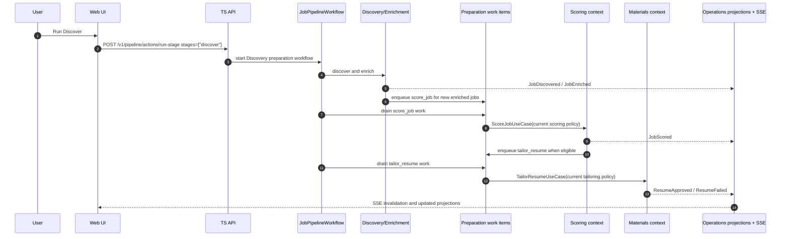

# Single Discovery Preparation Stage Implementation Plan

> **For agentic workers:** REQUIRED SUB-SKILL: Use superpowers:subagent-driven-development (recommended) or superpowers:executing-plans to implement this plan task-by-task. Steps use checkbox (`- [ ]`) syntax for tracking.

**Goal:** Make Discovery the single user-facing preparation stage while keeping scoring and tailoring as separate internal bounded contexts with versioned, event-driven orchestration.

**Architecture:** The UI and API expose one preparation stage named `discover`; internally, Pipeline Orchestration dispatches Discovery, Enrichment, Scoring, and Materials work through durable domain events and idempotent work items. Scoring remains owned by the Scoring context and Materials remains owned by the Materials Generation context; Discovery does not write scores or artifacts directly.

**Tech Stack:** Python automation worker, SQLite, Temporal local workflows, TypeScript Fastify API, React/Vite web app, shared contracts/domain-types packages, TanStack Query/SSE invalidation.

---

## Problem

JobHunter currently presents preparation as multiple user-facing stages:

```text
discover -> score -> tailor -> cover -> apply
```

That leaks implementation detail into the product workflow. From the user's perspective, the useful action is simpler: discover jobs and prepare the promising ones. Scoring and tailoring are still real domain concerns, but they should behave like internal subwork of Discovery unless the user deliberately asks for targeted maintenance actions such as rescore or re-tailor.

The change must not collapse the internal model. The codebase already has the right bounded contexts:

- Discovery owns job/source discovery and enrichment handoff.
- Scoring owns `JobScore`, score policy versions, corrections, stale markers, and fit evidence.
- Materials Generation owns `MaterialsSet`, tailored resumes, cover letters, PDFs, and artifact lifecycle.
- Pipeline Orchestration owns dispatch, retries, substatus, and workflow state.
- Operations owns projections and SSE-backed UI read models.

The target is a product simplification with stronger event-driven orchestration, not a domain rewrite.

## User-Facing Model

`Discover` is the only user-facing preparation stage.

When the user runs Discovery, JobHunter should:

1. Find and enrich jobs from configured sources.
2. Score newly discovered or newly enriched jobs with the current scoring policy.
3. Tailor only jobs whose latest score and eligibility satisfy the current threshold and hard-blocker conditions.
4. Leave apply as a separate explicit stage.

Scoring and tailoring details remain visible as diagnostic substatus in job detail, events, and operational views. They should not be separate primary stages in the standard user flow.

## Domain Model

The plan preserves the existing context boundaries:

| Concern | User sees | Internal owner |
| --- | --- | --- |
| Job/source discovery | Discover | Discovery |
| Detail enrichment | Discover substatus | Enrichment |
| Fit scoring | Discover substatus, score detail, rescore controls | Scoring |
| Tailored resume generation | Discover substatus, artifact detail, re-tailor controls | Materials Generation |
| Workflow dispatch/retry | Discover run and substatus | Pipeline Orchestration |
| Lists, dashboard, events | Live Discovery progress | Operations / Read-Side |

New domain language:

**Preparation Work Item**
- A durable command record for internal Discovery subwork.
- Keys: `tenant_id`, `job_id`, `kind`, `target_version`, `source_event_id`.
- Kinds: `score_job`, `tailor_resume`, `suppress_tailored_artifacts`.
- Used to make event handling idempotent and restartable.

**TailoringPolicy**
- Versioned configuration used to create tailored materials.
- Includes prompt version, user custom tailoring prompt hash, profile tailoring policy hash, generator model specs, judge model spec, judge threshold, schema version, and rollback metadata.

**TailorEligibility**
- Derived fact, not an LLM call.
- Inputs: latest fit score, hard blockers, score threshold, active state, latest tailoring policy version, and whether usable artifacts already exist.

**ArtifactSuppression**
- Soft removal of generated artifacts from active displays and downstream apply readiness.
- Preserves historical artifact rows and local files for audit unless a separate explicit delete action removes them.

## Event Flow



The important property is that every internal transition is event-backed and idempotent. If the process stops after scoring and before tailoring, the durable work item remains and a later Discovery run or repair action can continue from the same fact.

## Policy Versioning

### Scoring Policy

The existing scoring policy model remains the source of truth. A scoring algorithm, prompt, rubric, parser, or correction-derived anchor change creates a new `scoring_policies.version`.

Rules:

- New jobs discovered after a policy change use the current scoring policy.
- Existing jobs keep the score version and scoring policy version that produced their current score.
- Existing jobs are not silently rescored after scoring policy changes.
- A per-job rescore action scores one selected job with the current policy.
- A bulk rescore action scores every active job whose latest score was not produced by the current policy, subject to a limit/batch size.
- Corrected scores continue to be treated as user-authored facts and calibration anchors; bulk rescore must not erase correction history.

### Tailoring Policy

Add a parallel versioned policy for tailoring.

Rules:

- New tailored artifacts record the tailoring policy version used to create them.
- Tailoring prompt/config changes create a new tailoring policy version.
- New Discovery preparation work uses the current tailoring policy.
- Existing artifacts remain historical facts and are not silently regenerated.
- A per-job re-tailor action creates a new `MaterialsSet` generation with the current tailoring policy.
- A bulk re-tailor action enqueues every active eligible job whose latest active tailored artifact was not produced by the current tailoring policy, subject to a limit/batch size.

### Threshold Changes

The score threshold is not a scoring policy version. It is a live eligibility setting.

Rules:

- Lowering the threshold must apply to all discovered jobs by recomputing tailoring eligibility from persisted scores.
- Jobs that become eligible and do not already have active tailored artifacts must be enqueued for tailoring.
- Raising the threshold must apply to all discovered jobs by recomputing eligibility from persisted scores.
- Jobs that become ineligible must have active tailored artifacts soft-suppressed and removed from default display/downstream apply readiness.
- Threshold changes must not invoke the scoring LLM.

## API And UI Surface

Primary user actions:

- Run Discovery.
- Rescore this job with the current scoring policy.
- Rescore all jobs not scored with the current scoring policy.
- Re-tailor this job with the current tailoring policy.
- Re-tailor all eligible jobs not tailored with the current tailoring policy.

Diagnostics shown in job detail:

- Discovery/enrichment status.
- Latest score, scoring policy version, and stale/outdated state.
- Latest tailoring policy version for active tailored artifacts.
- Whether tailoring is pending, running, succeeded, failed, skipped, or suppressed.
- Suppression reason when an artifact is hidden because the threshold increased.

The main pipeline UI should no longer ask users to run `score` or `tailor` as primary stages. Those become maintenance actions and diagnostic substatus.

## Scaling And Reliability

Use durable, indexed work items instead of broad polling:

```text
preparation_work_items(
  tenant_id,
  item_id,
  job_id,
  kind,
  target_version,
  state,
  source_event_id,
  idempotency_key,
  attempts,
  last_error,
  created_at,
  updated_at,
  available_at
)
```

Recommended indexes:

- `(tenant_id, state, kind, available_at)`
- `(tenant_id, job_id, kind, target_version)`
- unique `(tenant_id, idempotency_key)`

This keeps work selection bounded and restartable. In local SQLite mode it avoids repeated unbounded scans; in a hosted future it maps cleanly to outbox/queue workers.

## Stacked PR Plan

### PR 1: Requirements And RFC

**Base:** `main`

**Files:**
- Create: `docs/plans/proposed/2026-05-26-single-discovery-preparation-stage.md`
- Modify: `docs/requirements.md`

**Acceptance:**
- Requirements include the single user-facing Discovery stage, scoring/tailoring policy versioning, threshold behavior, per-job and bulk rescore/re-tailor actions, event-driven work items, and artifact suppression.
- The plan states that internal bounded contexts remain separate.
- Markdown has no broken links.

### PR 2: Contracts And Domain Events

**Base:** PR 1 branch

**Files:**
- Modify: `packages/contracts/src/schemas.ts`
- Modify: `packages/contracts/src/rpc.ts`
- Modify: `packages/domain-types/src/events/index.ts`
- Modify: `packages/domain-types/src/events/materials.ts`
- Modify: `packages/domain-types/src/events/scoring.ts`
- Create: `packages/domain-types/src/events/preparation.ts`
- Modify or add colocated domain-types tests.

**Work:**
- Add typed events for `PreparationWorkItemQueued`, `PreparationWorkItemStarted`, `PreparationWorkItemCompleted`, `PreparationWorkItemFailed`, `TailoringPolicyUpdated`, `TailorRetailorRequested`, and `TailoredArtifactsSuppressed`.
- Add request/response contracts for per-job and bulk current-version re-tailor.
- Add request/response contracts for bulk current-policy rescore if the existing stale-score reset contract cannot express "not current policy".
- Keep `score` and `tailor` in low-level internal schemas only where existing RPC/backward compatibility requires them.

**Verification:**
- `pnpm --filter @jobhunter/domain-types check`
- `pnpm api:check`
- `pnpm --filter @jobhunter/web test-d`

### PR 3: Persistence And Policy Model

**Base:** PR 2 branch

**Files:**
- Modify: `workers/automation/src/jobhunter/database.py`
- Modify: `workers/automation/src/jobhunter/domain/materials/aggregate.py`
- Modify: `workers/automation/src/jobhunter/domain/materials/use_cases.py`
- Modify: `workers/automation/src/jobhunter/domain/ports/materials.py`
- Modify: `workers/automation/src/jobhunter/infrastructure/materials/`
- Create: `workers/automation/src/jobhunter/domain/preparation/`
- Create: `workers/automation/src/jobhunter/infrastructure/preparation/`
- Add Python tests under `workers/automation/tests/`.

**Work:**
- Add `tailoring_policies`.
- Persist tailoring policy version on `MaterialsSet` or artifact metadata in the latest-generation tables.
- Add `preparation_work_items` persistence with idempotent enqueue, claim, complete, fail, and retry operations.
- Add soft suppression state for active artifacts without deleting historical rows or files.

**Verification:**
- `uv --project workers/automation run --extra dev pytest -q workers/automation/tests/test_materials_use_cases.py workers/automation/tests/test_tailor_retailor.py`
- `uv --project workers/automation run --extra dev pytest -q workers/automation/tests/test_state_dashboard.py`
- `uv --project workers/automation run --extra dev ruff check .`

### PR 4: Discovery Preparation Orchestration

**Base:** PR 3 branch

**Files:**
- Modify: `workers/automation/src/jobhunter/pipeline/runner.py`
- Modify: `workers/automation/src/jobhunter/actions.py`
- Modify: `workers/automation/src/jobhunter/infrastructure/rpc/handlers.py`
- Modify: `workers/automation/src/jobhunter/scoring/scorer.py`
- Modify: `workers/automation/src/jobhunter/scoring/tailor.py`
- Modify: Temporal activity/workflow modules under `workers/automation/src/jobhunter/**/activities.py`.
- Add Python tests under `workers/automation/tests/`.

**Work:**
- Make user-facing `discover` run discovery, enrichment drain, score work-item drain, and eligible tailor work-item drain.
- Ensure scoring and tailoring still call their own use cases and repositories.
- Keep low-level `score` and `tailor` commands available for maintenance/backward compatibility where needed, but remove them from the primary user-facing pipeline path.
- Add threshold-change recomputation that enqueues new tailoring work or suppresses artifacts without rescoring.

**Verification:**
- `uv --project workers/automation run --extra dev pytest -q workers/automation/tests/test_jsonrpc_handlers.py workers/automation/tests/test_pipeline_observability.py workers/automation/tests/test_discovery_production_wiring.py`
- `uv --project workers/automation run --extra dev pytest -q workers/automation/tests/test_scoring_eval.py workers/automation/tests/test_scoring_eval_feedback.py workers/automation/tests/test_score_repository.py`
- `uv --project workers/automation run --extra dev ruff check .`

### PR 5: API, Projections, And SSE

**Base:** PR 4 branch

**Files:**
- Modify: `apps/api/src/server.ts`
- Modify: `apps/api/src/read-model.ts`
- Modify: `apps/api/src/write-model.ts`
- Modify: `apps/api/src/projections.ts`
- Modify: `apps/web/src/contexts/operations/invalidation-router.ts`
- Modify context handlers under `apps/web/src/contexts/*/handlers.ts`.
- Add or update API/web tests.

**Work:**
- Expose per-job and bulk re-tailor actions.
- Expose current scoring/tailoring policy version metadata and outdated counts.
- Project active artifact suppression so default artifact lists and apply readiness hide suppressed artifacts.
- Wire SSE invalidation for preparation work, tailoring policy changes, artifact suppression, rescore, and re-tailor events.

**Verification:**
- `pnpm api:test`
- `pnpm api:check`
- `pnpm --filter @jobhunter/web test`
- `pnpm --filter @jobhunter/web test-d`

### PR 6: Web Product Flow

**Base:** PR 5 branch

**Files:**
- Modify: `apps/web/src/contexts/pipeline/components/StageTriggerPanel.tsx`
- Modify: `apps/web/src/contexts/pipeline/components/JobActions.tsx`
- Modify: `apps/web/src/contexts/scoring/`
- Modify: `apps/web/src/contexts/materials/`
- Modify: `apps/web/src/views/jobs/`
- Modify or add MSW handlers in `apps/web/src/test/msw/handlers.ts`.
- Add or update colocated tests and Playwright specs.

**Work:**
- Present `Discover` as the single preparation action.
- Move score/tailor to diagnostic substatus and maintenance controls.
- Add per-job and bulk rescore/re-tailor buttons.
- Show suppressed artifacts only as historical/audit state, not active apply-ready material.
- Preserve URL/filter/list state during SSE updates.

**Verification:**
- `pnpm --filter @jobhunter/web test`
- `pnpm --filter @jobhunter/web test-d`
- `pnpm --filter @jobhunter/web e2e`
- Browser smoke through the local app for Discover, per-job rescore, bulk rescore, per-job re-tailor, and artifact suppression visibility.

### PR 7: QA Matrix And Architecture Docs

**Base:** PR 6 branch

**Files:**
- Modify: `docs/job-pipeline-architecture.md`
- Modify: `docs/local-ts-api.md`
- Modify: `docs/local-reliability-qa.md`
- Modify: `docs/architecture.md` if the runtime boundary text changes.

**Work:**
- Update the documented user-facing stage order to `discover -> apply`.
- Document internal Discovery preparation subwork and event flow.
- Add QA matrix rows for integrated Discovery preparation, scoring policy current-version actions, tailoring policy current-version actions, threshold lowering/raising, and artifact suppression.

**Verification:**
- `git diff --check`
- Markdown link validation from `docs/`
- Relevant doc-owned test commands if scripts exist.

## Acceptance Criteria

The full stack is done only when:

- The primary UI exposes one user-facing `Discover` preparation stage.
- Running Discover can find, enrich, score, and tailor eligible jobs without the user separately running `score` or `tailor`.
- Scoring and tailoring remain separate internal bounded contexts and use their existing use cases/repositories.
- Every score records scoring policy version.
- Every active tailored artifact records tailoring policy version.
- Scoring policy changes affect new jobs only until the user explicitly updates older jobs through per-job or bulk rescore.
- Tailoring policy changes affect new tailoring only until the user explicitly re-tailors one job or all outdated eligible jobs.
- Lowering the score threshold enqueues newly eligible untailored jobs.
- Raising the score threshold soft-suppresses active tailored artifacts for newly ineligible jobs and hides them from active artifact/apply readiness surfaces.
- Domain events and SSE invalidation keep job lists, job details, dashboard counts, and artifact lists current without full-page refreshes.
- The reliability matrix covers the new high-risk product paths.

## Self-Review

- Spec coverage: The plan covers the user's functional requirements for scoring-gated tailoring, versioned scoring, per-job and bulk rescore, threshold lowering/raising, versioned tailoring, per-job and bulk re-tailor, scaling, and event-driven execution.
- Scope check: The plan is intentionally stacked because it touches contracts, Python persistence/orchestration, API projections, web UI, and docs. Each PR is independently reviewable and testable.
- Boundary check: The plan does not merge bounded contexts. It changes the user-facing stage model while preserving Discovery, Scoring, Materials, Pipeline, and Operations ownership.
- Ambiguity check: "Single discovery stage" means one user-facing preparation stage. Internal diagnostic substatus and maintenance actions may still mention scoring and tailoring.
