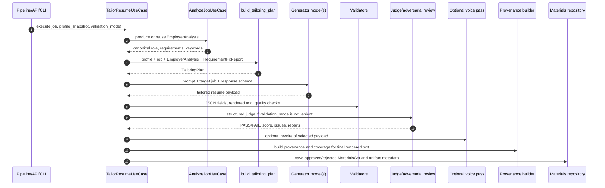

# Resume Tailoring Logic

This document explains how JobHunter generates a tailored resume for one job,
what question it asks the model, what the model is allowed to change, and which
checks decide whether the result becomes an approved artifact.

Tailoring is owned by the Materials bounded context. The main implementation is
in `workers/automation/src/jobhunter/domain/materials/use_cases.py`, supported
by deterministic quality checks in `quality.py`, content validation and assembly
in `services.py`, profile helpers in `resume_profile.py`, and provenance
construction in `provenance_builder.py`.

## Short Version

Requirement coverage is planned before writing. The model is not asked to write
one resume section per job requirement.

The model is asked:

```text
Here is the candidate's canonical master resume, the target job, the tailoring
policy, target profile, requirement-achievement coverage graph, required
profile evidence, allowed skills, verified metrics, and the quality plan.

Rewrite only these mutable resume fields and return JSON plus generated claim
mapping:
- executive_profile
- experience_updates for existing profile experience IDs
- skill_category_updates for existing profile skill category IDs
- generated_claim_mappings that link each generated claim to coverage edges,
  requirement IDs, evidence IDs, or a non-requirement reason such as pinned or
  positioning content
```

The target job and employer analysis decide what to emphasize. The existing
profile structure decides where generated text can go.

## End-to-End Flow



## Inputs To Tailoring

Tailoring combines several inputs. Each input has a different authority.

| Input | Source | What It Controls |
| --- | --- | --- |
| Candidate master resume | `ProfileSnapshot` / profile aggregate | The only source of candidate facts: summary, experience, education, skill categories, required bullets, real metrics |
| Tailoring policy | Profile tailoring rules | Claim policy, generation permissions, required content pins, max bullets, and advanced auto-approval |
| Writing style | Profile writing preferences | Tone, bullet standards, verbosity, advisory keyword emphasis, first-person preference |
| Target job | Job record | The target role, description, responsibilities, skills, and company context |
| Employer analysis | `EmployerAnalysis` aggregate | Grounded role framing, inferred seniority, requirements, and reasoned keywords |
| Requirement fit report | Scoring context, when available | Pre-tailoring fit by requirement, allowed evidence IDs, target keywords, prohibited claims, tailoring directives |
| Requirement-led coverage graph | Deterministic target-profile adapter plus constrained planner | Which profile achievements can cover which target requirements, which requirements are uncovered, which achievements are unused, and what claim policy each edge requires |
| Previous attempt feedback | Tailoring retry loop | Validation errors, judge repair instructions, adversarial blockers, warning-retry notes |

The target job is context, not candidate evidence. The prompt explicitly tells
the model not to copy target-job tools, systems, responsibilities, or business
claims into the candidate resume unless the same fact appears in the candidate's
master evidence.

## The Actual Model Prompt

`build_master_tailor_prompt()` builds the generator system prompt. The user
message then appends:

```text
ORIGINAL RESUME:
[baseline executive profile]

---

TARGET JOB:
[job blob]

Return the JSON:
```

That text is prompt-level guidance, not the main schema contract. The generator
call uses `LlmPort.chat_json(..., response_schema=TAILORED_RESUME_RESPONSE_SCHEMA)`,
so providers that support structured output receive the schema at the LLM
gateway boundary. If an adapter lacks `chat_json()`, `_chat_json_payload()` falls
back to `chat(..., response_schema=schema)` and parses the returned text. The
deterministic validators still run after the gateway returns a parsed payload.

The system prompt contains these sections:

- Mutable content boundary: executive profile, experience bullets, title field
  only where policy allows it, and skill category items.
- Fixed structure boundary: contact header, experience metadata, education, and
  section order are injected by code.
- Source-of-truth rules: profile data, required bullets, and real metrics are
  the only candidate evidence.
- Hard rules: return every required profile ID exactly once, preserve required
  bullets, include every requirement-covered achievement, do not add/remove
  experience, education, or skill categories, do not invent skills or metrics,
  and treat max bullet count as a layout budget that mandatory covered/pinned
  content may exceed with an audit reason.
- Writing method: use pinned evidence, order bullets strongest-to-weakest inside
  each experience entry, write result-first CAR/PAR bullets, order existing
  skills by truthful target overlap, and write a concise grounded summary.
- Master resume payloads: existing experience rows, education rows, and skill
  categories.
- Tailoring policy and writing style.
- Tailoring quality plan.
- Required experience IDs, required skill category IDs, and required bullets.
- Required output JSON shape.

## Output Schema

The generator must return JSON matching `TAILORED_RESUME_RESPONSE_SCHEMA`:

```json
{
  "executive_profile": "2-4 sentences tailored to the target role.",
  "experience_updates": [
    {
      "id": "existing_profile_experience_id",
      "title": "",
      "bullets": ["bullet 1", "bullet 2"]
    }
  ],
  "skill_category_updates": [
    {
      "id": "existing_profile_skill_category_id",
      "items": ["existing skill 1", "existing skill 2"]
    }
  ],
  "generated_claim_mappings": [
    {
      "claim_id": "claim_1",
      "location": "experience.existing_profile_experience_id.bullets[0]",
      "text": "Generated bullet text.",
      "claim_label": "evidence_reframed",
      "coverage_edge_ids": ["edge_req_1_ev_1_direct"],
      "requirement_ids": ["req_1"],
      "evidence_ids": ["ev_1"],
      "non_requirement_reason": "",
      "review_required": false
    }
  ]
}
```

The model cannot return contact info, education rows, new sections, comments,
warnings, or PDFs. The claim map is a sidecar audit contract; code still owns
assembly, provenance rows, final artifact metadata, and read models.

## What "Profile-Row Based" Means

The generated JSON is keyed by existing profile object IDs.

| Generated Field | Key | Based On | What The Model Can Do |
| --- | --- | --- | --- |
| `executive_profile` | No row ID | Baseline executive profile plus target role and quality plan | Rewrite the summary when policy allows it |
| `experience_updates[]` | Existing experience entry ID | One existing profile experience entry | Rewrite/order bullets for that entry, within max bullet count and evidence rules |
| `skill_category_updates[]` | Existing skill category ID | One existing profile skill category | Select/order exact existing skills from that category |
| Education | No model field | Existing profile education entries | Nothing; code injects it unchanged |
| Contact/header | No model field | Existing profile personal data | Nothing; code injects it |

Requirement directives influence which evidence and terms should be emphasized
inside those profile rows. They do not create one generated row per requirement.

For example, if the job has requirements for AI SDLC, developer platforms, and
security, the model does not return three requirement rows. It returns updated
bullets for the candidate's existing experience rows and selected existing
skills that best cover those requirements.

## Tailoring Plan

`build_tailoring_plan()` converts analysis and profile data into a compact plan
that both the generator and validators can use.

The plan includes:

- `target_seniority`: inferred from the job title/responsibilities.
- `job_keywords`: grounded keywords from `EmployerAnalysis` and requirement
  directives.
- `requirement_directives`: requirement-level instructions derived from the
  requirement fit report when it matches the same job and analysis generation.
- `required_evidence_ids`: profile evidence that must be represented.
- `seniority_evidence_ids`: profile evidence that supports senior/staff/director
  positioning.
- `verified_metrics`: metrics from profile constraints, achievement evidence,
  and baseline bullets.
- `prohibited_claims`: claims that must not appear because the requirement fit
  says they are missing/blocked or explicitly avoidable.
- `requirement_led_controls`: claim policy, generation permissions, required
  pins, writing style, revision gates, and advanced auto-approval policy after
  migrating legacy Preferences values.
- `target_profile`: must-have and nice-to-have requirements with safe excerpts,
  weights, keywords, and profile achievement IDs.
- `coverage_graph`: requirement nodes, achievement nodes, coverage edges,
  uncovered requirements, and unused achievements. Existing
  `RequirementFitReport.fit.evidence_ids` seed direct/transferable edges before
  the constrained planner can add more.
- `deterministic_checks`: a prompt-visible summary of important hard checks.

Requirement directives are sorted by priority, weight, and requirement ID. They
can say, for example:

- double down on a matched requirement,
- bridge a transferable gap using specific evidence,
- avoid claiming a missing or blocked requirement,
- target specific grounded keywords.

## Attempt Loop And Candidate Selection

`_run_attempts()` owns the generator retry loop.

For each attempt:

1. Start with the base tailor prompt.
2. Add `AVOID THESE ISSUES` when earlier attempts produced parse errors,
   validation errors, judge rejections, adversarial blockers, or retryable
   warnings.
3. Build two LLM messages:
   - system: the tailor prompt,
   - user: original resume baseline, target job blob, and JSON-only reminder.
4. Run each configured candidate model through `chat_json()` with
   `TAILORED_RESUME_RESPONSE_SCHEMA`.
5. Validate each candidate independently.
6. Judge each valid candidate unless `validation_mode` is `lenient`.
7. Optionally run adversarial review for high-fit jobs.
8. Select the best clean approved candidate by judge score.
9. If only warning-bearing approved candidates exist, retry while retry budget
   remains, then accept the best residual warning candidate only when allowed by
   the loop logic.

The retry loop is separate from the durable preparation work-item retry budget.
The inner loop improves one tailoring run. The durable work item controls how
many failed runs the background preparation queue auto-requeues.

## Validation Layers

Tailoring has multiple gates. Some are deterministic, some are LLM-judged.

### 1. Structured Output Schema

The LLM gateway is called with `TAILORED_RESUME_RESPONSE_SCHEMA` through
`chat_json()`. Provider adapters pass that schema as structured-output metadata
where supported and return a parsed dict. The prompt's "Return the JSON" wording
is redundant guardrail text, not the primary enforcement mechanism.

This catches malformed JSON and many shape errors before the tailoring
validators run.

### 2. JSON Field Validation

`ContentValidator.validate_json_fields()` checks the returned JSON against the
profile contract:

- `executive_profile` must exist and be non-empty.
- `experience_updates` must exist and be non-empty.
- `skill_category_updates` must exist and be non-empty.
- Each required experience ID must appear exactly once.
- Unknown or duplicate experience IDs are rejected.
- Experience bullet count cannot exceed the profile max unless every overflow
  bullet is mapped as pinned or requirement-covered content.
- Generated title must be empty or exactly match the source title.
- Each required skill category ID must appear exactly once.
- Unknown or duplicate skill category IDs are rejected.
- Skill items must exactly match skills already present in that profile
  category.
- LLM self-talk phrases are rejected.
- Watchlisted fabricated skills are rejected unless they are present in the
  allowed profile skills.
- Banned words are warnings in normal mode, errors in strict mode, and ignored
  in lenient mode.

### 3. Resume Assembly

`ResumeAssembler` turns the approved JSON payload into plain text.

It injects:

- name and contact,
- `EXECUTIVE PROFILE`,
- `EXPERIENCE` rows with source title/company/location/date metadata,
- `EDUCATION` from the profile,
- `SKILLS` with profile skill category labels.

It applies profile policy helpers:

- If summary rewrite is disabled, the baseline summary ships instead of the
  model's proposed summary.
- If achievement rewriting is disabled, source bullets ship instead of generated
  bullets.
- Required baseline bullets are appended if the model omitted them.
- If skill reordering is disabled, source skill order ships instead of generated
  order.

### 4. Rendered Resume Validation

`validate_tailored_resume()` checks the assembled text, not only the JSON:

- required section headings are present,
- required companies are still present,
- required education entries are still present,
- required skill category labels are still present.

### 5. Deterministic Tailoring Quality

`evaluate_tailoring_quality()` checks the payload and rendered text against the
`TailoringPlan`:

- standard resume sections exist,
- required evidence IDs are represented,
- all metrics are verified,
- prohibited claims do not appear,
- target keyword coverage is not extremely low,
- keyword repetition stays below stuffing thresholds,
- consecutive repeated words are warned,
- senior/staff/director jobs include supported ownership/scope/influence
  language when seniority evidence exists,
- executive phrasing on non-senior jobs is warned,
- stock phrase markers are warnings only.

Quality errors fail the candidate. Quality warnings can trigger a retry unless
they are label-only low-quality signals such as stock phrase markers.

### 6. Post-Generation Fit Gate

After assembly, requirement-led candidates are scored against the target
profile. The scorer records:

- final fit score,
- must-have coverage ratio,
- covered and uncovered requirement IDs,
- prioritized fixes,
- review blockers from adjacent or draft claims.

The versioned default gates are minimum fit score 8/10, must-have coverage
0.85, and one revision/enhancement attempt. If thresholds fail and claim policy
allows adjacent translation or draft confirmation, the retry loop receives the
prioritized fixes and uncovered requirements. Deterministic validators still
own fact safety: scoring can request revision, but it cannot approve unsupported
claims.

### 7. Structured Judge

`build_judge_prompt()` asks a separate judge model whether the tailored resume is
safe to show the user. The judge receives canonical profile evidence, allowed
skills, real metrics, the tailoring quality plan, the target job, the tailored
JSON, and the rendered resume.

The judge returns `TAILORING_JUDGE_RESPONSE_SCHEMA`:

- `verdict`: `PASS` or `FAIL`,
- `score`: 0-1,
- `criterion_scores`,
- `issues`,
- `unsupported_claims`,
- `fabrications`,
- `missing_required_evidence`,
- `repair_instructions`.

Approval requires:

- `verdict == PASS`,
- score at or above `tailorJudgeMinScore`,
- no unsupported claims, fabrications, or missing required evidence.

In `lenient` mode, the structured judge is skipped.

### 8. Adversarial Review

High-fit jobs can run an additional adversarial review after the judge approves.
If it finds blockers, the candidate becomes rejected and its blockers/repair
instructions feed the retry loop.

### 9. Optional Voice Pass

If a `VoicePort` is injected, the selected candidate can be rewritten for voice
after selection but before final provenance and coverage. The voice pass is kept
only when deterministic voice proxies improve and grounding re-validates. If it
introduces fabrication or regresses grounding, the pre-voice candidate ships.

## Persistence And Audit Data

After a parseable payload exists, the use case writes a text artifact for
inspection even when the final status is not approved. The artifact metadata is
the main audit surface for tailoring.

Approved resume metadata includes:

- validation mode and attempt count,
- tailoring policy ID/version,
- prompt/schema/judge schema versions,
- candidate models and selected model,
- selected candidate ID,
- judge model and judge threshold,
- quality plan,
- quality checks,
- post-generation fit score and revision decision,
- bullet-limit overflow reasons,
- adversarial review,
- retry/review feedback,
- change annotations,
- candidate summaries,
- judge result,
- voice pass result,
- keyword coverage read model.

Requirement-led audit data exposed to Apply Review is bounded and safe. It can
show covered requirements, uncovered requirements, unused achievement IDs,
evidence-backed generated claims, pinned claims, adjacent/draft claim labels,
bullet-limit overflow reasons, revision decisions, and review blockers. It
must not expose raw prompts, full profile payloads, full job descriptions, local
paths, PDFs, logs, browser data, or SQLite contents.

For accepted generations, `build_bullet_provenance()` records canonical
provenance rows. These rows are computed against the same final payload that
ships to the user, so `generated_text` matches the rendered resume text.

Provenance rows exist for:

- the executive profile line,
- each rendered experience bullet,
- each rendered skill category line.

Each provenance row records:

- section and source profile ID,
- profile evidence IDs,
- employer requirement IDs served by generated text,
- matched keywords present in generated text,
- transform type,
- governing control rule,
- rationale,
- generated text.

Failed re-tailor attempts do not destroy the last accepted generation's
artifact or provenance rows.

## Deterministic Versus LLM-Owned Work

| Area | Type | Notes |
| --- | --- | --- |
| Employer analysis drafting/synthesis | LLM/agentic | Produces grounded requirements and keywords before tailoring |
| Requirement fit scoring | LLM plus parser/domain model | Can provide requirement directives to tailor |
| Tailoring prompt assembly | Deterministic | Built from profile, job, analysis, fit report, policy, and style |
| Resume JSON generation | LLM | Constrained by strict output schema |
| JSON schema validation | Deterministic | Gateway/schema-level |
| Profile contract validation | Deterministic | Required IDs, allowed skills, title safety, max bullets |
| Text assembly | Deterministic | Code injects fixed sections and profile metadata |
| Rendered text validation | Deterministic | Checks final text has required structure/profile anchors |
| Tailoring quality checks | Deterministic | Evidence, metrics, prohibited claims, keyword coverage/repetition, seniority signals, stock phrases |
| Structured judge | LLM | Independent pass/fail quality and safety gate |
| Adversarial review | LLM | Optional high-fit challenge review |
| Voice pass | LLM plus deterministic gate | Optional, only retained if grounded and improved |
| Provenance and coverage rows | Deterministic | Built from final generated text, profile evidence, and employer analysis |

## Current Constraints

The current schema is intentionally narrow. It does not let the model return:

- `has_metric`,
- `dropped`,
- `warnings`,
- requirement-row output,
- new experience entries,
- new skill categories,
- education changes.

Those concepts can be added only by changing the schema and every owning layer:
prompt, validator, assembler, provenance builder, artifact metadata, tests, API
read models, and UI inspection surfaces.

The current implementation can safely:

- rewrite the executive profile when policy allows it,
- rewrite and order bullets inside existing experience entries,
- select and order existing skill strings inside existing skill categories,
- preserve required bullets,
- preserve every requirement-covered achievement even when that exceeds the max
  bullet budget,
- label generated claims with requirement/evidence coverage or pinned/
  positioning reasons,
- score generated output against the target profile and route one gated
  revision/enhancement pass,
- compute post-generation provenance and requirement coverage.

The current implementation cannot safely:

- add a new job requirement as a new resume row,
- invent a new skill because the job asks for it,
- rewrite source work-history titles with job keywords,
- reorder experience entries independently of the profile order,
- remove education or required experience,
- treat a keyword as covered unless it appears in the generated resume text or
  generation-time provenance.

## Common Failure Reasons

`failed_validation` usually means a deterministic gate failed. Common examples:

- missing `executive_profile`, `experience_updates`, or `skill_category_updates`,
- missing required experience or skill category IDs,
- unknown extra IDs,
- duplicate IDs,
- too many optional bullets for the profile max,
- non-empty generated title that does not exactly match the source title,
- fabricated skill,
- LLM self-talk,
- required company/education/category missing after rendering,
- required evidence missing,
- unknown metric,
- prohibited claim,
- severe keyword stuffing,
- seniority mismatch for senior/staff/director jobs.

`failed_judge` means deterministic validation passed, but the structured judge
did not approve or scored below the configured threshold.

`failed_adversarial_review` means the structured judge approved, but the
adversarial review found blockers.

`exhausted_retries` means the inner tailoring loop could not produce an
acceptable candidate within its retry budget. The durable preparation queue has
its own retry budget outside this inner loop.

## How To Change Tailoring Safely

When changing tailoring behavior, update the owning layer rather than masking
the symptom in the UI.

| Desired Change | Owning Layer |
| --- | --- |
| Change what the generator is asked to do | `build_master_tailor_prompt()`, prompt version, prompt tests |
| Change allowed output fields | `TAILORED_RESUME_RESPONSE_SCHEMA`, validator, assembler, provenance, tests, API/UI read models |
| Change deterministic validation | `ContentValidator` or `evaluate_tailoring_quality()` plus focused tests |
| Change keyword source | `EmployerAnalysis` / `build_tailoring_plan()` |
| Change requirement-level tailoring directives | requirement fit report/domain scoring layer and `_requirement_directive_items()` |
| Change approval semantics | judge schema/prompt, `_judge_resume()`, retry loop tests |
| Change displayed audit trail | persist the missing audit data first, then update projections/API/UI |
| Change final rendered content | assembler/render pipeline plus provenance and coverage tests |

At minimum, prompt or validator changes should update the focused materials
tests under `workers/automation/tests/test_materials_use_cases.py` and
`workers/automation/tests/test_materials_quality.py`. User-facing inspection
changes should also exercise the API/web path that displays the audit data.

## Key Code Pointers

- `TailorResumeUseCase.execute()`: overall transaction, generation, voice/audit,
  artifact write, metadata, persistence.
- `_run_analyze()`: resolves or produces canonical employer analysis.
- `_run_attempts()`: retry loop, candidate fan-out, warning retry, candidate
  selection.
- `build_master_tailor_prompt()`: generator prompt and output contract.
- `TAILORED_RESUME_RESPONSE_SCHEMA`: strict generator output schema.
- `_run_candidate()`: LLM call, validation, assembly, quality checks, judge,
  adversarial review.
- `build_judge_prompt()` and `_judge_resume()`: independent structured judge.
- `build_tailoring_plan()`: analysis/fit/profile to quality plan.
- `evaluate_tailoring_quality()`: deterministic quality gate.
- `ContentValidator`: JSON and rendered resume validation.
- `ResumeAssembler`: JSON payload to final resume text.
- `build_bullet_provenance()`: final text to provenance rows.
