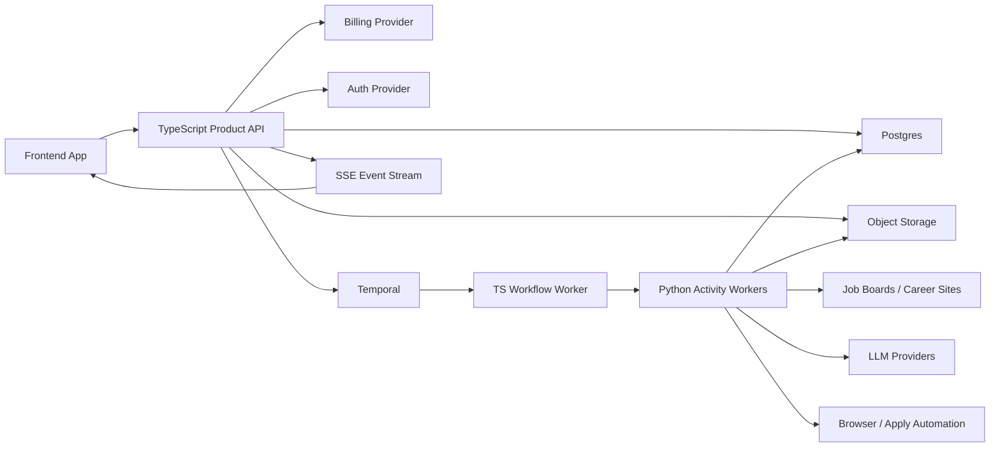

# TypeScript Product API + Python Workers Architecture Plan

## Purpose

This document captures the target architecture for evolving JobHunter from a
local Python application with an embedded dashboard into a production SaaS
product with:

- a TypeScript product API,
- a real frontend application,
- durable workflow orchestration,
- Python automation workers,
- multi-tenant storage,
- secure artifact handling,
- auditable user and worker activity.

The goal is not to rewrite the automation engine for its own sake. The goal is
to split product responsibilities from automation responsibilities so that the
system can scale, recover from partial failures, expose safe UI controls, and
support subscription billing.

## Executive Recommendation

Use a TypeScript product API for user-facing product concerns and keep Python
for automation work.

Recommended stack:

- Frontend: React application, preferably Vite + TanStack Router for a pure
  authenticated dashboard, or Next.js if server-rendered product pages and
  auth-heavy routing become important.
- Product API: TypeScript, NestJS with Fastify adapter as the default
  production choice. Pure Fastify remains a good leaner alternative.
- Workflows: Temporal.
- Workers: Python activity workers wrapping the current discovery,
  enrichment, scoring, tailoring, PDF, apply, and resume-import modules.
- Database: Postgres.
- Artifacts: object storage with signed preview/download URLs.
- Realtime: Server-Sent Events first; WebSockets later only if needed.
- Deployment: Cloudflare for DNS/WAF/CDN/static frontend, container runtime
  for API/workers, managed Postgres, managed object storage, managed Temporal.

The product API should own identity, tenancy, billing, authorization, API
contracts, workflow commands, and read models. Python workers should execute
side-effectful automation and return typed results/events.

## Current Architecture Review

### P0: The Current Dashboard Server Is A Local Control Plane, Not A Product API

`src/jobhunter/dashboard_server.py` uses `BaseHTTPRequestHandler` as router,
controller, static server, command runner, local file opener, profile editor,
and JSON API.

Current endpoints include:

- `GET /`
- `GET /api/health`
- `GET /api/dashboard`
- `GET /api/jobs`
- `GET /api/artifacts`
- `GET /api/job`
- `GET /api/profile-config`
- `PATCH /api/config`
- `PATCH /api/profile-config`
- `POST /api/profile-import`
- `POST /api/retry`
- `POST /api/command`
- `POST /api/open-artifact`
- `DELETE /api/jobs`

This is workable for a trusted local dashboard, but it is not safe as a hosted
SaaS API because it mixes:

- HTTP routing,
- file writes,
- profile and template mutation,
- SQLite reads/writes,
- subprocess execution,
- local filesystem opening,
- CORS behavior,
- dashboard HTML serving,
- worker-like command execution.

Production implication: replace this with a TypeScript API that exposes typed
product actions. Do not carry `POST /api/command` forward as a hosted endpoint.

### P0: Sensitive Data Is Stored And Logged As Local Files

Current local storage is rooted under `JOBHUNTER_DIR` or `~/.jobhunter` in
`src/jobhunter/config.py`.

Sensitive local files and folders include:

- `profile.json`
- `.env`
- `resume.txt`
- `resume.pdf`
- `resume_template.tex`
- `resume_style.json`
- `dashboard.json`
- `tailored_resumes/`
- `cover_letters/`
- `logs/`
- `chrome-workers/`
- `apply-workers/`

Risk areas:

- `profile.json` can include personal data and application credentials.
- `.env` stores provider keys in plaintext.
- apply prompts can embed profile data, resume text, cover letter text, upload
  paths, job-site credentials, and automation keys.
- tailoring reports can persist prompts, raw job descriptions, raw LLM
  responses, parsed JSON, and generated resume text.
- browser-worker profiles can include cookies, sessions, local storage, and
  browser databases.
- generated artifacts are path-based and deletion removes DB rows without
  necessarily deleting files.

Production implication: secrets must move to encrypted secret storage, artifacts
must move to object storage, logs must be redacted, and sensitive prompt/output
payloads must be treated as encrypted artifacts rather than default logs.

### P1: Workflow State Has Multiple Sources Of Truth

`src/jobhunter/database.py` stores a wide `jobs` table keyed by `url`. That row
contains discovery, enrichment, scoring, tailoring, cover-letter, PDF, and apply
fields.

The newer state model adds:

- `job_stage_states`
- `job_events`
- `job_artifacts`

`src/jobhunter/state.py` still derives legacy stage state from nullable columns,
then merges that with explicit stage rows.

Production implication: the product model needs one canonical source of truth.
The recommended source is `job_stage_states` plus append-only `job_events`, with
legacy columns imported only during migration.

### P1: URLs Are Used As Primary Identity

The current `jobs.url` primary key is fragile:

- enrichment can resolve and mutate URLs,
- duplicate or redirected jobs become hard to model,
- external URLs are too long and unstable for product identity,
- tenant scoping cannot be safely expressed with only URL identity.

Production implication: use stable internal IDs such as UUID or ULID. Preserve
source URL and canonical URL as fields with `UNIQUE (tenant_id, canonical_url)`.

### P1: The Current Pipeline Is Not Durable Or Distributed

`src/jobhunter/pipeline.py` orchestrates stages in-process. It has stage
helpers, a streaming mode, and a single-job mode, but the execution model is
still local-process orchestration with DB polling and threads.

Current stage definitions are also inconsistent:

- pipeline stages omit `apply`,
- state stages include `apply`.

Production implication: use a durable workflow engine. Temporal should own
job-level and batch-level workflow progression, retries, cancellation,
heartbeats, timeouts, and recovery.

### P1: The Frontend Is Generated HTML/JS, Not A Product Frontend

`src/jobhunter/view.py` generates CSS, JavaScript, and HTML as Python strings.
The frontend currently owns:

- KPI rendering,
- funnel rendering,
- jobs list,
- artifacts list,
- job drawer,
- profile editor,
- style editor,
- retry actions,
- delete actions,
- local artifact opening,
- dashboard polling.

Pain points:

- no typed component boundary,
- no generated client,
- no frontend routing model,
- no auth/session model,
- no tenant model,
- hardcoded command strings,
- imperative global state,
- limited testability.

Production implication: move this to a real frontend app using typed API
contracts and component-level tests.

### P1: Artifacts Are Local Paths Instead Of Product Objects

Generated resumes, cover letters, PDFs, LaTeX debug files, prompts, reports,
logs, and upload copies are currently represented primarily as filesystem paths.

Production implication: artifacts should be rows in Postgres and bytes in
object storage. A user should interact with artifact IDs, preview URLs, and
download URLs, never host-local paths.

### P1: Product Actions Are Currently Shell Commands

The dashboard still exposes copyable commands and, in some places, direct
command execution through the local API.

Production implication: product actions must be structured API calls such as:

- retry this stage,
- generate materials,
- apply to this job,
- cancel this run,
- delete selected jobs,
- import profile from resume,
- preview resume.

The UI can still show copyable CLI commands for local workflows, but the hosted
product should not depend on shell command strings.

## Target System Boundaries

### TypeScript Product API Owns

- user authentication,
- tenant and membership model,
- billing and usage limits,
- API contracts,
- dashboard read models,
- job CRUD,
- job filtering, sorting, and pagination,
- profile and resume-style configuration,
- artifact metadata and authorization,
- workflow creation and control,
- worker command dispatch,
- realtime event streams,
- audit logging,
- admin/support tooling.

### Python Workers Own

- job discovery,
- job-detail enrichment,
- LLM scoring,
- resume tailoring,
- cover-letter generation,
- PDF generation,
- resume PDF import/extraction,
- apply automation,
- provider-specific browser or scraping integration.

### Workflow Engine Owns

- durable job workflows,
- batch workflows,
- retries,
- cancellation,
- timeouts,
- worker heartbeats,
- stage dependencies,
- idempotency,
- resume-after-crash behavior.

### Frontend Owns

- dashboard UX,
- profile editor UX,
- resume style editor UX,
- jobs and artifacts tables,
- job drawer,
- workflow action buttons,
- optimistic UI where safe,
- realtime updates,
- form validation presentation.

## Proposed Monorepo Layout

```text
apps/
  web/
    src/
      app/
      components/
      features/
      routes/
      api-client/
      styles/

services/
  api/
    src/
      modules/
        auth/
        tenants/
        billing/
        jobs/
        stages/
        workflows/
        profiles/
        artifacts/
        events/
        settings/
        secrets/
        admin/
        webhooks/
      main.ts

  orchestrator/
    src/
      workflows/
      activities/
      task-queues/

  workers-python/
    jobhunter_workers/
      discovery/
      enrichment/
      scoring/
      tailoring/
      pdf/
      apply/
      profile_import/

packages/
  contracts/
    openapi/
    events/
    generated/

  ui/
    components/
    tokens/

  config/
    eslint/
    tsconfig/
    env/

infra/
  terraform/
  migrations/
  docker/
```

## TypeScript API Framework Decision

Recommended default: NestJS with Fastify adapter.

Why this is the default for this product:

- the product API will have many bounded modules,
- auth and tenant guards need to be consistently applied,
- billing webhooks need a clear module boundary,
- DTO validation and OpenAPI generation matter,
- admin APIs need stricter structure,
- the team may grow,
- background workflow commands need consistent validation and authorization.

When to choose pure Fastify instead:

- the team wants a smaller framework,
- API surface remains narrow,
- OpenAPI and dependency injection can be kept simple,
- faster cold start and lower abstraction overhead are more important than
  framework structure.

When to choose Hono:

- the API is intentionally deployed at the edge,
- most routes are lightweight request/response operations,
- there is no heavy workflow integration in the same service.

Recommended split:

- product API in NestJS/Fastify on containers,
- optional edge/BFF routes later if needed,
- no system-of-record business logic inside frontend route handlers.

## Frontend Framework Decision

Use React. The main choice is Vite vs Next.js.

Choose Vite + TanStack Router if:

- the app is primarily an authenticated dashboard,
- SEO does not matter for the dashboard,
- we want simple static hosting,
- the API is fully separate,
- we want low deployment complexity.

Choose Next.js if:

- product pages, onboarding, account pages, and dashboard share one app,
- server-side session checks are valuable,
- auth callback handling and layout composition matter,
- server-rendered product experiences become important.

Recommendation for the current product direction:

- start with Vite + TanStack Router for the dashboard app,
- keep marketing/docs separate or static,
- revisit Next.js only when server-rendering creates clear product value.

## High-Level Runtime Architecture



## Product API Modules

### Auth

Responsibilities:

- session validation,
- JWT validation,
- service-token validation,
- API key validation if exposed later,
- CSRF protection for cookie-auth write routes.

### Tenants

Responsibilities:

- tenants,
- users,
- memberships,
- roles,
- invitations,
- tenant-scoped authorization.

### Billing

Responsibilities:

- plans,
- subscriptions,
- usage ledger,
- quota checks,
- billing-provider webhooks,
- trial state,
- entitlement checks.

### Profiles

Responsibilities:

- applicant profile,
- resume facts,
- work authorization defaults,
- compensation defaults,
- required experiences,
- required bullets,
- tailoring constraints,
- writing style controls,
- prompt customization,
- resume style,
- template versions,
- resume import drafts.

### Jobs

Responsibilities:

- job creation,
- job list,
- global filtering,
- global sorting,
- pagination,
- job detail,
- job updates,
- bulk delete,
- manual URL intake.

### Stages

Responsibilities:

- current stage state,
- retries,
- exhaustion,
- blocking reasons,
- next action,
- stage attempt history.

### Workflows

Responsibilities:

- start workflow,
- cancel workflow,
- retry stage,
- pause/resume where supported,
- expose workflow run status,
- map UI actions to durable workflow commands.

### Artifacts

Responsibilities:

- artifact metadata,
- artifact versions,
- upload registration,
- preview URL generation,
- download URL generation,
- retention status,
- deletion.

### Events

Responsibilities:

- job events,
- stage events,
- worker events,
- workflow events,
- realtime SSE stream,
- event cursors.

### Secrets

Responsibilities:

- secret metadata,
- encrypted provider credentials,
- encrypted job-site credentials,
- key rotation hooks,
- decrypt audit trail.

### Admin

Responsibilities:

- support visibility,
- tenant health,
- stuck workflow recovery,
- usage inspection,
- operational audit views.

## Core API Contract

### Dashboard

```http
GET /v1/dashboard/summary
```

Returns:

- totals,
- funnel counts,
- stage failure counts,
- blocked counts,
- ready-to-apply queue count,
- recent activity,
- active worker/apply runs.

### Jobs

```http
GET    /v1/jobs
POST   /v1/jobs
GET    /v1/jobs/:jobId
PATCH  /v1/jobs/:jobId
DELETE /v1/jobs/:jobId
POST   /v1/jobs/bulk-delete
```

List query parameters:

- `cursor`
- `pageSize`
- `sort`
- `dir`
- `q`
- `stage`
- `state`
- `source`
- `company`
- `minFitScore`
- `maxFitScore`
- `createdFrom`
- `createdTo`

Sorting must be global, handled by SQL, not just the currently displayed page.

### Job Actions

```http
POST /v1/jobs/:jobId/actions/retry-stage
POST /v1/jobs/:jobId/actions/generate-materials
POST /v1/jobs/:jobId/actions/apply
POST /v1/jobs/:jobId/actions/cancel
POST /v1/jobs/:jobId/actions/mark-applied
POST /v1/jobs/:jobId/actions/mark-skipped
```

Actions return:

- `workflowRunId`,
- accepted command payload,
- current stage state,
- realtime stream cursor.

### Artifacts

```http
GET /v1/artifacts
GET /v1/artifacts/:artifactId
GET /v1/artifacts/:artifactId/preview
GET /v1/artifacts/:artifactId/download
DELETE /v1/artifacts/:artifactId
```

Artifact rows should expose:

- `artifactId`,
- `jobId`,
- `stage`,
- `type`,
- `status`,
- `mimeType`,
- `sizeBytes`,
- `createdAt`,
- `createdByRunId`,
- `previewUrl`,
- `downloadUrl`.

### Profile

```http
GET   /v1/profile
PATCH /v1/profile
POST  /v1/profile/import-resume
POST  /v1/profile/preview
POST  /v1/profile/style/preview
```

Profile writes should use optimistic concurrency with an `etag` or version ID.

### Workflow Runs

```http
GET /v1/workflow-runs/:runId
GET /v1/workflow-runs/:runId/events
```

### Realtime

```http
GET /v1/events/stream?cursor=...
```

Start with Server-Sent Events. Event payloads should include:

- `eventId`,
- `tenantId`,
- `type`,
- `occurredAt`,
- `jobId`,
- `workflowRunId`,
- `stageRunId`,
- `payload`.

## Canonical Data Model

### Identity And Tenancy

```text
tenants
  id
  name
  plan
  created_at
  updated_at

users
  id
  email
  name
  auth_provider_subject
  created_at
  updated_at

tenant_memberships
  tenant_id
  user_id
  role
  created_at
```

Every product table should carry `tenant_id`.

### Profiles

```text
applicant_profiles
  id
  tenant_id
  owner_user_id
  current_version_id
  created_at
  updated_at

profile_versions
  id
  tenant_id
  profile_id
  version
  profile_json
  created_by_user_id
  created_at

resume_style_versions
  id
  tenant_id
  profile_id
  version
  style_json
  created_by_user_id
  created_at

resume_template_versions
  id
  tenant_id
  profile_id
  version
  template_kind
  template_json
  template_source_artifact_id
  created_by_user_id
  created_at
```

Raw LaTeX should not be the primary user-facing style model. The user-facing
model should be structured style data, rendered through controlled templates.

### Jobs

```text
jobs
  id
  tenant_id
  source_url
  canonical_url
  application_url
  title
  company
  source
  strategy
  salary
  location
  description
  full_description
  discovered_at
  created_at
  updated_at
```

Recommended constraint:

```text
UNIQUE (tenant_id, canonical_url)
```

### Stage State

```text
job_stage_states
  tenant_id
  job_id
  stage
  state
  attempt_count
  max_attempts
  workflow_run_id
  stage_run_id
  worker_id
  lease_expires_at
  heartbeat_at
  started_at
  updated_at
  finished_at
  duration_ms
  error_code
  error_message
  retryable
  blocked_by_json
  next_action
  metadata_json
```

Canonical stages:

```text
discover
enrich
score
tailor
cover
pdf
apply
```

Canonical states:

```text
pending
queued
running
succeeded
failed
blocked
skipped
exhausted
canceled
stale
```

### Events

```text
job_events
  id
  tenant_id
  job_id
  workflow_run_id
  stage_run_id
  event_type
  severity
  message
  payload_json
  occurred_at
```

This should be append-only.

### Workflow And Automation Runs

```text
workflow_runs
  id
  tenant_id
  workflow_type
  status
  requested_by_user_id
  temporal_workflow_id
  temporal_run_id
  input_json
  result_json
  created_at
  started_at
  finished_at

automation_runs
  id
  tenant_id
  job_id
  workflow_run_id
  stage
  worker_id
  model
  status
  dry_run
  headless
  token_usage_json
  cost_json
  error_code
  error_message
  created_at
  started_at
  finished_at
```

### Artifacts

```text
artifacts
  id
  tenant_id
  job_id
  stage
  artifact_type
  content_type
  storage_key
  sha256
  size_bytes
  status
  version
  created_by_run_id
  retention_expires_at
  created_at
  updated_at
```

Artifact types:

- `base_resume_pdf`
- `base_resume_text`
- `tailored_resume_text`
- `tailored_resume_pdf`
- `cover_letter_text`
- `cover_letter_pdf`
- `resume_template`
- `tailoring_report`
- `apply_log`
- `profile_import_source_pdf`
- `profile_import_extraction`

### Secrets

```text
tenant_secrets
  id
  tenant_id
  kind
  display_name
  vault_ref
  created_by_user_id
  created_at
  rotated_at
  revoked_at
```

Do not store raw secrets in profile JSON.

### Audit Log

```text
audit_log
  id
  tenant_id
  actor_type
  actor_id
  action
  resource_type
  resource_id
  request_id
  ip_address
  user_agent
  outcome
  metadata_json
  occurred_at
```

Audit records should not contain raw PII or secrets.

## Workflow Design

### Job Workflow

Each job should have a durable workflow with stage transitions:

```text
discover -> enrich -> score -> tailor -> cover -> pdf -> apply
```

The workflow should:

- evaluate prerequisites before each stage,
- mark blocked states explicitly,
- retry retryable failures,
- stop on exhausted failures,
- emit events after every transition,
- create artifact records for every generated file,
- support manual retry from any failed/exhausted stage,
- support cancellation.

### Batch Workflow

A batch workflow should:

- discover jobs from configured sources,
- create or update job records,
- fan out job workflows,
- enforce tenant concurrency limits,
- record aggregate progress,
- expose batch-level status to the UI.

### Apply Workflow

Apply automation is the most sensitive workflow and should be isolated.

It should:

- require explicit user confirmation unless the tenant has enabled auto-apply,
- support dry run without marking jobs applied,
- never share browser state between tenants,
- avoid storing raw cookies/session files unless explicitly required,
- store logs as restricted artifacts,
- redact secrets from events,
- produce a verifiable final result.

Hosted apply automation may require a separate security decision. A safer first
production model is local user-runner apply automation controlled by the hosted
product API.

## Python Worker Contract

Python workers should accept typed activity inputs and return typed activity
results.

Example activity input:

```json
{
  "tenantId": "ten_...",
  "jobId": "job_...",
  "workflowRunId": "wf_...",
  "stageRunId": "sr_...",
  "profileVersionId": "pv_...",
  "styleVersionId": "sv_...",
  "artifactInputs": ["art_..."],
  "options": {
    "minFitScore": 7,
    "dryRun": false,
    "model": "default"
  }
}
```

Example activity result:

```json
{
  "status": "succeeded",
  "stage": "tailor",
  "artifacts": [
    {
      "type": "tailored_resume_pdf",
      "contentType": "application/pdf",
      "storageKey": "tenants/ten_.../jobs/job_.../resume.pdf",
      "sha256": "...",
      "sizeBytes": 190700
    }
  ],
  "metrics": {
    "durationMs": 42000,
    "inputTokens": 1200,
    "outputTokens": 800,
    "costUsd": "0.014"
  },
  "warnings": []
}
```

Workers should not independently invent product state. They should emit
structured results and events that the workflow/API can validate.

## Realtime Model

Use SSE for the first production realtime implementation.

Event types:

- `job.created`
- `job.updated`
- `job.deleted`
- `job.stage.queued`
- `job.stage.started`
- `job.stage.succeeded`
- `job.stage.failed`
- `job.stage.blocked`
- `job.stage.exhausted`
- `artifact.created`
- `artifact.updated`
- `workflow.run.started`
- `workflow.run.updated`
- `workflow.run.finished`
- `profile.updated`
- `billing.usage_recorded`

Frontend behavior:

- lists should not reload wholesale on a timer,
- filters and sort state should remain stable,
- incoming events should patch visible rows,
- if an event affects the active filter count, the UI should update counts
  without resetting user selection,
- manual refresh should remain available.

## Security Requirements

Minimum production requirements:

- authenticated API access,
- tenant authorization on every route,
- CSRF protection for cookie-auth write routes,
- rate limiting,
- request IDs,
- audit logging,
- encrypted secrets,
- signed artifact URLs,
- object-store lifecycle policies,
- redacted logs,
- LLM prompt/output retention controls,
- deletion workflow covering DB rows, artifacts, search indexes, queue jobs,
  and backups,
- tenant isolation tests,
- admin action auditing.

Data that should be treated as high risk:

- resumes,
- cover letters,
- profile data,
- addresses,
- phone numbers,
- compensation data,
- job-site passwords,
- provider API keys,
- browser cookies,
- generated prompts,
- raw LLM outputs,
- apply logs.

## Deployment Model

Recommended production setup:

- Cloudflare:
  - DNS,
  - WAF,
  - CDN,
  - bot protection,
  - static frontend hosting.
- Container runtime:
  - TypeScript API,
  - Temporal workflow workers,
  - Python activity workers.
- Managed Postgres:
  - product data,
  - workflow read models,
  - audit log.
- Object storage:
  - resumes,
  - cover letters,
  - PDFs,
  - logs,
  - reports,
  - import sources.
- Temporal Cloud:
  - durable workflows,
  - retries,
  - worker visibility.
- Secret manager:
  - provider keys,
  - job-site credentials,
  - worker secrets.
- Billing provider:
  - subscriptions,
  - checkout,
  - invoices,
  - usage metering.
- Observability:
  - OpenTelemetry,
  - error tracking,
  - LLM tracing with redaction,
  - metrics dashboards.

## Migration Plan

### Phase 0: Freeze Current Behavior

Add contract snapshots for:

- dashboard summary,
- jobs list,
- job detail,
- artifacts list,
- profile config,
- profile import,
- retry,
- delete.

The current API contracts are implicit in `src/jobhunter/view.py` and
`src/jobhunter/state.py`. Freeze them before porting.

### Phase 1: Define Product Contracts

Create `packages/contracts` with:

- OpenAPI schemas,
- event schemas,
- generated TypeScript client,
- Python DTO validation models for worker payloads.

Do this before building the new API.

### Phase 2: Introduce Postgres Schema

Create migrations for:

- tenants,
- users,
- memberships,
- jobs,
- stage states,
- events,
- workflow runs,
- automation runs,
- artifacts,
- profiles,
- style/template versions,
- settings,
- secrets,
- usage ledger,
- audit log.

### Phase 3: Build A Legacy Importer

Treat one local app directory as one tenant import.

Import:

- `jobhunter.db`,
- `profile.json`,
- `resume.txt`,
- `resume.pdf`,
- `resume_template.tex`,
- `resume_style.json`,
- `searches.yaml`,
- `dashboard.json`,
- tailored resume artifacts,
- cover letter artifacts.

Do not import by default:

- browser profiles,
- raw logs,
- MCP configs,
- temporary worker folders.

Sensitive-log import should be a separate explicit action with redaction.

### Phase 4: Build Read-Only TS API

Implement:

- auth,
- tenant context,
- dashboard summary,
- jobs list/detail,
- artifacts list/detail,
- profile read,
- settings read.

Validate against legacy contract snapshots.

### Phase 5: Move Frontend To A Real App

Port:

- dashboard,
- jobs list,
- artifacts list,
- job drawer,
- profile editor,
- style editor,
- profile import,
- action buttons.

Use the generated TypeScript API client. Remove dashboard list polling and
replace it with SSE-driven updates.

### Phase 6: Add Workflow Orchestration

Introduce Temporal with:

- job workflow,
- batch workflow,
- profile import workflow if needed,
- artifact generation workflow,
- apply workflow as a later isolated milestone.

Start with enrich, score, tailor, cover, and PDF. Leave apply for a dedicated
security pass.

### Phase 7: Wrap Python Modules As Activities

Wrap existing Python modules behind typed worker entrypoints.

Activities should:

- accept typed input,
- resolve tenant-scoped secrets,
- write artifacts to object storage,
- return typed outputs,
- emit stage events,
- avoid direct product DB mutation except through controlled repositories or
  activity result commits.

### Phase 8: Replace Command Execution

Remove hosted reliance on command strings.

Replace:

- `jobhunter retry ...`
- `jobhunter apply ...`
- `jobhunter run ...`

with structured API actions that start workflows.

The CLI can remain as:

- local developer tool,
- local worker runner,
- API client for advanced users.

### Phase 9: Harden Apply Automation

Before hosted apply automation:

- isolate browser profiles per tenant and run,
- decide whether cookies are ever stored,
- define consent boundaries,
- redact logs,
- verify dry-run semantics,
- enforce apply concurrency limits,
- define external-site failure policy,
- decide local-runner vs hosted-runner model.

### Phase 10: Production Readiness

Add:

- tenant isolation tests,
- authz tests,
- contract tests,
- workflow replay tests,
- worker idempotency tests,
- frontend Playwright tests,
- artifact authorization tests,
- load tests for lists and events,
- backup/restore drills,
- billing webhook tests,
- deletion/retention tests.

## Test Strategy

### API Tests

- route validation,
- auth required,
- tenant isolation,
- pagination,
- global sorting,
- filtering,
- optimistic concurrency,
- artifact authorization,
- structured action dispatch,
- billing quota enforcement.

### Contract Tests

- OpenAPI schema snapshots,
- generated client compatibility,
- legacy DTO parity tests during migration.

### Worker Tests

- activity input validation,
- idempotency,
- retry behavior,
- timeout behavior,
- artifact output correctness,
- redaction behavior.

### Workflow Tests

- full happy path,
- stage failure,
- retry,
- exhausted stage,
- blocked stage,
- cancellation,
- resume after worker crash,
- duplicate command idempotency.

### Frontend Tests

- dashboard render,
- jobs pagination,
- global sort,
- filters persist through events,
- job drawer deep link,
- artifact preview/download,
- profile field save/discard,
- save all/discard all,
- profile import,
- workflow action buttons,
- realtime updates.

### Security Tests

- cross-tenant access denial,
- artifact URL expiry,
- CSRF protection,
- secret redaction,
- audit log creation,
- admin-only route protection.

## Risks And Mitigations

### Risk: Big-Bang Rewrite

Mitigation: use a strangler migration. Keep Python automation intact while
moving product API, frontend, and state model incrementally.

### Risk: State Parity Bugs

Mitigation: freeze legacy outputs and run parity tests against imported data.

### Risk: Apply Automation Security

Mitigation: postpone hosted apply automation until browser/session/secrets
isolation is designed. Launch with local runner if needed.

### Risk: LLM Cost Spikes

Mitigation: usage ledger, per-tenant quotas, rate limits, model controls, and
budget alerts.

### Risk: Artifact Leakage

Mitigation: object storage keys scoped by tenant, signed URLs, access checks,
short expiry, and audit logs.

### Risk: Unbounded Lists

Mitigation: SQL-backed pagination, indexed filters, global sorting, and
separate summary/read models.

### Risk: Custom LaTeX Execution

Mitigation: avoid raw user-authored LaTeX as the primary style interface.
Render controlled templates in sandboxed workers.

## Open Decisions

1. Should apply automation be hosted, local-runner only, or hybrid?
2. Is the first product B2C single-user or team/org from day one?
3. Should the frontend be Vite or Next.js?
4. Should Temporal be managed or self-hosted?
5. Should the local CLI remain a supported edition or become a worker/importer?
6. Which auth provider should be used?
7. Which billing dimensions matter: jobs discovered, applications submitted,
   LLM tokens, active workflows, or seats?
8. What retention policy should be default for resumes, cover letters, logs,
   prompts, and application events?

## Recommended First Implementation Slice

The first slice should not touch automation behavior.

Build:

1. contract package,
2. Postgres schema,
3. legacy importer,
4. read-only TypeScript API,
5. frontend consuming the TypeScript API for dashboard/jobs/artifacts/profile.

Only after read parity is verified should workflow actions be introduced.

This keeps the rewrite grounded and prevents the project from losing working
automation while product architecture is rebuilt.
