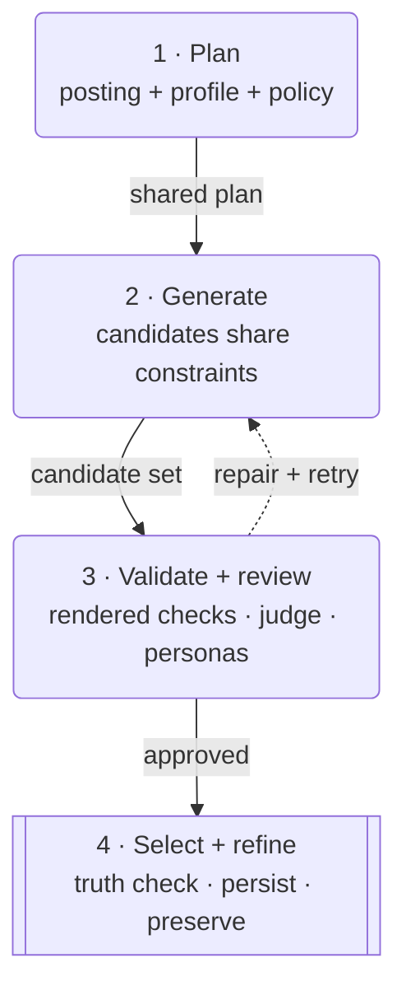

# Materials & Tailoring

Materials are the job-specific resumes, cover letters, PDFs, and related review
records JobCtrl creates from canonical profile evidence and the target posting.
Tailoring is the versioned, gated process that selects and renders those claims
without turning the job description into evidence about you.
For a plain-language walkthrough of that boundary, read
[Resume Tailoring Without Fabrication](../guides/resume-tailoring-without-fabrication.md).

## How JobCtrl Chooses A Resume

Tailoring is a candidate-selection pipeline, not one unconstrained prompt:

Solid arrows show the path to an accepted resume; dashed arrows return
repairable failures to the candidate pool. A failed retry never replaces the
last accepted resume.

1. **Build one deterministic plan.** JobCtrl combines the accepted posting and
   employer analysis with a versioned Candidate Profile snapshot, requirement
   fit, tailoring permissions, required evidence pins, and writing style. The
   posting may guide emphasis; only profile evidence may support claims about
   you.
2. **Ask each ready generator for structured content.** Configured candidate
   models receive the same plan. Their response must reference known experience
   and skill-category IDs, preserve source titles, respect bullet limits, and
   use skills that already exist in the profile.
3. **Validate the assembled resume, not just model JSON.** Deterministic checks
   run over the actual candidate text for grounding, preserved employers,
   education, section structure, prohibited claims, metrics, seniority, and
   requirement/keyword coverage. A keyword counts as covered only when it is in
   the rendered grounded text.
4. **Repair bounded quality failures.** The current post-generation defaults
   require fit of at least `8/10` and must-have coverage of at least `85%`, with
   one revision attempt. These are artifact-quality gates after generation, not
   the Discovery minimum-fit eligibility threshold.
5. **Require approval from every enabled gate.** In guarded validation, the
   structured judge must return `PASS`, reach the configurable threshold
   (`0.82` by default), and report no unsupported claims, fabrications, or
   missing required evidence. Jobs at or above `8/10` fit also receive a
   six-persona adversarial review. Repair instructions from rejected candidates
   feed the bounded retry.
6. **Select and persist the best clean candidate.** JobCtrl chooses the approved
   candidate with the best judge result. An optional voice pass is kept only if
   deterministic voice measures improve and grounding still passes; the final
   fabrication gate runs again afterward. Rendering and generation persistence
   complete together, so a PDF failure or rejected replacement leaves the last
   accepted generation intact.

The artifact inspector exposes the plan, gates, coverage, provenance, judge,
adversarial result, and lifecycle of warnings so you can inspect why the chosen
resume was accepted.

## What You Can See And Control

Eligible jobs receive materials during Discover preparation. You can also
generate first-time materials for one job, re-tailor a job with the current
policy, or run bounded re-tailoring from the Jobs toolbar.

The user-visible surfaces divide the work:

- `/jobs/:jobId` shows material readiness, accepted artifacts, employer and
  requirement evidence, stage failures, and the per-job generation/re-tailor
  controls.
- `/artifacts` lists registered generations; `/artifacts/:artifactId` opens a
  route-level inspector with stored validation, provenance, coverage, voice,
  template, risk metadata, and same-job comparison followed by the full-width
  real preview when supported.
  Canonical evidence foreign keys resolve to human-readable Evidence-map titles
  and excerpts with links back to the owning entry. An unresolved legacy key is
  labeled unavailable and stays accessible under **Technical details** rather
  than being presented as user-facing evidence.
- `/apply-review` consumes the accepted generation. The editor, revision,
  replacement-render, and submission-approval lifecycle is owned by
  [Apply](apply.md#materials-and-resume-rendering).
- `/preferences` owns tailoring permissions, writing style, resume templates,
  and template selection. Template payloads hold style/layout only, not
  candidate or job facts.
- `/settings/models` owns the generator/judge execution policy used by newly
  started work. The current fields and fallback rules belong to
  [Configuration](configuration.md), not this page.

Generating materials, choosing a default template, revising a resume in Apply
Review, and approving a live submission are separate decisions. Materials
hands accepted generations to Apply; it does not own submission approval.

Interview prep is an explicit, job-scoped generation from the Job Detail
workspace. It is not an automatic pipeline stage or live interview assistant.
Review its linked profile and requirement evidence before relying on it; the
current maturity boundary is described in
[Daily Workflow → Generate Interview Prep](normal-flows.md).

## Policy History And Rollback

The Dashboard's **Learning recommendations** card is a review boundary, not an
automatic tuning loop. Accepting a pending, active recommendation appends a new
Materials tailoring-policy revision linked to its recommendation and review;
rejecting it leaves the current revision unchanged. Recommendations whose
source evidence was tombstoned are inactive and cannot be accepted until they
are deterministically re-derived.

**Tailoring policy history** lists every current and superseded revision,
allowlisted learned rule, safe recommendation/review reference, restore
provenance, and creation time. Restoring a superseded version appends the next
version with `user_requested` provenance; it never edits or deletes the target
or current row. Acceptance and restore affect future tailoring-policy
resolution only. They do not re-score jobs, re-tailor existing materials,
replace accepted artifacts, alter the Candidate Profile, or change Apply
decisions. Use the normal explicit re-tailor action when you want existing work
to adopt the current policy.

## Source Of Truth And Ownership

The inputs have intentionally different authority:

| Input | Owner | What it may prove |
| --- | --- | --- |
| Candidate facts and achievements | Candidate Profile snapshot | Experience, skills, metrics, dates, titles, employers, and other claims about you. |
| Job requirements and employer wording | Enrichment snapshot plus canonical employer analysis | What the employer asks for and which language appears in the posting. It is target context, never candidate evidence. |
| Requirement fit | Scoring | Which requirements are matched, transferable, missing, or blocked, with allowed evidence links. It must describe the same posting-analysis generation Tailoring uses. |
| Tailoring and model policy | Preferences, Settings, and versioned Materials policy | What transformations and gates may run. Policy cannot create a fact. |
| Accepted output | Materials generation and registered artifacts | The exact text/HTML/PDF selected for review or Apply, plus its audit data. |

Every rendered resume line that makes a candidate claim should trace to
canonical profile evidence. Keyword coverage is computed from the actual
rendered, grounded text and persisted with the generation. The artifact read
model does not infer a missing list from the job description later, and it
reports absent audit data as unrecorded rather than as zero coverage.

JobCtrl also records what each posting requirement is for. Technical
qualifications and responsibilities are `resume` requirements and can enter
the grounded coverage gate. Work arrangements such as remote/hybrid or office
attendance are `logistics`; work authorization and screening are
`eligibility`; salary, benefits, and other employer terms are
`employer_condition`. Those context-only requirements remain visible for fit
and Apply Review, but the resume is never required to claim them. An unknown
office-attendance preference can therefore warn or ask for confirmation; it
cannot reject a resume candidate or spend Tailor retries.

Cover letters follow the same evidence boundary. They may describe employer
priorities from the posting, but posting-only numbers and dates are omitted or
expressed qualitatively. Only numeric/date facts already grounded in the
Candidate Profile or tailored resume may appear in the generated letter.

If requirement-fit evidence is missing or belongs to an older posting-analysis
generation, JobCtrl shows Tailor as blocked by Score and asks you to rescore the
job. This prerequisite block does not consume a Tailor retry. It prevents an
empty coverage plan from being retried as though it were a model-quality
failure.

The minimum-fit policy is a different terminal decision. When the current
score is below the live materials threshold, Tailor, Cover, and Apply are
persisted as `skipped` with the `MIN_SCORE` code and the exact score/threshold
pair. They do not remain `pending`, because no automatic work owns them.
Lowering the threshold or recording a qualifying current score restores only
these threshold-owned skips. The per-job **Tailor this job** action is an
explicit low-fit override and does not weaken score hard blockers.

Tailor failures also own their downstream state. If Tailor is retryably failed
or has exhausted its durable attempt budget, Cover and Apply show `blocked`
with the exact Tailor failure/exhaustion reason instead of implying pending
work. Retry or reset Tailor first. Once Tailor succeeds, JobCtrl restores only
those Tailor-owned dependency blocks and does not disturb a Cover another
worker already queued or claimed, or a skipped/canceled decision. When an
accepted replacement resume supersedes the material input, JobCtrl may reset a
completed, failed, or exhausted Cover so it can generate against the current
resume; the older artifact remains in its audit history.

Generated files stay under the local JobCtrl workspace and are served only
through registered artifact rows. An artifact route cannot open an arbitrary
filesystem path. See [Data, Privacy & Safety](data-and-safety.md#local-data) for
the local-file boundary.

## Lifecycle

1. **Check eligibility.** The latest score, blockers, active state, enrichment
   quality, and live threshold decide whether automatic tailoring may start. A
   deliberate first-time per-job action can request tailoring without changing
   the batch threshold.
2. **Plan evidence coverage.** The deterministic planner connects employer
   requirements to existing profile achievements, identifies uncovered needs,
   and preserves pinned or required evidence.
3. **Generate candidates.** Configured ready models produce structured resume
   candidates from the same profile and analysis contract.
4. **Validate and select.** Independent schema, grounding, rendering, quality,
   judge/adversarial, and fabrication controls reject unsupported content and
   feed bounded repair attempts. The detailed order and mode-dependent behavior
   are owned by the [Tailoring Contract](../architecture/tailoring.md), rather
   than duplicated here.
5. **Render and persist.** An accepted generation writes resume and cover
   records, HTML/PDF artifacts, layout boxes, provenance, coverage, policy
   version, and audit metadata. Operations projects that stored result into
   Jobs, Artifacts, and Apply Review.
6. **Preserve accepted history.** A failed generation or re-tailor remains audit
   history and never hides the last accepted artifact. Apply owns how a reviewed
   edit is validated and promoted into a replacement generation.
7. **Supersede or suppress deliberately.** A newly accepted replacement
   supersedes the prior active generation while preserving history. If a live
   threshold or blocker makes materials ineligible, JobCtrl soft-suppresses
   them from active/Apply surfaces rather than deleting the audit record.
8. **Review policy changes separately.** Compatible accepted feedback may
   produce a pending recommendation. Acceptance or restore appends a policy
   revision, while rejection or a failed restore leaves the current revision
   and all generated artifacts unchanged.

The same preservation rule applies to stored interview prep and outreach draft
generations: a failed replacement does not destroy the last accepted record.

## Implementation And API Pointers

| Layer | Pointer |
| --- | --- |
| User workflow | [Daily Workflow → Generate And Inspect Materials](normal-flows.md) and [Apply → Materials And Resume Rendering](apply.md#materials-and-resume-rendering). |
| HTTP contract | Artifact list/detail/preview routes, `/v1/resume-templates`, per-job generate/re-tailor actions, and `/v1/learning/recommendations` plus `/v1/learning/policies/materials`; see [Jobs & Materials API](../api/jobs-and-materials.md) and the [complete learning contract](../api/complete-contract.md#feedback-learning-and-policy-history). Apply Review routes are owned by [Apply](apply.md). |
| Worker implementation | `workers/automation/src/jobctrl/domain/materials/`, the `tailor.py` and `cover_letter.py` paths in `workers/automation/src/jobctrl/scoring/`, and `workers/automation/src/jobctrl/infrastructure/materials/`. |
| API and web implementation | In `apps/api/src/`: `resume-review-drafts.ts`, `resume-templates.ts`, and `read-model.ts`; in the web app: `apps/web/src/contexts/materials/`, `apps/web/src/views/artifacts/`, and `apps/web/src/views/apply-review/`. |
| Deep architecture | [Employer Analysis & Materials Audit](../architecture/materials.md), [Tailoring Contract](../architecture/tailoring.md), and [Stage Walkthrough → Tailor](../architecture/pipeline/stages.md#tailor). |
