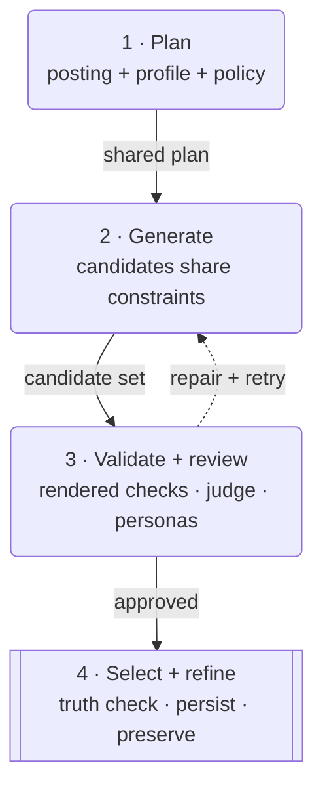

# Materials & Tailoring

Materials are the job-specific resumes, cover letters, PDFs, and related review
records JobCtrl creates from canonical profile evidence and the target posting.
Tailoring is the versioned, gated process that selects and renders those claims
without turning the job description into evidence about you.
For a plain-language walkthrough of that boundary, read
[Resume Tailoring Without Fabrication](../guides/resume-tailoring-without-fabrication.md).

Before generating a resume or cover letter, JobCtrl attempts to refresh active
evidence older than six hours. Usable content can feed preparation while
availability remains unknown. Confirmed unavailable postings stop new work;
failed checks preserve accepted materials and approvals. Use Job
Detail’s **Check availability** to retry; see
[saved posting availability](enrichment-and-extraction.md#saved-posting-availability).

## How JobCtrl Chooses A Resume

Tailoring is a candidate-selection pipeline, not one unconstrained prompt:

```mermaid
flowchart TB
    accTitle: How JobCtrl chooses an accepted resume
    accDescr: A shared plan feeds candidate generators. Rendered checks and review gates reject or repair candidates. The best approved candidate receives an optional voice refinement and a final truthfulness check before JobCtrl persists it as the accepted resume.

    PLAN("1 · Plan<br/>posting + profile + policy")
    DRAFT("2 · Generate<br/>candidates share constraints")
    GATES("3 · Validate + review<br/>rendered checks · judge · personas")
    SAVE[["4 · Select + refine<br/>truth check · persist · preserve"]]

    PLAN -->|shared plan| DRAFT
    DRAFT -->|candidate set| GATES
    GATES -->|approved| SAVE
    GATES -.->|repair + retry| DRAFT
```

Solid arrows show the path to an accepted resume; dashed arrows return
repairable failures to the candidate pool. A failed retry never replaces the
last accepted resume.

1. **Build one deterministic plan.** JobCtrl combines the accepted posting and
   employer analysis with a versioned Candidate Profile snapshot, requirement
   fit, tailoring permissions, required evidence pins, and writing style. The
   posting may guide emphasis; only profile evidence may support claims about
   you. Each target requirement initially keeps only its strongest grounded
   achievement edge, while one achievement may cover several requirements.
2. **Ask each ready generator for structured content.** Configured candidate
   models receive the same plan. Their response must reference known experience
   and skill-category IDs, preserve source titles, respect bullet limits, and
   use skills that already exist in the profile. The generator selects the
   smallest sufficient achievement set: a maximum bullet count is a ceiling,
   not a quota, and optional inventory does not become required content. Required
   experience pins are a mandatory minimum: target-covered or explicitly pinned
   achievements can select additional known roles. A bullet pin also requires
   its owning role, even if that role has no separate role pin. Unselected optional roles are
   omitted consistently from text, HTML/PDF, and the provenance audit. Required
   roles with neither achievement evidence nor required bullet pins retain their
   existing role details without generated bullets. If a required bullet remains
   pinned after its supporting achievement is removed, restore that role's
   evidence or remove the pin before tailoring; pins are still mandatory.
   Requiring a role does not pin every achievement within it. Without selected
   requirement evidence or a bullet pin, that role gets one grounded positioning
   bullet when evidence is available.
3. **Validate the assembled resume, not just model JSON.** Deterministic checks
   run over the actual candidate text for grounding, preserved employers,
   education, section structure, prohibited claims, metrics, seniority, and
   requirement/keyword coverage. Every experience bullet cites exactly one
   achievement, and every number must occur in that same achievement's evidence.
   A keyword counts as covered only when it is in the rendered grounded text.
4. **Repair bounded quality failures.** The current post-generation defaults
   require fit of at least `8/10` and must-have coverage of at least `85%`, with
   one revision attempt. These are artifact-quality gates after generation, not
   the Discovery minimum-fit eligibility threshold.
5. **Require approval from every enabled gate.** In guarded validation, the
   structured judge must return `PASS`, reach the configurable threshold
   (`0.82` by default), and report no unsupported claims, fabrications, or
   missing required evidence. Jobs at or above `8/10` fit also receive a
   six-persona adversarial review. A judge can identify canonical evidence to
   reconsider on a bounded retry. JobCtrl may select a comparable alternative
   already supported by fit analysis, keeping one achievement per requirement
   and checking the same pins and bullet budget again. Unsupported demands and
   raw review instructions stay in the audit; they cannot add facts or override
   the gates.
6. **Select and persist the best clean candidate.** JobCtrl chooses the approved
   candidate with the best judge result. An optional voice pass may edit only
   lines containing a configured buzzword and is kept only when it removes one
   without changing the claim. The final voiced artifact is re-bound to its
   evidence and re-runs deterministic validation, provenance, fabrication,
   quality, and the structured judge. Rendering and generation persistence
   complete together, so a PDF failure or rejected replacement leaves the last
   accepted generation intact.

The artifact inspector exposes the plan, gates, coverage, provenance, judge,
adversarial result, and lifecycle of warnings so you can inspect why the chosen
resume was accepted.

## What You Can See And Control

Eligible jobs receive materials during Discover preparation. You can also
generate first-time materials for one job, re-tailor a job with the current
policy, or run bounded re-tailoring from the Jobs toolbar.

The user-visible surfaces divide the work:

- `/jobs/:jobId` shows material readiness, accepted artifacts, employer and
  requirement evidence, stage failures, and the per-job generation/re-tailor
  controls. Accepted artifacts appear first, newest recorded generation first;
  older approved artifacts remain visible. Canonically superseded versions
  remain inspectable in the collapsed **Superseded artifacts** list.
- `/artifacts` lists registered generations; `/artifacts/:artifactId` opens a
  route-level inspector with stored validation, provenance, coverage, voice,
  template, risk metadata, and same-job comparison followed by the full-width
  real preview when supported.
  Canonical evidence foreign keys resolve to human-readable Evidence-map titles
  and excerpts with links back to the owning entry. An unresolved legacy key is
  labeled unavailable and stays accessible under **Technical details** rather
  than being presented as user-facing evidence.
- `/apply-review` consumes the accepted generation. The editor, revision,
  replacement-render, submission-approval lifecycle, and distinction between a
  local editor export and an approved artifact are owned by
  [Apply](apply.md#materials-and-resume-rendering). Its Plate toolbar can export
  the current document, including unsaved edits, directly to a PDF download.
- `/preferences` owns tailoring permissions, writing style, resume templates,
  and the default template; Apply Review can override the template for one job.
  Template payloads hold style/layout only, not candidate or job facts.
- `/settings/models` owns the generator/judge execution policy used by newly
  started work. The current fields and fallback rules belong to
  [Configuration](configuration.md), not this page.

**Materials ready** means the accepted resume text and submission PDF are
available for review, including while a replacement is queued or running.
Missing profile attestations remain visible as application prerequisites and do
not mean material generation is running. Missing resume text or PDF reports
**materials preparing**. Stage and apply-run failures still report repair, retain
accepted review evidence, and preserve all approval and submission gates.

Generating materials, choosing a default template, revising a resume in Apply
Review, and approving a live submission are separate decisions. Materials
hands accepted generations to Apply; it does not own submission approval.
Likewise, **Export PDF** is a browser-local copy of the current editor state. It
does not save the draft, render a replacement generation, register an artifact,
or make the exported file eligible for submission.

## Interview Preparation

Open **Interviews** (`/interviews`) to explore the installed question library.
Browsing works without a job or provider call. Search question text,
responsibilities, or competencies; filter by topic, role responsibilities, answer format, and source,
and switch between graph and list. The selected card and filters live in the
URL, so you can bookmark the same view. The list provides the same card content
and preparation actions as the graph.

The library contains 121 active question families across 15 topics, with 57
sources and 20 author groups. In **Graph**, **Questions** shows all matching
questions grouped by topic, with editorial connections between topics. Choose a
topic to read its question labels. **Sources** groups research resources by
author; choose an author, then a source to explore its linked questions.
Selecting a question updates the inspector while keeping the catalog map
available. Drag empty space or use the focused canvas's arrow keys to pan, use
the zoom controls, and choose **Overview** to return to the unfiltered map.

The selected card's inspector has **Answer**, **Rubric**, and **Sources** tabs.
**Answer** contains guidance, responsibility adaptations, alternatives, probes,
failure patterns, and synthetic illustrations when present. **Rubric** contains
draft criteria for reflection; do not add them into a readiness score.
**Sources** shows attribution, actual reading coverage, and original resources.

**Connections and saved evidence** is a separate, focused view of the selected
card's relationships and, when a job is selected, personal evidence. Source and
author attribution, editorial related-question edges, and accepted personal
evidence have different meanings: research supports guidance; it cannot prove
that you did something. Selecting a resource or following an editorial edge
does not select accepted profile evidence for preparation.

::: warning Research draft and beta output
The source ledger records actual reading coverage and distinguishes direct
interview guidance, extrapolation from leadership practice, and editorial
synthesis. Citations do not imply author endorsement or full-book reading.
Staff/executive coverage and neighboring-question distinctions still need
review. Draft criteria and synthetic examples do not establish coaching
quality, hiring outcomes, readiness, or validated grading. Review generated
personal claims against their linked evidence before relying on them.
:::

B11 asks what makes a decision good, separating the reasoning available at the
time from its eventual outcome. TS09 asks the same for technical decisions,
including requirements, realistic alternatives, whole-life costs, and conditions
that would change the decision. These principle answers need criteria, limits,
and application rather than a forced STAR success story. C07 persistently asks
for the employer's budgeted compensation range first, including ambiguity and
redirection; it must not invent leverage or reveal an inferred private minimum.
A deliberate user-chosen exception is a choice, not a competency failure. C08
is retired and reserved: availability, location, travel, and authorization
remain declared checklist facts.

### Prepare For A Job

Choose a canonical job from Interviews or follow the **Interview prep** link
from Job Detail. Browsing remains available without that choice; generating
personal preparation requires a job. Set the stage and format when known, the
role-responsibility lens, and any known employer criteria. Unknown stage is
valid, and an unspecified role lens remains unknown. Employer/user-supplied
criteria remain distinct from suggestions inferred from the role; a recommendation does not prove that an employer will ask it.

Review the focused question selection and its rationale. Add or remove cards
and adjust the order before generating. A request accepts at most 16 unique,
active questions from the selected catalog revision. This bounds a generation;
it does not limit the library. Old callers without a selection receive a
deterministic selection. JobCtrl generates only the selected cards, rather than
121 personalized answers.

Choose accepted profile evidence for each selected question before generating.
You can keep automatic selection, explicitly choose up to eight evidence
records, or choose none to ask for gaps instead of a factual outline. An empty
choice is preserved; JobCtrl does not silently fill it. If the profile changes,
review and reselect against its current version before generating. Notes and
new recollections cannot be selected as accepted facts.

Evidence selection precedes prose. Historical answers use relevant accepted
profile evidence; transferable experience keeps its scope limits. Principle,
situational, narrative, negotiation, and preference answers use their own
structures. An open prompt such as “Tell me about a time you handled conflict”
invites recollection; it does not establish that an event occurred.
Hypothetical reasoning, prospective first-time-manager guidance, and advertised
job responsibilities can guide preparation without implying past experience.
“I would explain what I stopped investigating and why” leaves missing particulars
for you to supply. Asking about the advertised role's expectations clarifies the
job; it does not prove that you held that role.

Specific claims or presuppositions about your history, including factual
headings, need support from that question's selected accepted evidence, even
inside future or conditional wording. Another question's evidence, source
examples, and job responsibilities cannot supply that support. Choosing no
evidence leaves focused questions and marked gaps without filling in personal
history, metrics, tools, or authority.

Factual sections cite the selected evidence that supports their claims.
Guidance and clarifying questions keep proof citations separate: they may refer
back to a supported fact and ask for missing details, while contextual question
links do not confirm personal experience.
Current approved materials provide context only when their registered artifact
bindings are valid; an unrelated or stale fit report cannot prove a personal
claim.

### Inspect History And Keep Your Notes

Accepted question outlines expose linked profile excerpts, selection rationale,
missing details, probes, and guidance references. Each generation retains its
catalog/card/rubric bindings, selected-card snapshots, automatic or user-selected
evidence mode and ordered evidence IDs for each question, profile version and
relevant evidence excerpts, job/requirement excerpts, employer-analysis binding,
approved-material references, and model/prompt/gate versions. Inspect these original inputs even
after the current profile or job changes. Changed inputs mark the prep stale;
regeneration is your decision and does not rewrite the older result.

Legacy themes, STAR drafts, gap drills, and company notes remain readable as
legacy generated prep. They have no invented question or rubric association.
Older accepted and superseded prep remains inspectable. A pending or failed
refresh, including provider or gate rejection, leaves the last accepted prep
visible.

Save your editable notes/outlines separately for each job and question. A note
keeps an independent revision, optional source generation, and its own factual
support label. New recollections default to unverified user statements, and a
user edit does not inherit a generated answer's passed audit. A save checks the
revision you loaded; a conflict requires reconciliation rather than overwriting
a newer note. Failed saves keep your draft available for correction and retry.
Generating replacement prep does not delete saved notes.

A note's generation origin refers to that question's retained preparation;
JobCtrl derives the matching card and input bindings. New notes for questions
outside the saved generation are independent, with no generation-context
claim. Editing an existing note keeps its origin instead of attaching it to
newer prep. If that generation was deleted, a normal edit becomes independent;
the earlier note revision keeps its original provenance.

Reopen the job/question bookmark to edit an existing note for a retired or
unavailable card. Start new preparation or an independent note with an active
card.

Question choices and unsaved notes survive page navigation within the current
app session. Save a note to retain it across a browser reload; private draft
text is not stored in the URL or browser storage.

Preparation does not modify Profile, fit scores, Discovery intent, approved
resumes, or Apply state. Review and save a true new fact through
[Candidate Profile](candidate-profile.md). Post-interview reflections remain
manual Apply outcomes linked to a prep generation; they are separate from
preparation notes. See [Outcomes & Feedback](outcomes-and-feedback.md).

Reusable preparation across jobs or without a job, typed rehearsal, calibrated
assessment, and live assistance are future phases. This release has no answer
grading, readiness score, transcript upload, microphone, or in-session answer
surface.

## Policy History And Rollback

The Dashboard's **Learning recommendations** card is a review boundary, not an
automatic tuning loop. Accepting a pending, active recommendation appends a new
Materials tailoring-policy revision linked to its recommendation and review;
rejecting it leaves the current revision unchanged. Recommendations whose
source evidence was tombstoned are inactive and cannot be accepted until they
are deterministically re-derived.

**Tailoring policy history** lists every current and superseded revision,
allowlisted learned rule, safe recommendation/review reference, restore
provenance, and creation time. Restoring a superseded version appends the next
version with `user_requested` provenance; it never edits or deletes the target
or current row. Acceptance and restore affect future tailoring-policy
resolution only. They do not re-score jobs, re-tailor existing materials,
replace accepted artifacts, alter the Candidate Profile, or change Apply
decisions. Use the normal explicit re-tailor action when you want existing work
to adopt the current policy.

## Source Of Truth And Ownership

The inputs have intentionally different authority:

| Input | Owner | What it may prove |
| --- | --- | --- |
| Candidate facts and achievements | Candidate Profile snapshot | Experience, skills, metrics, dates, titles, employers, and other claims about you. |
| Job requirements and employer wording | Enrichment snapshot plus canonical employer analysis | What the employer asks for and which language appears in the posting. It is target context, never candidate evidence. |
| Requirement fit | Scoring | Which requirements are matched, transferable, missing, or blocked, with allowed evidence links. It must describe the same posting-analysis generation Tailoring uses. |
| Tailoring and model policy | Preferences, Settings, and versioned Materials policy | What transformations and gates may run. Policy cannot create a fact. |
| Accepted output | Materials generation and registered artifacts | The exact text/HTML/PDF selected for review or Apply, plus its audit data. |

Every rendered resume line that makes a candidate claim should trace to
canonical profile evidence. Keyword coverage is computed from the actual
rendered, grounded text and persisted with the generation. The artifact read
model does not infer a missing list from the job description later, and it
reports absent audit data as unrecorded rather than as zero coverage.

JobCtrl also records what each posting requirement is for. Technical
qualifications and responsibilities are `resume` requirements and can enter
the grounded coverage gate. Work arrangements such as remote/hybrid or office
attendance are `logistics`; work authorization and screening are
`eligibility`; salary, benefits, and other employer terms are
`employer_condition`. Those context-only requirements remain visible for fit
and Apply Review, but the resume is never required to claim them. An unknown
office-attendance preference can therefore warn or ask for confirmation; it
cannot reject a resume candidate or spend Tailor retries.

When summary rewriting is enabled, an old years-of-experience estimate may be
expressed qualitatively if it lacks supporting achievement evidence. Verified
metrics and required achievement bullets remain subject to their normal
preservation checks.

Cover letters follow the same evidence boundary. They may describe employer
priorities from the posting, but posting-only numbers and dates are omitted or
expressed qualitatively. Only numeric/date facts already grounded in the
Candidate Profile or tailored resume may appear in the generated letter.

If requirement-fit evidence is missing or belongs to an older posting-analysis
generation, JobCtrl shows Tailor as blocked by Score and asks you to rescore the
job. This prerequisite block does not consume a Tailor retry. It prevents an
empty coverage plan from being retried as though it were a model-quality
failure.

When rescoring restores missing evidence, JobCtrl returns that retryable Tailor
block to pending after checking the current score and posting analysis. The
worker can then continue automatically after the normal cooldown and eligibility
checks. This preserves prior attempts, canceled decisions, and approved resumes.

The minimum-fit policy is a different terminal decision. When the current
score is below the live materials threshold, Tailor, Cover, and Apply are
persisted as `skipped` with the `MIN_SCORE` code and the exact score/threshold
pair. They do not remain `pending`, because no automatic work owns them.
Lowering the threshold or recording a qualifying current score restores only
these threshold-owned skips. The per-job **Tailor this job** action is an
explicit low-fit override and does not weaken score hard blockers.

Tailor failures also own their downstream state. If Tailor is retryably failed
or has exhausted its durable attempt budget, Cover and Apply show `blocked`
with the exact Tailor failure/exhaustion reason instead of implying pending
work. Retry or reset Tailor first. Once Tailor succeeds, JobCtrl restores only
those Tailor-owned dependency blocks and does not disturb a Cover another
worker already queued or claimed, or a skipped/canceled decision. When an
accepted replacement resume supersedes the material input, JobCtrl may reset a
completed, failed, or exhausted Cover so it can generate against the current
resume; the older artifact remains in its audit history.

Generated files stay under the local JobCtrl workspace and are served only
through registered artifact rows. An artifact route cannot open an arbitrary
filesystem path. See [Data, Privacy & Safety](data-and-safety.md#local-data) for
the local-file boundary.

## Lifecycle

1. **Check eligibility.** The latest score, blockers, active state, enrichment
   quality, and live threshold decide whether automatic tailoring may start. A
   deliberate first-time per-job action can request tailoring without changing
   the batch threshold.
2. **Plan evidence coverage.** The deterministic planner connects employer
   requirements to existing profile achievements, identifies uncovered needs,
   and preserves pinned or required evidence.
3. **Generate candidates.** Configured ready models produce structured resume
   candidates from the same profile and analysis contract.
4. **Validate and select.** Independent schema, grounding, rendering, quality,
   judge/adversarial, and fabrication controls reject unsupported content and
   feed bounded repair attempts. The detailed order and mode-dependent behavior
   are owned by the [Tailoring Contract](../architecture/tailoring.md), rather
   than duplicated here. The post-generation fit pass may request one truthful
   coverage revision. If a requirement remains uncovered because the profile
   contains no supporting evidence, Materials accepts the best otherwise-safe
   candidate with an inspectable residual gap; Score remains the owner of the
   job-fit decision.
5. **Render and persist.** An accepted generation writes resume and cover
   records, HTML/PDF artifacts, layout boxes, provenance, coverage, policy
   version, and audit metadata. Operations projects that stored result into
   Jobs, Artifacts, and Apply Review.
6. **Preserve accepted history.** A failed generation or re-tailor remains audit
   history and never hides the last accepted artifact. Apply owns how a reviewed
   edit is validated and promoted into a replacement generation.
7. **Supersede or suppress deliberately.** A newly accepted replacement
   supersedes the prior active generation while preserving history. If a live
   threshold or blocker makes materials ineligible, JobCtrl soft-suppresses
   them from active/Apply surfaces rather than deleting the audit record.
8. **Review policy changes separately.** Compatible accepted feedback may
   produce a pending recommendation. Acceptance or restore appends a policy
   revision, while rejection or a failed restore leaves the current revision
   and all generated artifacts unchanged.

The same preservation rule applies to stored interview prep and outreach draft
generations: a failed replacement does not destroy the last accepted record.

## Implementation And API Pointers

| Layer | Pointer |
| --- | --- |
| User workflow | [Daily Workflow → Generate And Inspect Materials](normal-flows.md) and [Apply → Materials And Resume Rendering](apply.md#materials-and-resume-rendering). |
| HTTP contract | Artifact list/detail/preview routes, `/v1/resume-templates`, per-job generate/re-tailor actions, and `/v1/learning/recommendations` plus `/v1/learning/policies/materials`; see [Jobs & Materials API](../api/jobs-and-materials.md) and the [complete learning contract](../api/complete-contract.md#feedback-learning-and-policy-history). Apply Review routes are owned by [Apply](apply.md). |
| Worker implementation | `workers/automation/src/jobctrl/domain/materials/`, the `tailor.py` and `cover_letter.py` paths in `workers/automation/src/jobctrl/scoring/`, and `workers/automation/src/jobctrl/infrastructure/materials/`. |
| API and web implementation | In `apps/api/src/`: `resume-review-drafts.ts`, `resume-templates.ts`, and `read-model.ts`; in the web app: `apps/web/src/contexts/materials/`, `apps/web/src/views/artifacts/`, and `apps/web/src/views/apply-review/`. |
| Deep architecture | [Employer Analysis & Materials Audit](../architecture/materials.md), [Tailoring Contract](../architecture/tailoring.md), and [Stage Walkthrough → Tailor](../architecture/pipeline/stages.md#tailor). |
