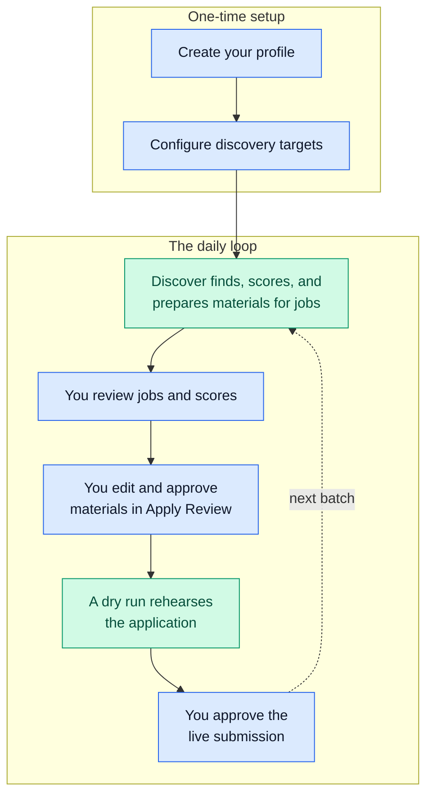

# Daily Workflow

This is your daily loop with JobCtl: set up once, then repeat Discover →
review → Apply. The web app is the main way you work; the command line stays
available for maintenance and diagnostics. For a screen-by-screen walkthrough of
each page below, see the [Product Tour](screenshots.md).



*Blue steps are yours; green steps are JobCtl's. Setup happens once, the
loop repeats. Under the hood, Discover runs Enrich, Score, and Materials for
each eligible job. Live submission approval is bound to the current materials,
profile version, application URL, and dry-run evidence.*

## 1. Build The Candidate Profile

Use the Profile page or the resume import flow to create structured profile data.
The profile includes personal details, work authorization, experience,
education, skills, target search preferences, writing style, resume rendering
settings, and tailoring controls. It is the source of truth every later stage
scores and tailors against.

Profile and settings forms autosave after a short delay. The explicit Save
buttons use the same save path.


*The Profile page collects personal information, resume baseline, experience, skills, and voluntary equal-opportunity (EEO) fields alongside the baseline resume editor.*

## 2. Configure Discovery

Use the Discovery page to set:

- target roles and role tracks;
- target locations and work models;
- source registry controls;
- minimum fit score and automation preferences;
- manual capture and quarantined source decisions.

The optional browser extension's **Save job** action also lands here: it records
the active page as a user-mediated manual capture, then the normal discovery
import path dedupes, snapshots, and surfaces the job in Jobs.

Target locations are validated before they can drive discovery. Discovery uses
exact and broader recall role queries, then filters and scores the results
downstream.


*The Discovery page configures target search, seniority floors, locations and work models, minimum fit score, job boards, and the source registry.*

## 3. Run Discover

From the web app, open the Pipelines page and start `Discover`. From the command
line:

```bash
uv --project workers/automation run jobctl run discover
```

Starts a Discover run from the terminal — the same workflow the Pipelines page
starts.


*The Pipelines page starts a Discover run with limit, worker count, and a dry-run toggle.*

Per-stage commands (`jobctl enrich`, `score`, `tailor`, `cover`) and the
single-job path (`jobctl job <url> --dry-run`) start the same underlying
workflows when you want a narrower run.

Discover owns the preparation path:

- source crawling or ATS/API fetches;
- detail enrichment;
- scoring;
- tailoring eligibility;
- material generation, or suppression, for eligible jobs.

Internal stages such as Enrich and Score, and material generation (the `tailor`
and `cover` commands), stay visible in job detail and diagnostics, but the
user-facing preparation stage is Discover.

## 4. Review Jobs

The Jobs view supports filters, sorting, pagination, deep links, deleted and
hidden views, fit-score ranges, stage state, source provenance, compensation
evidence, and job detail drawers.


*The Jobs table ranks discovered jobs by fit score with filters, compensation columns, and bulk triage actions.*

Use the job detail drawer to inspect:

- score, confidence, blockers, gaps, and score policy metadata;
- the requirement-fit report when present;
- audit history;
- source and enrichment evidence;
- generated artifacts;
- apply readiness and blockers.


*The job detail drawer shows the audit triage: ranking, requirement fit, matched and transferable requirements, keywords, and compensation evidence.*

Failed preparation work can be retried per job or in bulk without automatically
starting apply automation.

## 5. Inspect The Evidence Map

Open Evidence from the main navigation, the Profile page, or a job detail
drawer. The Evidence map shows the canonical profile achievements and declared
skills currently reused by generated resume bullets, requirement-fit decisions,
keyword coverage, and recorded gaps. Links in the usage lists return to the
owning artifact or job detail so you can audit the source before editing profile
evidence or re-running materials.

## 6. Generate And Inspect Materials

Eligible jobs receive tailored resumes and cover letters during Discover. You can
also generate materials for a single job from the job detail drawer.

Generated material records are kept as audit history. Re-generation does not
destroy the accepted material already in use; a replacement becomes active only
after it validates and you approve it.

## 7. Generate Interview Prep

From a job detail drawer, use "generate interview prep" when you want stored
pre-interview notes for that job. Prep is generated only after you ask for it and
uses JobCtl's grounded data: profile evidence, requirement fit, accepted
materials, employer analysis, and evidence-map usage.

The drawer shows the latest accepted prep as themes, STAR-story drafts, gap
drills, and company notes. Each item keeps its evidence IDs, requirement IDs, and
profile source snippets visible, with evidence links back into the Evidence map.
Regeneration keeps the last accepted prep visible until a replacement is
accepted.

After the interview, record reflection notes from the same prep panel. Each
reflection is saved as a normal manual `interview` outcome linked to that prep
generation, so it also appears in the job's application outcome timeline.

Interview prep is not live interview assistance. JobCtl does not provide
in-session answers, transcript upload, microphone input, websocket streaming, or
real-time interview participation.

## 8. Review And Edit The Resume

Apply Review opens the generated resume in an in-browser editor. The editor keeps
the final PDF link, the source behind each line, risk flags, JobCtl's line
comments, and your draft together.


*Apply Review pairs requirement evidence and the verbatim job post with the tailored resume preview, JobCtl line comments, and approve or dry-run controls.*

Typical review actions:

- edit the generated resume text or formatting;
- reply to JobCtl line comments;
- save or autosave a draft revision;
- validate and render an edited draft into replacement artifacts;
- compare the accepted artifact with the rendered draft using stored coverage,
  validation, judge, template, and risk-label rows;
- approve only after the edited draft is saved, valid, and rendered.

Failed validation stays as audit history and does not hide the last accepted
artifact.

## 9. Rehearse With A Dry Run

Apply automation can submit real applications, so start with dry runs:

```bash
uv --project workers/automation run jobctl apply --dry-run --limit 1
uv --project workers/automation run jobctl apply --url https://example.com/job/123 --dry-run
```

The first dry-runs Apply for one eligible job; the second dry-runs a specific job
by URL. A dry run never submits — it shows what would happen without sending
anything.

Auto apply is separate from a one-off dry run. When the Discovery automation
setting `autoApply` is on, a running worker keeps one continuous Apply workflow
active and the Runs page shows it as the standing apply loop. With
`applyApprovalRequired` still on, that loop live-submits only jobs already
approved in Apply Review and parks the rest as awaiting approval. If you also
turn approval off, the same loop may submit eligible prepared jobs
autonomously, bounded by the minimum fit score, daily spend ceiling,
at-most-once submit intent tracking, CAPTCHA fail-closed behavior, and the
dry-run guard for dry-run apply paths.

Only approve real submission after inspecting the dry run, final materials,
field mapping, blockers, and apply-run history. Submit approval is valid only
for the materials generation, profile version, and application URL shown in
Apply Review, and requires full dry-run evidence unless you explicitly accept a
listed partial dry-run with its blocked channels. The full approval model is on
the [Security](security.md) page.

## 10. Inspect Progress

Useful command-line checks:

```bash
uv --project workers/automation run jobctl status
uv --project workers/automation run jobctl digest
uv --project workers/automation run jobctl runs
uv --project workers/automation run jobctl runs --failed-only
```

These print your pipeline status, show the local daily digest, list all workflow
runs, and list only failed runs, respectively. The digest is read-only unless
you pass `--acknowledge`, which marks the displayed digest as reviewed.

Useful web app views:

- Dashboard for high-level counts and source health.
- Analytics for recorded outcome counts and sample-gated rates by source, score
  band, fit band, and apply mode. The page reads canonical application outcome
  rows and projections only; groups below the minimum sample count stay
  count-only.
- Jobs for triage and per-job actions.
- Runs for workflow history.
- Evidence for profile-evidence reuse, generated-material usage, and gaps.
- Artifacts for generated files and same-job artifact comparisons.
- Apply Review for approval and resume edits.
- Debug for event-level inspection.


*The Runs page lists workflow runs with status, mode, timing, and a link into the web interface of Temporal, the workflow engine.*

## 11. Keep Contacts (Optional)

Keep contact records for the people behind an application — a recruiter, hiring
manager, or referrer — attached to a company or a specific job:

- Open the **Contacts** page (the "Contacts" nav entry) or the **Contacts** panel
  in a job's detail drawer, and add a contact with a role (recruiter, hiring
  manager, referrer, warm intro, or other), a link to the employer and/or the
  application, and facts like name, title, email, phone, or a note.
- Or import a list from a CSV file. Each imported fact is tagged as coming from
  that file (its filename is recorded as the source); rows that name neither an
  employer nor an application are skipped.
- Every fact you store shows its **provenance** — where it came from — in the list
  and detail views, so you can always see the source of a name or email.

You can also run **supervised research** from a job's Contacts panel to propose
contacts:

- Click **run research** (optionally pasting one public source URL, such as a
  company team page). JobCtl starts a supervised run; with no URL it simply
  records which sources it could and could not use.
- Research **proposes** candidates for review — it never stores them automatically
  (supervised, INV-4). Each proposed candidate shows its provenance (the page it
  came from, the capture method, and a confidence), and the run shows the
  per-source outcomes (fetched, blocked by `robots.txt`, rate-limited, or routed
  to manual capture because the page needs a login).
- Review each candidate and click **confirm contact** to promote it into your
  contacts. Only then does it become a stored fact — with its research provenance
  preserved and marked confirmed by you. No public page is fetched unless you
  supply its URL, and login-walled pages are never fetched automatically.

Once you have a contact, you can **draft an outreach message** to them — a
truthful, reviewable message that you send yourself:

- On the contact's detail (the **Outreach** panel), click **generate draft**.
  JobCtl writes a short message grounded only in your profile and the confirmed
  contact facts, then runs it through the **same anti-fabrication gates as your
  resumes and cover letters**: a deterministic never-fabricate check, a content
  validator, an LLM judge, and a claim-to-fact provenance record.
- Review the **gate results** and the **claim → fact** bindings shown beside the
  draft. A draft that invents a metric, an employer, or a relationship it cannot
  support is blocked — you cannot approve it until the gates pass.
- **Edit** the draft if you want; saving your edit creates a new version and
  **re-runs the gates** on your edited text. Earlier versions stay in the
  generation history, and your last approved message is never overwritten until a
  replacement is approved.
- **Approve** the message once the gates pass, then **copy** it and send it
  yourself through your own channel (your email client, and so on).
- After you have sent it, **log the send**: record the date you sent it and the
  channel you used (for example "email"). This is a record you enter — JobCtl
  never sends the message and has no way to; logging simply marks the thread as
  sent so your history is honest. A send can only be logged against an approved
  draft, and approving a draft is a separate action that never sends anything.
- Optionally **schedule a follow-up**. JobCtl suggests a conservative date —
  7 days after the application was submitted for the first nudge, 14 days for a
  later one if you have had no reply — which you can edit freely. Due follow-ups
  surface in a **Follow-ups** list and a badge so you remember to reach out; you
  then send the follow-up yourself, exactly like the first message. Follow-ups are
  reminders only: they are never sent for you, and any optional recurring reminder
  is off by default.

You send every message yourself. JobCtl drafts, previews, and records; it
never sends anything to a contact — there is no email, message, or outreach send
transport of any kind, drafts terminate at copy/export, a thread only becomes
"sent" through a send you log yourself, and contact, research, draft, send, or
follow-up data never affects scoring or apply decisions.
