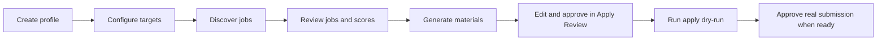

# Normal Flows

This page describes the product flow a normal local user follows. Command-line
paths remain available for maintenance and diagnostics, but the web app is the
primary operating surface.



## 1. Build The Candidate Profile

Use the Profile page or resume import flow to create structured profile data.
The profile includes personal details, work authorization, experience,
education, skills, target search preferences, writing style, resume rendering
settings, and tailoring controls.

Profile and settings forms autosave after a short delay. Explicit Save buttons
use the same API mutation path.

## 2. Configure Discovery

Use the Discovery page to set:

- target roles and role tracks;
- target locations and work models;
- source registry controls;
- minimum fit score and automation preferences;
- manual capture and quarantined source decisions.

Target locations are validated before they can drive discovery. Discovery uses
exact and recall role queries, then filters and scores results downstream.

## 3. Run Discover

From the UI, use the Pipelines page and run `Discover`. From the CLI:

```bash
uv --project workers/automation run jobhunter run discover
```

Discover owns the preparation path:

- source crawling or ATS/API fetches;
- detail enrichment;
- scoring;
- tailoring eligibility;
- material generation or suppression for eligible jobs.

Internal stages such as `enrich`, `score`, `tailor`, and `cover` remain visible
in job detail and diagnostics, but the user-facing preparation stage is
Discover.

## 4. Review Jobs

The Jobs view supports filters, sorting, pagination, deep links, deleted/hidden
views, fit-score ranges, stage state, source provenance, compensation evidence,
and job detail drawers.

Use the job detail drawer to inspect:

- score, confidence, blockers, gaps, and score policy metadata;
- requirement-fit report when present;
- audit history;
- source and enrichment evidence;
- generated artifacts;
- apply readiness and blockers.

Failed preparation work can be retried per job or in bulk without automatically
starting apply automation.

## 5. Generate And Inspect Materials

Eligible jobs receive tailored resumes and cover letters during Discover. You
can also generate materials for a single job from the job detail drawer.

Generated material records are preserved as audit history. Re-generation does
not destroy the accepted material already in use; replacement artifacts become
active only after validation and approval.

## 6. Review And Edit The Resume

Apply Review loads the generated HTML/CSS resume into a Plate editor. The editor
keeps the final PDF link, source pins, risk labels, JobHunter comments, line
anchors, and draft state together.

Typical review actions:

- edit generated resume text or formatting;
- reply to JobHunter line comments;
- save or autosave a draft revision;
- validate and render an edited draft into replacement artifacts;
- approve only after the edited draft is saved, valid, and rendered.

Failed validation remains audit history and does not hide the last accepted
artifact.

## 7. Dry-Run Apply Before Submission

Apply automation can submit applications. Start with dry runs:

```bash
uv --project workers/automation run jobhunter apply --dry-run --limit 1
uv --project workers/automation run jobhunter apply --url https://example.com/job/123 --dry-run
```

Only approve real submission after inspecting the dry run, final materials,
field mapping, blockers, and apply-run history.

## 8. Inspect Progress

Useful CLI commands:

```bash
uv --project workers/automation run jobhunter status
uv --project workers/automation run jobhunter runs
uv --project workers/automation run jobhunter runs --failed-only
```

Useful UI views:

- Dashboard for high-level counts and source health.
- Jobs for triage and per-job actions.
- Runs for workflow history.
- Artifacts for generated files.
- Apply Review for approval and resume edits.
- Debug for event-level inspection.
