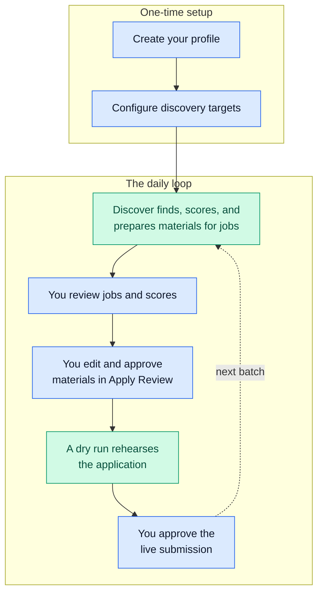

# Daily Workflow

This is your daily loop with JobHunter: set up once, then repeat Discover →
review → Apply. The web app is the main way you work; the command line stays
available for maintenance and diagnostics. For a screen-by-screen walkthrough of
each page below, see the [Product Tour](screenshots.md).



*Blue steps are yours; green steps are JobHunter's. Setup happens once, the
loop repeats. Under the hood, Discover runs Enrich, Score, and Materials for
each eligible job. Live submission approval is bound to the current materials,
profile version, application URL, and dry-run evidence.*

## 1. Build The Candidate Profile

Use the Profile page or the resume import flow to create structured profile data.
The profile includes personal details, work authorization, experience,
education, skills, target search preferences, writing style, resume rendering
settings, and tailoring controls. It is the source of truth every later stage
scores and tailors against.

Profile and settings forms autosave after a short delay. The explicit Save
buttons use the same save path.


*The Profile page collects personal information, resume baseline, experience, skills, and voluntary equal-opportunity (EEO) fields alongside the baseline resume editor.*

## 2. Configure Discovery

Use the Discovery page to set:

- target roles and role tracks;
- target locations and work models;
- source registry controls;
- minimum fit score and automation preferences;
- manual capture and quarantined source decisions.

The optional browser extension's **Save job** action also lands here: it records
the active page as a user-mediated manual capture, then the normal discovery
import path dedupes, snapshots, and surfaces the job in Jobs.

Target locations are validated before they can drive discovery. Discovery uses
exact and broader recall role queries, then filters and scores the results
downstream.


*The Discovery page configures target search, seniority floors, locations and work models, minimum fit score, job boards, and the source registry.*

## 3. Run Discover

From the web app, open the Pipelines page and start `Discover`. From the command
line:

```bash
uv --project workers/automation run jobhunter run discover
```

Starts a Discover run from the terminal — the same workflow the Pipelines page
starts.


*The Pipelines page starts a Discover run with limit, worker count, and a dry-run toggle.*

Per-stage commands (`jobhunter enrich`, `score`, `tailor`, `cover`) and the
single-job path (`jobhunter job <url> --dry-run`) start the same underlying
workflows when you want a narrower run.

Discover owns the preparation path:

- source crawling or ATS/API fetches;
- detail enrichment;
- scoring;
- tailoring eligibility;
- material generation, or suppression, for eligible jobs.

Internal stages such as Enrich and Score, and material generation (the `tailor`
and `cover` commands), stay visible in job detail and diagnostics, but the
user-facing preparation stage is Discover.

## 4. Review Jobs

The Jobs view supports filters, sorting, pagination, deep links, deleted and
hidden views, fit-score ranges, stage state, source provenance, compensation
evidence, and job detail drawers.


*The Jobs table ranks discovered jobs by fit score with filters, compensation columns, and bulk triage actions.*

Use the job detail drawer to inspect:

- score, confidence, blockers, gaps, and score policy metadata;
- the requirement-fit report when present;
- audit history;
- source and enrichment evidence;
- generated artifacts;
- apply readiness and blockers.


*The job detail drawer shows the audit triage: ranking, requirement fit, matched and transferable requirements, keywords, and compensation evidence.*

Failed preparation work can be retried per job or in bulk without automatically
starting apply automation.

## 5. Inspect The Evidence Map

Open Evidence from the main navigation, the Profile page, or a job detail
drawer. The Evidence map shows the canonical profile achievements and declared
skills currently reused by generated resume bullets, requirement-fit decisions,
keyword coverage, and recorded gaps. Links in the usage lists return to the
owning artifact or job detail so you can audit the source before editing profile
evidence or re-running materials.

## 6. Generate And Inspect Materials

Eligible jobs receive tailored resumes and cover letters during Discover. You can
also generate materials for a single job from the job detail drawer.

Generated material records are kept as audit history. Re-generation does not
destroy the accepted material already in use; a replacement becomes active only
after it validates and you approve it.

## 7. Generate Interview Prep

From a job detail drawer, use "generate interview prep" when you want stored
pre-interview notes for that job. Prep is generated only after you ask for it and
uses JobHunter's grounded data: profile evidence, requirement fit, accepted
materials, employer analysis, and evidence-map usage.

The drawer shows the latest accepted prep as themes, STAR-story drafts, gap
drills, and company notes. Each item keeps its evidence IDs, requirement IDs, and
profile source snippets visible, with evidence links back into the Evidence map.
Regeneration keeps the last accepted prep visible until a replacement is
accepted.

Interview prep is not live interview assistance. JobHunter does not provide
in-session answers, transcript upload, microphone input, websocket streaming, or
real-time interview participation.

## 8. Review And Edit The Resume

Apply Review opens the generated resume in an in-browser editor. The editor keeps
the final PDF link, the source behind each line, risk flags, JobHunter's line
comments, and your draft together.


*Apply Review pairs requirement evidence and the verbatim job post with the tailored resume preview, JobHunter line comments, and approve or dry-run controls.*

Typical review actions:

- edit the generated resume text or formatting;
- reply to JobHunter line comments;
- save or autosave a draft revision;
- validate and render an edited draft into replacement artifacts;
- compare the accepted artifact with the rendered draft using stored coverage,
  validation, judge, template, and risk-label rows;
- approve only after the edited draft is saved, valid, and rendered.

Failed validation stays as audit history and does not hide the last accepted
artifact.

## 9. Rehearse With A Dry Run

Apply automation can submit real applications, so start with dry runs:

```bash
uv --project workers/automation run jobhunter apply --dry-run --limit 1
uv --project workers/automation run jobhunter apply --url https://example.com/job/123 --dry-run
```

The first dry-runs Apply for one eligible job; the second dry-runs a specific job
by URL. A dry run never submits — it shows what would happen without sending
anything.

Only approve real submission after inspecting the dry run, final materials,
field mapping, blockers, and apply-run history. Submit approval is valid only
for the materials generation, profile version, and application URL shown in
Apply Review, and requires full dry-run evidence unless you explicitly accept a
listed partial dry-run with its blocked channels. The full approval model is on
the [Security](security.md) page.

## 10. Inspect Progress

Useful command-line checks:

```bash
uv --project workers/automation run jobhunter status
uv --project workers/automation run jobhunter digest
uv --project workers/automation run jobhunter runs
uv --project workers/automation run jobhunter runs --failed-only
```

These print your pipeline status, show the local daily digest, list all workflow
runs, and list only failed runs, respectively. The digest is read-only unless
you pass `--acknowledge`, which marks the displayed digest as reviewed.

Useful web app views:

- Dashboard for high-level counts and source health.
- Analytics for recorded outcome counts and sample-gated rates by source, score
  band, fit band, and apply mode. The page reads canonical application outcome
  rows and projections only; groups below the minimum sample count stay
  count-only.
- Jobs for triage and per-job actions.
- Runs for workflow history.
- Evidence for profile-evidence reuse, generated-material usage, and gaps.
- Artifacts for generated files and same-job artifact comparisons.
- Apply Review for approval and resume edits.
- Debug for event-level inspection.


*The Runs page lists workflow runs with status, mode, timing, and a link into the web interface of Temporal, the workflow engine.*
