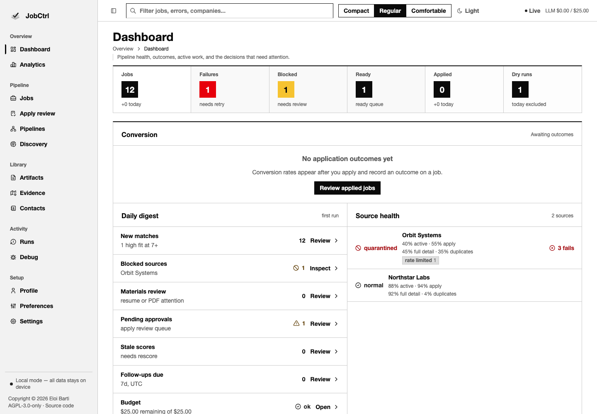
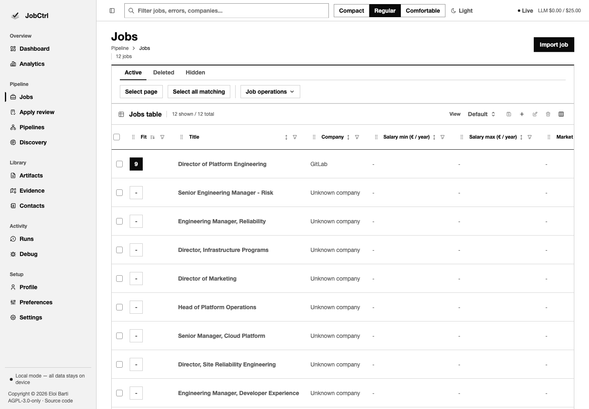
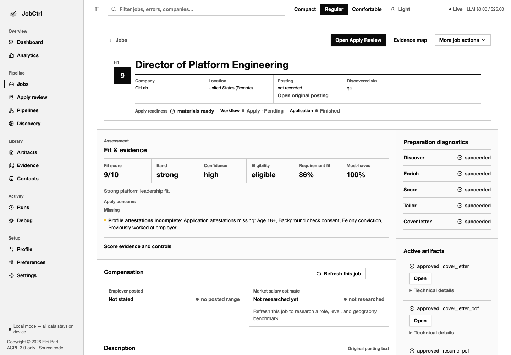
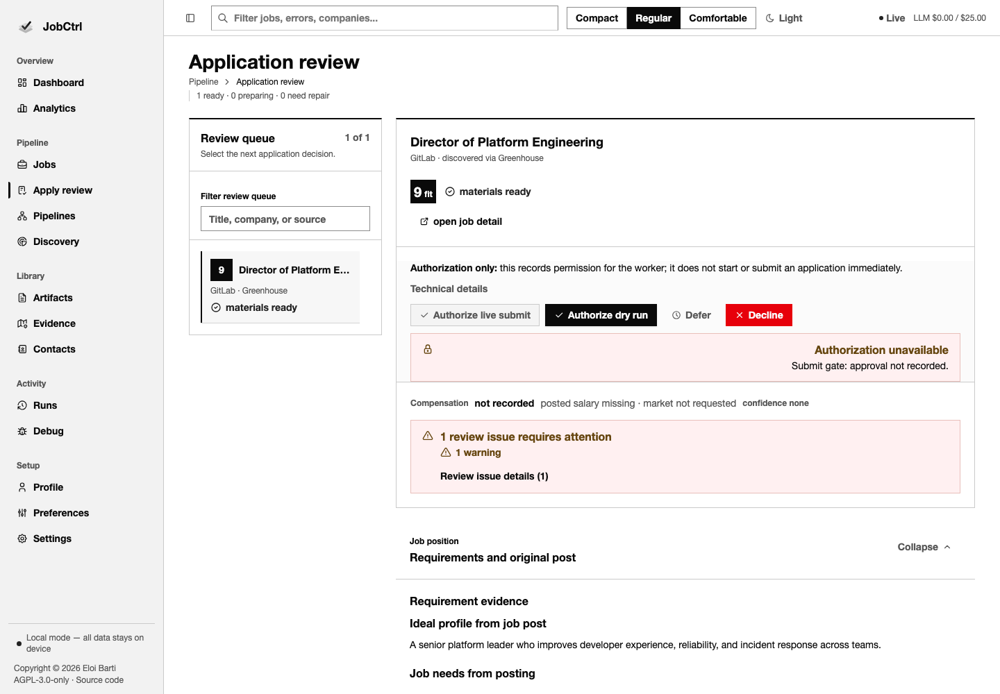
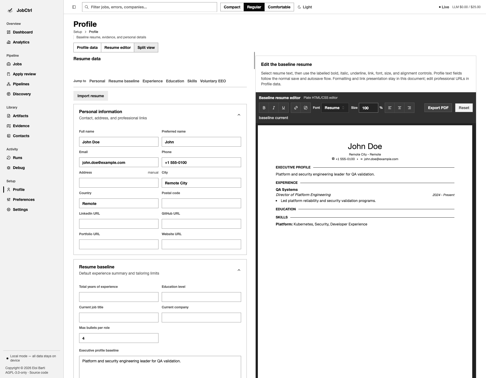
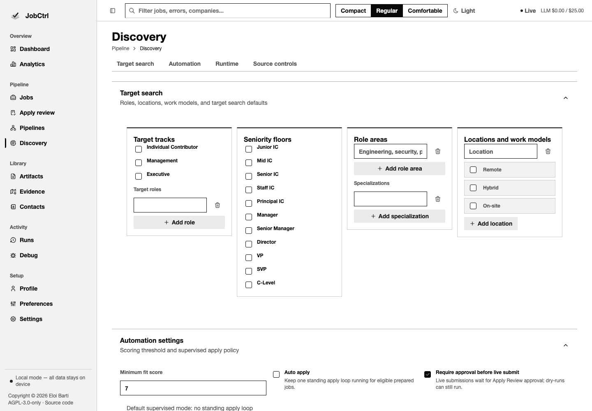
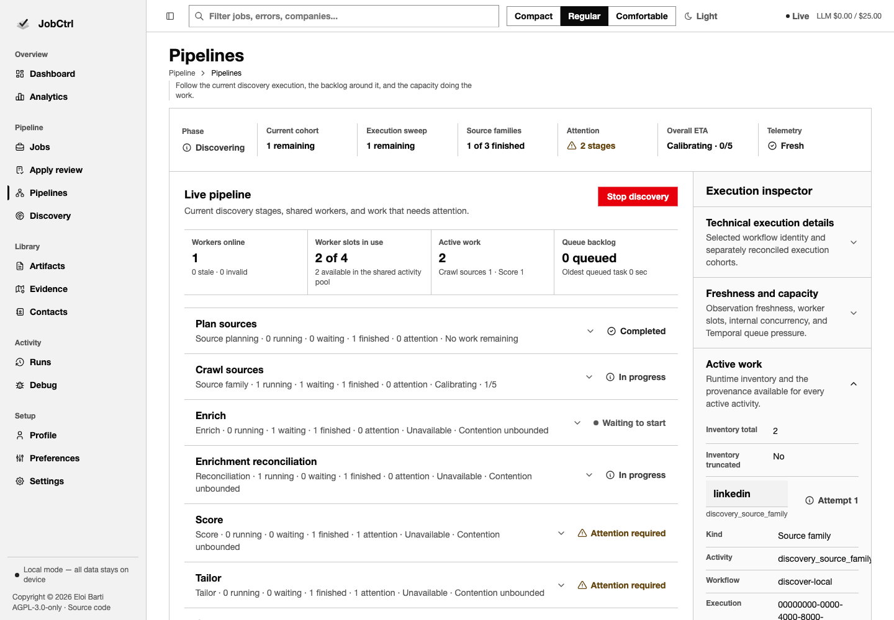
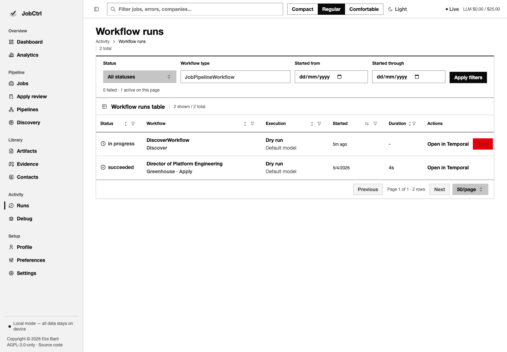

# Screenshots

Public screenshots are generated from synthetic data only. They are useful for
README previews, release notes, and visual QA, but they must never contain real
profile data, real resumes, real company targets from a private search, API
keys, logs, browser state, or local paths.

## Generate Screenshots

```bash
pnpm docs:screenshots
```

The command runs a Playwright spec against a disposable E2E workspace. The E2E
global setup calls the existing QA seed, starts the local API and Vite app on
test ports, and saves PNGs under:

```text
docs/assets/screenshots/
```

## Covered Surfaces

The screenshot flow captures these eight surfaces.


*Dashboard: pipeline progress, job counts, source health, and recent apply runs.*


*Jobs table: fit-score ranking, compensation columns, and bulk triage actions.*


*Job detail drawer: ranking, requirement fit, keywords, and compensation evidence.*


*Apply Review: requirement evidence, tailored resume preview, line comments, and approval controls.*


*Profile: personal information, resume baseline, experience, skills, and the baseline resume editor.*


*Discovery: target search, seniority floors, locations and work models, job boards, and the source registry.*


*Pipelines: start a Discover run with limit, worker count, and a dry-run toggle.*


*Runs: workflow run history with status, mode, timing, and a Temporal web UI link.*

See [docs/developer/screenshot-playbook.md](../developer/screenshot-playbook.md)
for the implementation details and refresh checklist.
